# 将智能合同部署到 Rinkeby Network 的多种方式

> 原文：<https://medium.com/coinmonks/the-many-ways-to-deploy-your-smart-contract-to-rinkeby-network-38cadf7b20be?source=collection_archive---------1----------------------->

为了理解这篇文章，您需要了解[如何创建智能契约](/coinmonks/write-a-simple-contract-on-top-of-ethereum-92b543594e84)、[将其部署到测试网络](/coinmonks/test-a-smart-contract-with-truffle-3eb8e1929370)以及[如何使用元掩码](/coinmonks/build-a-simple-and-unstoppable-decentralized-web-application-dapp-aa8d08e35f9c)。在本文中，我将向您展示如何将您的智能合约部署到 Rinkeby network。那么什么是 Rinkeby 网络呢？这就像以太坊的舞台网络。虽然您的测试网络只存在于您的计算机中，但 Rinkeby 是一个测试网络，但它存在于全球。也许你可以说它“生活”在云中，这样住在雅加达的你可以让你住在波哥大的朋友轻松测试你的智能合约。


Upload your smart contract to Rinkeby network. Photo credit: henrique from Unsplash.

在本地测试网络中，你从一开始就得到 100 以太网。在林克比，你没有。你必须“乞求”以太。转到[https://水龙头. rinkeby.io](https://faucet.rinkeby.io/) 。然后创建一个包含你的公共以太坊地址的推文或公开帖子(在脸书或谷歌+)。记住，在[上一篇文章](/coinmonks/build-a-simple-and-unstoppable-decentralized-web-application-dapp-aa8d08e35f9c)中，您通过在 Metamask 中“创建一个帐户”来创建一个新的以太坊公共地址。

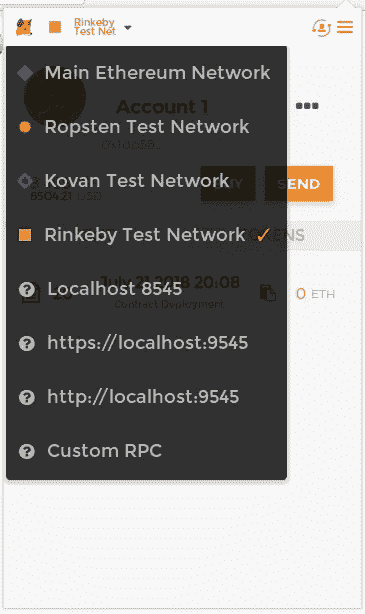

Go to Rinkeby Network in your Metamask software.

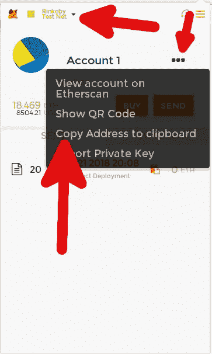

Once you are in Rinkeby network, you can get the public address easily.

一旦你创建了一个包含你的以太坊公共地址的社交媒体帖子，将你的社交媒体帖子的链接提交到 Rinkeby 认证水龙头表格。

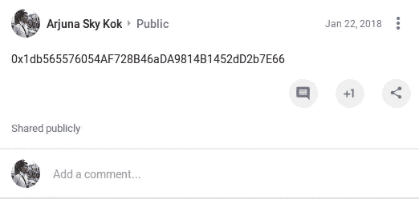

An example of social media post containing Ethereum public address. Here I use Google+. But you can use Facebook or Twitter.

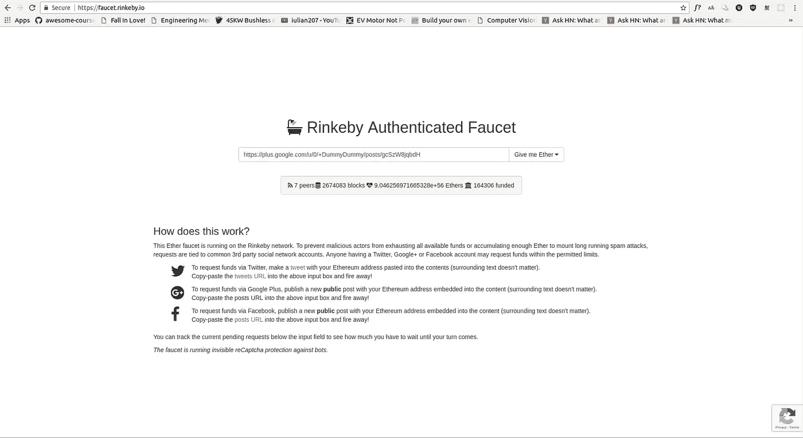

Submit your public link of social media post in Rinkeby form.

然后根据你的选择，你可以在等待 8 小时或 1 天或 3 天时得到 3 或 7.5 或 18.75 个乙醚。

在我们将智能合约发布到 Rinkeby network 之前，我们需要一个智能合约。你可以使用任何你知道的智能合约。或者如果你懒，你可以用我的。

```
pragma solidity ^0.4.19;contract Auction {
  address public manager;
  address public seller;
  uint public latestBid;
  address public latestBidder; constructor() public {
    manager = msg.sender;
  } function auction(uint bid) public {
    latestBid = bid * 1 ether; //1000000000000000000;
    seller = msg.sender;
  } function bid() public payable {
    require(msg.value > latestBid); if (latestBidder != 0x0) {
      latestBidder.transfer(latestBid);
    }
    latestBidder = msg.sender;
    latestBid = msg.value;
  } function finishAuction() restricted public {
    seller.transfer(address(this).balance);
  } modifier restricted() {
    require(msg.sender == manager);
    _;
  } function kill() restricted public { selfdestruct(manager); }
}
```

这是我在上一篇文章中开发的智能合约，增加了一点:一个杀死智能合约的方法(该方法被命名为 *kill* ),这样如果你不再需要它，你就有办法清理你的智能合约。

有几种方法可以将您的智能合同上传到 Rinkeby network。我们将逐一讨论它们。

# 元掩码

打开[https://remix.ethereum.org，](https://remix.ethereum.org,)点击左上角的+按钮新建一个文件。将其命名为 *Auction.sol* 。粘贴要部署的智能合约。然后点击*运行*选项卡，再选择*注入 Web3* 环境。它将自动使用您的元掩码帐户(确保您已首先登录您的元掩码)。然后点击“*部署*按钮。最后，单击浏览器上的 Metamask 图标，批准向 Rinkeby network 发布您的智能合约。

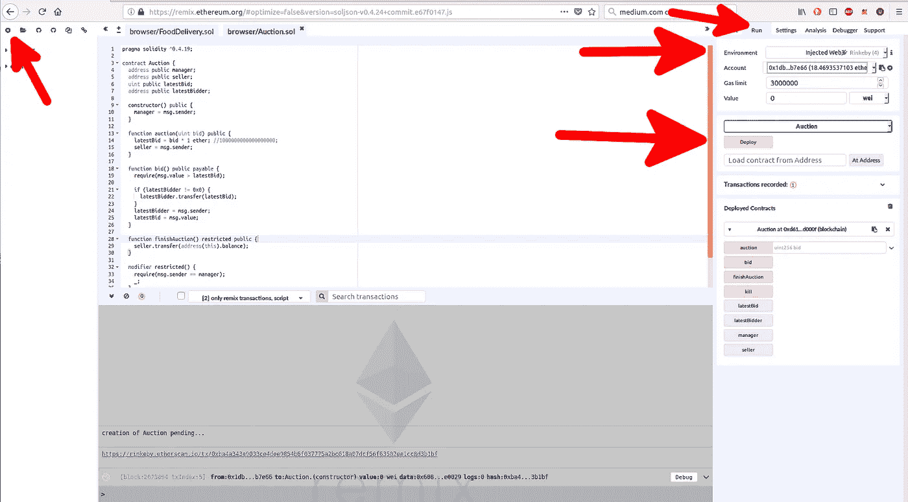

Deploy your smart contract in Remix.

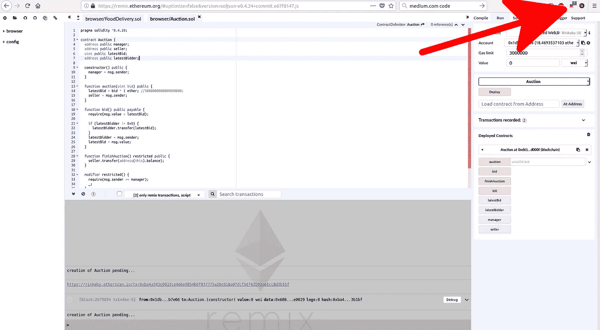

Click Metamask icon after clicking “Deploy” button.

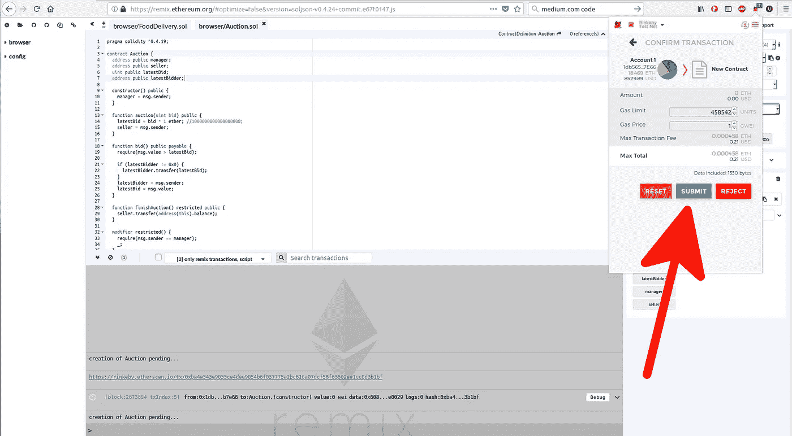

Approve the launching of your smart contract.

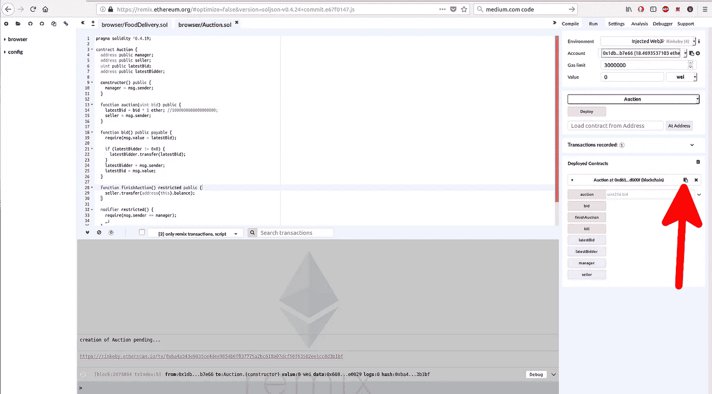

You can get your smart contract address by clicking that “small copy” paste icon.

给这个智能合约地址就可以让全世界的人玩你的智能合约。以下是如何做到这一点，以防你在波哥大的朋友想玩你的智能合同。她可以在她的浏览器中打开 Remix，然后将您的智能合同地址放入标签为“*从地址*加载合同”的表格中，然后在地址处单击“*按钮。*

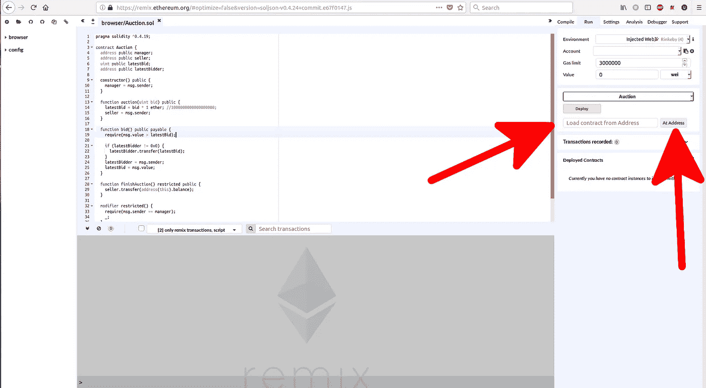

Load smart contract from the address.

这不是唯一的方法。您可以通过其他方式以编程方式玩智能合约，如使用 geth 客户端、Truffle 控制台和使用代码(Solidity)。我只是给你一个简单的方法来测试已经部署的智能合同。

# 松露配蘑菇

通过这种方式，您将使用 Truffle 框架通过 Infura 部署智能合约。基本上 Infura 就是某人带 API 的以太坊节点。免费注册。

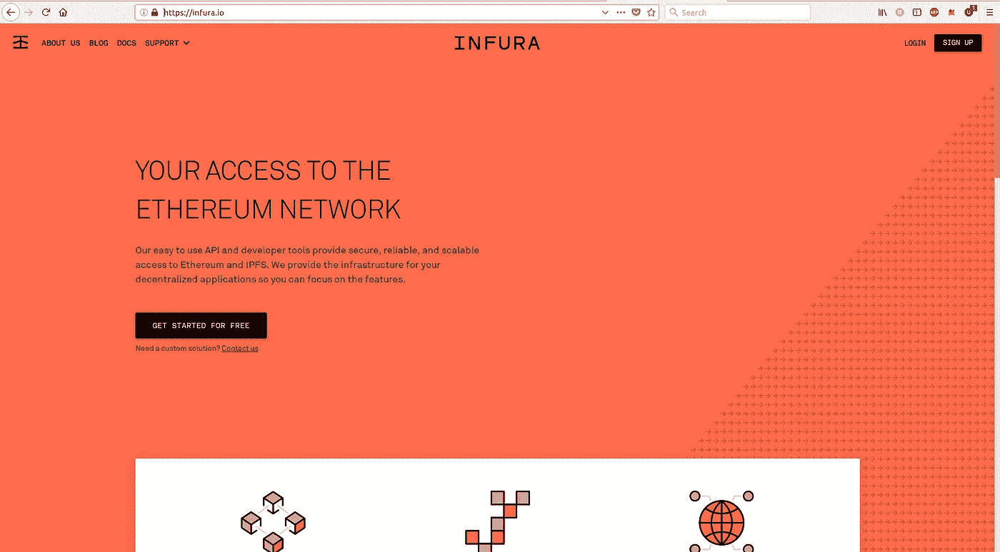

Infura website.

当他们给你发邮件时，你会得到 API 密匙。

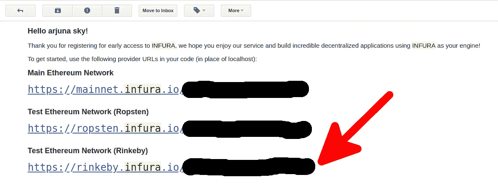

Your API key from Infura.

现在使用 Truffle 框架开发你的智能合约。

转到空目录。

```
truffle init
```

将智能合同粘贴到 *contracts/Auction.sol* 中。然后编译它。

```
truffle compile
```

安装*truffle-HD wallet-provider*模块。

```
npm install --save truffle-hdwallet-provider
```

在*migrations/2 _ deploy _ contracts . js*中创建部署合同文件。

```
var Auction = artifacts.require(“Auction”);module.exports = function(deployer) {
  deployer.deploy(Auction);
};
```

编辑 *truffle.js* 。

```
var HDWalletProvider = require(“truffle-hdwallet-provider”);var mnemonic = “aquaman superman batman shazam flash wonderwoman greenlantern ironman captainamerica hulk blackwidow thanos”;module.exports = {
  // See <[http://truffleframework.com/docs/advanced/configuration](http://truffleframework.com/docs/advanced/configuration)>
  // to customize your Truffle configuration!
  networks: {
    rinkeby: {
      provider: function() {
        return new HDWalletProvider(mnemonic,     “[https://rinkeby.infura.io/thisistheapikey](https://rinkeby.infura.io/thisistheapikey)");
      },
      network_id: 1
    }
  }
};
```

用来自 Infura 的 API 密钥更改“*thisitheapikey*”。并且改变你的记忆术。你的记忆术是怎么来的？您可以从 Metamask 获得它，如下图所示。

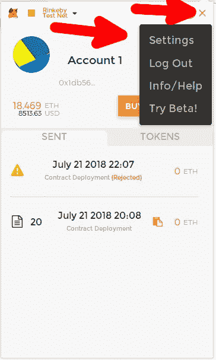

Click Settings.

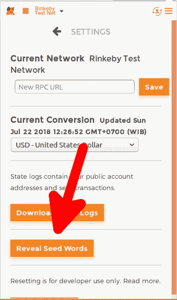

Click “Reveal Seed Words” button.

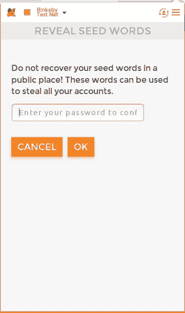

Submit password.

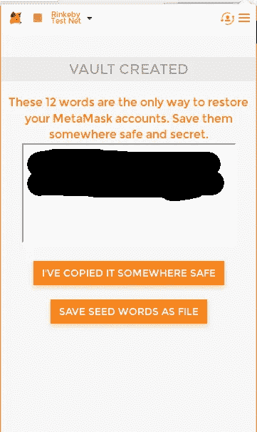

Your seed words.

然后运行迁移。

```
truffle migrate -f 2 --network rinkeby
```

“-f 2”意味着您只运行*migrations/2 _ deploy _ contracts . js*的迁移。你不运行*migrations/1 _ initial _ migration . js*。如果要运行所有迁移，请省略 if。

您将得到如下输出:

```
Running migration: 2_deploy_contracts.js
 Replacing Auction…
 … 0xe473f0879bc0cbec1e9b72cf881e07a148d733753b20d9795d549a7903b5d39d
 Auction: 0x85db00a8660b4c006bcdeb0d221f2e6c3860c66d
Saving artifacts…
```

智能合约的地址是“拍卖:”一词之后的地址。是 0x 85 db 00 a 8660 b4c 006 BC deb 0d 221 F2 E6 c 3860 c66d。

命令的执行将会挂起。别担心。地址显示给你后，你可以 Ctrl+C。

# 带有 Infura 的 web3.js

如果你没有/不能使用 Truffle framework，这里介绍如何使用 Solidity 编译器和 Web3 库将你的智能合约部署到 Rinkeby network。

在新目录中，可以选择将其初始化为 Node.js 项目。它是可选的。你不一定要做，但建议你这样做。

```
npm init
```

然后安装必要的工具(Solidity 编译器、web3 和 truffle hdwallet 提供程序)。

```
npm install --save web3@1.0.0-beta.34 truffle-hdwallet-provider solc
```

对于 *web3* 我们必须使用测试版，因为上一个稳定版太原始了。 *solc* 模块是 Solidity 编译器。如果使用 Truffle，就不需要手动安装这个模块。 *web3* 模块是负责部署智能合约的库。

把你的智能合约， *Auction.sol* 放到 *contracts/Auction.sol* 里。创建一个文件来编译此智能协定。将其命名为 *compile.js* ，并将其放在项目目录的根目录下。它应该与*合同*目录在同一个目录下。

```
//compile.js
const path = require(‘path’);
const fs = require(‘fs’);
const solc = require(‘solc’);const auctionPath = path.resolve(__dirname, ‘contracts’, ‘Auction.sol’);
const source = fs.readFileSync(auctionPath, ‘utf8’);module.exports = solc.compile(source, 1).contracts[‘:Auction’];
```

然后创建一个文件来部署智能合约。将其命名为 *deploy.js* ，并将其放在项目目录的根目录下。它应该和*合同*目录在同一个目录下。

```
//deploy.js
const HDWalletProvider = require(‘truffle-hdwallet-provider’)
const Web3 = require(‘web3’);
const { interface, bytecode } = require(‘./compile’);const provider = new HDWalletProvider(
  ‘aquaman superman batman shazam flash wonderwoman greenlantern ironman captainamerica hulk blackwidow thanos’,
  ‘[https://rinkeby.infura.io/thisistheapikey'](https://rinkeby.infura.io/thisistheapikey')
);const web3 = new Web3(provider);const deploy = async () => {
     const accounts = await web3.eth.getAccounts();console.log(‘Attempting to deploy from account’, accounts[0]);const result = await new web3.eth.Contract(JSON.parse(interface))
 .deploy({ data: ‘0x’ + bytecode})
 .send({ gas: ‘1000000’, from: accounts[0] });console.log(‘Contract deployed to’, result.options.address);
};deploy();
```

这是基于来自 [Stephen Grinder](https://github.com/StephenGrider) 的代码。这是他的功劳。我对它做了一点修改，所以它可以与最新版本的*松露-高清钱包-供应商*模块一起工作。

当你使用 *solc* 模块编译代码时，你会得到接口和字节码。然后我们用 *web3* 连接到提供商。从这个供应商那里， *web3* 得到账户。最后， *web3* 拥有部署智能合约的方法。

像这样执行它。

```
node deploy.js
```

该命令也会挂起。一旦获得智能合约地址，只需 Ctrl+C 即可。很好。没问题。

# Geth

这是将智能合约部署到 Rinkeby 网络的最困难的方法。从以太坊网站安装 geth 软件。[https://geth.ethereum.org/downloads/](https://geth.ethereum.org/downloads/)

Geth 是以太坊网站的一款软件。它可以用来采矿以获得乙醚。但是在这里，我们使用它来部署智能合约。下载并安装它。使用的操作系统不同，说明也会有所不同。

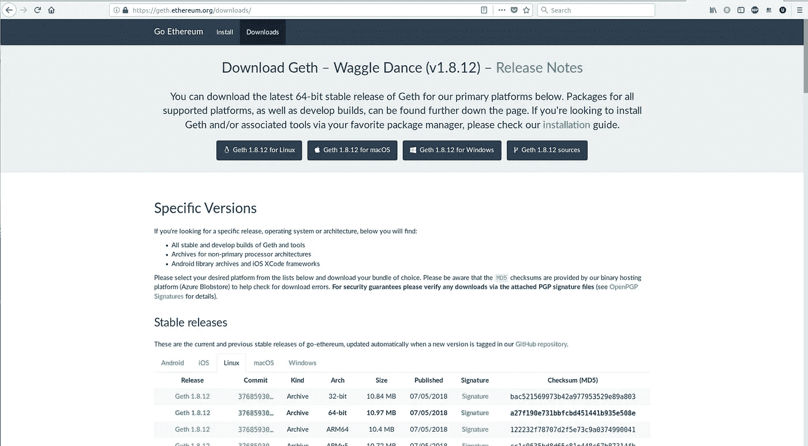

Geth website.

然后像这样发射 geth。

```
geth --rinkeby --datadir /opt/data/ethereumdata
```

Geth 有很多功能。当您像这样运行它时，这意味着，它将节点完全同步到 rinkeby 网络，并将节点数据放入 */opt/data/ethereumdata* 目录。在将智能合同部署到 Rinkeby network 之前，您需要这样做。获得完全同步的节点需要一段时间。在我的情况下，一个晚上是需要的时间长度。

然后，您需要将您在 Metamask 中创建的帐户导入 geth 软件。在这种情况下，你不用记忆法。你用私钥。从元掩码导出私钥。

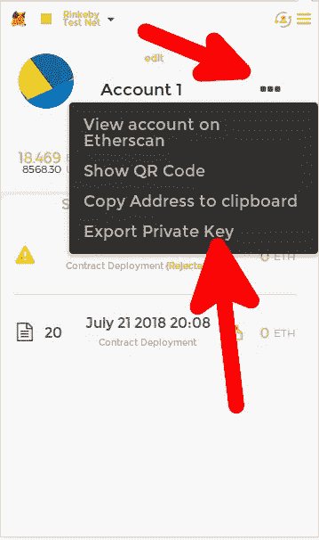

Choose “Export Private Key” menu.

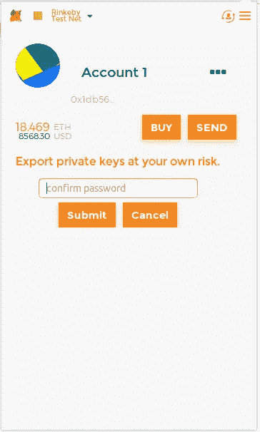

Submit password before exporting your private key.

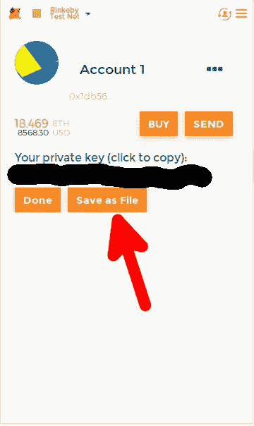

Save it as a file.

将您的私钥文件命名为 *privatekeyfile.txt* 。像这样导入到 geth 软件。

```
geth --rinkeby account import privatekeyfile.txt --datadir /opt/data/ethereumdata
```

您将被要求在 geth 软件中设置密码来保护此帐户。

然后，您使用 geth 软件的控制台连接到该软件。

```
geth --rinkeby --verbosity 0 console --datadir /opt/data/ethereumdata
```

在它的控制台中(在 geth 控制台中，**而不是操作系统控制台中的**，您将智能合约的字节码设置为变量。让我们将变量命名为*字节码*。

```
bytecode = “your_smart_contract_bytecode”
```

那么，如何获得智能合约字节码呢？这取决于你如何编制你的智能合同。例如，如果你使用“*松露编译*”进行编译，那么你的字节码位于*build/contracts/auction . JSON*中。打开文件。找到 JSON 键“字节码”。它指向智能契约的字节码。

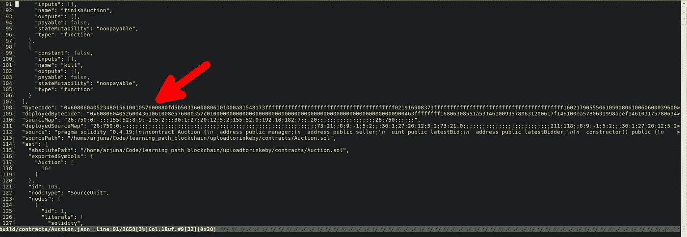

Your smart contract bytecode.

在同一个 geth 控制台中，解锁您的帐户。

```
personal.unlockAccount(eth.accounts[0], “password”)
```

从元掩码导入帐户时，用您的密码替换“*密码*”。然后把你的智能合约上传到 Rinkeby 网络。

```
tx = eth.sendTransaction({from: eth.accounts[0], data: bytecode, gas: 500e3})
```

然后检查是否已经上传。

```
web3.eth.getTransactionReceipt(tx)
```

如果已经部署，您将得到如下输出。

```
{
 blockHash: “0xfed7dcbd5e8c68e17bff9f42cd30d95588674497ae719a04fd6a2ff219bb001d”,
 blockNumber: 2534930,
 contractAddress: “0xbd3ffb07250634ba413e782002e8f880155007c8”,
 cumulativeGasUsed: 1071323,
 from: “0x1db565576054af728b46ada9814b1452dd2b7e66”,
 gasUsed: 458542,
 logs: [],
 logsBloom: “0x00000...”,
 status: “0x1”,
 to: null,
 transactionHash: “0x1a341c613c2f03a9bba32be3c8652b2d5a1e93f612308978bbff77ce05ab02c7”,
 transactionIndex: 4
}
```

您的合同地址由 JSON 键“ *contractAddress* ”指向。

**记住**当你想通过 geth 软件部署智能合约时，你必须先同步节点。如果只是轻度同步，是否可以将智能合约部署到 Rinkeby network，我不确定。现在，只需完全同步节点。

> 加入 Coinmonks [电报频道](https://t.me/coincodecap)和 [Youtube 频道](https://www.youtube.com/c/coinmonks/videos)获取每日[加密新闻](http://coincodecap.com/)

## 另外，阅读

*   [复制交易](/coinmonks/top-10-crypto-copy-trading-platforms-for-beginners-d0c37c7d698c) | [加密税务软件](/coinmonks/crypto-tax-software-ed4b4810e338)
*   [网格交易](https://coincodecap.com/grid-trading) | [加密硬件钱包](/coinmonks/the-best-cryptocurrency-hardware-wallets-of-2020-e28b1c124069)
*   [密码电报信号](http://Top 4 Telegram Channels for Crypto Traders) | [密码交易机器人](/coinmonks/crypto-trading-bot-c2ffce8acb2a)
*   [最佳加密交易所](/coinmonks/crypto-exchange-dd2f9d6f3769) | [印度最佳加密交易所](/coinmonks/bitcoin-exchange-in-india-7f1fe79715c9)
*   [面向开发人员的最佳加密 API](/coinmonks/best-crypto-apis-for-developers-5efe3a597a9f)
*   最佳[密码借贷平台](/coinmonks/top-5-crypto-lending-platforms-in-2020-that-you-need-to-know-a1b675cec3fa)
*   杠杆代币的终极指南
*   [7 大最佳零费用密码交易平台](https://coincodecap.com/zero-fee-crypto-exchanges)
*   [最佳网上赌场](https://coincodecap.com/best-online-casinos) | [期货交易机器人](/coinmonks/futures-trading-bots-5a282ccee3f5)
*   [分散交易所](https://coincodecap.com/what-are-decentralized-exchanges) | [比特 FIP](https://coincodecap.com/bitbns-fip)
*   [用信用卡购买密码的 10 个最佳地点](https://coincodecap.com/buy-crypto-with-credit-card)
*   [加拿大最佳加密交易机器人](https://coincodecap.com/5-best-crypto-trading-bots-in-canada) | [Bybit vs 币安](https://coincodecap.com/bybit-binance-moonxbt)