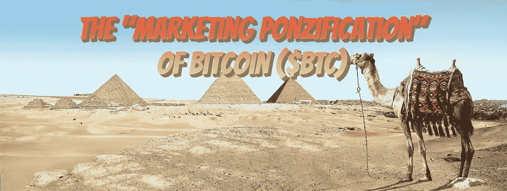
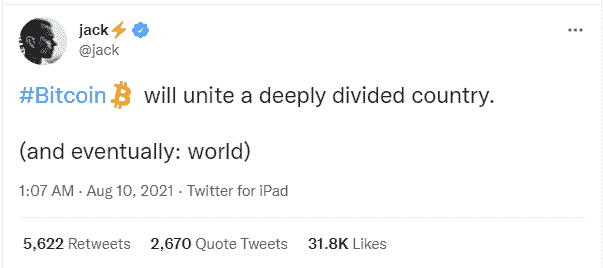
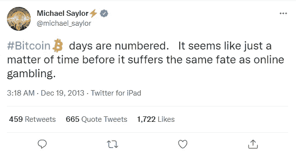
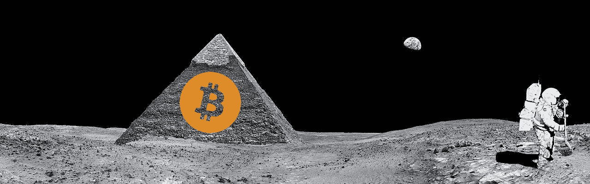
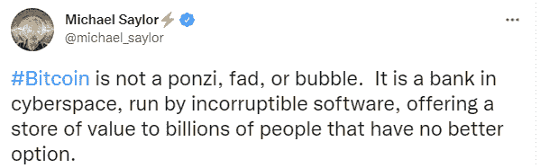

# 比特币的市场营销(BTC)

> 原文：<https://medium.com/coinmonks/the-marketing-ponzification-of-bitcoin-btc-9e16a2c53d03?source=collection_archive---------14----------------------->

BTC 版的比特币如今只是其辉煌和革命历史的一个幽灵。如今，人们很少讨论赋予自我所有权和个人融资的概念。大多数投资者只是交易所里上涨的数字，永远不会动硬币。

这完全是关于比特币的价格，它遵循了 Blockstream 的 BTC 的道路，并决定扩大比特币不是一个选项。从这个意义上说，它成功了，但代价是什么？比特币的长期应用潜力被削弱了。比特币变成了它以前的影子，一个代表投机的货币单位和一个模糊的“价值储存”论点。

比特币的区块流版本 BTC，在营销方面越来越接近与加密领域的一些顶级庞氏骗局竞争:Onecoin 和 Bitconnect。

我们应该祝贺 BTC 社区、开发者、负责这个节目的 Blockstream 以及所有 BTC 的支持者。剩下的支持 BTC 的部分总是关于它的价格和它的特权。

在这篇文章中，我没有证明 BTC 是一个庞氏骗局或金字塔计划。相反，我解释了 BTC 社区的叙述是如何缺乏实质内容，并类似于庞氏骗局的宣传活动。

> 订阅 [**Coinmonks Youtube 频道**](https://www.youtube.com/c/coinmonks/videos) 获取每日加密新闻。

# 迈克尔·塞勒:“庞氏领主”

塞勒从一开始就完全错了。他告诉矿工不要卖任何东西，这在财务上是不符合逻辑的，尤其是当这话出自一位企业高管之口时，这是一件相当荒谬的事情。

这是另一个著名的 Saylor rants。它与庞氏促销活动以及所有这些骗局的宣传方式有许多相似之处。

> “有些人认为比特币不会成功，但他们不是和我们一起的，对吗？”
> 
> [——迈克尔·塞勒](https://www.youtube.com/watch?v=xbpZT31En_w&t=48s)

这是与“我们”或反对“我们”与庞氏太。就像所有的罪犯一样，他们将进攻作为最后的反抗行为，当末日即将来临的时候，他们的争论将比以往任何时候都更加不理智。

这总是一个危险信号。他们经常在庞氏骗局中使用类似的引语来创造或增强归属感。

> “你不认为比特币会成功？去做点别的吧。
> 
> [——迈克尔·塞勒](https://www.youtube.com/watch?v=xbpZT31En_w&t=48s)

少管闲事！别用“我们”来烦我。

**Saylor 带着比特币的革命精神，把它扔进了垃圾桶。**

Saylor 没有提到比特币的特性是什么帮助它获得了高人气。虽然，这不仅仅是 Saylor。另外两个在商界有着重要影响力并被数百万人追随的杰出人物是埃隆·马斯克(特斯拉和 SpaceX 的首席执行官，前 PayPal 的高管)和杰克·多西(Twitter 的首席执行官)。

[*Source*](https://twitter.com/jack/status/1424854924194729984?lang=en)

> 这个世界不再是过去的样子了
> 
> 卡洛斯·马托斯

这些受欢迎的人物已经控制了叙事。

然而，今年的最大亮点是臭名昭著的 2021 年比特币迈阿密大会，当迈克尔·塞勒和马克斯·凯泽登上舞台时，这一时刻变得疯狂。

在观看比特币迈阿密会议时，我们都想起了之前辉煌的 Bitconnect 会议，现场充满了对相关加密货币质量的极度热情和赞美。

传奇的庞氏骗局推广人卡洛斯·马托斯(Carlos Matos)为现代加密货币的影响者和数以千计的新 BTC 骗子铺平了道路，他们被释放到加密社交媒体的狂野西部。

塞勒很早就涉足比特币，至少从 2013 年开始，当时他在推特上写道，比特币正在变成一个赌场，并将面临与在线赌博相同的命运。

他经常要求美国政府对比特币钱包进行更多的监管和监督。

迈克尔·塞勒在那里有一个计划，他并不孤单。他发现了一个死气沉沉的区块链，没有任何存在的意义，但他也发现了一个由前银行家铺设的庞大营销网络。路是空的，于是他拿着政府给 Covid 的救助金，用它赌博。

六年后，塞勒比任何人都更理解这个游戏。我不能理解的是，2017 年的奔牛赛，赛乐在哪里？可能他不相信减半会有什么效果，没有在 2016 年初投资。所以他跳过了整个牛市，不知道这将如何展开。他似乎在 2020 年做好了更充分的准备，尽管投机风险不断增加，因为 Microstrategy 在整个牛市中不断买入，甚至在 BTC 60，000 美元的价格上买入。

此外，值得一提的是，塞勒也是网络泡沫的一部分，他甚至被美国证券交易委员会指控欺诈性操纵 Microstrategy 的利润报告，以提高其公司的股价([来源](https://www.computerworld.com/article/2589923/update--microstrategy-executives-to-pay--11-million-to-settle-sec-fraud-ch.html))。

塞勒和其他倡导者经常使用每一本庞氏教科书中的红旗牌来宣传 BTC:

*   **没有关于技术的讨论**:这是一个主要的危险信号。一个从不探究 BTC 如何运作的技术公司的投资者和高管。
*   **极限回报承诺**:1/10/1 亿美元的比特币！，“去月球！”
*   **现在就行动的压力**:“趁早买入”现在是买入的最佳时机。我买下了未来 10/20/300 年的 hodl。
*   **金融不稳定论点**:享受保持贫穷的乐趣(又名 HFSP……)
*   **需要更多的投资者**:引诱“香蕉共和国”政府
*   **再投资的压力**:“买得多，拿得出手”的理念。虽然许多人早些时候从中获利，但不能保证 BTC 会继续上涨，尤其是当所有人都知道网络不起作用(高费用、低速度)时，或者当资产价格比 10 年前高 5 万倍时。傻瓜的数量是有限的。([大傻瓜理论](https://www.investopedia.com/terms/g/greaterfooltheory.asp))

塞勒正试图推动一项议程，以模糊的条款和条件使 BTC 成为一项机构资产。他在他的一个涅槃时刻产生了这个想法，其他人只有使用致幻物质才能达到。

# 最后

Me Got Diamond Hands! To the moon!, [Source](https://pixabay.com/tr/illustrations/ay-piramit-m%c4%b1s%c4%b1r-astronot-2092807/)

这一切都是为了人数的增加，而这需要对 BTC 教的虔诚。

这是一个非常相似的方法，至少在营销部分，与 **Bitconnect** ， **OneCoin** ，以及我们经常遇到的所有其他庞氏骗局或类似的传销。

这一切都是为了赚更多的钱，同时立即指责这些钱是吸引投资者进来的借口。价格越高，噪音和垃圾邮件就越多。

故事不再是关于比特币区块链的质量，因为这一消息将立即使这一说法无效，因为 BTC 费用将再次达到 50 美元或更高。

BTC 今天有更高的目标。让每个人都富有！它不需要有任何效用，任何产品，任何目的。不过，目的只有一个，让每个人都暴富！这是合格的机构和金融老练的亿万富翁最近发现的。不知道为什么，BTC 是一个很棒的投资。

在 2012 年，比特币并不是一项伟大的投资，当时它的交易价格为 5 美元，并有一个革命性的概念，即实际上让世界变得更好。对于亿万富翁来说，只有数字才是重要的，所以今天 BTC 拥有 50，000 美元，这开始看起来像一项可靠的投资！没错。也许美国给予的机会比预期的要多得多。

BTC 的拥护者没有责任，也没有什么实质性的东西可以依靠，只是一种无意识的推动，只专注于几个词的叙述，只是试图吸引注意力，玩弄大众的心理。一切都与数字有关，这永远不会有好结果。

Twitter

我写这篇文章不是为了宣称 BTC 是一个庞氏骗局，而是为了解释 BTC 的营销是如何被那些表现得像庞氏骗局的人所充斥的。

虽然当有一种解释为什么这不是一个庞氏骗局的冲动时，这将立即使我们产生怀疑。

Follow me on: ● [ReadCash](https://read.cash/@Pantera) ● [NoiseCash](https://noise.cash/u/Pantera99) ● [Medium](/@panterabch) ● [Hive](https://hive.blog/@pantera1) ● [Steemit](https://steemit.com/@pantera1) ●[Vocal](https://vocal.media/authors/pantera) ● [Minds](https://www.minds.com/pantera99/) ● [Twitter](https://twitter.com/Panterabch) ● [LinkedIn](https://www.linkedin.com/in/panterabch/) ● [email](https://read.cash/@Pantera/localcryptos-p2p-exchange-is-now-offering-bitcoin-cash-trading-06637230#bad-link)

***支持内容创作者。如果你喜欢这个故事，请订阅！***

*原载于*[*https://read . cash*](https://read.cash/@Pantera/the-marketing-ponzification-of-bitcoin-btc-47ad770f)*。*

> 加入 Coinmonks [电报频道](https://t.me/coincodecap)和 [Youtube 频道](https://www.youtube.com/c/coinmonks/videos)了解加密交易和投资

## 另外，阅读

*   [比特币基地僵尸工具](/coinmonks/coinbase-bots-ac6359e897f3) | [AscendEX 审查](/coinmonks/ascendex-review-53e829cf75fa) | [OKEx 交易僵尸工具](/coinmonks/okex-trading-bots-234920f61e60)
*   [如何在印度购买比特币？](/coinmonks/buy-bitcoin-in-india-feb50ddfef94) | [瓦济克斯审查](/coinmonks/wazirx-review-5c811b074f5b)
*   [隐翅虫替代品](/coinmonks/cryptohopper-alternatives-d67287b16d27) | [HitBTC 审查](/coinmonks/hitbtc-review-c5143c5d53c2)
*   [折叠 App 审核](https://blog.coincodecap.com/fold-app-review) | [Kucoin 交易机器人](/coinmonks/kucoin-trading-bot-automate-your-trades-8cf0ca2138e0) | [Probit 审核](https://blog.coincodecap.com/probit-review)
*   [如何匿名购买比特币](https://blog.coincodecap.com/buy-bitcoin-anonymously) | [比特币现金钱包](https://blog.coincodecap.com/bitcoin-cash-wallets)
*   [币安 vs FTX](https://blog.coincodecap.com/binance-vs-ftx) | [最佳(索尔)索拉纳钱包](https://blog.coincodecap.com/solana-wallets)
*   [如何在 Uniswap 上交换加密？](https://blog.coincodecap.com/swap-crypto-on-uniswap) | [A-Ads 评论](https://blog.coincodecap.com/a-ads-review)
*   [WazirX vs coin dcx vs bit bns](/coinmonks/wazirx-vs-coindcx-vs-bitbns-149f4f19a2f1)|[block fi vs coin loan vs Nexo](/coinmonks/blockfi-vs-coinloan-vs-nexo-cb624635230d)
*   [本地比特币审核](/coinmonks/localbitcoins-review-6cc001c6ed56) | [加密货币储蓄账户](https://blog.coincodecap.com/cryptocurrency-savings-accounts)
*   [比特币基地评论](/coinmonks/coinbase-review-6ef4e0f56064) | [德里比特评论](/coinmonks/deribit-review-options-fees-apis-and-testnet-2ca16c4bbdb2) | [FTX 评论](/coinmonks/ftx-crypto-exchange-review-53664ac1198f)
*   [n rave ZERO Review](/coinmonks/ngrave-zero-review-c465cf8307fc)|[phe MEX Review](/coinmonks/phemex-review-4cfba0b49e28)|[PrimeXBT Review](/coinmonks/primexbt-review-88e0815be858)
*   最佳[区块链分析](https://bitquery.io/blog/best-blockchain-analysis-tools-and-software)工具| [赚比特币](/coinmonks/earn-bitcoin-6e8bd3c592d9)
*   [加密套利](/coinmonks/crypto-arbitrage-guide-how-to-make-money-as-a-beginner-62bfe5c868f6)指南| [如何做空比特币](/coinmonks/how-to-short-bitcoin-568a2d0b4ae5)
*   [德国最佳加密交易所](https://blog.coincodecap.com/crypto-exchanges-in-germany) | [Arbitrum:第二层解决方案](https://blog.coincodecap.com/arbitrum)