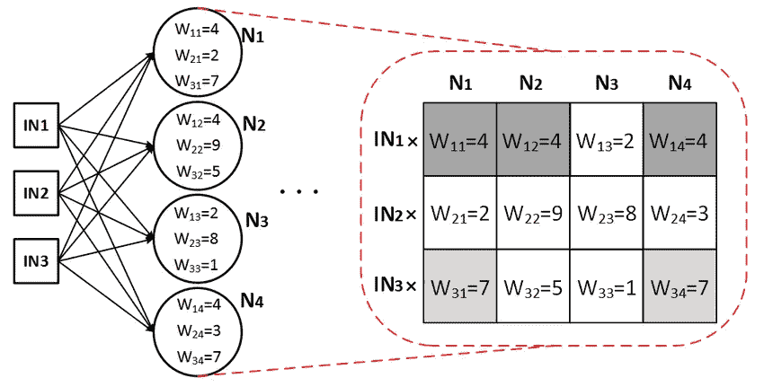
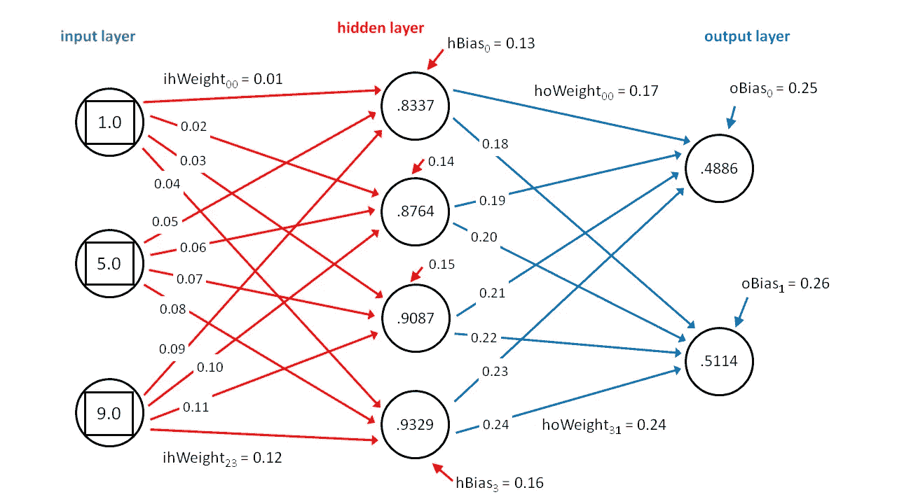
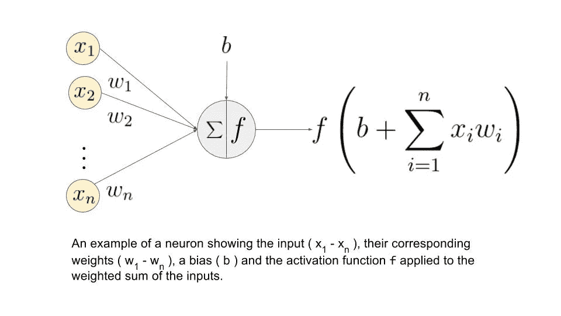
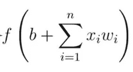

# 神经网络的数学

> 原文：<https://medium.com/coinmonks/the-mathematics-of-neural-network-60a112dd3e05?source=collection_archive---------0----------------------->

所以我的上一篇文章是对 MLP 的一个非常基本的描述。在这篇文章中，我将处理 MLP 中涉及的所有数学问题。没看过上一篇文章的，可以在这里看[。不浪费时间，让我们开始吧。](/@temi.ayo.babs/multi-layer-perceptron-for-beginners-6aee246c6a03)

# **基础知识**

关于神经网络数学，你必须知道的第一件事是，它非常简单，任何人都可以用笔、纸和计算器来解决它(不是你想要的)。然而，你可能有超过几十万个神经元，所以可能要花很长时间才能解决。其次，大量的计算涉及矩阵。如果你对矩阵不熟悉，你可以在这里找到一篇很棒的文章，它很有解释力。

## 1.砝码

正如上一篇文章所强调的，权重是神经元之间的连接，它承载着一个值。值越高，权重越大，我们越重视权重输入端的神经元。此外，在数学和编程中，我们以矩阵格式查看权重。我们用一个图像来说明。

Image taken from [here](https://www.researchgate.net/figure/A-simple-neural-network-and-the-mapping-of-the-first-hidden-layer-onto-a-43-Weight_fig2_292077006)

如图所示，输入层有 3 个神经元，下一层(隐藏层)有 4 个。我们可以创建一个 3 行 4 列的矩阵，并将每个权重的值插入到矩阵中，如上所述。这个矩阵将被称为 **W1** 。在我们有更多层的情况下，我们将有更多的权重矩阵 W2、W3 等。
一般来说，如果一层 L 有 N 个神经元，而下一层 L+1 有 M 个神经元，那么**权重矩阵**就是一个 N 乘 M 的矩阵(N 行 M 列)。

再次仔细观察图像，您会发现矩阵中最大的数字是***【W22】***，其值为 ***9*** 。我们的 ***W22*** 将输入层的 ***IN2*** 连接到隐藏层的 ***N2*** 。这意味着***在这个状态下】*** 或 ***目前*** ，我们的*认为输入 ***IN2*** 是它在做出自己的微小决定时所收到的所有 3 个输入中最重要的。*

## *2.偏见*

*偏见也是一个砝码。想象你正在思考一个情况(试图做出决定)。你必须考虑所有可能的(或可观察到的)因素。但是那些你没有遇到过的参数呢？那些你没有考虑到的因素呢？在神经网络中，我们试图迎合这些不可预见或不可观察的因素。这就是偏见。每个不在输入层上的神经元都有一个偏置，这个偏置就像权重一样，带有一个值。下图就是一个很好的例证。*

**

*Image taken from [here](https://www.google.com.ng/url?sa=i&source=images&cd=&cad=rja&uact=8&ved=2ahUKEwiNrsqCtJ7cAhUJmRoKHTYxBJcQjhx6BAgBEAM&url=https%3A%2F%2Fvisualstudiomagazine.com%2Farticles%2F2014%2F11%2F01%2Fuse-python-with-your-neural-networks.aspx&psig=AOvVaw1GAUpVNKTwPerWNaKmwH_C&ust=1531651320014699)*

*仔细观察隐藏层和输出层中的层(分别有 4 个和 2 个神经元)，您会发现每个神经元都有一个指向它的红色/蓝色小箭头。你还会发现这些小箭头没有源神经元。*

*就像权重可以被视为一个矩阵一样，偏差也可以被视为一列矩阵(一个**向量**)。例如，上面隐藏层的偏差可以表示为[[0.13]，[0.14]，[0.15]，[0.16]]。*

## *3.激活*

*在这一节，让我们把注意力集中在单个神经元上。将所有输入聚合到其中后，我们称这个聚合为 *z* **(不要担心聚合，我稍后会解释。现在，只要把进入神经元的所有东西都表示为 z)** ，神经元应该对那个输出做出一个**微小的**决定，并返回另一个输出。这个过程(或功能)称为激活。我们将其表示为 *f(z)* ，其中 *z* 是所有输入的聚合。有两大类激活，线性和非线性。如果 *f(z)=z* ，我们说 *f(z)* 是一个**线性**激活(即什么也没发生)。其余的是非线性的，描述如下。*

**

*Image taken from [here](https://www.google.com.ng/url?sa=i&source=images&cd=&cad=rja&uact=8&ved=2ahUKEwiJzvu-uJ7cAhUPyoUKHRiADuIQjhx6BAgBEAM&url=https%3A%2F%2Fwww.learnopencv.com%2Funderstanding-activation-functions-in-deep-learning%2F&psig=AOvVaw3pihV0B7X71yg__4FwbpKv&ust=1531652449551299)*

*我们的神经元可以通过几种方式做出决定，几种选择 f(z) 可能是什么。这里重点介绍了一些流行的方法:*

*   ***整流线性单元(ReLU)——**有了 ReLU，我们确保我们的输出不会低于零(或负)。因此，如果 *z* 大于零，我们的输出保持为 *z* ，否则，如果 *z* 为负，我们的输出为零。公式为 ***f(z) = max(0，z)*** *。*长话短说，我们选择 0 和 *z* 之间的最大值。这里有一篇关于 ReLU 的可爱的文章。*
*   ***Tanh** —这里我们的 ***f(z) = tanh(z)*** 。就这么简单。我们求出 *z* 的双曲正切并返回。别担心，你的科学计算器可以做到这一点。*
*   ***乙状结肠激活—** 这次我们用的公式是:
    ***f(x)= 1/(1+e^(-1*z))****。*按照以下步骤:
    1。通过乘以-1 对 z*求反。
    2。求 1 中输出的指数。同样，你的计算器可以做到这一点。
    3。在 2 的输出中添加 1。
    4。用 1 除以 3 的输出。
    **如此而已。****

*请注意，还有更多非线性激活函数，这些恰好是最广泛使用的。此外，函数的选择很大程度上取决于你试图解决的问题或你的神经网络试图学习什么。*

# *数学*

*既然你知道了基础知识，是时候做数学了。还记得这个吗？*

**

*是的，你在上面关于激活函数的图片中看到了。下面是我承诺的关于聚合的解释:*

*看到括号里的东西了吗？称之为你的 *z* 。然后；*

*   *b =偏见*
*   **x* =神经元的输入*
*   *w =重量*
*   **n* =来自输入层的输入数量*
*   **i* =从 1 到 *n* 的计数器*

*在我们继续之前，请注意'**最初是'**，唯一具有值的神经元是输入层上的输入神经元(它们是从我们用来训练网络的数据中观察到的值)。那么，这是如何工作的呢？*

1.  *将每个传入的神经元乘以其相应的权重。*
2.  *把这些值加起来。*
3.  *添加有问题的神经元的偏置项。*

*对于我们的神经元来说，这就是评估 *z* 的全部内容。简单吧？*

> *但是想象一下，你必须对每一层(你可能有数百个)中的每一个神经元(你可能有数千个神经元)都这样做，这将需要花很长时间才能解决。这是我们使用的技巧:*

*还记得我们说过的矩阵(*和向量*)吗？这是我们开始使用它们的时候。请遵循以下步骤:*

1.  *如前所述，创建从输入层到输出层的权重矩阵；例如 N 乘 M 矩阵。*
2.  *根据偏差创建一个 M 乘 1 矩阵。*
3.  *将输入图层视为一个 N 乘 1 的矩阵(或大小为 N 的向量，就像偏差一样)。*
4.  *转置权重矩阵，现在我们有一个 M 乘 N 的矩阵。*
5.  *求转置权重和输入的点积。根据点积法则，如果你找到一个 M 乘 N 矩阵和一个 N 乘 1 矩阵的点积，你就得到一个 M 乘 1 矩阵。*
6.  *将第 5 步的输出添加到偏差矩阵中(如果您做得正确，它们肯定会有相同的大小)。*
7.  *最后，你有神经元的值，它应该是一个 M 乘 1 的矩阵(大小为 M 的向量)*

*之后，对向量中的每个值运行您选择的激活函数。*

*对你拥有的每一个权重矩阵都这样做，在前进的过程中找到神经元/单元的值。继续前进，直到到达网络的末端(输出层)。*

*就这样。但不是终点。在这一部分，我们计算距离原始输出有多远，并尝试纠正错误。我将在接下来的文章中描述这些。*

> ***警告:**此方法仅适用于**全连接网络**。其他类型网络的权重矩阵不同。*

*现在，您可以构建一个神经网络，并根据给定的输入计算其输出。正如你所看到的，这非常非常容易。拍拍自己的背，吃个冰淇淋，不是每个人都能做到的。*

*感谢您阅读本文，请注意即将发表的文章，因为您还没有完成。*

> *加入 Coinmonks [电报频道](https://t.me/coincodecap)和 [Youtube 频道](https://www.youtube.com/c/coinmonks/videos)获取每日[加密新闻](http://coincodecap.com/)*

## *此外，请阅读*

*   *[密码电报信号](http://Top 4 Telegram Channels for Crypto Traders) | [密码交易机器人](/coinmonks/crypto-trading-bot-c2ffce8acb2a)*
*   *[拷贝交易](/coinmonks/top-10-crypto-copy-trading-platforms-for-beginners-d0c37c7d698c) | [密码税务软件](/coinmonks/crypto-tax-software-ed4b4810e338)*
*   *[网格交易](https://coincodecap.com/grid-trading) | [加密硬件钱包](/coinmonks/the-best-cryptocurrency-hardware-wallets-of-2020-e28b1c124069)*
*   *[最佳加密交换机](/coinmonks/crypto-exchange-dd2f9d6f3769) | [印度最佳加密交换机](/coinmonks/bitcoin-exchange-in-india-7f1fe79715c9)*
*   *[开发人员的最佳加密 API](/coinmonks/best-crypto-apis-for-developers-5efe3a597a9f)*
*   *最佳[密码借出平台](/coinmonks/top-5-crypto-lending-platforms-in-2020-that-you-need-to-know-a1b675cec3fa)*
*   *[杠杆令牌](/coinmonks/leveraged-token-3f5257808b22)终极指南*
*   *[加密交易的最佳虚拟专用网络](https://coincodecap.com/best-vpns-for-crypto-trading)*
*   *[链上数据的最佳加密分析](https://coincodecap.com/blockchain-analytics) | [Bexplus Review](https://coincodecap.com/bexplus-review)*
*   *[NFT 十大市场造币集锦](https://coincodecap.com/nft-marketplaces)*
*   *[AscendEx Staking](https://coincodecap.com/ascendex-staking)|[Bot Ocean Review](https://coincodecap.com/bot-ocean-review)|[最佳比特币钱包](https://coincodecap.com/bitcoin-wallets-india)*
*   *[Bitget 回顾](https://coincodecap.com/bitget-review)|[Gemini vs block fi](https://coincodecap.com/gemini-vs-blockfi)|[OKEx 期货交易](https://coincodecap.com/okex-futures-trading)*