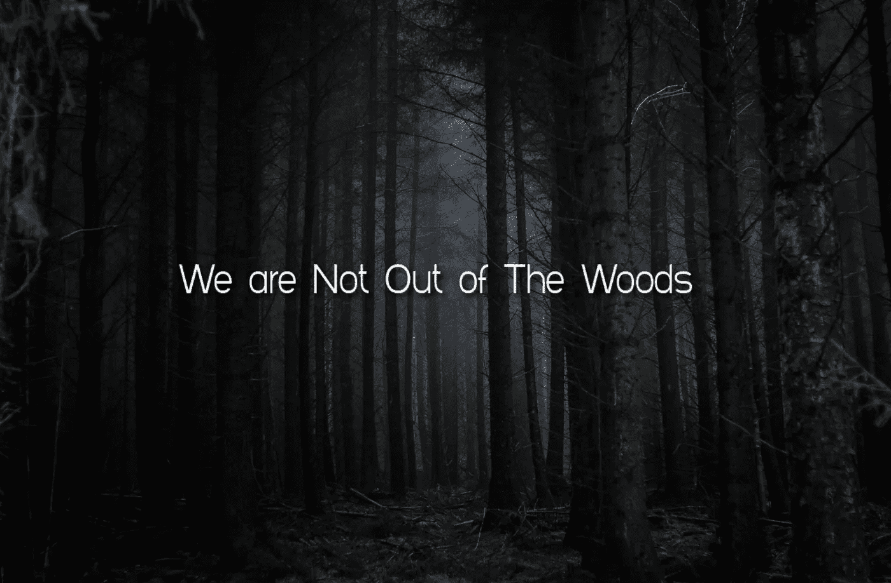
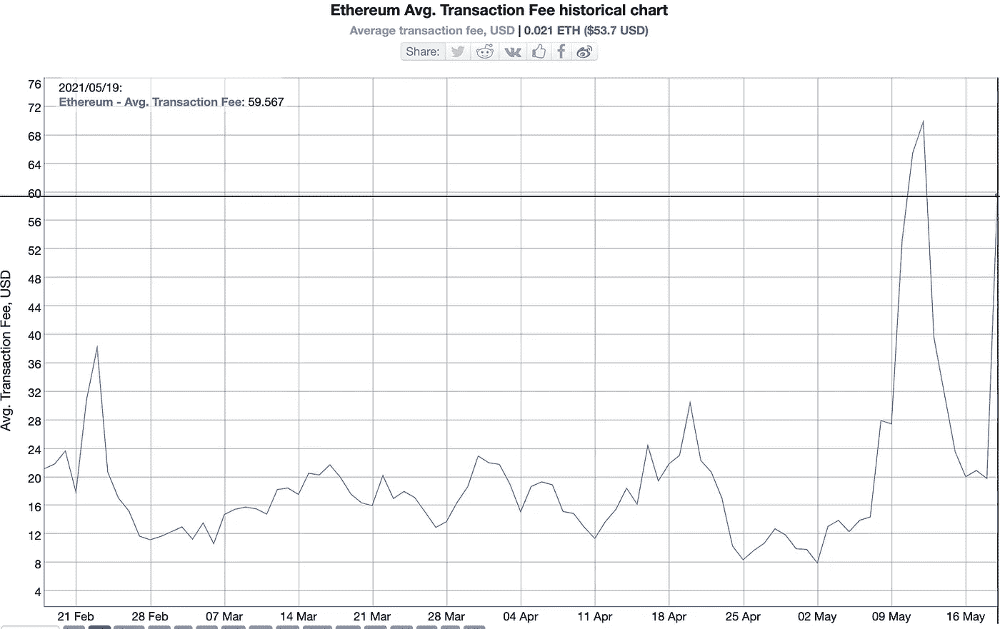
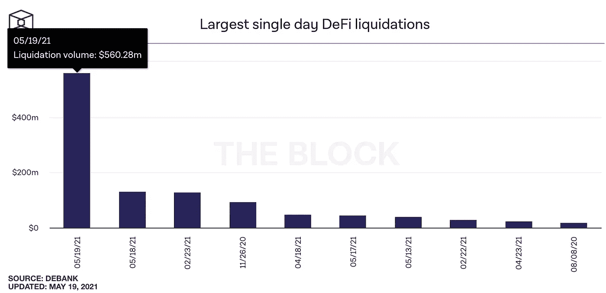
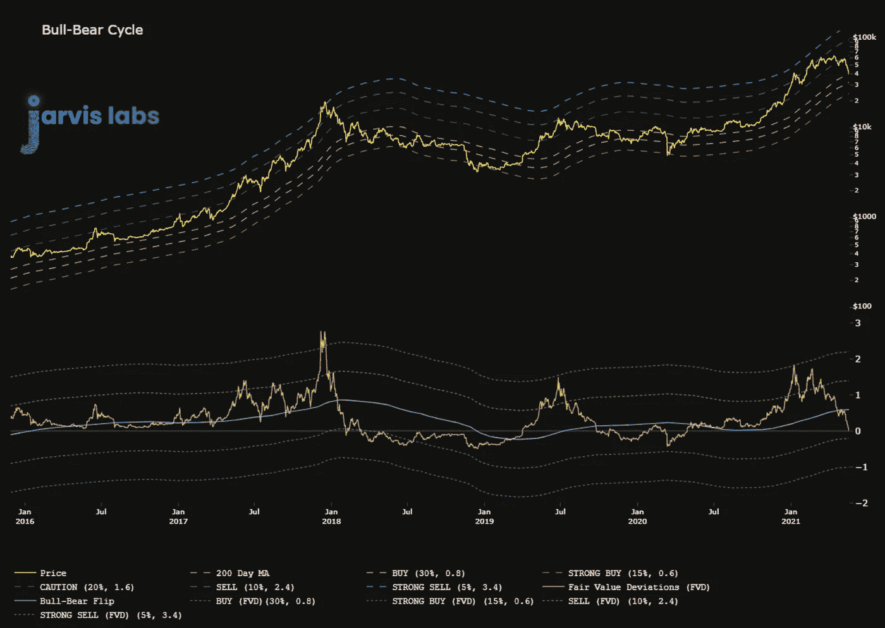

# 5 月 19 日的市场崩盘

> 原文：<https://medium.com/coinmonks/the-may-19-market-crash-23d02d6fb8f3?source=collection_archive---------3----------------------->

想象一下如果你抓住了灯芯。

此外，想象一下，如果您以 20 倍、50 倍甚至 100 倍的杠杆抓住它。

跳票赚的钱可能足够你维持一年。这是一个全垒打赌注。

但是事情是这样的…

你甚至不能尝试它。各地的交易所都在下跌。CoinMarketCap 和 CoinGecko 在拖延时间。

想在 Uniswap 这样的分散式交易所交易…享受平均交易费第三高的一天，每张图表显示 60 美元。

更不用说像 Aave 和 Compound 这样的 DeFi 协议的清算，昨天都是前所未有的。

你不能动。

如果这是你第一次比特币下跌超过 30%,替代币下跌超过 40%,欢迎来到节目现场。

这是密码。

到现在为止，你可能已经听过这个三个字的短语很多次了。现在，今天在座的每一位读到这三行字的人都更好地理解了它的含义。

当你在一场狗屎风暴中，什么都不管用。

这就是为什么我们把风险管理放在如此重要的位置，避免像昨天那样对投资组合造成巨大冲击，让你在市场上获得巨大优势。

对于那些在 HODL 看着一切流血的人来说，没有必要恐慌。如果你已经走了这么远，你可以安然度过接下来的几个月，因为市场会再次走强。

我如何才能确信这一资产类别会长期上涨？

因为…这是加密的。

我们昨天了解到，crypto 实际上仍然是一个青少年。exchange 基础架构无法大规模运营的问题非常突出。

这反过来导致流动性问题，因为做市商无法做出反应，因为主要市场的 API 都没有反应。

流动性的缺乏表现为各种各样的混乱。

就连比特币基地的交易价格也比其它交易所高出 3000 美元。

这些是系统中的缺陷，空间正在消除。这也是我们看到如此大规模抛售的部分原因。

然而，尽管 crypto 效率低下，我们还是取得了长足的进步。我们现在有能力进行衍生品交易，获得贷款等等。

尽管已经做了这么多，我们仍然有大量的进展要做。

这就是为什么我可以充满自信地继续在这篇时事通讯上挥洒乐观的笔墨。

这也是为什么我强调要规避风险。意思是不要跑到压路机前面去拿那些 sat。保护你的资本让你更有机会将整个资产类别推高。

好了，别再鼓励了。我希望其中一些对你有意义。

一般来说，我会在这里或那里写一些奇怪的话题，但我很肯定我可以假设每个人在接下来的几天里每天都想要什么…

# 市场更新

众所周知，在下跌之前，我们收到了很多异常看跌的 BTC 获利回吐交易。

它始于本月初，并引起了我们足够的关注，以至于我们在 5 月 7 日的“[获得动力](https://jarvislabs.substack.com/p/gaining-momentum)”中写下了它。

下面是我们提到的…

> *“当我们将这与过去两周比特币的连锁获利回吐联系起来时，我们可以描绘出一个非常强劲的下跌熊市。*
> 
> *这不是一种“顶部进入”类型的熊市，而是更像是一种下跌，替代币下跌 30%至 50%，而比特币下跌 10%至 15%。*
> 
> *随后不久，比特币引领市场走高。”*

当时我们注意到巴勃罗先生开始行动了。他的招牌动作是在疲软的市场中卖出。

之前有两次，他的卖出没有逆势，最终在价格反转前创造了最后一次卖出。

这也是为什么当我们看到他的第一笔交易时，我们拒绝了。当时的想法是，市场流动性过剩。

不管怎样，我们知道威胁。贾维斯·艾知道威胁。我们规避风险，等待市场告诉我们它的走向。

低于 3 万美元。哇哦。那么它是如何在链上展开的呢？

由于 BTC 不寻常的空头钱包交易被存入交易所，我们的算法和风险模块到处发出警报。

此外，大量美元形式的流动性正在离开交易所。

随后，随着伦敦时段临近，看跌交易开始见顶。这意味着一场剧烈波动的熊市正在酝酿之中。

随着 price 蹦极跳下 4 万美元，订单的买盘被堆积起来以吸收冲击。但由于交易所无法进入，几乎没有市场购买，这意味着 crypto free 陷入了休眠的任何出价。

一旦交易所启动了拨号调制解调器，我们就会遭遇恐慌性抛售。巴勃罗从未停止，只是一拳接一拳地打击。我们真的好几年没见过这种情况了。简单地说，这就是大屠杀。

现在我们又在追埃隆的核武器、巴勃罗的干草制造机，甚至次优的基础设施，为把钉子钉进比特币的棺材创造了条件。

然而，它仍高于此前减半周期的高点 2 万美元。

好东西。

所以就我们现在所处的位置而言…

我将暂停片刻，拿起头盔。因为我要给你看的东西可能会引起一些反弹。如果是这样的话，请记住这是一个长期的游戏。

上个月末，我们开发了一个新的牛熊指标。当本杰明受到 COVID 的攻击时，它正在内部完成。当本杰明回来后，他把它清理干净，以满足他的期望。

好吧，在埃隆发推特之前，它就在告诉我们，我们正处于熊市。

在指标的下半部分，有一条橙色线，我们称之为资产的公允价格或“公允价值偏差”。

几周前我们达到顶峰时，它越过了蓝线。那条蓝线是牛熊分界线。

我们现在低于它，根据这个指标，我们处于熊市。

(我抓住我的头盔)

我首先要提到的是，不，我们并不是说比特币已经进入熊市。这是一个新的指标，所以我们需要有所保留。

但清楚的是，当公允价格跌至阈值以下时，我们会得到熊市修正。而且得益于其陡峭度，仍能以类似图表中 2017 年下半年的力度反弹。

因此，我们计划在需要时拿出这张图表，评估我们在比特币公平价格方面的地位。

对于我们的 Jarvis AI 用户来说，这个指标帮助我们在熊市趋势中更早地出仓，尽可能接近顶部，而不是像昨天那样在大幅调整后出仓。

现在，让我们在房子周围找些事情做。或许清理一下那个塞满东西的壁橱。现在不是做交易的时候。让尘埃落定。我知道我昨天说过这可能是最后一次冲洗，但我们还没有脱离险境。

直到下一次…

你的脉搏在加密，

本·莉莉