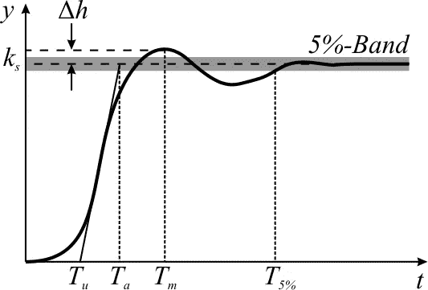
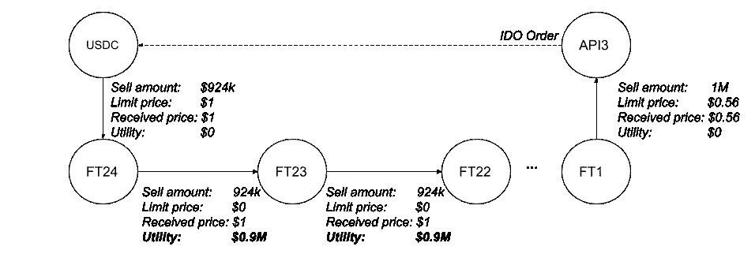

# Mesa DEX 漏洞

> 原文：<https://medium.com/coinmonks/the-mesa-dex-exploit-56f393518de0?source=collection_archive---------1----------------------->

这是我的帖子【Mesa DEX 如何工作的第二部分，我写于 11 月 27 日，API3 公共令牌分发的三天前。在分发过程中——实际上，就在开始时——一个以前未利用的漏洞被攻击者利用，以相对低廉的价格购买了大约 160 万个 API3 令牌，每个令牌 0.56 美元。这导致 API3 DAO 筹集的资金比正常情况下的预期少 68 万美元。(如果你想知道:攻击者在一天之内以更高的价格在 Mesa 上转售了所有这些代币。)

在这篇文章中，我将解释这个漏洞到底是什么(它相对来说是复杂的),并且我将更新我对 Mesa / Gnosis 协议的一些最初想法。

这个帖子是相当技术性的，虽然不如现有的文档那样技术性；我试着保持高层次的东西。如果你想跳过所有的技术内容，我建议你向下滚动到“Rand0m 和不那么随机的最终想法”部分，其中包含了我对漏洞的事后思考和对我第一篇文章的各种补充。

# 关于目标函数的一点注记

在我的[上一篇文章](/api3/how-mesa-dex-works-2e2d026090bf#:~:text=Mesa%20is%20an%20Open%20Source,(to%20prevent%20front%2Drunning))中，这应该是这篇文章的必备阅读材料，我说过给定批次的匹配订单的优化函数是**总交易盈余**，它是最大化的。

这并不完全正确。我写这篇文章时，只阅读了 2019 年撰写的原始 [Gnosis 协议白皮书](https://raw.githubusercontent.com/gnosis/dex-research/master/dFusion/dfusion.v1.pdf)，当时该协议被称为 *dfusion* 。在阅读他们最近更新的文档时，似乎 Mesa 目前使用的优化函数(据我所知，Gnosis 协议的唯一实际实现)在他们更复杂的更新目标函数中使用交易者盈余作为单个术语:

*目标函数=交易者的剩余-不考虑效用+收取的费用/ 2*

也就是说，自最初的白皮书以来，目标函数似乎已经更新，包括了**忽略效用**(解释如下)，以及不太重要的，求解者收取的费用。

## 忽视效用

来自 Gnosis 协议[开发者指南](https://docs.gnosis.io/protocol/docs/devguide03/):

> **忽略效用**:解决方案中所有(已执行)交易的忽略效用总和(即忽略未触及订单)。交易的被忽略效用被定义为最大效用和实际效用之间的差异…最大效用是指交易以计算价格(`trade.buyAmount == order.buyAmount`)完全执行时的效用。

也就是说，目标函数有一个额外的项，它“惩罚”只履行部分订单的解决方案，从而创建对完全履行订单的偏好—提醒:用户在 Mesa 上创建限价订单，指定他们愿意出售的令牌 A 的最大数量 *n* (对于令牌 B 的某个最小数量 *m* )。

在其他条件相同的情况下，目标函数更喜欢完全执行的订单；即执行交易金额尽可能接近 *n* 的订单。

现在，为什么在目标函数中包括被忽视的效用？问得好，我也问过自己同样的问题……答案并不完全直观。

## 包含忽略效用的理由

在开发者指南中，作者承认:

> …直观上，针对这个指标(交易者盈余)进行优化就足够了。

然后他们补充道:

> 然而，这可能会对“市场订单”产生不利影响。

如前所述，Gnosis 协议默认只允许[限价单](https://www.investopedia.com/terms/l/limitorder.asp)。那么，那些想要下*市价单*——以当前市价立即执行的订单——的用户怎么办呢？对此有一个巧妙的解决方案:可以通过指定远离当前市场价格的非常低的限价来模拟市场(卖出)订单。

这里有一个简单的例子。考虑一些稳定的货币，通常在 0.95-1.05 美元之间交易。假设您想为 STABLE 创建一个市场买入订单。假设卖方通过合理定价的限价卖单(例如在 1.00-1.05 美元的范围内)出售，您可以为 *n* 创建一个稳定在 1.10 美元的限价买单(即高限价买价)。然后你会期望一个 1.00-1.10 美元范围内的结算订单，可能在某个中点，最大化买卖双方对交易的满意度(即“效用”)。也就是说，市场买方出价过高，认为实际交易会以更低的价格结算，更接近市场价格。

An illustration of overshoot. This image is sourced from the Wikipedia article on [overshoot](https://en.wikipedia.org/wiki/Overshoot_(signal)), a topic from signal processing, and only somewhat related to the topic at hand :)

现在，我想这是好的，假设有一个市场交易者，交易另一方的交易者正在考虑外部市场信息，创建一个合理的限价单，从而将最终结算价格“抑制”到某个合理的市场价格。**那么，问题是当有两个相反的“市场订单”时。**同样，根据文档:

> 在极端情况下，可能会有两个相反的“市场订单”。在他们的限制的大范围内的任何价格将是有效的，并且在整个价格范围内效用的总和将是相等的。

也就是说，如果聪明的用户 A 在 1.20 美元创建了稳定的“市场买入”，而聪明的用户 B 在 0.80 美元创建了“市场卖出”，当单独考虑交易者盈余时，0.80 和 1.20 之间的任何价格将导致用户 A 和用户 B 的相同的*总*效用分数。我省略了数学公式，并敦促读者参考交易者盈余公式来说服自己这一点(正如他们所说，留给读者做练习)。

我想你可能会说这是一个问题，因为这些“市价订单”没有恰当地模拟市价订单应该做的事情，即，在市价(~1.00 美元)附近结算。

这就是**忽视效用**的原因。这个想法是，虽然可能有这些杂乱的“市场订单”，但大多数订单都是合理的限价订单(所谓合理，我指的是考虑到外部市场信息，因此是在市场价格附近做出的)。因此，用户在 0.80 美元进行稳定的“市场卖出”将会被大约 1.00 美元的市场价格的限价卖单超过。因此，尽管个人买家希望以 0.80 美元的诱人价格部分完成订单，但这只会使*部分*完成订单，从而导致*忽略效用——即*完全完成订单时交易者总效用与*实际完成*之间的差额。

换一种方式来考虑:将忽略效用加到目标函数中，将已结算订单的价格推向最大限价订单所代表的价格。这迫使价格处于“较大”订单的末尾。

因此，忽视效用意味着允许合理执行市场指令。是的，这并不完全是直觉。

# 利用

有了上面的澄清，我现在可以确切地了解在 API3 令牌分发事件中利用了什么。Gnosis 团队的 Felix Leupold 在这里详细描述了这一事件。

有一个天真的假设，在 Gnosis 协议文档中并没有明确表达出来(据我所知):链外解算器和交易器是不相交的集合。更具体地说:链外解决者不会同时在平台上下单。也许不那么天真的是，人们可能会承认这种假设是错误的，但可以说不那么天真的假设是:即使求解者也是订单制定者，他们也不能简单地包括他们的订单，因为他们与其他求解者竞争以制定“最佳”解决方案(不保证包括他们自己的订单)。

这种利用推翻了这两个假设。攻击者是一个解决者，他下了一个订单，然后创建了一个变通办法，将他们自己的订单(以相对较低的价格)包含在他们的解决方案中，这最终成为“最佳”解决方案，尽管原因是错误的。

> 在拍卖开始之前，EOA [0x9cde](https://etherscan.io/address/0x9cdea12621a2ac04b80cd60afbf7eff364afa305) 在 Gnosis 协议上创建并列出了 24 个假的 ERC 20 代币(FT1 … FT24)。

The giant ring trade the attacker created in order to create a high utility score. ([Source](https://hackmd.io/@n6YCqowrQduQ5u25wSoRXw/Hylnk7SjD))

漏洞的本质:攻击者创建了一个巨大的环形交易，由 26 个代币组成——API3、USDC 和 24 个新铸造的 shitcoins (FT1，…，FT24)。环形贸易中的订单包括:

1.  约 160 万 API3 的“合法”订单，价格为 0.56 美元(通过销售 FT1，见上图)。
2.  以 1 美元的价格卖出 FT24 英尺的订单。
3.  所有其他订单(FT[n+1] → FT[n])的限价都是 0 美元(以 1 美元成交)。

请注意，通过该环形交易的总“实际价值”仅为 924，000 美元，并且该环形交易的规模可能会增加，而实际上不会让攻击者付出代价。(提醒一下，梅萨的批量交易可以通过最多 30 个订单来解决，所以结算的环形交易*的规模是*有界的。)也就是说，你可以通过增加戒指的大小来任意夸大戒指交易的效用，而实际上并没有增加交换的总价值。我认为这是问题的关键之一。

> 用户提出以基本上 0 美元的价格出售 FT_x 以换取 FT_y，但他们收到的价格是 1 美元。这为他们创造了大量盈余(被称为效用，也是优化标准中的主要因素之一):每个假令牌的效用接近 100 万美元。

请注意，因为攻击者将每笔 FT[n+1] → FT[n]交易的限价设置为 0 美元，所以他们能够非常显著地夸大其解决方案的效用——如下:根据目标函数的公式，卖方以比他们要求的价格(0 美元)高得多的价格(1 美元)出售他们的代币，从而导致高交易者福利/盈余。请注意，实际交易结算为 1 美元(不低于 1 美元),这与上面详细讨论的目标函数中的*忽略效用*项有关，允许用户以限价“接受”其他订单。

因此，该漏洞结合了在[开发文档](https://github.com/gnosis/dex-docs/blob/develop/docs/devguide03.md)之一中定义的两个“已知问题”:[市场秩序漏洞](https://github.com/gnosis/dex-docs/blob/develop/docs/devguide03.md#market-order-exploit)和[假令牌实用程序](https://github.com/gnosis/dex-docs/blob/develop/docs/devguide03.md#fake-token-utility)。攻击者获胜的解决方案产生了>2200 万英镑的总效用，而良性求解者的最佳解决方案大约是<500 万英镑。

我还应该注意到，这种攻击在 IDO 场景中更有可能发生——在 I do 场景中，买卖订单提前很多时间发出——因为最佳真实效用分数可以近似计算，因此可以提前计算出用假戒指交易获胜所需的效用值。

# 随机的，不那么随机的最终想法

以下是我对此事件的一些想法和收获。请注意，我在这里列出的大多数事情最终都是以问题的形式出现的，旨在引发对话，而不是作为我对这些问题的固定想法。

*   **文档** —简单地给一些不常阅读的文档添加一个简短的附录来提醒用户现有的漏洞是否足够？各种区块链协议的创建者应该如何充分提醒用户已知的漏洞？
*   **解决者的独立性**——在我之前的文章中，我提到了通过“众包”和让解决者竞争提出解决方案来解决 NP 难题的独创性。然而，令我惊讶的是，我现在意识到我做了一个假设(就像我确信许多人做的一样)，即求解者使用独立的技术，从而导致对非凸搜索空间的彻底搜索。然而，似乎大多数求解者都使用[相同的代码](https://github.com/gnosis/dex-open-solver)来提出解决方案。尽管代码中嵌入了一些随机性，但搜索技术的相似性无疑会导致最佳匹配订单的解决方案在某种程度上有偏差。换句话说，给定批次的解可能不像我们最初想象的那样不确定和模糊，可能偏向于某些局部最小值。这一点无疑需要更彻底的分析；我只是暂时记下大致的想法。
*   **复杂性和晦涩难懂** —当很少人知道一个协议如何工作时，它有多大优势？一方面，晦涩使得普通用户无法真正“玩弄系统”(正如我在上一篇文章中提到的)，另一方面:由于协议的复杂性，一个非常聪明的用户可能会发现以前没有发现的主要漏洞。复杂性增加了攻击面。攻击潜伏在复杂数学的黑暗角落，特别是当需要削减角落(例如，每批最多 30 个订单)以便在区块链上实施高维数学复杂性时，有许多约束和限制。
*   **非链计算和黑箱**——[黑箱](https://en.wikipedia.org/wiki/Black_box)解决方案在多大程度上适合原本透明的区块链？也就是说，在不创建难以看到的攻击面的情况下，有多少“工作”可以被链外计算安全地隐藏？
*   **解决方案改进与解决方案复杂性**—Gnosis 协议提供的收益——前置阻力和可以说是“更公平”的解决方案(通过增加交易者效用)——是否超过解决方案日益增加的复杂性所带来的成本？(事实上，Gnosis 协议 v2 可能会再次涉及[改变优化标准](https://forum.gnosis.io/t/should-gnosis-build-gnosis-protocol-v2/741/8)。)我们如何衡量这种权衡呢？
*   **用户友好？** —用户对他们不了解的系统有一种天生的(也是可以理解的)不信任感(这是密码领域/区块链领域普遍存在的抱怨)。这种系统的创造者在设计这种系统时应该意识到这种复杂性/用户友好性的权衡吗？也许我应该把用户/发行参与者的大量问题当作一个烟雾信号——煤矿里的金丝雀之类的东西？
*   **历史技术文档**——我考虑过根据这个漏洞编辑“Mesa DEX 如何工作”，这发生在我写完我的帖子之后。然而，我选择让它保持原样，带有一个到这个帖子的链接，并把它当作一个历史文档。技术不是凭空出现的，我认为历史背景应该更多地融入技术讨论/文档中。

## 最后一个音符

我通过阅读少量的文档，在没有任何外部编辑的情况下写了这篇文章(现在是假期！)所以，如果这篇帖子有任何不准确的地方或任何重大缺失，请随时评论，我会相应地更新。