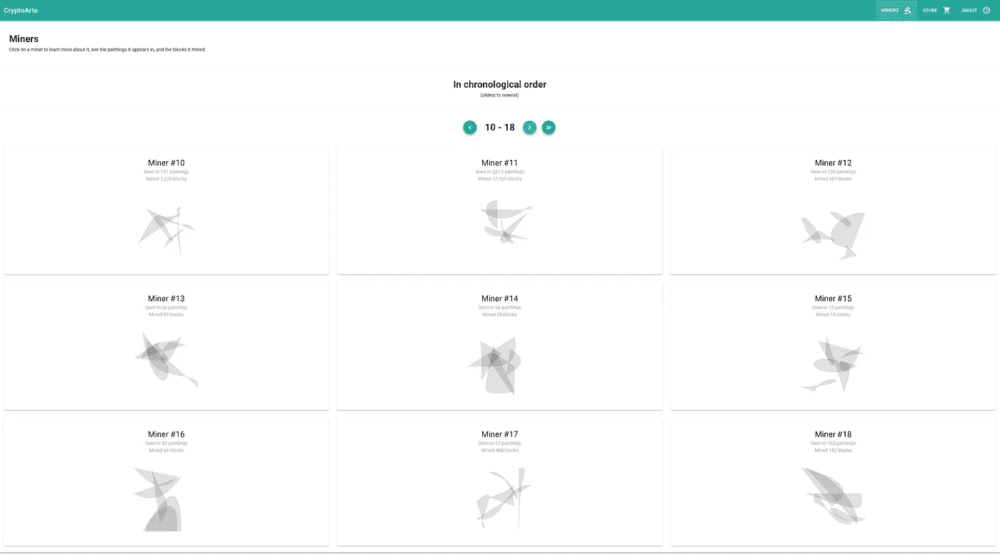
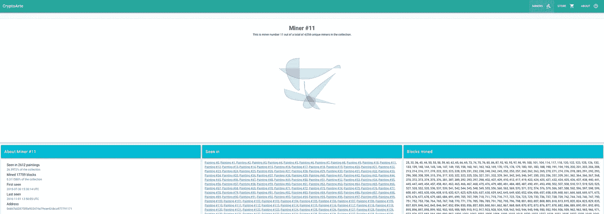
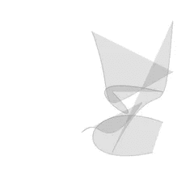

# 矿工画廊 CryptoArte 发布前更新#3

> 原文：<https://medium.com/coinmonks/the-miners-gallery-cryptoarte-pre-launch-update-3-e1cb3667fd22?source=collection_archive---------4----------------------->

Miner #3160 (an extremely rare one)

Привет.我非常兴奋地分享这最后的 [CryptoArte](https://www.cryptoarte.io) 预发布更新。

你可能已经知道，每幅 CryptoArte 画作描绘了以太坊区块链的 576 个连续的街区。并且，每个块通过一个形状或图标艺术地投射它的矿工。

每个矿工的形状都是独一无二的，因此当一名矿工在同一幅画中和不同的画中开采了多个区块时，你可以分辨出来，因为它们的形状在整个系列中以不同的颜色重复出现。

有些矿工非常罕见，只开采过一个区块，在一幅且只有一幅画中可以看到，而另一些则非常活跃和常见，开采过很多区块，几乎每幅画中都可以看到。

以前很难理解，这次更新让你可以[浏览收藏中的 4056 名矿工，观察他们独特的形状和统计数据](https://www.cryptoarte.io/miners)，从而为这个 CryptoArte 维度注入新的光芒。

## 矿工画廊

**Figure 1** — *CryptoArte Miners 10 through 18*

**上面的图 1** 显示了[矿工画廊](https://www.cryptoarte.io/miners)，在这里你可以按时间顺序浏览矿工(从以太坊历史上看到的第一个矿工开始，一直到集合中看到的最后一个矿工)。每个矿工都由它的编号、其独特形状的小型版本、整个收藏中开采的块数以及它出现在绘画中的数量来表示。

**Figure 2** — Miner #11 detailed page

点击一个矿工会带你到它的专用页面。**图 2** 显示了[11 号矿工](https://www.cryptoarte.io/miners/0xbb7b8287f3f0a933474a79eae42cbca977791171)的情况。Miner pages 包括更详细的形状图像和更详细的统计数据，包括:

*   开采的矿块数量和列表(以及所占的百分比，让你了解矿工的稀有程度)
*   矿工所在的所有画作的数量和链接(以及这代表的收藏百分比，也让你了解矿工的稀有程度)
*   首次发现(矿工首次开采区块的日期和时间)
*   最后一次看到(矿工最后一次开采集合中的区块的日期和时间)
*   以太坊地址(所以你可以在[以太扫描](https://etherscan.io/blocks?m=0xbb7b8287f3f0a933474a79eae42cbca977791171&ps=100&p=178)上查找)

作为背景，这里有一些最罕见和最常见的矿工的快速列表。

## 最稀有的矿工

一些矿工非常罕见，在整个采集过程中只开采了一个区块。以下是其中的一些:

*   [4047 号矿工](https://www.cryptoarte.io/miners/0x66a87cd1c3c31bf8d49197b18655603038472021)开采了 5657036 号区块，只在[画 9821 号](https://www.cryptoarte.io/paintings/9821)。
*   [3841 号矿工](https://www.cryptoarte.io/miners/0x70e2cf0afee8328e016e818f71cb50845984e769)开采了 4377056 号区块，目前只在[画 7599 号](https://www.cryptoarte.io/paintings/7599)。
*   [3160 号矿工](https://www.cryptoarte.io/miners/0x203374883aaf0c942e7d3dbf8ce7f8a961e93e59)开采了 1726071 号区块，只在[画 2996 号](https://www.cryptoarte.io/paintings/2996)。
*   [2518 号矿工](https://www.cryptoarte.io/miners/0x855780c8aa9f767cab961f2b28c96584c77da602)开采了 1096154 号区块，目前只在[1903 号画](https://www.cryptoarte.io/paintings/1903)。
*   [2295 号矿工](https://www.cryptoarte.io/miners/0x3f2da093bb16eb064f8bfa9e30b929d15f8e1c4c)开采了 877513 号区块，目前只在[1523 号喷漆](https://www.cryptoarte.io/paintings/1523)。
*   [1847 号矿工](https://www.cryptoarte.io/miners/0x2ece364f8952764cedd391d2316a8147e0c6c304)开采了 238969 号区块，并且只在[油漆 414 号](https://www.cryptoarte.io/paintings/414)中。
*   [1834 号矿工](https://www.cryptoarte.io/miners/0x6a8a4a4d1c436cbbb1eca791d69cab962024b4e8)开采了 233905 号区块，目前只在[油漆 406 号](https://www.cryptoarte.io/paintings/406)。
*   [619 号矿工](https://www.cryptoarte.io/miners/0xf5b4b23a772b6794a7cdb21b95014c5e6758ded0)开采了 21630 号区块，目前只在[油漆 37 号](https://www.cryptoarte.io/paintings/37)。
*   [609 号矿工](https://www.cryptoarte.io/miners/0x7c194fca5a65240732314600f1b910a5036d2ec8)开采了 21224 号区块，目前只在[油漆 36 号](https://www.cryptoarte.io/paintings/36)。
*   [606 号矿工](https://www.cryptoarte.io/miners/0xf0f8112dd11d7afc19cb1769ccbfcda17627e33b)开采了 21062 号区块，只在[画 36 号](https://www.cryptoarte.io/paintings/36)。
*   [604 号矿工](https://www.cryptoarte.io/miners/0x344bbd5023f03da0bdfe384c65b4a5d62b0b2bca)开采了 20921 号区块，目前只在[油漆 36 号](https://www.cryptoarte.io/paintings/36)。
*   [600 号矿工](https://www.cryptoarte.io/miners/0x005fe5036d71907694e26421440e85103ea44018)开采了 20595 号区块，仅在[油漆 35 号](https://www.cryptoarte.io/paintings/35)。
*   [59 号矿工](https://www.cryptoarte.io/miners/0xde43d08f8150ffd4e0b6398a80ae7e322247cfac)开采了 762 号区块，只能在 1 号画作中看到。

## 最普通的矿工

Figure 3 — Miner #1872, aka DwarfPool_1

采矿池 [Miner #1872](https://www.cryptoarte.io/miners/0x2a65aca4d5fc5b5c859090a6c34d164135398226) ，是整个系列中最活跃、最常见的矿工。如上面图 3 中的**所示，它也被称为 [DwarfPool_1](https://etherscan.io/address/0x2a65aca4d5fc5b5c859090a6c34d164135398226) ，已经开采了 878，454 个区块(15.4%)，并且可以在 CryptoArte 收藏画中看到高达 9，463 个(95.6%)。**

Figure 4 — Miner #2,692, aka Ethermine

[另一个名为](https://www.ethermine.org/) [Ethermine](https://etherscan.io/address/0xea674fdde714fd979de3edf0f56aa9716b898ec8) (见**图 4** )的采矿池,[Miner # 2692](https://www.cryptoarte.io/miners/0xea674fdde714fd979de3edf0f56aa9716b898ec8)紧随其后，开采了 847963 个矿块(14.88%)，在 7825 幅画中出现(79.03%)。

Figure 5 — Miner #1536, aka Nanopool

**图 5** 显示了第三常见的矿工:1536 号矿工，又名 [Nanopool](https://eth.nanopool.org/) 。开采了 600，978 块(10.54%)，其中 9，709 幅为隐花岩画(98.12%)。

## 20 世纪的 OpenSea 捆绑包

我还想强调一下新创建的 **OpenSea 捆绑包**，为 20 世纪每十年后的画作编号:

*   [20 世纪(1900 年至 1909 年的画作)](https://opensea.io/bundles/the-1900-1909-paintings)
*   [1910 年(1910 年至 1919 年的画作)](https://opensea.io/bundles/the-1910-1919-paintings)
*   【1920 世纪 20 年代(画作# 1920–1929)
*   [20 世纪 30 年代(画作# 1930–1939)](https://opensea.io/bundles/the-1930s)
*   [20 世纪 40 年代(1940 年至 1949 年的画作)](https://opensea.io/bundles/the-1940s)
*   [20 世纪 50 年代(画作# 1950–1959)](https://opensea.io/bundles/the-1950-s)
*   [20 世纪 60 年代(绘画# 1960–1969)](https://opensea.io/bundles/the-1960-s)
*   [20 世纪 70 年代(绘画# 1970–1979)](https://opensea.io/bundles/the-1970-s)
*   [20 世纪 80 年代(1980 年至 1989 年的绘画作品)](https://opensea.io/bundles/the-1980-s)
*   [20 世纪 90 年代(1990 年至 1999 年的画作)](https://opensea.io/bundles/the-1990-s)

OpenSea 捆绑包令人惊叹，因为它们使您能够只通过一次以太坊交易来购买一套连续的 CryptoArte 画作，确保您拥有连续的一套画作，并且与独立购买画作相比，为您节省了资金。

但是有一个问题:一旦其中一幅画被卖出，这个包就会被打破，不再可以购买。所以，如果你是 90 年代的粉丝，就去买一包吧。或者，你也可以购买整个 1900 年代的(现在！).

## CryptoArte 统计

我想用当前的 CryptoArte 统计数据来完成这次更新:

*   **售出/转让的画作:** 102 幅(1.03%)
*   **画作铸造:** 376 幅(3.79%)
*   待售画作:9793 幅(98.97%)
*   **可证明的独特画作总数:**9895 幅(100%)
*   当前价格:0.0375 瑞士法郎(卖出 7 幅画后上涨 0.0025 瑞士法郎)

## 接下来

除了铸造一些画和实施一些小的 UX 改进，我们现在几乎准备推出。如果您有任何问题，请通过 [hello@cryptoarte.io](mailto:hello@cryptoarte.io) 给我们留言，或者前往 Discord 聊天室。

如果你喜欢 CryptoArte，**请考虑** [**购买一幅画**](https://www.cryptoarte.io/store) **，鼓掌，或者分享这篇文章给你的网络。**

感谢阅读，敬请关注 CryptoArte 官方发布会！