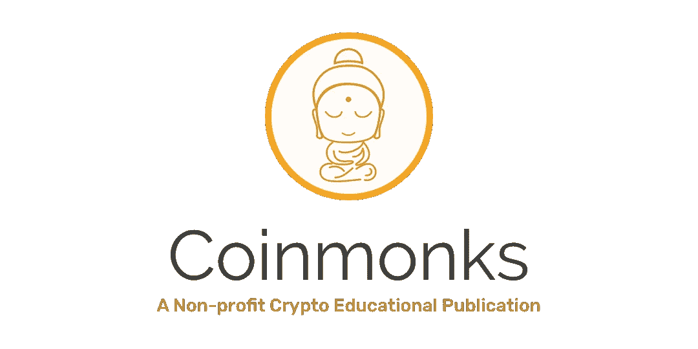

# 最小混合契约(MHC):将法律效力与区块链不变性联系起来

> 原文：<https://medium.com/coinmonks/the-minimum-hybrid-contract-mhc-tying-legal-effect-to-blockchain-immutability-a9ed1cd8b0f5?source=collection_archive---------4----------------------->

—在过去三十年里，一个国家应该建立的金融机构类型主要围绕着发现和实施实现自由市场经济的理想机制。这些辩论的核心问题是自由市场经济如何能够安全、负责、透明并包容所涉及的行为者，这些问题的一些关键解决方案是特定的金融监管和法律契约。此外，虽然西方以外的发展中国家和新兴经济体发生的腐败吸引了媒体的大部分注意力，但必须指出，腐败问题也是发达国家面临的一个重大挑战。

A legacy contract, source: [https://bit.ly/2UNu2uA](https://bit.ly/2UNu2uA)

为了克服腐败和依赖可信的中央第三方的挑战，我们提议用智能合同补充现有的法律制度，智能合同补充法律合同。我们的方法称为 [**【最小混合契约】(MHC** )](https://arxiv.org/abs/2002.06850) ，并在我们最近的论文中概述了“ [**【最小混合契约】(MHC):结合法律和区块链智能契约**](https://arxiv.org/abs/2002.06850) **，**”寻求将智能契约的责任和透明度纳入人类判断和自由裁量权的领域。

我们在论文中提出的论点是，除了利用法院解决合同关系中的法律纠纷之外，使用[区块链](https://blog.coincodecap.com/tag/blockchain/)作为设定金融交易规则的工具来补充法律合同，可以提供透明和不可变的交易，同时还可以通过降低信息共享成本来降低进行尽职调查和适当性评估的成本。

MHC 由一个法律合同和一个智能合同组成。智能合约通过不可变的记录促进透明和安全的交易。鉴于民事法庭处理纠纷受双方法律合同的支配，MHC 可以成为解决合同关系中低信任度问题的工具。

因为智能合同是无边界和不受管辖的，包括国内和地方管辖在内的几个管辖区可以在跨管辖区的 MHC 上合作。这使 MHC 能够促进透明的跨境交易和司法管辖区的互联。

MHC 为金融交易提供了透明性和不变性，交易的收据与交易本身无法区分。伪造收据的机会为零，因此收据欺诈在理论上是不可能的。使用 MHC 的不可变和透明的交易进行成本核算，可以降低非法活动的风险，因为其可靠性和成本核算都很高。

获取财务信息通常成本高昂，而且存在缺陷。使用 MHCs 时，信息的价格会降低，因为不再需要雇用审计公司来审查财务记录，也不再需要信任审计员、发行人和收据的安全保管人。合同关系中的一方可以审计 MHC 智能合同中的记录，以证明哪些过去的交易是使用对应方的公钥对签署的。

区块链监管战略需要为采用 MHC 开辟一条道路。如果区块链是非法的，MHC 不能使用智能合同作为合法合同的补充。先驱监管者的建议策略是实施安全港和监管沙箱，在这些地方，与区块链相关的特定活动被排除在法律义务之外。

MHC 也更值得信赖，使审计更具成本效益。最终，它成功地减轻了代理理论所强调的道德风险、信息不对称和监控成本。为了利用信息技术造福社会，必须在私人交易和透明交易之间找到一个黄金中间路线，必须在透明度和人类对隐私和保密的基本需求之间取得平衡。

MHC 智能合约的实现现在在以太坊地址[**0x c0e 817d 3 e 3d 79085175 BCD 83 BD 899 a 3d 06 BC 1c 8 a**](https://etherscan.io/address/0xc0e817d3e3d79085175bcd83bd899a3d06bc1c8a)上的[以太坊](https://blog.coincodecap.com/tag/ethereum/)区块链上公开运行。任何人都可以使用该地址中的智能合同来永久链接合法的智能合同。更多细节参见 [**MHC Git 库**](https://github.com/jakobsn/MHC) 中的文档。

> [直接在您的收件箱中获得最佳软件交易](https://coincodecap.com/?utm_source=coinmonks)

