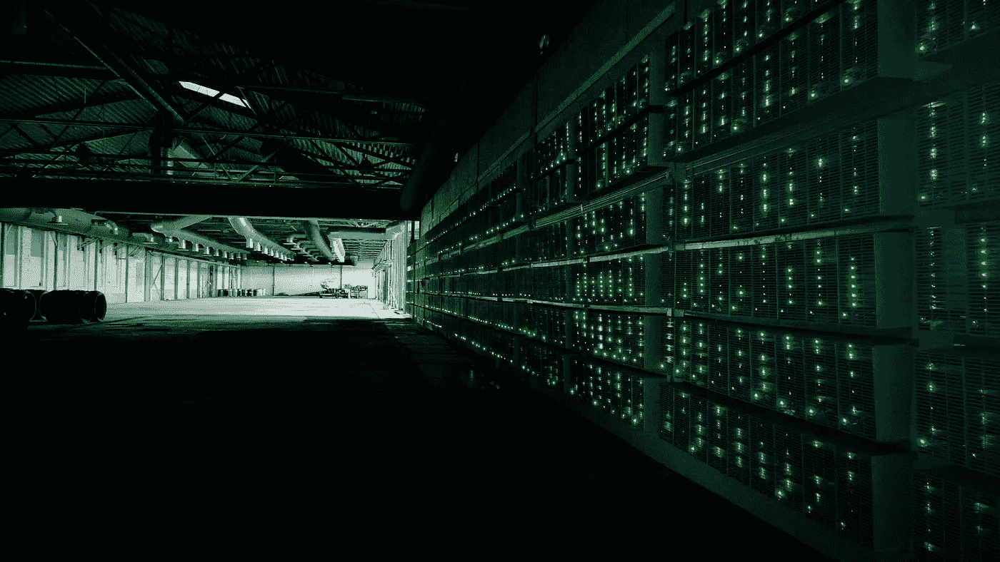

# 中国的矿业形势

> 原文：<https://medium.com/coinmonks/the-mining-situation-in-china-4fd2993dbee7?source=collection_archive---------5----------------------->

*Image From:* [*Finance Magnates*](https://www.financemagnates.com/cryptocurrency/news/end-bitcoin-mining-china-interview-rootant-ceo-lincoln-yin/)

中国已经多次宣布禁止加密货币，然而，这从来不是全面禁止。秘密采矿业被关闭是非常有利可图的，所以中国政府没有打击它，而是允许矿工保持他们的运作完好无损。

与此同时，民众仍被允许持有加密货币。mainland China 的交易所于 2017 年 9 月关闭，同时…