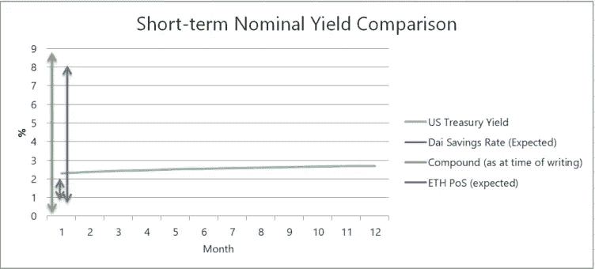
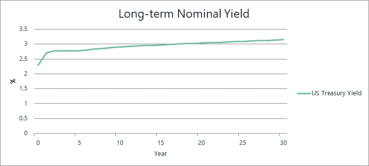

# DeFi 拼图中缺失的部分

> 原文：<https://medium.com/coinmonks/the-missing-pieces-of-the-defi-puzzle-52de2c023d96?source=collection_archive---------4----------------------->

以太坊的一个特殊用例在 2018 年出现了相当大的增长——新生的金融生态系统统称为“去中心化金融”(或简称为“DeFi”)。MakerDAO 特别成功，超过 1.5%的 ETH 现在被锁定为贷款工具的抵押品，被称为抵押债务头寸(CDPs)，贷款本身以 DAI 计价，DAI 是一种与美元挂钩的稳定货币。

在这种背景下，ETH 2.0 的工作仍在继续，这是对以太坊基础层协议的改进，主要目的是提供额外的事务吞吐量。目标是降低能耗和提高效率。作为规范的一个特征，适当的下注是有奖励的。

## 对创收资产的需求

对我来说，开放金融生态系统的宏伟愿景是将控制权从目前占主导地位的不负责任的机构转移回个人手中。为了实现这一点，需要建立其他可行的金融合作方法，为了挑战现有的机构，这些方法需要能够在金融上竞争。

成功的金融体系的一个关键组成部分是将资本有效地分配给那些最有能力利用资本的人。作为回报，资本的提供者会因此获得回报。这就是投资，目前最简单的形式可以是贷款(给银行、政府或公司)，或者购买公司的一小部分股份。

个人和实体都需要可行的投资选择，否则他们会发现自己的资产价值因通货膨胀而缩水。基于区块链的系统有能力改善这些投资工具的获取途径，同时降低基础供应成本。

然而，目前大多数链上价值都存在钱包里或集中交易所里，在那里没有回报——相当于把现金存放在床垫里。DeFi 和 ETH 2.0 正在创造各种各样的资产，任何人都可以在不需要许可或审查的情况下自由投资并获得被动回报。同时，其他生态系统参与者受益于额外的网络安全或借用资金的能力。

## 即将推出的产品和可用的产品？

在以太坊的生态系统中，现在有很多选择可以获得或者正在进行中。

*以太坊 PoS 投注*

最明显的(但也可能是最遥远的)是成为提议的利害关系证明协议中的利害关系人。在 ETH 2.0 的最新规范中，作为以太坊验证者的风险和预期回报已经被 Eric Conner 和 ethhub 团队的其他成员关注并很好地[总结了](https://docs.ethhub.io/)，Vitalik Buterin 提供了一些[的输入](https://www.reddit.com/r/ethereum/comments/a41u9k/i_wrote_a_page_on_eth_20_economics_hopefully_it/)。也有可能通过使用[标桩服务](https://www.rocketpool.net/)来规避一些风险。

获得的利息是可变的，取决于锁定协议中锁定的 ETH 总数。在最短锁定期和撤出期方面仍有一些不确定性，但看起来方向是让投资者随心所欲地进出，而没有太多的时间限制。

关于最终结果和相关未来变化的不确定性是许多链上被动回报资产的新兴关键属性。我已经开始在脑海中称之为“治理风险”,投资者/利益相关者可能会要求对此进行补偿，就像他们现在要求对流动性和信贷风险进行补偿一样——这是一个值得单独发表的讨论。

*戴储蓄率*

另一个即将推出的选择是用戴储蓄利率合约锁定戴。同样，它将有可能进入和退出没有任何固定的时间段。

收益将由 Oracle 通过 Maker token governance 制定的费率政策设定，预计将低于 CDP 收取的稳定性费用。介绍性文章使用了低于这个费用 1%的数字。鉴于当时 2.5%的稳定费，预期回报率约为 1.5%。

然而，MakerDAO 社区最近以微弱优势[投票](https://vote.makerdao.com/)将 Dai 稳定费降低回 0.5%。在鼓励发行和采用 Dai 的同时，这意味着潜在的 Dai 储蓄率要低得多。同样，治理风险是一个重要的考虑因素。

有趣的是，相比之下，当前的央行不太可能将这一利率设定为负利率。与现实世界的实体不同，如果 DAI 产生负回报，散户和机构用户就没有真正的动力将其锁定在 Maker 的系统中——持有 DAI 是一个可行的替代方案。

另一个特点是，这里的回报是以稳定币命名的，通过持有和锁定这个稳定币。以太坊用户最终是否更喜欢这种方式，而不是持有并获得 ETH 的回报，这是一个单独的问题，也值得单独讨论。

*复合*

[Compound](https://app.compound.finance/#Markets) 作为一个算法货币市场，目前正在 main net 上运行，使其有可能从一些 ERC20 资产中赚取利息，包括 DAI 和 wrapped ETH。它于 9 月份推出，在 12 月初之前，贷款利率一直很低，12 月初，一个高价值的借款人导致 DAI 供应商的年利率飙升至 10%左右。截至 2018 年 12 月 12 日，可获得的回报率徘徊在 8%左右。截至 2019 年 8 月 1 日，Dai 供应年利率回落至约 3.3%。这表明单个参与者目前可以对其他人获得的资产结果产生巨大影响。早期。

Sources: https://medium.com/makerdao; compound.finance; US Department of Treasury, 12/12/2018\. docs.ethhub.io, 08/01/2019.

## 少了什么？

上述产生回报的三种潜在方式的一个显著特点是，可以随时存取资金，这实质上创造了货币市场类型的工具。虽然这似乎是一个可取的特征，但由于回报率的可变性，很难保证你在一个月、一年或更长时间内会赚多少钱。

Source: US Department of Treasury, 12/12/2018

成功的金融系统的一个关键方面是将你的资产投资于可预测的长期回报的能力。这对[养老基金](https://data.oecd.org/pension/pension-funds-assets.htm)和[保险公司](https://read.oecd-ilibrary.org/finance-and-investment/oecd-insurance-statistics-2017_ins_stats-2017-en#page15)来说至关重要——这两个集团在全球投资组合中占了很大一块。

此外，此类工具对于长期个人储蓄至关重要，尤其是对于那些不希望出现波动的人，例如即将购买房产的人或接近退休的人。

除了有助于[保险型](https://www.nexusmutual.io/#)和[储蓄用例](https://akropolis.io/)之外，类似这样的东西将鼓励长期思考，并可能导致以太坊空间中项目资产与负债匹配的改进。

它缺乏清晰度。

## 我们能做什么？

有可能对固定的长期锁定期实施更高的 ETH PoS 奖励；在某种程度上，这已经出现在[之前的规范](https://www.ethnews.com/vitalik-buterins-five-steps-to-becoming-a-casper-validator)中，涉及约 4 个月的退出期。理论上，通过提供额外的利息来激励利益相关者锁定其 ETH 更长的时间，实际上会以更多利益相关者和保证将来在特定点至少有一定数量的 ETH 利益相关者的形式来促进网络的安全性。然而，由于回报的可变性质取决于赌注的数量，这可能需要一个类型为*即时验证率+ x%* 的浮动回报，再次使回报不可预测。

[达摩协议](https://dharma.io/)凭借其创造灵活贷款工具的能力致力于长期固定资产，我很高兴看到[达摩杠杆](https://lever.dharma.io/)会发生什么。然而，它还没有完全实现——目前它仍然依赖 p2p 匹配，目前利率非常不稳定。在源自达摩的 [525 笔贷款](https://loanscan.io/)(截至 2018 年 12 月 12 日)中，有 16 笔(3%)的价值(a)超过 10 美元，(b)超额抵押(避开“在互联网上借钱给陌生人”的问题)，因此这意味着它们不太可能只是实验，以及(c)持续时间超过 1 个月。

也有可能通过迫使用户在一段固定时间内借出/借入，创造出允许在长期资产上汇集算法市场的复合衍生品。这将是一项相当复杂的努力——需要一个基于久期的份额体系，随着个人用户头寸的减少，他们的头寸会随着时间的推移而跳跃。“互联网上的陌生人”问题目前需要一个适当的抵押系统来匹配这些份额。即便如此，如果可获得的利率是基于贷款人/借款人的供给和需求，很难看出回报如何随着时间的推移而固定。

长期资产的关键问题仍然是缺乏借款方——目前没有多少用户/项目想长期借款 crypto。长期借款人从根本上需要相信，他们可以在特定时间内借入资金，利用这些资金创造和获取价值，然后偿还贷款并保留增值。当前加密价值的不可预测性、围绕用户登录的问题以及对有形资产的有形[链接的缓慢采用，所有这些因素结合在一起，使得当前的借贷需求具有投机性，因此是短期的。](https://mattereum.com/)

我们在[的 Nexus Mutual](https://www.nexusmutual.io/#) 将继续以极大的兴趣关注这个利基市场，并愿意与[进行更多的交谈](https://discord.gg/pm35wJ6)。

*注意:本文最初是在 12 月 10 日起草的(在自我实施的加密新闻禁令之前)，因此一些数据可能已经过时。与此同时，达摩协议的 Max 发布了一份关于* [*新兴加密债务市场*](https://blog.dharma.io/exploring-the-emerging-crypto-debt-markets-36e3800fd7c5) *的精彩概述，其中涉及了许多类似的主题，尽管有一些略微不同的解释(例如 PoS 赌注)——绝对值得一读！*

> [直接在您的收件箱中获得最佳软件交易](https://coincodecap.com/?utm_source=coinmonks)

