# 现代金融体系是一个基于债务的金字塔计划&一个基于投资的庞氏骗局，还有额外的步骤…

> 原文：<https://medium.com/coinmonks/the-modern-financial-system-is-a-debt-based-pyramid-scheme-and-an-investment-based-ponzi-scheme-e37c4154b9?source=collection_archive---------0----------------------->

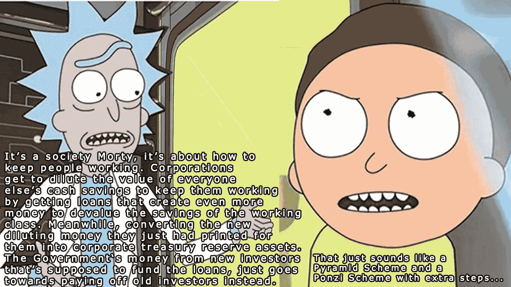

1\. Meme Image from Rick and Morty(8/30/2015) Season 2, Episode 6; The Ricks Must Be Crazy

经过几年对₿itcoin 和美元的研究，我从小就相信它是某个不知名的上帝，最终我开始用比特币的 Satoshis 来衡量一切，而不是美元。

最大的原因也不是因为比特币。是美元体系让我变成这样的。一旦我了解了这个系统是什么，它是如何运作的，我就不能再用美元来衡量任何东西了，因为我意识到它们的价值正以指数速度下降。

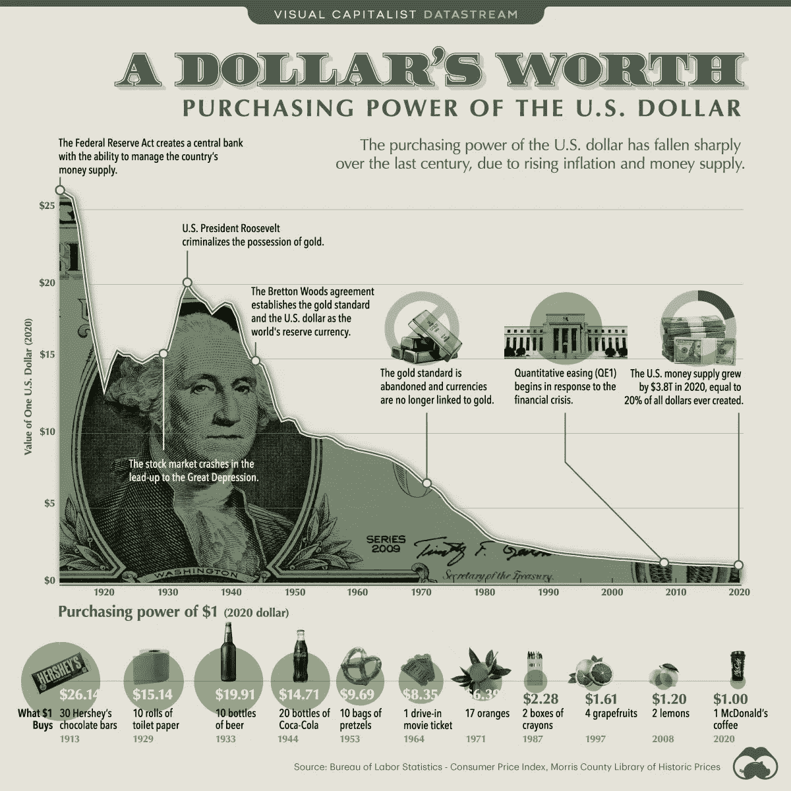

2\. Visual Capitalist: [https://www.visualcapitalist.com/purchasing-power-of-the-u-s-dollar-over-time/](https://www.visualcapitalist.com/purchasing-power-of-the-u-s-dollar-over-time/)

美元是一个系统，随着每一张新的美元以数字形式发行并被塞进世界上 1%的富人的银行账户，美元就在燃烧自己的价值。每当他们需要获得新的银行救助贷款或公司债券贷款时，这笔钱就会被打入他们的账户。

3\. New Year’s Resolutions 2018 | JEFF DUNHAM(1/11/2018) [https://youtu.be/PqyFS8Pc09Y](https://youtu.be/PqyFS8Pc09Y)

然后，他们将这些新资金冻结在自己投资组合的资产中。逃离美元，而贷款/印钞过程让他们获得了这些美元，融化了其他人的美元储蓄的购买力。

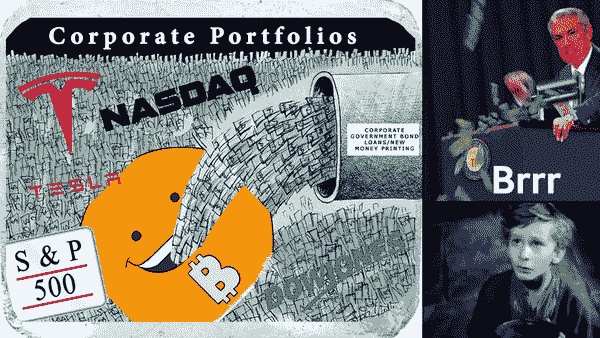

4\. “Bitcoin and Friends”(3/28/2019), Tesla Logo(2008), Dow Jones(1896), S & P 500(1957), Money Printer Go Brr Jerome Powell GIF: [https://tenor.com/view/money-printer-go-brr-jerome-powell-cash-money-printing-money-gif-17266014](https://tenor.com/view/money-printer-go-brr-jerome-powell-cash-money-printing-money-gif-17266014), Oliver Twist(1948), Chris Britt | Copyright 2021 Creators Syndicate

这一过程几乎没有让新印刷的货币流动性渗透到那些依赖美元的底层民众手中。

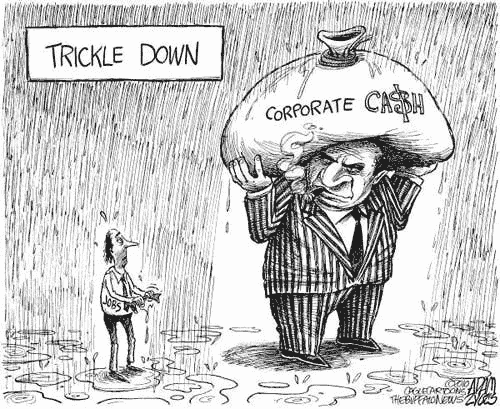

Trickle Down Economy published October 7, 2010 by Adam Zyglis politicalcartoons.com [https://politicalcartoons.com/sku/84137/](https://politicalcartoons.com/sku/84137/)

由于数万亿新美元的数字印刷，数万亿新美元被永久贬值，这些新美元是通过 1%的富人因囤积资产的贪婪而获得的贷款发行的。

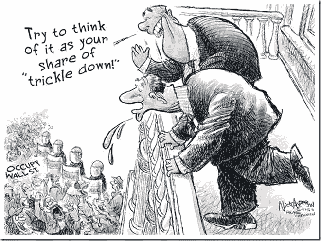

Nick Anderson’s Editorial Cartoons Published 2011–11–16 (Image 73167) [cartoonistgroup.com/cartoon/Nick+Anderson%27s+Editorial+Cartoons/2011–11–16/73167](https://www.cartoonistgroup.com/cartoon/Nick+Anderson%27s+Editorial+Cartoons/2011-11-16/73167)

我们想知道为什么在所有这些贷款福利下，财富不平等变得如此严重。为 1%的顶层人群提供贷款福利，在他们选择的资产市场中，他们可以获得大部分新印制的现金，然后用来玩音乐椅。

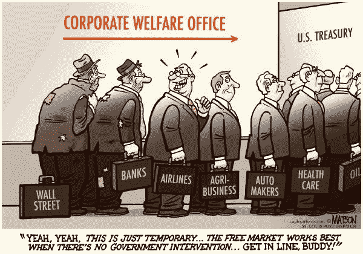

Corporate Welfare
RJ Matson ©
Distributed to subscribers for publication by Cagle Cartoons, Inc.

他们得到了去年疫情期间凭空数字化印刷的现有 35%美元中的大部分。就像他们每年总是获得大部分新的数字印刷现金来囤积在他们的资产中，同时给员工最少的钱。甚至不再是最低的生存水平，而是他们可以摆脱的最低水平，因为最低工资甚至不足以支付新上涨的房租。

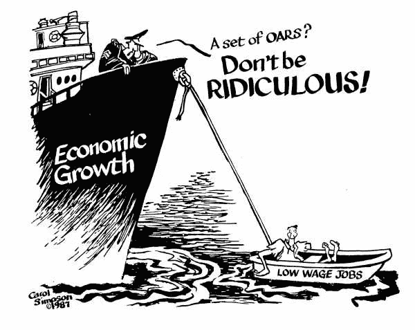

这是因为在我们当前的货币体系中，每一笔新的贷款都会创造出我们的现金，而最富有的 1%能够从我们所有人那里获得最大的贷款。他们中的一些人甚至可以迫使政府给他们大量贷款，这反过来又迫使新的货币被数字化印刷。在此过程中，流通中的剩余美元贬值。

*顶部可视化的美元通胀 Vs 底部可视化的比特币通缩:*

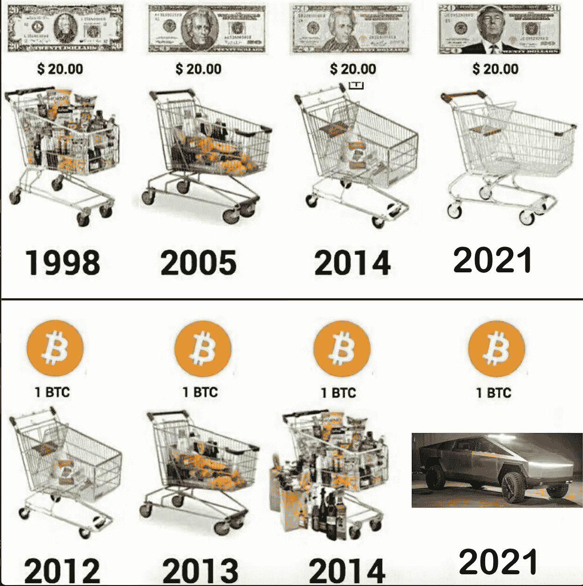

政府经常被迫发放这些大规模的企业贷款，导致新货币的印刷，使每个人的美元储蓄贬值。我们每隔几年就会看到这样的情况，银行需要纾困，因为它们腐败的系统破产并开始分崩离析，进一步加剧了美元资产负债表上的债务失衡。

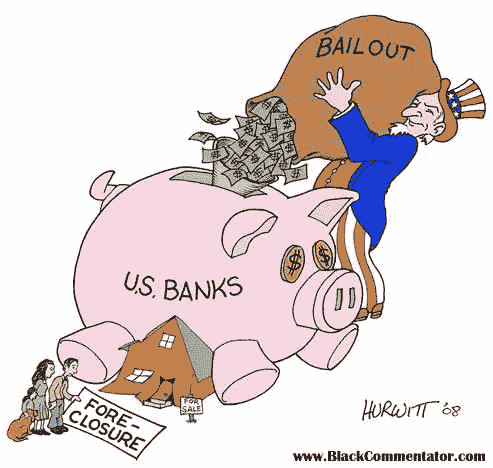

通过贷款产生新美元的美元体系基本上是一个基于贷款、囤积资产的金字塔计划，只不过增加了额外的步骤。随着每一次通货膨胀率的上升，这个国家正以越来越快的速度分崩离析，而由于企业贪婪导致的工资停滞，工资却没有上涨。企业的贪婪喜欢测试他们在避免起义的同时，能在多大程度上不付钱给人。

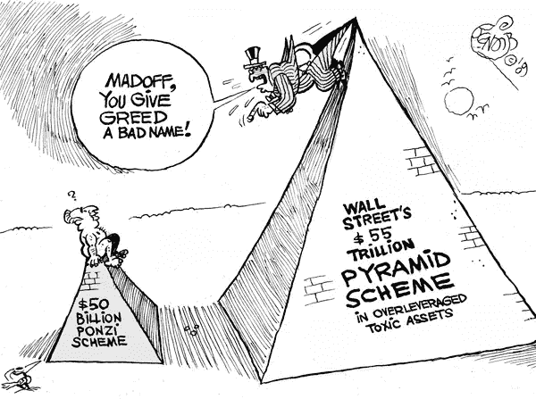

随着每一个新的数字印刷美元的出现，它会进一步瓦解，迫使他们印刷更多的美元来偿还旧债，这反过来又会在这个过程中产生更大的债务。重复这种流血的债务-货币创造-循环，导致美元的通货膨胀购买力损失随着时间的推移以指数速度增长。

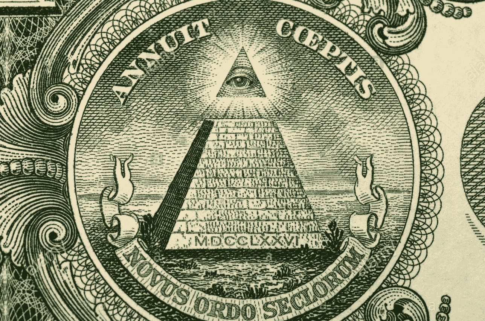

所有这一切都是为了让 1%的人口能够囤积足够的资产，过上金融大神般的生活。有足够的钱让他们的火箭飞上天，但仍然有比他们有生之年可能花掉的更多的钱。但是当然，他们中的一些人承诺在他们去世的时候会把所有的钱都捐出去，所以他们告诉我们他们可以这样做。

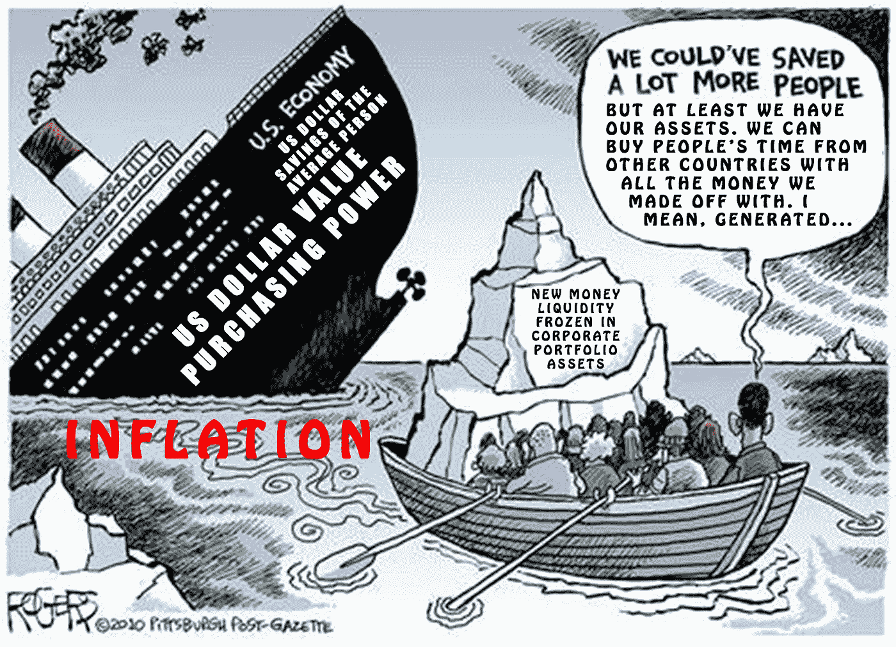

他们的腐败计划在债务-货币创造发行等式的另一端也获得了更多的乐趣:**投资者端。**

在投资者方面，政府用新的国家债券投资者向政府债券市场系统投资获得的资金偿还旧的国家债券投资者的债务。

这意味着，美国用新投资者注入美国债券体系的资金来偿还老投资者。听起来熟悉吗？在字典里，这被称为**庞氏骗局**。我称之为“额外步骤的庞氏骗局”

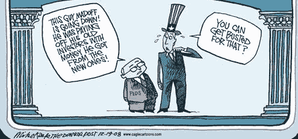

*补充说明:这些政府债券投资者应该为新的政府债券贷款提供资金。但是没有足够的投资者来做这件事，因为今天大多数人都是工资奴隶。因此，有能力投资的投资者只能负担得起每年获得批准的大规模企业政府贷款的一小部分。这意味着，其余部分是每笔贷款都凭空印出来的新钱，超过了国家债券投资的现金流入。*

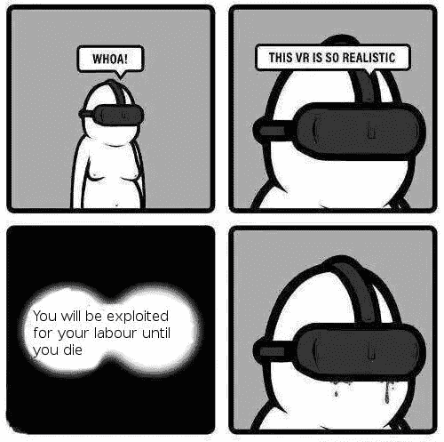

在这个体系中，他们印刷新的货币，使其他人美元储蓄的购买力价值贬值，同时冻结企业资产中的新货币供应，防止其渗透到整个经济中流通，这就是工资奴隶工人阶级的产生方式。

*工资如此之低的工人阶级，在他们储蓄中的美元贬值到超出任何有意义的效用之前，他们不可能存下任何可观的钱。通常迫使他们别无选择，只能承担无法偿还的债务，只是为了生存和获得生活中需要的任何东西，如房子、汽车、食物或租金，甚至支付紧急医疗账单等。*

*在这个等式中，国家债券投资者这一端是让政府能够印出大量钞票的前沿。他们每年借给华尔街的钱，然后华尔街把这些钱冻结在他们的资产袋里。*

你知道，就像洗钱一样。只不过，不是来自卡特尔或拥有离岸银行账户的邪恶企业的钱，然后通过他们的虚假业务进行清洗，并储存在合法资产中，而是由美联储凭空印刷出来的。增加了更多的美元流通总量，同时降低了其他人的美元和/或依赖美元的法定货币的储蓄价值。

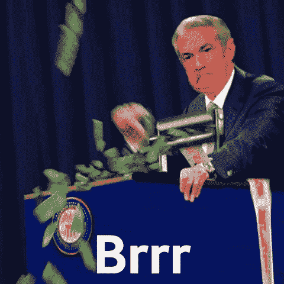

你有没有感觉到我们国家的金融系统出了什么问题？这可能是因为你下意识地注意到，这个系统不公平地把新的资金流向了最富有的 1%。而与此同时，让底层的人拥有更少的钱，只有每年更高的债务，这种债务不断增加，迫使他们一辈子工作。

用拉曼斯的话来说，这个系统是一个额外步骤的**基于债务的金字塔计划，另一端是一个额外步骤**的**基于投资的庞氏骗局。**

# **这是个大俱乐部，不邀请你。**

# 其他人也可能是一个西方世界机器人般的工资奴隶，他们的时间可以像一副交易卡一样用薪水出租和交易。

# **乔治·卡林说得好:**

这是同一个烂苹果的两面，而且已经开始腐烂到核心了。这两种腐败行为是政府在其他公司和个人被抓到时采取的措施。也许他们只是不喜欢竞争。也许是美宝莲。 *(不好意思，控制不住自己！)*

当伯尼·麦道夫被抓到经营庞氏骗局后，在监狱里接受第一次采访时，他告诉媒体:“你为什么还要和我说话；联邦政府正在经营世界上最大的庞氏骗局！”

如果说伯尼·麦道夫擅长什么的话，那就是庞氏骗局。游戏识别游戏。

如果我对金融系统是一个巨大的庞氏骗局的解释仍然不中听，那么这个人更详细的解释可能会有所帮助。他是一个愚蠢到无法理解比特币的人，但谢天谢地，他的大脑几乎没有足够的能力来解释这个巨大的庞氏骗局，这个骗局正在破坏金融系统:

所有这些都在将美元推向恶性通货膨胀的悬崖，这是一种美元购买力的金融悬崖，我们大多数人现在都很有可能在有生之年看到这种情况。

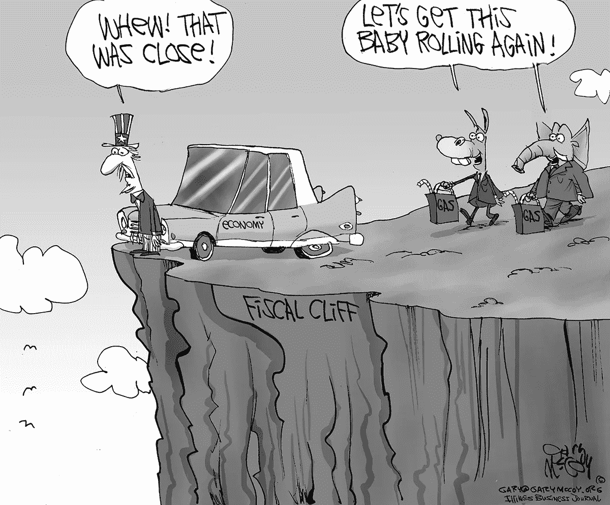

当我们将我们今天的债务与资产负债表的比率与历史上其他国家的债务与资产负债表的比率进行比较时。从历史上看，这些国家都在 30 年内陷入了恶性通货膨胀。通货膨胀率的不可持续的增长，导致一条面包花费他们的公民超过 100 万美元的货币。

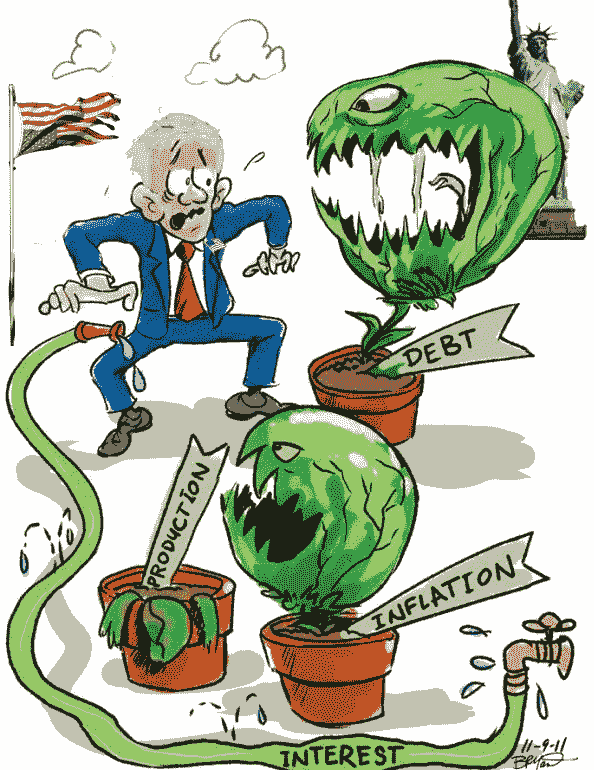

委内瑞拉今天的位置。今天的阿根廷、津巴布韦和许多其他国家。在我们之前已经经历过这种情况的所有国家，从通胀率和国家债务平衡表来看，30 年前就和我们今天一样。

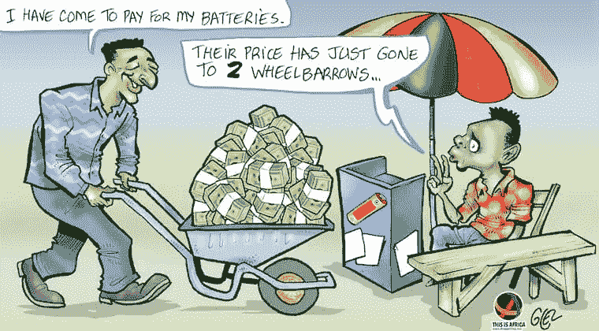

在德国因经济崩溃的痛苦而绝望并陷入战争之前，它也发生过。作为拯救国家的最后努力而开始的战争。

这些国家货币的下跌总是以缓慢的加速开始，就像我们在 2008 年第二次银行救助时第一次注意到的那样(没错，第一次银行救助是在 90 年代末完成的，几乎没有人注意到)。接下来是像我们现在这样的中速到快速加速。所有这些最终导致他们的货币在 30 年内不可控制地大幅贬值。一旦陷入恶性通货膨胀，通货膨胀的价值损失率就永远不会结束。

随着美元成为当今大多数国家的储备货币，如果他们不妥善对冲以保护自己免受美元即将崩溃的影响，那么美元的崩溃将拖累整个世界。

萨尔瓦多是这种对冲美元的一个很好的例子，其他国家似乎也注意到了这一点。如果你不知道，萨尔瓦多让比特币成为他们国家的法定货币和国库储备资产，以保护自己免受美元日益增长的通货膨胀率的影响。

当你看看今天正在经历恶性通货膨胀的所有国家时，美元崩溃的迹象是显而易见的。那些依赖美元的国家，直到其日益增长的通货膨胀率让他们和他们的货币失望。

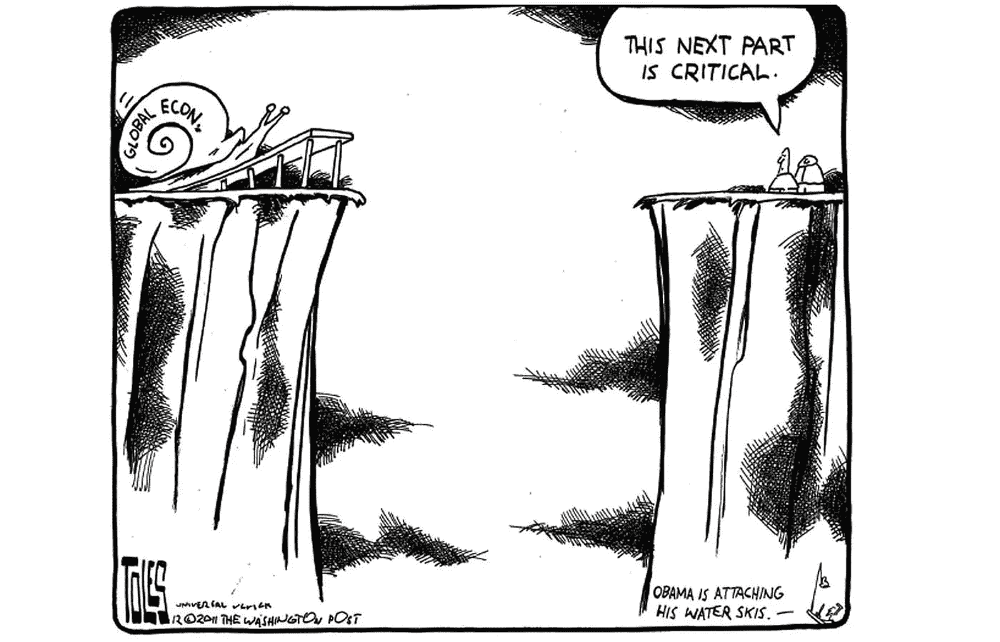

# 这是最后一个视频，虽然它可能很长，也可能不是一个喜剧性的解释。它比我更好地解释了我们今天面临的债务问题。它也更好地解释了历史上每一个与我们今天处境相同的国家，为何仅用了 30 年就远离了恶性通货膨胀和彻底的经济崩溃

正因为如此，我更害怕长期保存美元，而不是保存比特币。尤其是看了**上的图表之后**

**这真的很好地描绘了在尼克松结束金本位制后，我们是如何开始进入这个通胀率不断上升的兔子洞的。甚至连尼克松都说这是暂时的。从那以后，50 年过去了，美元只损失了什么？与房屋、汽车、食物、房租相比，超过其价值的 99%。但是当然，这是暂时的。我相信狡猾的迪克有一天会从坟墓里回来告诉我们是时候回到金本位制了。/s**

**如果你想知道我为什么看好比特币，以及自从了解了比特币相对于美元的系统后，我为什么开始把它作为我的主要储蓄？然后看看这篇文章:**

**[**我最大的努力就是简化一个价值 5000 万美元的比特币的数学运算【1₿=$50 百万】**](https://www.publish0x.com/the-modern-bitcoin-maximalist/my-best-attempt-to-simplify-the-math-of-a-50-dollars-million-xnxedde%20)**

** [## 我简化 5000 万美元比特币(1₿=$50 百万)数学的最佳尝试

### ₿:所以只有 2100 万比特币会存在，不像无限印刷的美元，这就是为什么它会失去…

investla.medium.com](https://investla.medium.com/my-best-attempt-to-simplify-the-math-of-a-50-million-dollar-bitcoin-1-50-million-592175011593) 

My reaction after learning about the option to save ₿itcoin instead of saving the dollar that’s perpetually losing value at faster and faster rates.

**想用你花的每一美元赢得₿itcoin 吗？然后在这里查看新的 BlockFi 信用卡！前三个月在₿itcoin 赚取 3.5%的利润，之后在₿itcoin 每笔交易赚取 1.5%的利润。这是您购买的信用卡奖励有朝一日会变得比您购买的任何东西都更有价值以获得₿itcoin 信用卡购买奖励的唯一地方:**[**https://blockfi.com/?ref=b19c0bcb**](https://blockfi.com/?ref=b19c0bcb)

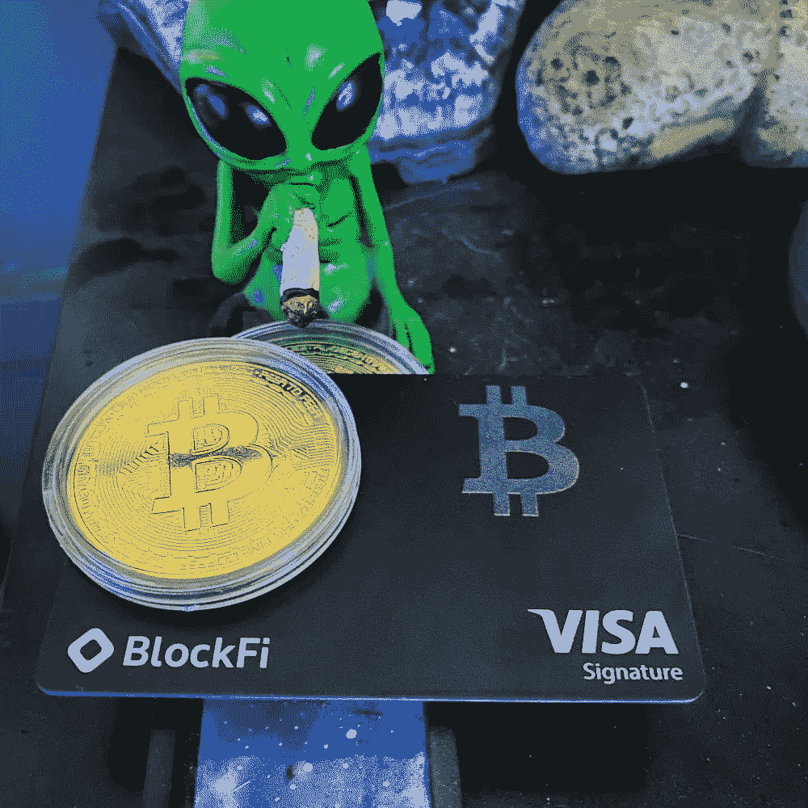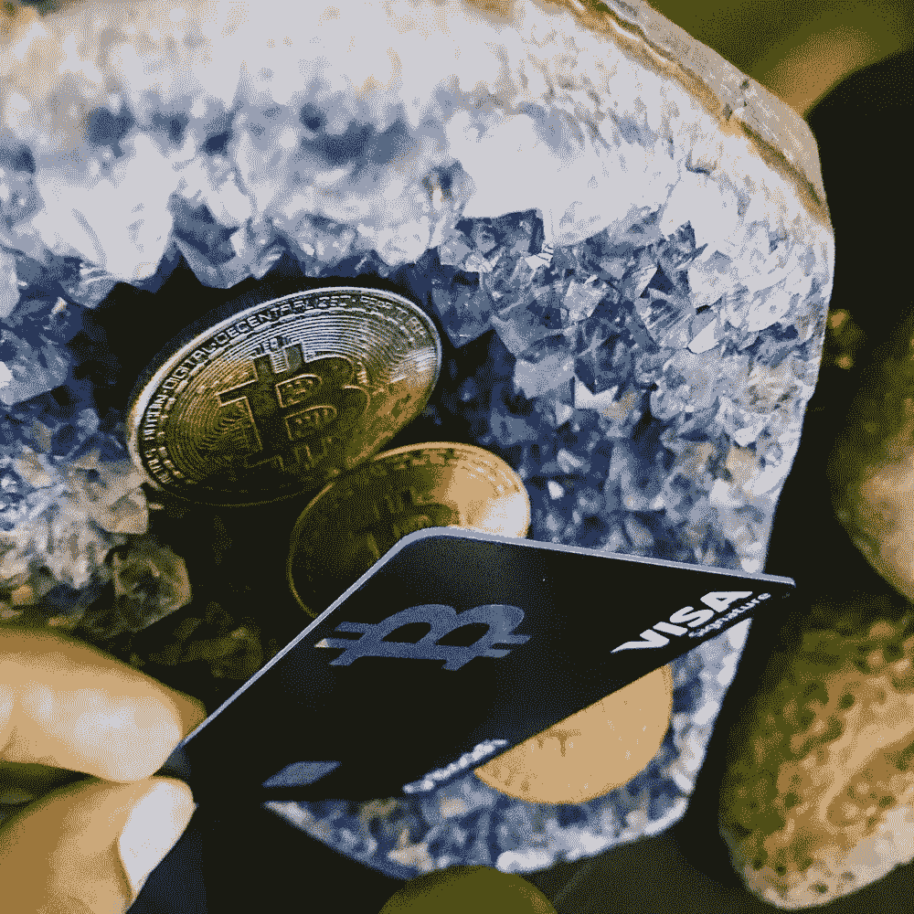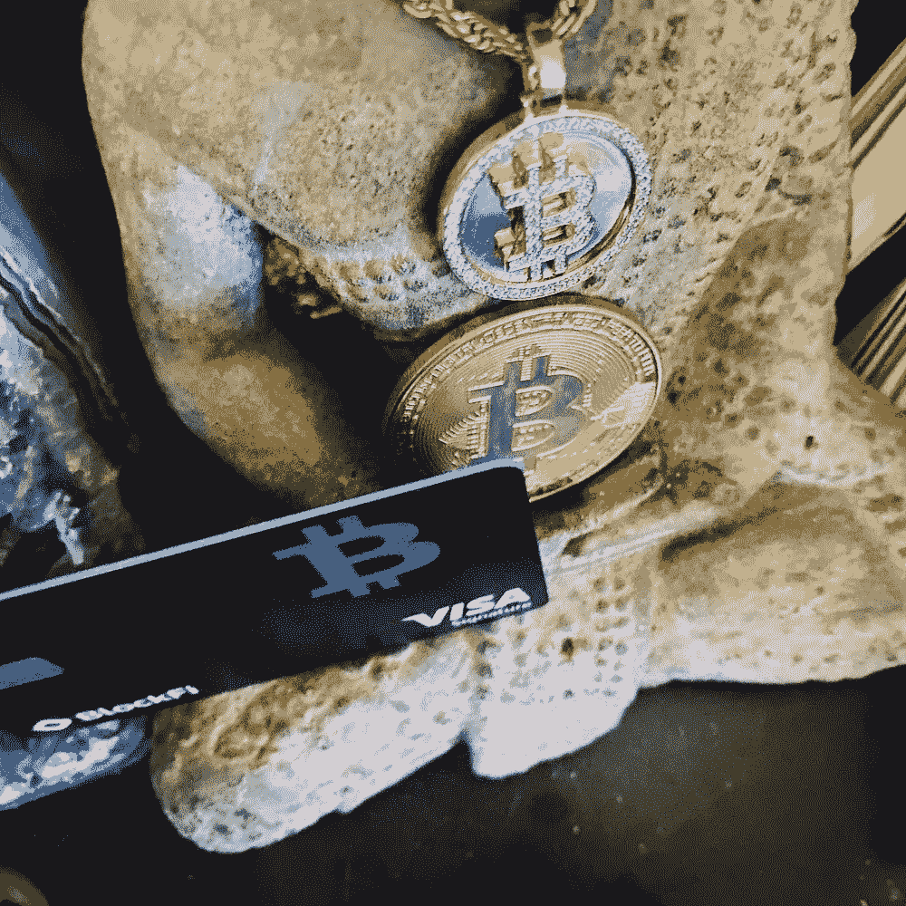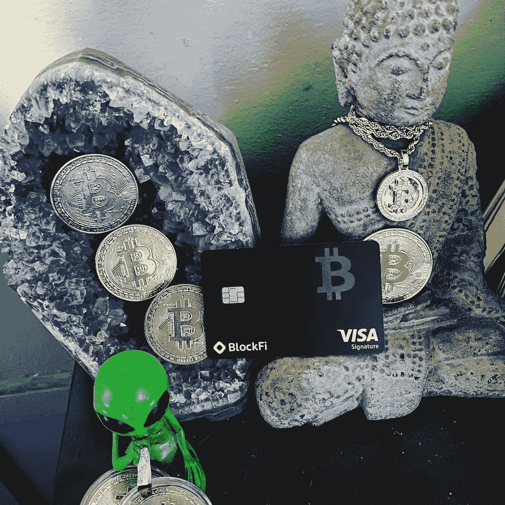

**看看这些平台，你可以在这些平台上赚取你的比特币和加密货币的利息，让你的加密货币为你服务。因为就像巴菲特说的“睡觉的时候不找到赚钱的方法，就会工作到死”:**[【https://linktr.ee/Investla】T21](https://linktr.ee/Investla)

**在 Instagram 上关注我:**【https://www.instagram.com/investlayt/ 

【https://www.youtube.com/c/Investla】在 YouTube 上订阅:

**在推特上对我发推文:**[https://twitter.com/InvestlaYT](https://twitter.com/InvestlaYT)

**看看我的 https://www.tiktok.com/@investla:**T14

**跟我上 https://www.facebook.com/Investla:**

我会把我为比特币和加密货币社区制作的比特币 Reverso 卡艺术品的 NFT 收藏留给你。以防有人想收集它们:

[https://opensea.io/collection/inflation-bitcoin-reverso](https://opensea.io/collection/inflation-bitcoin-reverso)

出价，我会接受读者的出价。如果你想要一份免费的 NFT 礼物，请在下面评论你的 NFT 钱包地址。

NFTs:

[菲亚特充值卡+4%](https://opensea.io/assets/0x495f947276749ce646f68ac8c248420045cb7b5e/21897474743434463121136197943869837338316639940609943639972978592736807513920)

描述:

"当激活时，每个玩家的所有法定货币都失去 4%的通货膨胀率"

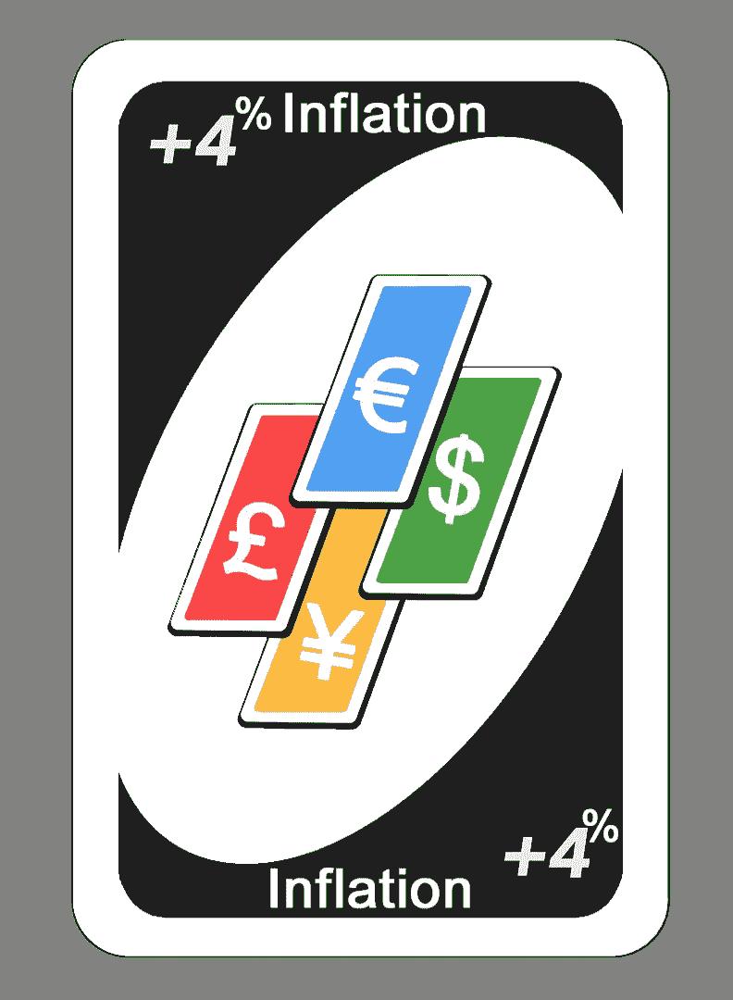 [## 菲亚特通胀卡+4% —通胀？比特币 Reverso！公海

### 一个 NFT 商品收藏集，用来描绘比特币对抗通胀的效果。一种穿越…

opensea.io](https://opensea.io/assets/0x495f947276749ce646f68ac8c248420045cb7b5e/21897474743434463121136197943869837338316639940609943639972978592736807513920) 

[比特币 Reverso 卡](https://opensea.io/assets/0x495f947276749ce646f68ac8c248420045cb7b5e/21897474743434463121136197943869837338316639940609943639972978591637274886354)

描述:

“使用此卡逆转任何货币的通货膨胀影响”

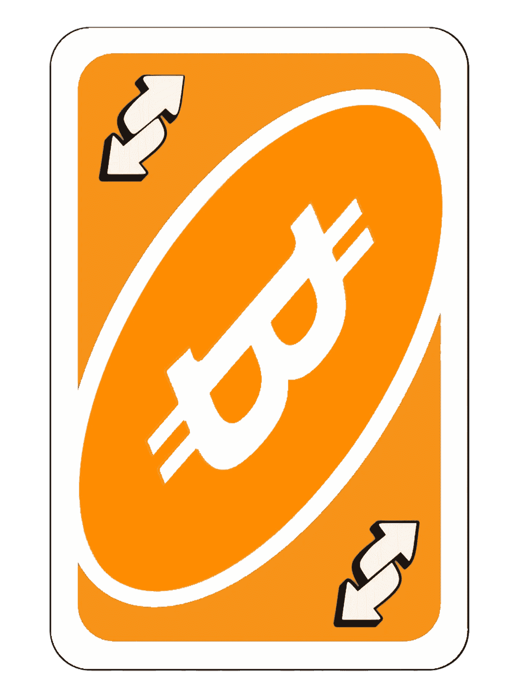 [## 比特币 Reverso 卡——通货膨胀？比特币 Reverso！公海

### 一个 NFT 商品收藏集，用来描绘比特币对抗通胀的效果。一种穿越…

opensea.io](https://opensea.io/assets/0x495f947276749ce646f68ac8c248420045cb7b5e/21897474743434463121136197943869837338316639940609943639972978591637274886354) 

[法币充值卡 Vs 比特币 Reverso 卡组](https://opensea.io/assets/0x495f947276749ce646f68ac8c248420045cb7b5e/21897474743434463121136197943869837338316639940609943639972978594935809771572)

描述:

一个罕见的 2 张卡的集合，在每个 HODL 人对有限的、无限可分的比特币和无限印刷的法定货币的基本理解中起着至关重要的作用。

这组卡片描绘了比特币长期计算的信息，每个 HODL 人一旦成为 HODL 人，就会理解并意识到这一点。

(无限印刷的法币+时间)的方程式(2100 万个网络，有限，无限可分[通过像闪电网这样的二层网络]比特币)。

即使理解这个等式的含义也需要一万个小时的研究，但这个 NFT 迷因有助于更快地理解这个等式。如果不是在技术意义上，那么，在基本的理解意义上。开始让一个人走上好奇的道路，有一天成为 HODL 氏症患者，并成为他们纸债链的 DCA 卖家，这些纸债链除了融化他们工作的财务能量之外什么也不做，随着时间的推移，他们储蓄的购买力永远变得一文不值。

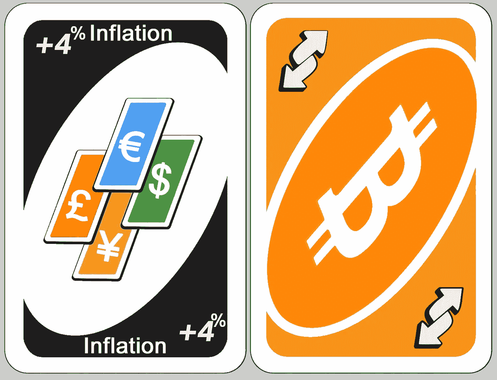 [## 菲亚特通货膨胀卡 Vs 比特币 Reverso 卡——通货膨胀？比特币 Reverso！公海

### 一个罕见的收集 2 卡发挥了重要作用，每个 HODL 的基本理解有限，无限…

opensea.io](https://opensea.io/assets/0x495f947276749ce646f68ac8c248420045cb7b5e/21897474743434463121136197943869837338316639940609943639972978594935809771572) 

如果您没有开放的 Sea 帐户，请在此注册一个:

 [## OpenSea:在以太坊上购买 NFTs、加密收藏品、CryptoKitties、分散土地等

### 设置您的钱包设置好您选择的钱包后，通过单击…中的钱包图标将其连接到 OpenSea

opensea.io](https://opensea.io?ref=0x3069881007589ad2c9387f4b46ae9703927e7e4e) 

# 比特币和加密货币捐赠提示地址:

**BTC:**3 doztwkxaw 8 ha 3s I2 xgezu 3 lzmwksbcxsb

**ETH:**0x 2 bbff 5a 0007433 a 4157300d 46 a83 ACD FCC 45 af 13

**LTC:**mqs 9 oyg 3n 9 q 2 vkrz 95 yx 5 Han 2 ut 3p 5 erxw

**链接:**0x 2 bbff 5a 0007433 a 4157300d 46 a83 ACD FCC 45 af 13

**蝙蝠:**0x 2 bbff 5a 0007433 a 4157300d 46 a83 ACD FCC 45 af 13

> 加入 Coinmonks [电报频道](https://t.me/coincodecap)和 [Youtube 频道](https://www.youtube.com/c/coinmonks/videos)获取每日[加密新闻](http://coincodecap.com/)

## 另外，阅读

*   [复制交易](/coinmonks/top-10-crypto-copy-trading-platforms-for-beginners-d0c37c7d698c) | [加密税务软件](/coinmonks/crypto-tax-software-ed4b4810e338)
*   [电网交易](https://coincodecap.com/grid-trading) | [加密硬件钱包](/coinmonks/the-best-cryptocurrency-hardware-wallets-of-2020-e28b1c124069)
*   [密码电报信号](http://Top 4 Telegram Channels for Crypto Traders) | [密码交易机器人](/coinmonks/crypto-trading-bot-c2ffce8acb2a)
*   [币安交易机器人](/coinmonks/binance-trading-bots-d0d57bb62c4c) | [OKEx 评论](/coinmonks/okex-review-6b369304110f) | [Atani 评论](https://coincodecap.com/atani-review)
*   [最佳加密交易信号电报](/coinmonks/best-crypto-signals-telegram-5785cdbc4b2b) | [MoonXBT 评论](/coinmonks/moonxbt-review-6e4ab26d037)
*   [如何在 Bitbns 上购买柴犬(SHIB)币？](https://coincodecap.com/buy-shiba-bitbns) | [购买弗洛基](https://coincodecap.com/buy-floki-inu-token)
*   [CoinFLEX 评论](https://coincodecap.com/coinflex-review) | [AEX 交易所评论](https://coincodecap.com/aex-exchange-review) | [UPbit 评论](https://coincodecap.com/upbit-review)
*   [十大最佳加密货币博客](https://coincodecap.com/best-cryptocurrency-blogs) | [YouHodler 评论](https://coincodecap.com/youhodler-review)
*   [最佳加密交易所](/coinmonks/crypto-exchange-dd2f9d6f3769) | [印度最佳加密交易所](/coinmonks/bitcoin-exchange-in-india-7f1fe79715c9)
*   [面向开发人员的最佳加密 API](/coinmonks/best-crypto-apis-for-developers-5efe3a597a9f)
*   最佳[密码借贷平台](/coinmonks/top-5-crypto-lending-platforms-in-2020-that-you-need-to-know-a1b675cec3fa)
*   [免费加密信号](/coinmonks/free-crypto-signals-48b25e61a8da) | [加密交易机器人](/coinmonks/crypto-trading-bot-c2ffce8acb2a)
*   [杠杆代币](/coinmonks/leveraged-token-3f5257808b22)终极指南**