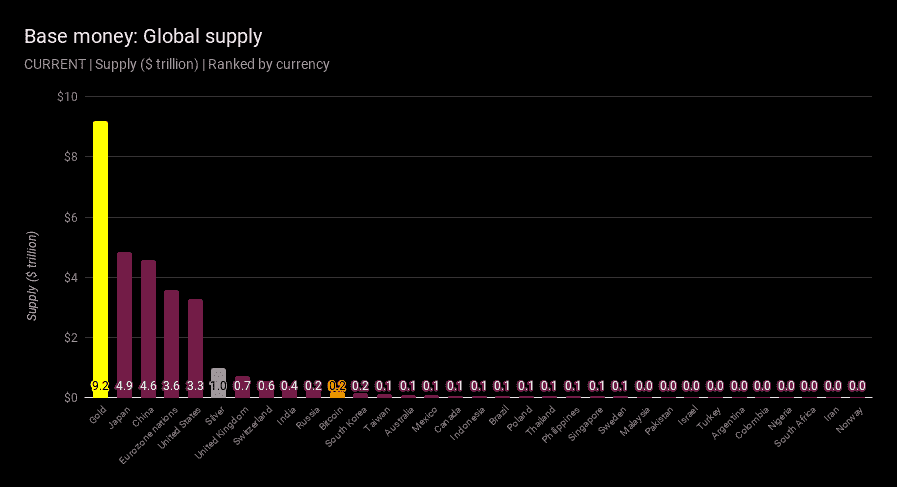
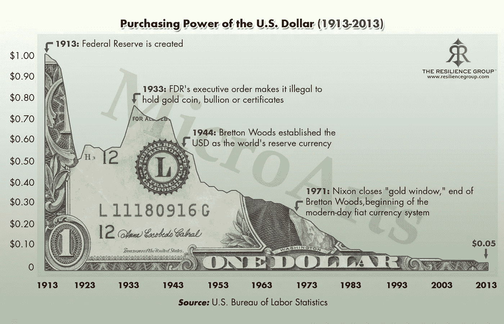
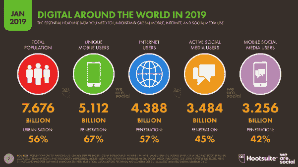

# 比特币的货币案例

> 原文：<https://medium.com/coinmonks/the-monetary-case-for-bitcoin-778cd51ff272?source=collection_archive---------0----------------------->

十年前，比特币作为一种新的货币体系被引入世界，引发了人们对货币经济学领域的新兴趣。在经历了一个世纪完全国有化的货币生产系统，以及大约 50 年不可挽回的国家纸币标准之后，健全货币之战似乎早已落败。回归金本位，即使在奥地利学派和自由市场思想家的圈子里，也变得越来越不切实际，似乎除了等待当代体系不可避免的崩溃之外别无选择，我们可以说好几次都濒临崩溃。无论是从学术角度还是从公众的普遍接受程度来看，知识界的斗争似乎也结束了。除了极少数例外，比如弗里德里希·哈耶克(Friedrich Hayek)，大多数得到公众认可的杰出经济学家都是凯恩斯货币理论的追随者。从而认可了货币民族主义和法定货币纸币的发行，将其作为黄金的一种具有成本效益的替代品，并作为政府融资和国民经济“微调”的一种手段。

与此同时，虽然公众和学术界对健全货币的斗争可能会宣告失败，但新技术的兴起开辟了一个新的领域，人们开始寻找数字货币的替代品。一个主要由个人计算机科学家和密码学家组成的小型无组织团体，称为“密码朋克”,开始研究计算机网络和密码学可以为解放人们提供的新可能性，包括创造开放数字货币的努力。随着大卫·乔姆( [DigiCash](https://en.wikipedia.org/wiki/DigiCash) )在数字支付方面的开创性工作，以及后来各种各样的研究和实践举措，最著名的是亚当·巴克([哈希什](http://www.hashcash.org/))、戴伟( [b-money](https://en.bitcoin.it/wiki/B-money) )、尼克·萨博([比特戈尔德](https://nakamotoinstitute.org/bit-gold/))和哈尔·芬尼( [RPOW](https://nakamotoinstitute.org/finney/rpow/index.html) )，引入数字现金的尝试开始堆积。尽管这些努力的优点令人感兴趣，但它们都没能提供一个有效的系统，或获得足够的牵引力，对货币事务产生任何重大影响。

大约在 2008 年末，比特币的引入可以说是自 1971 年以来货币事务中最重要的转折点，当时布雷顿森林体系崩溃，并导致我们今天不可挽回的纸币标准。尽管并非立竿见影，但比特币作为一种新的货币形式开始加速增长。现在，在它成立大约十年后，它经常成为新闻头条，甚至引起了美国国会的讨论。比特币的巨大成功因此吸引了人们对货币经济学领域的大量关注，并重新点燃了这场输掉的货币争夺战。

起初，比特币受到了双方微不足道的关注和怀疑，认为它只不过是一个泡沫或一个短暂的趋势。然而，随着时间的推移，随着比特币的增长逐年加快，它开始受到一些关注，成为其知识盟友和竞争对手。从所有经济学派来看，比特币现象似乎只符合奥地利学派的理论。在那里，它的许多支持者和怀疑者之间目前仍在激烈辩论。另一方面，在所有其他经济学派中，比特币仍然主要被视为泡沫、“市场非理性”或即将崩溃的趋势。作为没有政府权威支持的货币，比特币与他们的经济理论，尤其是货币经济学的观点不相容，这让他们看不到比特币这样的新货币出现的可能性。尽管来自学术界的支持相当少(但越来越多)和强烈反对，比特币仍在不断发展，并确立了其货币地位，比许多国家的货币更具经济意义。

The market cap of Bitcoin compared to other national currencies and precious metals. Source: [https://cryptovoices.com/basemoney](https://cryptovoices.com/basemoney)

在这一点上，很明显比特币不能再被忽视，而是应该被彻底研究和调查。看起来理解它的本质可以揭示它成功的原因，以及对它未来的粗略预期。在之前的两个 articles⁴中，我从奥地利学派的角度概述了理解货币经济学的一些基础，货币的[本质](/discourse/the-nature-of-money-528275aa4a9e)和[物质](/@ben_kaufman/the-substance-of-money-f22e45cdc272)。我们从研究货币的本质开始，货币是最易出售的商品，在未来的交易中，货币持有者的经济成本最低。然后，我们继续探索影响商品可销售性的各种因素，以及它们作为货币出现在市场上的可能性。⁵在本文中，我们将利用这种理解，并将其应用于比特币的案例，从货币经济学的角度探索比特币的案例。

# 比特币的货币属性

影响商品作为货币的适用性的一般货币属性，如可分割性、可携带性和持久性，通常是商品本身的物理组成所固有的。这些年来，由此产生的物理限制在很大程度上影响了货币的具体内容。例如，将黄金分割成足够小的面值以用于低价值交易的物理限制阻止了它在许多交易所中的(物理)使用，迫使人们求助于银和铜等价值较低的金属，后来还求助于货币券。

比特币作为第一种数字货币形式的出现让我们绕过了货币的“物理”限制，并将其扩展到数字领域几乎不存在的限制。要理解比特币如何让我们改善货币属性，需要对其工作原理以及比特币的数字表示方式有一个基本的了解。“最原始”形式的比特币是一种软件，可以自动就比特币单位的所有权(允许消费的条件)达成共识。换句话说，这种原始形式的比特币是一个可消费金额和消费条件的列表。

由于比特币不同于以前的货币资产，它不是基于物理所有权，而是基于对其支出条件的共识，我们应该将对其局限性的讨论分成两个共识层。第一层，通常称为“链上”层，是我们刚刚描述的全球共识层，我们可以将其视为确定比特币单位所有权的最终来源。从其作为全球共识层的性质来看，它对所有参与者都有约束力，因此相对来说是严格和限制性的。因此，它在货币属性方面为我们提供了适度的改进。例如，这里的比特币的可分性被限制在一个“satoshi”以内，相当于一个比特币的一亿分之一。分割的过程本身需要改变分配给相关单位的支出条件，这意味着它们需要被“花掉”才能分割。我们可能会注意到，尽管有单位规模的限制，但如果有必要，可以通过改变全球共识机制来扩大规模。这样的变更，尽管执行起来极其困难并且成本高昂，但是仍然是可行的，并且随着时间的推移新的需求的出现，为我们提供了对资产本身的一定程度的改进。⁶改变资产的技术货币属性的能力是比特币引入的一项前所未有的能力，这已经使其相对于其前身具有显著优势。

第二层称为“链外”层，利用比特币作为基于共识的数字资产和可编程软件的性质，允许合作的个人创建比特币共识的“子集”，并使用各种机制在该子集内进行交易。如果我们以比特币的可携带性为例，尽管它无疑便宜且易于在物理位置之间移动，但比特币在链上层的实际所有权转移(消费条件的变化)在一定程度上受到限制，每天允许大约 600，000 次最终结算(所有权转移)。然而，由于交易通常是在希望完成交易的合作实体之间进行的，所以链外层允许它们使用各种结构来达成共识。因此，它使他们能够将事务处理能力扩展到电子数据物理移动的几乎无限的极限。这种结构有许多选择，其中许多目前正在研究和开发中，每一种都为交易实体提供了非常不同的权衡。突出的例子是"[闪电网络](https://en.bitcoin.it/wiki/Lightning_Network) ,"⁷，它提供无信任和即时交易，主要有一些流动性限制，以及"[侧链](https://en.bitcoin.it/wiki/Sidechain)，如" [Liquid](https://blockstream.com/liquid/) "，它提供高速和保密交易等好处，并以在可信实体联盟中引入信任为代价进行资产发行，可信实体联盟为其客户管理共识子集。

在分析比特币货币属性的结论中，我们看到货币资产从物理领域到数字领域的转变不仅使我们获得了前所未有的改进，还使资产的货币属性具有了高度的灵活性。因此，我们在这里可能会得出这样的结论:比特币，从其“固有”的属性来看，比所有的前辈都要空前的优越。考虑到这一点，比特币似乎值得进一步研究其作为货币的适用性。因此，我们将继续讨论比特币最具争议性和创新性的方面，即它的生产和供应。

# 比特币生产

在比特币出现之前，从货币经济学作家的角度来看，在市场上生产数字货币的挑战似乎几乎是不可能的。专注于货币经济学的奥地利经济学家 jrg Guido hülsmann 教授在他的一本书里表达了这种普遍的观点。他指出，“完全用比特和字节来定义的经济商品不可能在自由市场上自发产生。”⁸巧合的是，他在 2008 年 10 月发表了这篇文章，在比特币白皮书首次发表的两个月后，也就是第一个比特币出现的三个月前。

比特币的发明确实需要找到一个迄今为止尚未解决的问题的解决方案，即在不依赖可信实体的情况下，通过可控供应制造数字稀缺的能力(解决“[双重支出问题](https://en.bitcoinwiki.org/wiki/Double-spending)”)。比特币的创始人通过引入现在通常被称为“中本 Consensus,"⁹”的机制解决了这个问题，这是对所讨论问题的解决方案。基本的想法是在计算机之间进行一场公开的竞赛，寻找一个数学难题的解决方案。这个挑战类似于随机抽奖，因为找到解决方案的唯一已知方法是通过随机猜测，并且每次猜测发现解决方案的机会都是相同的。这个过程需要计算能力的支出，而计算能力主要受限于计算机器的能量可用性。亚当·巴克最初在 1997 年提出了一个类似的过程，作为 HashCash 系统的一部分。比特币的工作原理与提议的机制类似，但比特币优于这一提议的一个关键点是能够为新单位的生产设定严格的时间表。比特币通过使用点对点共识网络(我们在上面讨论过)来执行和验证货币规则和时间表，以及对生产新单位所需的计算工作进行自动定期调整来实现这一点，这种调整调整了挑战的[难度](https://en.bitcoin.it/wiki/Difficulty)，从而使生产速度与时间表相匹配。

不同于以前的货币资产，如黄金、白银和贝壳，它们的生产依赖于特定的物理限制和稀缺性，也不同于当前的法定纸币货币系统，它依赖于可信的发行者(中央银行)来生产货币，比特币依赖于纯粹的数学系统来生产。这一特性允许以客观和通用的方式来审核比特币单位的有效性，并允许对其生产进行公平和公开的竞争。任何人都可以通过消耗计算能力来自由参与(和停止参与)这场竞争，有机会产生与他们消耗的计算量成正比的比特币。

# 货币生产和外部性

从历史上看，无论从直接还是间接的角度来看，货币物质的生产总是成本高昂的。例如，在许多游牧社会中作为货币使用的牛，饲养(“生产”)成本很高，并导致一些完全意想不到的外部性，主要是因为饲养牛需要大量的牧场。另一个例子是⁰黄金，它的生产成本也很高，因为它的开采过程需要过滤掉许多吨的灰尘才能获得少量的灰尘。它的外部性也相当令人不快，因为军事夺取金矿和它涉及的危险和有时强迫劳动给我们带来了多重经济和伦理问题。

马可·波罗也许是第一个将他在中国观察到的看似令人印象深刻的纸币概念介绍给西方世界的人。自从他发现这一点以来，统治者、银行家和知识分子对宽松货币的胃口一直在不断增长。1661 年，瑞典中央银行 Stockholms Banco 开始发行纸币，这是欧洲第一次尝试简易纸币。三年后，这种做法导致了该银行的破产，但这一失败似乎只是增加了统治者和银行家对更多这类实验的渴望。就知识分子而言，让货币生产更“高效”的愿望从政治经济领域一开始就很明显。亚当·斯密和约翰劳等早期经济学家确实支持这一观点，他们认为贵金属的使用是一个低效的过程。他们和许多其他经济学家，尤其是我们这个时代的经济学家，试图通过用诸如纸张这样的廉价替代品取代货币生产的实质，从而使货币生产更便宜，从而更有效率。他们认为，这种替代货币体系的功能可以和贵金属一样好，只需要生产成本的一小部分。生产成本和货币的“表面价值”之间的这种差异就是我们所说的“容易的”货币，我们应该把它与“难的”货币区分开来。因此，从这种肤浅的观点来看，区别在于，宽松货币的生产成本似乎微不足道，而宽松货币的生产成本很高。

宽松货币的问题，以及像大卫·李嘉图这样的理论支持者反对实施宽松货币的原因，是它的外部性，它所涉及的隐藏成本和风险。众所周知，自由市场永远不会出现真正的宽松货币。这是因为，对于任何商品，市场参与者都愿意增加产量和成本，直到增加产量不再有利可图。这意味着，如果我们试图在自由市场上建立一个宽松的货币体系，市场参与者会开始大量生产货币，以使每个货币单位的价值大致等于其生产成本，从而取消宽松货币的预期“效率”。因此，所有引入宽松货币体系的尝试都要求国家将货币生产的垄断特权分配给一个通常被称为中央银行的特定实体。随着市场参与者被法律禁止参与货币生产，宽松货币的支持者相信他们能够成功地将货币生产的成本降低到仅仅是纸币的印刷成本。

然而，这种对货币生产的直接和高度可见成本的近乎痴迷的看法，让这些经济学家看不到宽松货币带来的许多不明显成本。首先，可能是最明显的担忧，也是李嘉图表达的担忧，是滥用该体系的风险。从许多恶性通胀情景到不太引人注目的道德风险，⁴“宽松货币的陷阱”带来了各种风险，并被那些有能力这样做的人多次滥用。光是这个问题就应该让宽松货币的陷阱清晰可见。它在获得小效率的同时，也引入了致命的风险和许多道德风险点。然而，还有两个方面暴露了廉价资金的谬误。

我们可以考虑的第二个方面是运行这样一个系统的实际成本。所有公共机构都有庞大的官僚机构，央行有数十万名工作人员，因此，毫无疑问，如今所谓的“廉价”高效纸币体系确实比硬通货更有效率。⁵除了这一考虑之外，我们还应该注意到，用于货币目的的黄金生产在很大程度上仍在继续。因此，廉价货币体系的这些额外成本主要是对之前硬通货体系成本的补充，而不是替代。当我们理解这样一个重要事实时，问题就变得更糟了:尽管监管将市场参与者排除在直接货币生产之外，但这些参与者仍将花费尽可能多的资源来预测和影响央行的政策。宽松货币政策的支持者显然未能考虑到市场参与者仍想充分利用货币生产的意愿，许多分析师、经济预测者和游说者的工作就是宽松货币政策这种间接低效率的结果。

宽松货币导致的第三个也是最关键的问题是对市场过程的操纵。市场使用货币作为资源配置的工具，货币持有者根据他们的需要和需求来引导市场。然而，当使用宽松货币时，其生产者(央行)有权不成比例地影响资源配置。事实上，我们可以说它实际上控制了市场，因为它可以廉价地为自己创造货币，随心所欲地引导资源。因此，在宽松的货币经济中，配置资源的权力从市场转移到控制央行的人手中。这种市场扭曲逐渐将整个经济转变为间接的中央计划经济。与廉价货币生产的道德风险相结合，这一过程进一步加速，随之而来的是以市场现象为幌子的中央计划经济的破坏性后果。

正如我们所看到的，宽松货币并没有降低货币生产的成本，也没有在任何其他意义上提高货币生产的效率。它实现的唯一功能是降低货币生产的直接可见成本，同时不成比例地增加隐藏的、不明显的成本。从这一分析中，我们可以得出两个主要结论。第一个也是更明显的一个原因是，宽松货币不仅效率低下，而且由于其风险和外部性，甚至可能具有破坏性。第二，我们可以注意到，我们应该渴望货币生产过程是明显和透明的，以尽量减少这种风险和意外的外部性。

当看比特币时，它的一个显著特征是它的生产过程。如上所述，生产比特币最重要和最昂贵的部分是将能量转化为电能，并将其转化为计算能力的过程。虽然所有类型的生产都需要使用能源，但大多数其他过程需要以非常间接的方式使用能源，更重要的是，在非常具体的地方使用能源。例如，黄金的生产既需要大量的人力劳动，也需要许多复杂类型的机械，但更重要的是，它需要矿工在特定的地点(金矿)应用它们。因此，黄金不仅需要复杂的生产过程，而且还限制了人们在特定地区生产黄金的能力。另一方面，比特币的生产让世界上任何地方的任何人——⁶，只要那里有未开发的能源，都可以用它来生产比特币。比特币这种独特的生产过程有三个主要优势，我们将在这里讨论。

首先，它使货币生产的竞争比以往更加公平和公开，消除了许多空间限制，并允许一个真正有效的市场竞争过程。其次，通过让生产过程变得如此简单直接，比特币降低了货币生产过程中的隐性成本和外部性。这种外部性的减少使得整个系统更加稳健，并让我们更好地理解其后果。第三，通过消除空间限制，比特币的生产允许利用以前由于这种空间考虑而无法使用的能源。比特币生产中的残酷竞争迫使其生产商(通常称为矿工)将成本降至最低，以比竞争对手更有效率。这种竞争要求他们不断寻求最有效的能源生产过程，这将使他们的连续生产成本最小化，并且在理论和实践上，这种最有效的来源似乎可以在可再生能源中找到。从这些来源自然获得的能量，如阳光、水、风和许多其他来源，比传统来源便宜得多，因为它们既丰富又大多未被使用。虽然这种能源的运输成本限制了它在许多日常用途中的可行性，但比特币的生产却没有这种空间限制。因此，比特币的生产促进了可再生能源的有利可图的融资和发展，并激励了能源生产领域的进步。⁷因此，毫不奇怪，比特币生产使用的大部分能源可能来自可再生能源⁸，这使得比特币生产可能是最清洁的经济领域之一。

我们可以在这里总结一下，至于上面讨论的原因，比特币的生产似乎是我们可能拥有的最理想的货币生产过程。它是硬钱的事实，加上它简单透明的生产过程，公开直接的竞争，以及看似正的外部性，使它在很大程度上优于它的任何前辈。第二个重要的考虑因素，通常与货币的生产过程有关，是货币的供给问题，也是我们下一个讨论的重点。

# 比特币的供应

比特币作为一种基于软件的资产的性质意味着，与之前的自然货币⁹不同，它的供应最终由用户控制。事实上，这是其共识规则的关键部分，上限约为 2100 万比特币单位。这通常被称为比特币的“货币政策”，并通过比特币网络每个参与者的经济活动来实施。比特币作为一个点对点网络的去中心化本质意味着没有一个中央实体被授权来决定比特币的货币政策。因此，虽然理论上有可能改变这一政策，但这种改变在实践中似乎不太可能，因此不在本文考虑之列。

比特币的这一政策与当今各国央行制定的普遍政策形成了鲜明对比。这些机构从一开始就一直奉行不断扩大货币供应的政策。这些扩张性政策往往被认为是“公共利益”所必需的，因为它们理应允许政府及其“高度合格”的经济学家促进经济增长、减少失业和对抗商业周期。在过去的一百年里，他们在这项任务上非常失败，在此期间，这些问题似乎只是进一步恶化。⁰在目前的讨论中，比特币的货币政策在大多数人眼中通常被认为是相当激进的。许多比特币的批评者声称，缺乏“弹性”货币政策，即可以根据所谓的新情况需求进行修改的政策，阻止了比特币获得任何有意义的采用。

然而，弹性政策的需要甚至必要性的概念只是在过去一百年左右才开始获得显著的支持。因此，与货币存在的几千年或几万年相比，这是一个相对较新的时代。此外，如果更仔细地观察，由央行制定和管理的弹性货币政策的现代实验并没有实现它为自己设定的任何目标。我们的中央银行没有兑现的承诺包括没有能力驯服商业周期，没有能够保持持续的低失业率，完全没有能够保持货币的价值和总体价格水平。

Purchasing Power of the U.S. Dollar (1913–2013). During this period, the USD lost at least 95% of its purchasing power.

鉴于弹性货币政策的实际优点和效果，这种政策的理由很难令人信服。如今，许多人理所当然地认为，弹性货币政策是货币的必需品。这甚至不用提及它在这一现代尝试之前完全无可争议的失败。⁴此外，如果我们考虑到上个世纪由恶性通货膨胀导致的 50 多次经济崩溃，这种说法就更站不住脚了。如果没有弹性货币政策的存在，恶性通货膨胀就不会发生。⁵ ⁶

对现代央行的弊病及其理论所依据的错误进行全面的批判超出了本文的范围。感兴趣的读者可以在脚注中找到这些作品的参考资料。⁷:就我们目前的目的而言，我们将把重点放在最引人注目的论点上，即为什么弹性货币政策是不可取的，以及为什么比特币的有限供应有利于它超越其前身。让我们首先探讨弹性货币政策的“需要”这一概念。如上所述，鉴于其经验上的失败，并考虑到在“美好时代”盛行并在美联储体系建立前后终结的金本位制所取得的令人印象深刻的成功，弹性货币政策似乎没有实际“必要性”的经验依据。然而，尽管缺乏这种必要性的证据，人们仍然可以认为这种政策通常是可取的。因此，我们现在要进一步研究这个问题。

在我们之前对宽松货币政策的讨论中，我们已经阐明了它的一些弊端。这些风险包括严重的道德风险，以及滥用和破坏系统的潜在风险。我们现在将跳过这些问题，把注意力集中在反对这种政策类型的另一个更普遍的论点上，这个论点涉及货币和信贷供应的这种中央计划的认知错误。⁸

让我们假设，那些负责货币政策的人已经设法抵制住了所有滥用货币政策的诱惑，并且正在尽最大努力帮助经济。他们可能掌握着不可逾越的数据量和假定相关指标的信息。然后，他们的任务是利用所有这些知识和见解来调整价格，以诱导人们根据他们(中央计划者)认为对经济最有积极影响的东西来做出经济决策。换句话说，他们利用自己对经济中货币和信贷供应的影响力来调控价格和失业率等行为。这些中央计划者的任务是预测可能的货币政策对他们希望调整的参数(CPI、失业等)的影响。)，并追求其中最“最优”的选项。

然而，这意味着他们不仅需要预测自己行为的后果，还需要预测对这些行为的任何反应，以及对这些后果的任何进一步反应。所有对最优货币政策进行预测和建模的尝试，即使假设存在这样一个最优货币政策，也会因为经济的本质而失败，因为经济是一个复杂的个体行为，最重要的是个人反应，试图为自己提供资金。人类的行动和反应本身大多是不可预测的，但是试图预测这种反应对变化的影响，以及对那些先前的反应所引起的变化的后续反应必须被认为是可笑的。⁹

当我们考虑到央行行长所能掌握的数据的局限性时，他们对经济预测的无能就更加明显了。在一般社会现象，特别是经济现象的范围内，结果在很大程度上取决于形成这些现象的所有人类行为。虽然我们知道如何高精度地测量某些参数，但我们没有能力测量与个人经济行为相关的许多其他事实。哈耶克用价格和工资的例子解释了知识的这种局限性，他说:“在决定这些价格和工资时，会涉及到市场过程中每个参与者所拥有的特定信息的影响——这些事实的总和不可能被科学观察者或任何其他单个大脑所了解。”⁰由于无法获得如此多的重要事实，导致大多数经济学家完全忽视了它们的重要性，用哈耶克的话说:“他们[经济学家]于是愉快地继续虚构，认为他们能够衡量的因素是唯一相关的因素。”正如我们所见，央行行长们必须从对过去和现在高度不完整的描述开始他们的任务。因此，他们预测经济结果的努力从一开始就注定要失败，因为即使他们有适当的方法从数据中得出预测，他们也不可能解释所有影响人类行为的数据，正如我们所见，每一个单独的行为都可能对整个过程产生破坏性影响。

我唯一可以自信地做出的预测是，随着央行行长继续干预货币和信贷供应，他们将继续产生意想不到的行为，结果将悲惨地用他们的预测努力愚弄自己——比特币是对这一准确预测的金融押注。只要货币政策是有弹性的，我们肯定会遭受这种认知错误和预测失败，经济危机将不可避免地接踵而至。经济是一个相互依存的系统，任何人为干预都会导致意想不到的副产品，其影响将随着进一步的干预而进一步加剧。一百多年来，经济学家试图规划货币供应，每一次干预都会引发另一场危机。这可能是面对这一失败的最合适的时机，承认经济太复杂，中央计划者无法预测，让个人自己做出决定，从他们的行动中形成完整的画面。

到目前为止，我们已经消除了对比特币非弹性货币政策的担忧，并证明了它优于弹性政策。然而，有人可能会说，静态通胀时间表，比如每年 2%，仍然是一个可行的选择，而不是一个上限。虽然即使没有严格限制的供应，比特币仍然可以很好地工作，这可能是事实，但这种通胀似乎是不可取的，甚至是有害的。货币通胀虽然本身不一定是有害的，但它具有高度非线性和复杂的影响，正如我们所看到的，我们无法完全预测其影响。有些人想要修补这样一个他们并不了解，或者更糟的是，他们认为自己了解的复杂系统，这种冲动至多是无害的，但可能很容易变得具有破坏性。此外，如果我们深入调查，似乎首先没有扩张性政策的正当理由。

当我们理解货币的本质及其在市场上的出现时，这种通货膨胀似乎是非常不可取的。货币的出现是基于其降低交易成本的能力，其中一个重要因素是其长期保值的能力。众所周知，货币供应量的增加稀释了每个单位的价值，即其购买力，因此在延迟交易中使用货币的成本更高。因此，通胀政策可能会降低比特币在交易中的用途，从而阻碍比特币的应用，也不会给我们带来任何好处。⁴相反，通货膨胀政策会降低经济计算的准确性，还会减少现金储蓄和鼓励支出，这在之前的一篇文章中已经被证明是不可取的。

在这一部分中，我们研究了比特币生产过程的基础知识及其货币政策。我们讨论了货币生产的概念及其外部性，以及比特币作为硬通货如何拥有更好的生产流程。我们探索了宽松货币的陷阱，更具体地说，是拥有弹性货币政策的陷阱，并展示了比特币如何设法避免陷入这样的问题。最后，我们还看到了作为比特币规则的实际硬政策(比特币是一种有限的供应)如何为其服务，并促进储蓄和资本积累的适当经济激励，同时也是经济计算的可靠衡量标准。

到目前为止，我们已经探索了比特币的“固有”特征，并且我们迄今为止已经得出了非常积极的结论。我们将继续深入比特币的货币案例，探索影响货币本质的外部因素，以及比特币如何应对这些因素。

# 立法比特币

在之前的一篇文章中，我们挑选出了影响货币实体采用的三个突出的外部因素:立法、社会结构和认知因素。我们现在将转向检查这些因素，并试图理解它们如何影响比特币作为货币，从立法方面开始。

即使对贵金属作为普通货币的使用的消亡进行肤浅的调查，也会向我们揭示，是立法当局的影响导致了这种消亡。随着大多数国家赋予黄金相对于其他贵金属的垄断地位，以及其在中央银行控制下的进一步集中化，立法当局已经影响了金属货币的具体选择。通过这种中央集权，他们后来能够有效地没收⁵的黄金储备，防止日常使用。随着 1971 年尼克松总统颁布的第 11615 号 T4 行政命令，我们的货币与黄金的最后联系终于被打破了。⁶这一命令结束了从金属货币到不可赎回的纸币标准的漫长转变过程。这个最新的例子向我们揭示了法律当局对我们选择货币的影响有多大，在当代主权货币体系下，这些当局似乎不喜欢受到比特币挑战的想法。

尽管比特币面临的法律挑战看起来确实难以置信，但这正是它的设计初衷。从一开始，比特币就伴随着自由和自由的赛博朋克精神，以及在实现从压迫中解放出来的过程中使用加密技术而诞生。比特币面临的这些挑战正是它最初诞生的原因。半个多世纪以来，我们一直生活在压制性的法定纸币货币体系之下，任何实施竞争性体系的尝试都遭到了拒绝。⁷相反，比特币是在考虑了过去所有失败的基础上建立起来的，旨在抵御这种威胁。正如它的创造者所解释的:

> “许多人自动认为电子货币是一个失败的事业，因为自 20 世纪 90 年代以来，所有的公司都失败了。我希望很明显，只是这些系统的中央控制性质注定了它们的命运。我认为这是我们第一次尝试一个分散的、不基于信任的系统。" ⁸

比特币的生产和维护过程是高度开放的，并通过支付交易费，为参与者提供与使用比特币的实际需求相匹配的财务激励。⁹使用私钥加密技术存储比特币的机制使其能够抵御没收企图。随着坚持将验证成本保持在极低水平，我们可以看到这些都是旨在让比特币在经济和金融压迫存在的地方生存甚至繁荣的设计选择。

比特币的“立法弹性”如此之强，以至于美国国会议员帕特里克·麦克亨利甚至称比特币是一股“不可阻挡的力量”继续说“我们[政府]不应该试图阻止这种创新；政府无法阻止这种创新，那些尝试过的政府已经失败了。”⁴⁰虽然有许多其他立法者不同意这一观点，但这一大胆的声明强调了比特币的理念，以及它背后聚集的那些人的使命。我们可能还不知道比特币是否真的有能力面对它可能面临的法律挑战和政府压力，但有一点是明确的，那就是比特币是我们最好的选择。比特币的这种法律阻力可能是它相对于以前健全货币的最大进步，也是它真正的优势所在。⁴

现在，假设政府明白阻止比特币的难度，他们有可能选择使用比特币，因为比特币为他们提供了财务激励。尽管政府将黄金作为货币从我们的日常生活中移除，但它们仍在大量积累黄金，主要是通过其中央银行，其持有量约占地上黄金总存量的 17%。⁴当比特币变得足够重要时，政府有可能会购买它作为黄金替代品，将其用于国际货币事务，或作为“储存价值”的对冲工具。⁴政府利用比特币成功赚钱的另一个选择是直接或间接参与其采矿业务，因为它们控制着许多最丰富的能源生产来源。作为另一个收入来源，这种采矿作业将有利于两个州，也有利于比特币，比特币利用其采矿过程中投入的更高能量来保护其网络。虽然这种代表政府的行为在短期或中期内似乎不太可能，但从长期来看，这种选择仍然非常合理。

# 社会全球化和比特币

我们已经确定的第二个重要外部因素是占主导地位的社会结构，当代社会结构是全球化和国际合作的趋势。理解这种社会转型所带来的需求，对于理解什么是服务于这样一个社会的合适的钱是非常重要的。当今社会正在快速向城市化转变，世界上大多数人口都生活在城市中。⁴⁴互联网在我们日常生活中扮演的角色也变得越来越重要。拥有超过 40 亿互联网用户的 users⁴⁵，这项技术对社会的影响似乎超过了大多数以前的发明。

尽管社会的联系比以往任何时候都更加紧密，但世界正处于数百年来从未有过的严重货币解体状态。过去，大多数货币只是不同重量的贵金属，因此在商业上几乎被普遍接受，而今天，我们有数百种不兼容的纸币，瓦解了世界市场，损害了全球劳动分工。现在，跨越大多数国家边界的任何社会合作都需要多种货币之间的货币兑换。这增加了额外的成本，同时使经济计算变得复杂和扭曲，并且需要信任更多的金融机构。在这个问题上，我们可以加上交易结算的问题。由于跨境转移货币的成本和监管，这种结算非常昂贵，并且需要经过多个中介的集中过程。

随着社会转变为一个全球互联的社会，随着全球范围内电子交易量的不断增加，对数字环境中货币的需求变得越来越强烈。在不信任金融中介或发行货币的央行的情况下，与陌生人结算支付，目前是一个不切实际的过程。此外，这一过程根本无法在我们拥有的任何货币系统中实现，包括比特币。作为一种完全电子化的商品，比特币允许在世界任何地方进行结算，不需要可信的支付清算。它不需要昂贵的国际实物运输，易于存储，并以最低的成本在任何地方使用。从现代社会结构来看，似乎确实需要不可信的、原生的数字货币，这可能会推动比特币成为“中央银行的去中心化替代方案”。⁴⁶

# 理解比特币——采用比特币的认知障碍

在结束我们的研究之前，我们最后要讨论的是影响货币本质的第三个显著的外部因素，即认知因素。不同于以前的货币，如黄金、毛皮或牛，比特币除了货币用途外没有任何“实际”用途。在这一点上，它类似于可收藏的货币，如贝壳和各种贝壳，在这一点上，也类似于目前的法定纸币。用一个更常规的、尽管在经济上不准确的术语来说，它没有“内在价值”。争论这种内在价值是否必要，或者更准确地说，是否存在，已经超出了讨论范围，与此无关。⁴⁷

为了理解比特币的认知障碍，对我们来说至关重要的是，由于缺乏如此广泛的实际用途，并且与 seashells⁴⁸(可以说)的自然美景或法定纸币的立法推广不同，除了货币用途之外，没有任何东西可以促进比特币的使用，从而促进其最初的积累。因此，我们可以说，只有两种力量推动比特币的采用，即“经济”和“认知”，没有任何“间接效用”发挥作用。我在这里所说的比特币的经济力量就是我们到目前为止所讨论的，它涉及使用比特币的经济激励，以及它提供的优于传统系统的好处。

第二种“认知”力量，涉及我们对货币的一般理解，特别是对比特币的理解，以及如何利用我们的知识来指导我们的经济决策。也就是说，我们对金钱、它的起源和本质了解得越多，我们在这方面的决策就越好。因此，我在这里讨论的认知力是使用比特币的动机，它不是来自比特币的直接和即时(或预期立即可用)好处，而是来自对比特币及其优势的理解。虽然在比特币诞生之初，我认为大多数持有人纯粹是出于认知动机参与其中，但我认为，就今天而言，经济力量是吸引大多数人前来的原因，而认知是促使他们留下的原因。这一过程在比特币的“供应冲击”( [halvings](https://en.bitcoin.it/wiki/Controlled_supply) )期间最为明显，此后我们迄今见证了比特币价格的大幅上涨。价格的上涨(经济力量)吸引了人们对比特币的大量关注，但在炒作逐渐消退后，让许多人仍然感兴趣的是对比特币及其愿景(认知力量)的理解。然而，只有当比特币的经济力量如此强大，以至于人们没有必要在日常生活中使用它时，才可能真正采用比特币。

我认为最后一个主题是本文中最重要的，因为与其他主题不同，这是我认为比特币处于显著劣势的唯一一个主题。虽然对于黄金来说，其数千年的货币使用历史足以替代理解其为何如此有效，但比特币却没有这种奢侈。另一方面，法定纸币——其“既定历史”充斥着失败和经济崩溃——通过为学术经济部门提供直接资金，并作为其最重要的就业选择，成功解决了这一认知问题。随后，法定货币为这些学者提供了备受尊敬、有影响力且收入丰厚的工作，而他们反过来又为这一货币体系提供了认知基础，并用他们的“资格证书”证明了这一点。相比之下，比特币作为硬通货，没有为自己生产这种“科学基础”的预算，也没有为经济学家提供这种有影响力的工作，而主要是取代他们目前的工作。因此，正如本文开篇所提到的，发现支持比特币的文章寥寥无几也就不足为奇了，尤其是在学术界。

没有足够的资源来理解货币和比特币，推动其采用的唯一力量将是经济力量。即使它本身就足够了，也肯定不够好，而且在当代系统自我崩溃之前，向比特币的过渡似乎不太可能，这使得过渡非常不愉快，也没有必要如此。然而，了解比特币的资源越多，人们对比特币的理由理解得越好，他们就会越快采取行动采用比特币，从而越快、越顺利地过渡到使用比特币。

如今，央行已经存在了一个多世纪，对货币的总体理解是完全错误的，在大多数学术讨论中更是如此，他们仍然相信他们可以用复杂的数学模型和通胀目标“微调”经济。2008 年的上一次危机动摇了人们对当前体系的信任，这是理所当然的，但为公众提供的理解货币的大多数选择，只是加剧了当代体系的错误。像“钱就是国家颁布的任何东西”或“钱只是一种共同的幻觉”这样的说法现在非常普遍，甚至在许多比特币支持者中也是如此，这只能说明解释比特币和钱的工作有多么广泛。本文的重点和目的是展示向其他人解释货币，特别是比特币，以使其成为一场真正和平的革命是多么重要。⁴⁹

# 结论——比特币的出现

从货币经济学的角度来看，过去的十年是最有趣的。在此期间，我们见证了第一个由自由市场发明而非发现的货币商品，以及其令人惊讶的快速货币化过程。最初看起来只是又一个关于塞弗朋克邮寄 list⁵⁰的命运多舛的提议，现在已经发展成为一个功能齐全的货币系统，积极服务于全球数百万人。在整篇文章中，我们讨论了影响货币可销售性的常见因素，以及货币在市场上的采用情况，并研究了比特币与其前身相比的表现。现在，为了完成我们对比特币的分析，我们将简要地整体看看比特币的出现过程，从它的早期开始到它如何在未来发展。

当比特币刚刚推出时，在其存在的最初几个月，它没有价格，交易主要是为了测试软件。比特币的“零到一”时刻是在 2009 年 10 月，它的第一个汇率公布，它第一次在交换中变得有价值。不久之后，它的少数早期采用者开始交换它，通过给比特币最初的价格给这个系统注入生命。由于他们愿意花钱将比特币带入生活，尽管几乎没有人知道比特币会变成什么样，但他们一定是被比特币的潜力所激励。因此，比特币开始流通不是因为另一个“有用”的公用事业，也不是因为权威的法令，而是因为其早期采用者的自愿行动，他们重视创造新货币系统的机会——而不是他们不得不花费金钱来实现比特币的愿景潜力。⁵

再往前一点，虽然比特币具有一定的交换价值，但可供其使用的交换机会数量相当少，因为对比特币作为交换媒介的需求才刚刚开始形成。这意味着，与现存的纸币相比，人们最初需要等待相当长的时间才能兑换。也就是说，他们必须拿着它才能收养它。这就是比特币的硬度及其有限供应量过去是、现在仍然是其成功的关键的主要原因。如果没有一个硬的非弹性政策，持有比特币的不确定性(由于货币通胀和随之而来的贬值风险)将会太高，并阻止其被任何有意义的采用。

比特币的货币硬度让人们有信心持有它，因为他们知道自己的财富不会被稀释。此外，其有限的供应量意味着，随着比特币被越来越多的人采用，它必然会变得更有价值，而不会受到通货膨胀的负面影响，从而降低其价值。因此，比特币的有限供给本身就为那些理解其作为货币资产的优越性并因此预期其需求会随着时间的推移而增加的人提供了采纳和持有比特币的强大经济激励。Satoshi 自己非常理解这一点，他写道:

> “不是供给变化来保持价值不变，而是供给是预先确定的，价值是变化的。随着用户数量的增长，每枚硬币的价值也会增加。它有可能形成正反馈循环；用户增加，价值就上去了。”⁵

至于今天，比特币的流通速度比过去快得多，交换机会也多得多。但是，比特币要想成为广泛使用的货币体系，还有非常长的路要走。货币化的过程，像所有其他的社会合作现象一样，是一个非线性的过程，加速并受益于每一个额外的使用。因此，比特币的速度及其日常使用不应在近期内变得显著，但从长期来看，应该会加速。看看它迄今取得的进展，似乎有一个很好的理由相信比特币将成功达到足够加速增长并成为全球通用货币所需的“临界质量”。

目前，比特币增长最显著的两个领域是互联网领域和缺乏最低限度经济自由的国家。在后一个领域，在土耳其、伊朗和阿根廷等国家，我们可以看到比特币如何在一定程度上立即缓解生活在那里的人们所遭受的经济压迫。资本管制越严格，通胀率越高，使用比特币作为抵制政府的替代品的好处就越大。因此，尽管我们无法确切知道比特币将如何增长，但比特币作为货币的出现似乎很可能将主要在经济受压迫的国家继续，这些国家的公民最需要比特币来保护他们的财富，并将在经济危机出现的地方继续大幅增长。在现阶段，比特币似乎是一种自由市场商品，在缺乏自由市场的情况下，它最有效地展示了自己的价值主张。限制比特币的独裁企图只会促进其使用，因此比特币似乎真的应该被称为抗脆弱货币。

[1]: The crises of the 1980s and 2008 are notable examples of such collapses which seem like they could easily turn catastrophic to the system.
[2]: Friedrich A. Hayek: “By Monetary Nationalism I mean the doctrine that a country’s share in the world’s supply of money should not be left to be determined by the same principles and the same mechanism as those which determine the relative amounts of money in its different regions or localities.” — “[Monetary Nationalism and International Stability](https://mises.org/library/monetary-nationalism-and-international-stability)” (1937), page 4.
[3]: See both the chart below and further relevant metrics produced by Crypto-Voices [here](https://cryptovoices.com/basemoney).
[4]: [The Nature of Money](/discourse/the-nature-of-money-528275aa4a9e) and [The Substance of Money](/@ben_kaufman/the-substance-of-money-f22e45cdc272).
[5]: The principles for our analysis of money here are rooted in the works of Carl Menger. Most notably, his “[Principles of Economics](https://mises.org/library/principles-economics)” (1871), chapter VIII, and “[On the Origins of Money](https://mises.org/library/origins-money-0)” (1892).
[6]: Such changes, though hard to coordinate and perform, have been previously made to the Bitcoin protocol after sufficient consensus was reached. See [BIP16](https://github.com/bitcoin/bips/blob/master/bip-0016.mediawiki) (P2SH) and [BIP141](https://github.com/bitcoin/bips/blob/master/bip-0141.mediawiki) (Segregated Witness) as prominent examples of such changes, which improved the monetary properties of Bitcoin by adding consensus rules to the protocol, a method known as “[soft-fork](https://en.bitcoin.it/wiki/Softfork)”.
[7]: See the following website for an extensive list of resources for learning more about the Lightning Network: [https://www.lopp.net/lightning-information.html](https://www.lopp.net/lightning-information.html)
[8]: Jörg Guido Hülsmann, “[The Ethics of Money Production](https://mises.org/library/ethics-money-production)” (2008).
[9]: For a more thorough definition of the problem and the solution, the Nakamoto Consensus, see the [Bitcoin whitepaper](https://bitcoin.org/bitcoin.pdf).
[10]: See the following article, by [Bezant Denier](https://medium.com/u/fa395894e7a4?source=post_page-----778cd51ff272--------------------------------), for a historical examination of these externalities: [https://www.bdratings.org/l/war-externalities-of-livestock-money/](https://www.bdratings.org/l/war-externalities-of-livestock-money/)
[11]: Thomas Wright, “[The Travels of Marco Polo, the Venetian](http://public-library.uk/ebooks/60/81.pdf)” (1854), especially page 168\. See also [this short thread](https://twitter.com/festina_lente_2/status/1008597894214049792?s=20) for a brief lookout over Polo’s recordings of paper money, and [this blog post](https://www.bdratings.org/l/tales-of-soft-money-kublai-s-alchemy/) for a more elaborate treatment.
[12]: For some historical record on the thought of paper by from those writers see Jörg Guido Hülsmann, “[The Ethics of Money Production](https://mises.org/library/ethics-money-production)” (2008), pages 79–81, Robert Minton, “[John Law: The Father of Paper Money](https://archive.org/details/johnlawfatherofp00robe)” (1975).
[13]: David Ricardo, “[The High Price of Bullion, a Proof of the Depreciation of Bank Notes](https://is.muni.cz/el/1456/jaro2009/PEMOEK/um/ricardo1810.pdf)” (1810)
[14]: For an economic view on moral hazard see Jörg Guido Hülsmann, “[The Political Economy of Moral Hazard](http://www.guidohulsmann.com/pdf/PE_Moral_Hazard.pdf)” (2006).
[15]: See Milton Friedman, “The Resource Cost of Irredeemable Paper Money” (1986).
[16]: With the existence of various data transmission mechanisms, with a notable example being the [Bitcoin satellite launched by Blockstream](https://blockstream.com/satellite/), there is a virtually no barrier for participating in the Bitcoin mining process from anywhere in the world.
[17]: See [this article](/blockkeeper/bitcoins-energy-consumption-is-a-necessity-and-has-positive-impact-on-the-environment-752502288082) by [Daniel Wingen](https://twitter.com/danielwingen) on the production process of Bitcoin and how it may positively affect the environment and sustainable energy production.
[18]: See CoinShares mining analysis for more information: [https://coinshares.co.uk/bitcoin-mining-cost/](https://coinshares.co.uk/bitcoin-mining-cost/) See also this 2 part series of posts on their blog: [https://medium.com/coinshares/an-honest-explanation-of-price-hashrate-bitcoin-mining-network-dynamics-f820d6218bdf](/coinshares/an-honest-explanation-of-price-hashrate-bitcoin-mining-network-dynamics-f820d6218bdf) [https://medium.com/coinshares/beware-of-lazy-research-c828c900b7d5](/coinshares/beware-of-lazy-research-c828c900b7d5)
[19]: Jörg Guido Hülsmann: “We may call any kind of money that comes into use by the voluntary cooperation of acting persons ‘natural money.’” — “[The Ethics of Money Production](https://mises.org/library/ethics-money-production)” (2008), page 24.
[20]: A good example for this miserable incompetence can be seen with these two quotes from former U.S. Federal Reserve Chair Janet Yellen, which in 2017 [stated that](https://www.reuters.com/article/us-usa-fed-yellen/feds-yellen-expects-no-new-financial-crisis-in-our-lifetimes-idUSKBN19I2I5): “I hope that it [financial crisis] will not be in our lifetimes and I don’t believe it will be,” and less than a year later, she expressed quite a different sentiment, [saying that](https://www.cnbc.com/2018/12/11/yellen-warns-of-another-potential-financial-crisis.html): “I’m not sure we’re working on those things in the way we should, and then there remain holes, and then there’s regulatory pushback. So I do worry that we could have another financial crisis.”
[21]: On the history of money see [Nick Szabo](https://twitter.com/NickSzabo4), “[Shelling Out](https://nakamotoinstitute.org/shelling-out/)” (2002)
[22]: See [this article](https://www.forbes.com/sites/markhendrickson/2013/12/20/100-years-later-the-federal-reserve-has-failed-at-everything-its-tried/#ceeda322a60c) by Mark Hendrickson on the 100 years long failure of the Federal Reserve at achieving any of its goals.
[23]: During the time of existence of the Federal Reserve, the USD has lost at least [95% percent of its purchasing power](https://visual.ly/community/infographic/economy/purchasing-power-us-dollar-1913-2013).
[24]: See for example the Yuan of 13th century China, the [Assignat in France](https://en.wikipedia.org/wiki/Assignat), and the [Continental currency in America](https://en.wikipedia.org/wiki/Early_American_currency#Continental_currency).
[25]: [Here](https://conversableeconomist.blogspot.com/2019/02/58-episodes-of-hyperinflation-venezuela.html) you can find a list of 58 hyperinflation collapses of the last century.
[26]: Though there was a recorded case of hyperinflation during the Roman empire, which used metallic money, this is still compatible with what is said here as the fault in such cases is still attributed to the severe debasement of the money by governments of that time, an action which equates to their “monetary policy” in present terms.
[27]: For such criticism see: Jesús Huerta de Soto — “[Money, Bank Credit, and Economic Cycles](https://mises.org/library/money-bank-credit-and-economic-cycles)” (2006), Jörg Guido Hülsmann — “[The Ethics of Money Production](https://mises.org/library/ethics-money-production)” (2008), Friedrich A. Hayek — “[Denationalisation of Money: The Argument Refined](https://mises.org/library/denationalisation-money-argument-refined)” (1990), Murray N. Rothbard — “[What Has Government Done to Our Money?](https://mises.org/library/what-has-government-done-our-money)” (1963).
[28]: For a brilliant critique on this grounds see Friedrich A. Hayek, “[The Pretence of Knowledge](https://www.nobelprize.org/prizes/economic-sciences/1974/hayek/lecture/)” (1974).
[29]: An appropriate treatment of the errors of the use of predictions and models in complex domains in general and in economics in particular can be found in the works of Nassim N. Taleb.
[30]: Friedrich A. Hayek, “[The Pretence of Knowledge](https://www.nobelprize.org/prizes/economic-sciences/1974/hayek/lecture/)” (1974).
[31]: Friedrich A. Hayek, “[The Pretence of Knowledge](https://www.nobelprize.org/prizes/economic-sciences/1974/hayek/lecture/)” (1974).
[32]: In relation, see Friedrich A. Hayek, “[The Use of Knowledge in Society](http://bev.berkeley.edu/ipe/readings/The%20use%20of%20knowledge%20in%20society.pdf)” (1945).
[33]: Though as for today, Bitcoin do have monetary inflation, this is merely a temporary phase which distributes the initial ownership over bitcoins, and as we saw, is done in accordance to a strictly defined schedule. We may therefore ignore this initial inflation and discuss the long term, permanent policy of Bitcoin, which is a constant supply.
[34]: For a full critique on inflationary monetary policy see Ludwig von Mises, “[The Theory of Money and Credit](https://mises-media.s3.amazonaws.com/Theory%20of%20Money%20and%20Credit.pdf)” (1912), chapter VII part 3 — Inflationism.
[35]: [Executive Order 6102](https://en.wikipedia.org/wiki/Executive_Order_6102) issued by President Franklin D. Roosevelt on April 5, 1933, prohibited the “hoarding” of gold, and effectively ordered the confiscation of most private gold reserves.
[36]: Executive Order 11615 issued by President Richard Nixon on August 15, 1971, as part of what is called the “[Nixon shock](https://en.wikipedia.org/wiki/Nixon_shock)”, cancelled the convertibility of the USD to gold.
[37]: Notable examples are [e-gold](https://en.wikipedia.org/wiki/E-gold), shut down in 2008, and [Liberty Reserve](https://en.wikipedia.org/wiki/Liberty_Reserve) shut down in 2013.
[38]: Satoshi Nakamoto [in response to a comment on the P2P Foundation Forum](https://web.archive.org/web/20110418104011/http://p2pfoundation.ning.com:80/forum/topics/bitcoin-open-source?commentId=2003008%3AComment%3A9493).
[39]: On how transaction fees help Bitcoin defend itself against the state, see [this post](https://github.com/libbitcoin/libbitcoin-system/wiki/Censorship-Resistance-Property) by [Eric Voskuil](https://twitter.com/evoskuil).
[40]: [https://cointelegraph.com/news/bitcoin-an-unstoppable-force-us-congressman-tells-crypto-hearing](https://cointelegraph.com/news/bitcoin-an-unstoppable-force-us-congressman-tells-crypto-hearing)
[41]: This legal resistance also had to be accompanied with a sufficient improvement in the monetary properties in order to be effective, as to prevent centralization risks of holding it. See [the following article](/@festina_lente_2/projection-and-throwness-8152b0e4b33f) by [The Bitcoin Observer](https://medium.com/u/c887844c886b?source=post_page-----778cd51ff272--------------------------------) for further explanation on that.
[42]: [https://www.gold.org/about-gold/gold-supply/gold-mining/how-much-gold](https://www.gold.org/about-gold/gold-supply/gold-mining/how-much-gold)
[43]: The following article, “[The Bullish Case for Bitcoin](/@vijayboyapati/the-bullish-case-for-bitcoin-6ecc8bdecc1)” by [Vijay Boyapati](https://medium.com/u/9efdc740067f?source=post_page-----778cd51ff272--------------------------------), articulates the possibility of such scenario in more details.
[44]: [https://ourworldindata.org/how-urban-is-the-world](https://ourworldindata.org/how-urban-is-the-world)
[45]: [https://wearesocial.com/blog/2019/01/digital-2019-global-internet-use-accelerates](https://wearesocial.com/blog/2019/01/digital-2019-global-internet-use-accelerates)
[46]: [Saifedean Ammous](https://twitter.com/saifedean), “[The Bitcoin Standard: The Decentralized Alternative to Central Banking](https://saifedean.com/the-book/)” (2018)
[47]: On that subject in relation to Bitcoin, see [Conner Brown](https://medium.com/u/e80d90938169?source=post_page-----778cd51ff272--------------------------------), “[Bitcoin Has No Intrinsic Value — and That’s Great.](/coinmonks/bitcoin-has-no-intrinsic-value-and-thats-great-e6994adbfe0f)”
[48]: In his article “[Shelling Out: The Origins of Money](https://nakamotoinstitute.org/shelling-out/)”, Nick Szabo propose the possibility that our natural attraction to such collectibles, which we attribute to their “beauty”, is not merely “accidental”, but is an instinct developed from their usefulness as primitive money.
[49]: See [Nic Carter](https://medium.com/u/a063100e6515?source=post_page-----778cd51ff272--------------------------------), “[A Most Peaceful Revolution](/@nic__carter/a-most-peaceful-revolution-8b63b64c203e)”.
[50]: Besides Hal Finney, most reactions Satoshi initially received were very skeptical, see [the original discussion on The Cryptography Mailing List](https://satoshi.nakamotoinstitute.org/emails/cryptography/threads/1/#014810).
[51]: See this beautiful short piece by [Ross Ulbricht](https://freeross.org/) called “[Bitcoin Equals Freedom](/@RossUlbricht/bitcoin-equals-freedom-6c33986b4852)”.
[52]: Satoshi Nakamoto [in response to a comment on the P2P Foundation Forum](http://p2pfoundation.ning.com/forum/topics/bitcoin-open-source?commentId=2003008%3AComment%3A9562).

特别感谢 Ben Prentice ( [mrcoolbp](https://twitter.com/mrcoolbp) )、《比特币观察者》(T2)festina _ lente _ 2)、Bezant Denier([Bezant Denier](https://twitter.com/bezantdenier))、Thib ( [thibm_](https://twitter.com/thibm_) )和 Daniel Wingen([Daniel Wingen](https://twitter.com/danielwingen))从他们的评论、评论和建议中获得的所有反馈，这些都有助于我撰写本文。

> [直接在您的收件箱中获取最佳软件交易](https://coincodecap.com/?utm_source=coinmonks)

