# Terra (LUNA)的登月案例

> 原文：<https://medium.com/coinmonks/the-moonshot-case-for-terra-luna-7759f2015335?source=collection_archive---------2----------------------->

Photo by [Noah Silliman](https://unsplash.com/@noahsilliman?utm_source=unsplash&utm_medium=referral&utm_content=creditCopyText) on [Unsplash](https://unsplash.com/s/photos/moon?utm_source=unsplash&utm_medium=referral&utm_content=creditCopyText)

Terra 是目前最流行的分散式金融(“DeFi”)区块链协议之一，在最近几个月获得了巨大的牵引力。Terra 提供了一个非常有趣的 stablecoin 概念和增长路线图，允许大规模采用他们的加密货币，我看好 Terra 及其底层的原生加密资产 LUNA。本文探讨了 Terra 生态系统的增长潜力，深入研究了 CHAI 支付平台、Mirror、Anchor，并简要概述了 Terra 路线图中的未来协议。

# **什么是 Terra？**

Terra 是一项区块链协议，由 Terraform Labs 的联合创始人 Daniel Shin 和 Do Kwon 于 2018 年 1 月创立，其唯一的愿景是实现加密货币的大规模采用。Terra 支持稳定的可编程支付和开放的金融基础设施开发。它由一篮子**固定资产**支持，这些资产通过其本地加密资产 **LUNA** 进行算法稳定。

Daniel Shin (Left) and Do Kwon (Right) Co-founders of Terraform Labs | Source: [Coindesk](https://www.coindesk.com/galaxy-coinbase-bet-25m-on-defi-using-terra-stablecoins)

# 稳定地带背后的记号组学

最受欢迎的法定货币挂钩的稳定货币，如 USDT 的泰斯和 USDC 的美元硬币，都与美元挂钩，并且能够通过保持相当于流通中的 USDT/USDC 的美元储备来实现其挂钩。

另一方面，Terra 是一种**算法稳定币**，其中铸造成本等于铸造稳定币的面值。关于为什么 Terra stablecoins 能够保持其固定汇率的谜题的关键部分要归功于 LUNA——在 Terra 的股权证明区块链中的治理标志。

根据 Terra 的[白皮书](https://terra.money/Terra_White_paper.pdf)，每当 Terra 偏离其钉住汇率时，这就为 Terra 支付网络参与者创造了一个套利机会，而 LUNA 要么被铸造，要么被烧毁，以强制执行任何 Terra 稳定货币的钉住汇率。这一过程允许套利者从泰拉偏离钉住汇率制中获利，并确保泰拉稳定的价格。

把它放在上下文中，每当 TerraUSD(与美元挂钩的稳定币)超过 1 美元时，价值 1 美元的 LUNA 必须被烧掉，以铸造 1 TerraUSD，这扩大了 TerraUSD 的货币供应，使其回到 1 美元的挂钩水平。

# 露娜的投资论文

> Terra 令牌组学背后的美妙之处在于，随着 Terra 被更广泛地采用，LUNA 令牌的增长呈现出线性关系。

由于 LUNA 是 Terra stablecoin 背后的稳定机制，这意味着 LUNA 是一个通货紧缩系统。月神的最大数量是在创世纪发行的 10 亿月神。随着对稳定土的需求增长，流通供应只会随着时间的推移而减少。

因此，月神本质上是一种资产，它以与 Terra stablecoin 增长非常同步的方式获取价值——这为持有月神令牌的 Terra 生态系统的信徒提供了一个登月机会。简单地说，随着对稳定土币需求的增长，越来越多的月神币将被烧掉，这实际上提高了月神币的价值。

等一下，但是如果对 Terra 的稳定徽章没有可持续的需求，那不就意味着月神令牌实际上一文不值了吗

确实如此。回到现实，要理解 LUNA 的潜在价值，关键是分析 Terra 增长背后的杠杆及其用户获取路线图。

# 2018/19 年以来，Terra 的用户是谁，增长如何？

**CHAI、镜像协议、锚定协议增长潜力分析**

自成立以来，TerraKRW (KRT)和 TerraUSD (UST) stablecoins 一直呈指数级增长。对的需求主要由 CHAI 贡献，而对的需求主要由 Terra 最近推出的镜像和锚协议贡献。我决定分析 CHAI、Mirror 和 Anchor Protocol 是如何为创造需求的，并从这里开始探讨它们的增长潜力。

# 柴

CHAI 是一家总部位于首尔的支付科技创业公司，由 Daniel Shin 于 2019 年创立。它是韩国多个电子商务商家中发展最快的电子钱包平台之一。

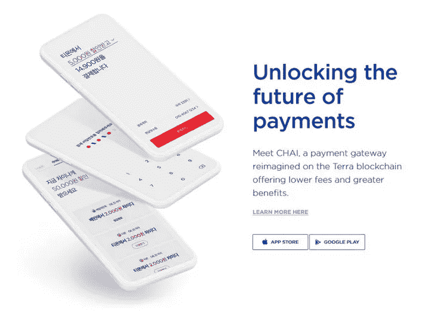

采用 stablecoin 的主要原因是 CHAI 向韩国不断增长的数字支付市场扩张。柴使和电子商务商家之间的这种整合成为可能。通过 CHAI 电子钱包或借记卡进行的任何支付都将通过 Terra 区块链进行。

**柴如何与泰拉的 KRT 融合的快速演练:**

1.  Alice 将她的银行账户与 CHAI 连接，并创建了 CHAI 电子钱包
2.  Alice 在电子商务平台上购买产品，并使用 CHAI 付款
3.  柴利用她的韩元和购买代表她
4.  柴将爱丽丝的减去交易费后寄给商人

Tokenist 和 Do Kwon 之间的采访进一步揭示了 Chai 的用户实际上从未直接接触过 Terra。因此，这使得用户界面流畅，有利于大规模采用。

亚洲的数字支付市场高度分散，为了分析 CHAI 和潜在的 KRT 的增长潜力，我决定研究 CHAI 的用户获取和商户获取战略，因为这是任何数字支付平台的两个关键成功因素。

**1。柴的用户获取策略**

柴利用游戏化的奖励平台获取用户。CHAI 电子钱包和 CHAI 借记卡使用户能够在热门品牌获得即时返现促销。CHAI [之前](/terra-money/in-numbers-four-months-of-chai-a8820a1dc2f5)表示，他们的资产负债表中营销费用为 0 美元，因为所有促销活动都是通过铸币税背后的经济学原理来运作和资助的。Terra 能够将经济增长(KRT 不断增长的需求)再投资，为消费者提供持续的折扣。在增长时期，这最终导致对 KRT 需求的良性反馈循环——增长导致铸币税，铸币税用于资助折扣，从而推动进一步采用。

柴电子钱包平台自 2019 年 6 月成立以来，增长强劲。目前，它拥有超过 240 万用户，这一关键数字在过去一年中翻了一倍多。

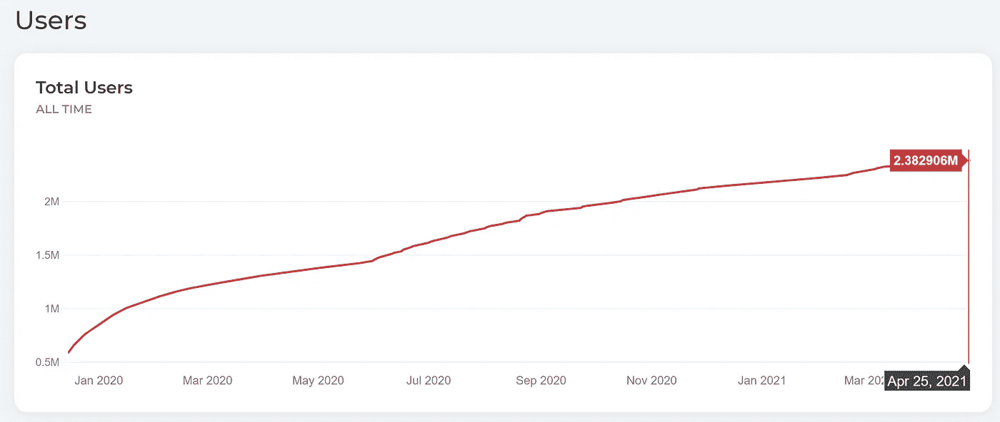

Source: [ChaiScan](https://www.chaiscan.com/server/web/ChartUsers_selectPage)

柴的日交易量也呈上升趋势。

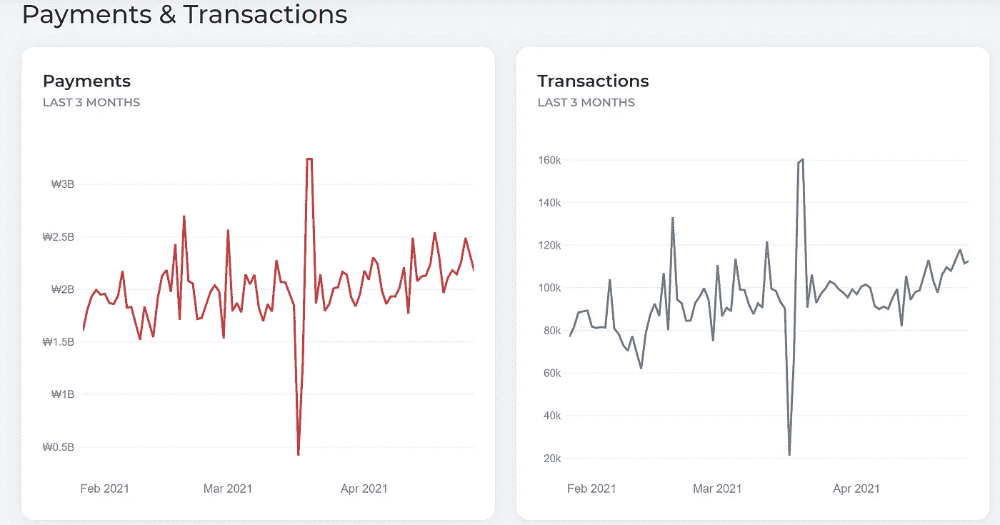

Source: ChaiScan

在日活跃用户方面，柴目前在和的所有 dApps 中排名第四，DAU 为 78k。

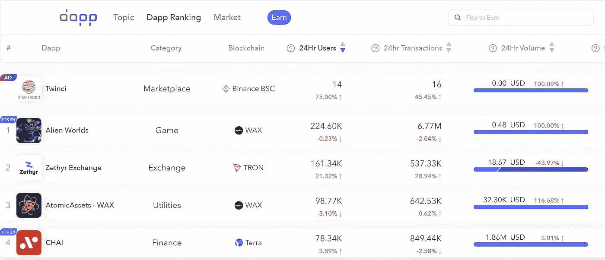

CHAI ranks 4th across dApps with 78k DAU

虽然我无法获得长期交易增长和净用户保留(美元)的数据，但我决定看看柴的[苹果](https://apps.apple.com/kr/app/%EC%B0%A8%EC%9D%B4/id1459979272#see-all/reviews)和[谷歌](https://play.google.com/store/apps/details?id=finance.chai.app&hl=en_SG&gl=US&showAllReviews=true)应用商店评级，作为粘性和总体用户情绪的代理。大多数评论都非常积极，主要是称赞该应用程序的干净的用户界面和非常有吸引力的折扣和现金返还，柴用户可以得到。

CHAI 还与韩国的 Samsung Pay 进行了整合，这进一步方便了 CHAI 卡在各商家之间的使用。

柴用户群的整体增长看起来肯定是有希望的。CHAI 在其支付平台上获得了强大而稳定的用户群。一个令人担忧的领域是其每日活跃用户的增长速度放缓。然而，随着该公司努力向泰国、台湾和新加坡扩张，这一数字有望增长。看看柴在其他亚洲市场获得市场份额的策略会很有意思。

**2。柴的商户收购策略**

CHAI 通过一个名为[I ' import](https://www.iamport.kr/)的 API 与商家和电子商务公司进行整合，该 API 允许在线商家接受 20 多种选择的支付，如传统的借记卡和信用卡、电汇、数字钱包，包括 CHAI 的电子钱包和借记卡。

那么，为什么商家会接受柴支付而不是 PayPal 和 venmo 等其他形式的支付呢？CHAI 为商家提出了两个非常明确的价值主张——**更快的结算时间**(传统支付服务 7 天，相比之下，的平均封锁时间为 6 秒)和**更低的交易费用**，通过绕过现有的结算网络将费用从 2.7-3.3%降至 0.5-1.5%。

这一价值主张似乎对 Terra 获得新的商家很有效。据 [TechCrunch](https://techcrunch.com/2020/12/09/seoul-based-payment-tech-startup-chai-gets-60-million-from-hanhwa-softbank-ventures-asia/) 报道，截至 2020 年 12 月，CHAI 目前在韩国有>2200 家商家使用，包括耐克韩国和菲利普莫里斯韩国。在 2021 年 3 月与道权的 AMA 中，他提到柴目前有一个头重脚轻的战略，支付流量主要来自 45-50 家大型商家(大型便利连锁店如 CU，电子商务平台如 TMON)。

虽然缺乏关于 CHAI 商户的净留存率的公开数据，但 CHAI 相对于其他数字支付的价值主张似乎真的很吸引商户接受 CHAI 作为一种支付形式。

此外，从整体电子商务和数字支付市场的增长来看，这两个市场都有望在亚洲实现强劲的 CAGR 增长。Terra 的商业收购策略是为了在不断增长的市场中获得更大的份额，这进一步支持了看涨的观点。

# 镜像协议和锚协议

镜像和锚协议都值得有自己的文章，我将在不久的将来发表，但这里是对这两个建立在 Terra 生态系统上的 DeFi 协议的快速总结。

TerraUSD (UST)于 2020 年 9 月[公开推出](/terra-money/announcing-terrausd-ust-the-interchain-stablecoin-53eab0f8f0ac)。当 [**镜像协议**](https://mirror.finance/) 于 2020 年 12 月推出时，对 UST 的需求出现了指数级增长，这是一种用于跟踪真实世界资产的分散式合成协议。简而言之，镜像资产是反映股票、期货、ETF 和其他传统金融资产等现实资产价格活动的合成资产。 **Mirror 旨在解决无法进入全球金融市场的问题，并为世界任何地方的交易者提供公开的价格敞口，而无需承担拥有或交易实物资产的负担。在三月的 AMA 与 Do 中，他提到目前很大一部分镜像用户来自泰国、中国和印尼——在这些地区，投资美国股票受到非常严格的限制。**

从 2020 年 12 月至今，Mirror 的 M-o-M 流动性增长了 100%，日活跃用户超过 2 万，日均交易量超过 5000 万 UST。

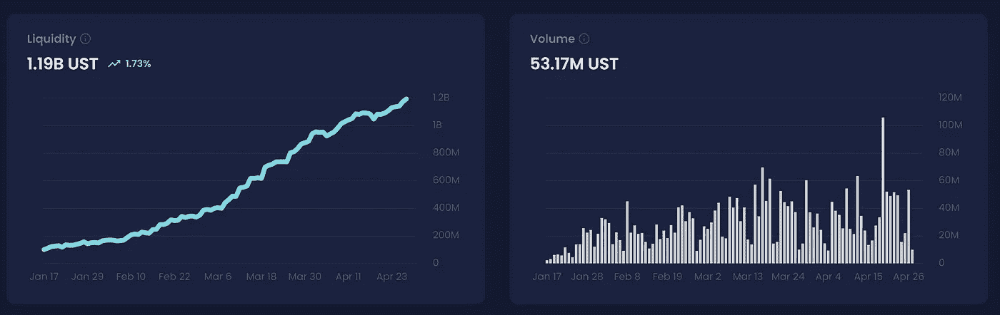

Source: [https://terra.mirror.finance/](https://terra.mirror.finance/)

[**锚协议**](https://anchorprotocol.com/) 随后由 Terraform Labs 于 2021 年 3 月推出。 **Anchor 是一种为 UST 存款提供低波动收益的储蓄协议。**吸引力在于，用户只需在主播平台内存款，就能获得 20%的 UST 稳定币收益(APY)。**是的，低波动 20%收益率。**在当前利率极低的环境下，这使得锚定储蓄极具吸引力。

***20%……但是怎么会呢？！***

Terraform labs 在 Anchor 的背后提出了一个巧妙的经济模型，该模型利用借款人贷款的过度抵押，并抵押抵押担保资产来赚取抵押收益率，以支付支付储户所需的成本(除了赚取借款人的 APR)。每当贷款价值比超过 50%时，抵押资产就会被清算。如何确保源源不断的借款人？Anchor 也有激励机制，激励借款人使用 Anchor 的平台借款，中长期目标是使 Anchor 生态系统能够自我维持。我将在随后的文章中更深入地探讨 Anchor 背后的经济学。

Anchor 目前的总存款资产价值为 2.4 亿美元，其中 UST 存款 2.17 亿美元，UST 借款 2.17 亿美元，UST 抵押品价值为 7.2821 亿美元。目前，Anchor 在 TVL 上市仅 5 周就积累了超过 9 亿美元。(注:TVL 价值根据抵押品总价值的价格而变化)

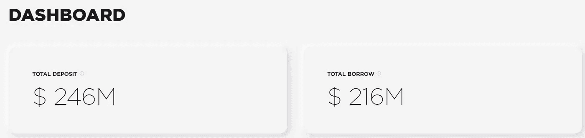

Source: [https://anchorprotocol.com/dashboard](https://anchorprotocol.com/dashboard); 28th April 2021

Anchor 的长期目标是成为主流用户的“储蓄磁条”。跟踪 Anchor 的商业伙伴关系会很有趣，这可能是更大增长的迹象。多个项目，如 [Orion Money](https://twitter.com/orion_money) 和[tiik Money](https://tiiik.money/)目前正在建设中，以进一步将 Anchor 推向大众。

纵观 UST 的增长，UST 的供应量从 2020 年 11 月下旬的 1123 万吨增长到 2021 年 4 月的 190 万吨。在过去的 5 个月里，价值约 19 亿美元的 LUNA 被用来铸造 UST。

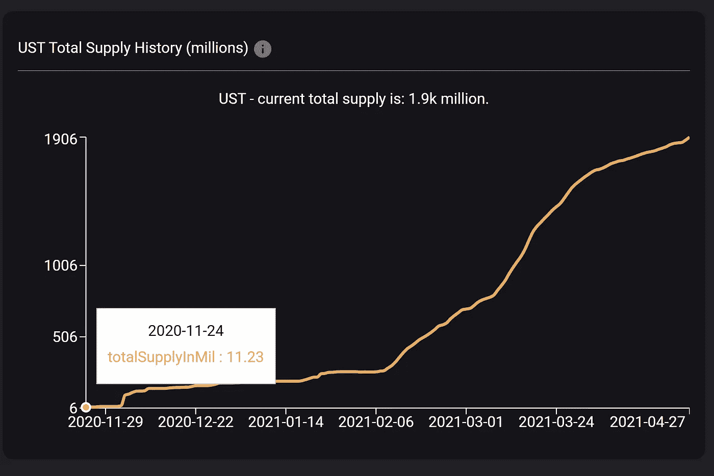

UST Data from [SmartStake](https://terra.smartstake.io/history) Validator

将这 3 个平台放在一起，我们有:

> 支付平台“**CHAI**”——使 UST 易于**支付**
> 储蓄协议“**锚**”——使 UST 易于**持有**
> 投资协议“**镜像**”——使 UST 易于**投资**

看到这 3 个平台能发展到什么程度确实令人兴奋。

# Terra 的增长路线图——2021 年及以后

***这种增长能持续吗？促进增长的其他杠杆是什么？***

Terra 生态系统的愿景并不以 CHAI、Mirror 和 Anchor 结束。事实上，这些只是 Terraform 实验室团队开发的第一代 dApps。Terra 现在已经转变为一个平台，能够授权和激励社区成员和开发者在 Terra 生态系统内构建更分散的融资平台。

Terra 生态系统中目前正在开发一系列令人兴奋的 dApps:

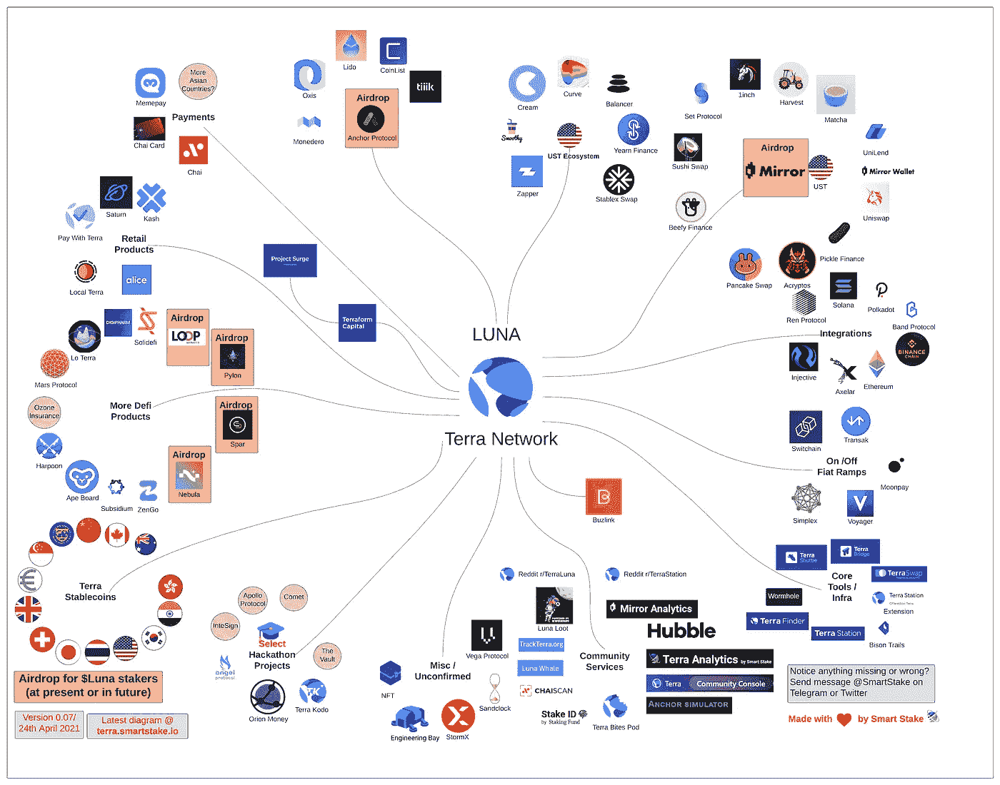

Source: [https://terra.smartstake.io/eco](https://terra.smartstake.io/eco)

## 管道内传入的新协议(非穷举):

*   Kash —集成镜像和锚的平台
*   臭氧-锚的保险协议
*   循环金融——自动化做市商分散式交易所
*   土星——菲亚特网关
*   Spar —分散式资产管理平台
*   挂架——传闻是一个多用途的分散融资平台
*   爱丽丝，星云，火星——能力仍然未知

## 额外宣传:

*   正在进行中的 Delphi Digital Hackathon for Terra 目前有 [63 个项目](https://docs.google.com/spreadsheets/d/1suYKPrz52Q-AmB4AsA_NB1kztkr_-V3Ia2ulEyClF38/edit#gid=0)——每个项目都有可能在 Terra 生态系统中启动
*   暹罗商业银行的控股公司 SCB 10X 最近[开始在 Terra 站](https://www.reddit.com/r/CryptoCurrency/comments/mywh2f/siam_commercial_bank_one_of_thailands_public/)上运行一个定位节点。
*   [有传言称,](https://www.techm.kr/news/articleView.html?idxno=82935)Terra stable coin 被用作釜山市“代币经济”的一部分

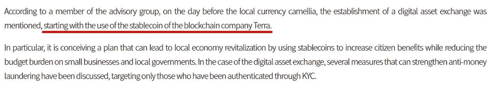

Source: TechM.kr 26th April 2021

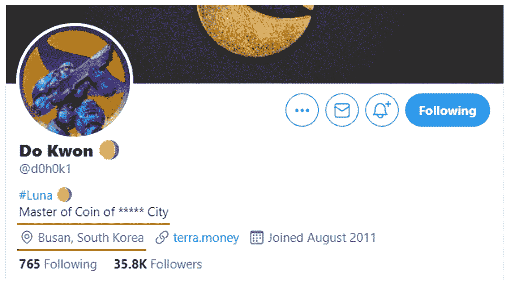

Do Kwon’s Twitter Profile

# Terra 的早期投资者是谁？

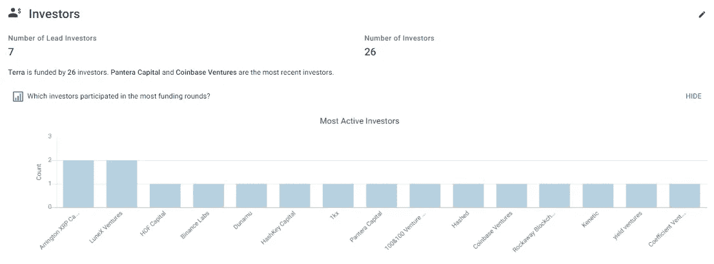

Data from [Crunchbase](https://www.crunchbase.com/organization/terra-d41a/investor_financials/investors)

许多著名的风险投资加密基金已经投资了 Terraform Labs。话虽如此，当价格和估值远低于当前水平时，他们中的大多数人可能会从上限表中分得一杯羹。

Terraform Labs 在 2019 年 8 月的 3200 万美元种子轮中有 12 位投资者，由[币安实验室](https://www.crunchbase.com/organization/binance-labs)、[杜纳姆](https://www.crunchbase.com/organization/dunamu-8ffd)、[火币资本](https://www.crunchbase.com/organization/huobi-bd34)、 [OKEx](https://www.crunchbase.com/organization/okex) 领投

[Kakao Ventures](https://www.crunchbase.com/organization/kakao-ventures) 、 [HashKey Capital](https://www.crunchbase.com/organization/hashkey-capital) 和 [LuneX Ventures](https://www.crunchbase.com/organization/lunex-ventures) 在 2019 年的未公开融资轮次中资助了 Terraform Labs。

在 2021 年 1 月的最新一轮融资中，Terraform Labs 从[潘迪拉资本](https://www.crunchbase.com/organization/pantera-capital)、[比特币基地风险投资](https://www.crunchbase.com/organization/coinbase-ventures)、[银河数码](https://www.crunchbase.com/organization/galaxy-digital-lp)又筹集了 2500 万美元。

# **风险**

## **1。Altcoin 赛季正处于历史最高水平，因此目前对 LUNA 的炒作也是如此**

如果你已经买入 Terra 的增长故事，并持有一些 LUNA，理解潜在的风险是很重要的。与其他替代硬币相比，LUNA 存在一些类似的风险——高价格波动性、功能损失、缺乏消费者保护、监管问题等。大多数替代硬币正在达到或处于历史最高水平(美元和 Satoshi 水平)，并且[替代硬币季节指数](https://www.blockchaincenter.net/altcoin-season-index/)目前也处于 90 的高位。LUNA 最近也被多协议发布和釜山的谣言炒得沸沸扬扬。

## 2.土地保持稳定的能力来自于保持他们的固定汇率

迄今为止，还没有一个重大的黑天鹅事件来对 UST 坚持盯住美元的能力进行压力测试。然而，在过去的几周里，有几天非常不稳定，[UST 设法很好地保持了它的联系汇率](https://twitter.com/terra_money/status/1385464423268057089?s=20)——一个积极的迹象。但在 UST(或其他稳定的货币)失去向下挂钩的情况下，必须铸造 LUNA 来稳定价格，这反过来会稀释 LUNA 的价值。

## 3.给露娜一个合适的估价的困难

反向观点肯定会对露娜目前的估值造成冲击。自 2021 年初以来，LUNA 的估值一直在大幅攀升，今年 3 月达到 22.30 美元的历史高点时，其年初至今涨幅超过 3000%。基于对 Terra 未来 FCF 的保守估计的传统 DCF 估值也将使 LUNA 的公允价值远远低于其当前价格(在撰写本文的这些天里，LUNA 的价格已经从 13 美元升至 19 美元以上)。

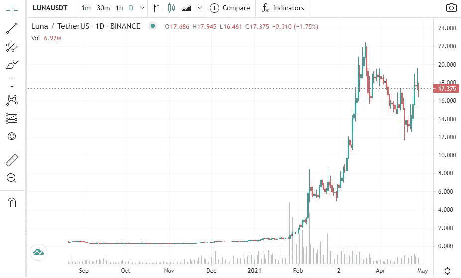

LUNA price on CoinMarketCap; 28th April

但随着 Terra 正在经历的成长步伐，现在似乎很难对 LUNA 进行估值。很难准确预测未来 3 个月 Terra 生态系统中的交易数量，未来几年更是如此。如果你对 LUNA 的深入基本面估值感兴趣， [Hashed](/hashed-official/capitalizing-on-terras-growth-a-valuation-framework-for-luna-f7d2e4b750f8) 、 [Rbf Capital](https://rbf.capital/terra-luna-token-analysis-and-valuation/) 和 [Block42](/block42-blockchain-company/terra-luna-valuation-a-serious-visa-mastercard-competitor-f20a0946fc64) 之前已经在这方面做了一些很好的分析。我决定从 UST 的目标市值开始回溯，从增长预期的角度出发 Terra 在 Y 日期增长并达到 X 美元的市值是否明智”。

钻入增长预期带来的**风险**。如果 CHAI 或其他 terra 协议的增长停滞，那肯定会损害 UST 的需求和 LUNA 的估值。然而，terra 生态系统在不断增长，这意味着协议无法满足其需求潜力的风险在更大且不断增长的协议池中呈现多样化。大多数 LUNA 信徒坚信，Terra 能够实现其增长战略，让 UST 市值实现指数级增长。Do Kwon 此前提供了指导，即随着协议管道的出现，**他预计 UST 的市值将在 2021 年底达到 100 亿美元** (UST 的市值目前约为 19 亿美元)。2021 年 3 月 Anchor 正式上线时，平均每天都在铸造[~ 3000 万辆 UST](https://terra.smartstake.io/history) 。4 月份，UST 的铸造速度有所放缓，平均每天铸造约 800 万至 1000 万枚 UST。做一个简单的粗略计算，要达到 UST EOY 公司 100 亿美元的目标，这意味着在 EOY 之前，每天大约需要铸造 3200 万 UST(80 亿美元/247 天)。按照目前的每日铸币率，这一指引听起来确实非常乐观。但是随着 Terra 社区的成长和新协议的到来，这种可能性仍然存在。每当新的协议发布时，我将跟踪 smart stake 上的 UST 供应数据，并在此过程中，审查 EOY UST 目标市场上限的可行性。

Flood capital 根据 UST 的市值对 LUNA 的价格上涨做了一个有趣的[敏感性分析](https://twitter.com/FloodCapital/status/1386747737010540544?s=20)。

一个额外的缓解因素是，LUNA 不同于其他的区块链，它不会引起通货膨胀。LUNA 赌注奖励来自 Terra 生态系统产生的费用(交易费、交换费)以及你从其他 Terra 协议获得的空投奖励。

> LUNA staking 收益率= Chai TX 费+“铸币税费”+掉期费(哥伦布-5 之后)+ MIR/Anchor 交易费+ MIR 空投+ Anchor 空投+未来更多空投
> 注意:当前 oracles 奖励池中的“铸币税费”将在 3 年内累计，而不是最初的 1 年。未来的铸币税将不再被分配到神谕奖励池。

此外，作为即将到来的 Terra Core Columbus-5 升级的一部分，它带来了一个精细的铸币税分配模型，进一步收紧了 LUNA 的供应(所有燃烧 LUNA 令牌产生的铸币税将被完全燃烧，不再进入社区池和甲骨文奖励池。这意味着一旦价值 1 美元的月神令牌被烧毁，将没有路由回到流通供应。你可以在这里找到更多[。)](https://agora.terra.money/t/terra-core-priorities-for-q1-q2-2021/388)

## 4.LUNA 流通供给增加的风险

***(此风险仅适用于使用其流通供应量评估 LUNA 市值的情况。如果用完全稀释的市值来评估 LUNA，这种风险就不适用。最近有一场关于 LUNA“锁定”供应的透明度的辩论，其中提到他将在不久的将来提供一份透明度报告。)***

**1。早期投资者/风投的归属悬崖**——这意味着将未归属的 LUNA 供应转变为流通供应。根据 Messari 的说法，大多数种子前和种子销售已经在 2020 年末归属，其余的将在 2021 年第四季度完全归属。这可能会导致一些抛售压力，因为早期投资者希望套现，但根据 Terra 的 telegram chat，他澄清说，除了一些钻石手外，大多数早期投资者已经在最近的上涨前出售了他们的既得 Luna。

**2。员工和贡献者池的归属悬崖** —从现在到 2022 年年中，这一未归属的 LUNA 供应池将逐渐归属。虽然从这些池中授予的 LUNA 当然有可能在交易所出售，但员工的授予似乎将在更小的批次中完成，并一直持续到 2022 年年中。这意味着突然大量涌入的新 LUNA 流动性被出售的风险较低。(目前还没有关于授权时间表的明确信息。这可能会在确实提到的透明度报告中说明)

**3。UST 需求的减少导致了卢纳**的铸造——这导致了卢纳**流通**供应的增加(之前是为了满足 UST 不断增长的需求而被烧掉的)。CHAI、Anchor 和 Mirror 的强劲增长以及正在开发的多种协议缓解了这一风险，所有这些都旨在进一步推动 UST 需求。

# 结论

> “对月球的押注就是对地球稳定增长的简单押注”——权道，2021 年

我个人认为 Terra 是一个非常令人兴奋的加密货币 DeFi 项目，并且有前途将 DeFi 带给大众。随着 LUNA 估值的大幅攀升，现在 Terra 有责任实现其 DeFi 增长故事。如果你相信 Terra 的增长故事，那么 LUNA 可能是一项具有吸引力的资产，可以持有并下注，在这个过程中，可以从新协议中获得 LUNA 赌注收益和空投(除了你将获得(发生)的任何资本收益(或损失)。

这篇文章只是覆盖了地球生态系统的冰山一角，当然还需要做更多的分析。对 Terra 生态系统发布的每一个新协议集也必须进行尽职调查。

Terra 有一个惊人的、活跃的、快速发展的社区。Terra 的电报[频道](https://t.me/TerraLunaChat)(感谢 Aayush！)和 Terra 的研究论坛， [Agora](https://agora.terra.money/) ，对我来说是获得关于生态系统的澄清或更新的非常有用的途径。这个强大的社区也为 Terra 生态系统带来了许多新的想法，正如正在进行的 Delphi 数字黑客马拉松所证明的那样。

最后一点，主流采用一直是加密货币的一个挑战，Terra 需要克服巨大的障碍，才能将其稳定的货币送到大众手中。直到 2021 年，Terra 一直被认为是一个稳定的支付平台。随着镜，锚，以及即将到来的多种协议，游戏已经从根本上改变了 Terra，它现在在整个 DeFi 生态系统中很好地定位自己。

*我可能完全错了***关于 Terra 及其成长的故事，看看一年后事情如何发展肯定会很有趣。**

**免责声明:本文并非投资建议，加密货币是高波动性资产。在做任何投资决定之前，做好自己的研究。我是龙露娜。**

***有用链接:***

***Terra***

*   *[网站](https://terra.money/)*
*   *[中等](https://medium.com/terra-money)*
*   *[不和](https://discord.gg/bYfyhUT)*
*   *Agora——Terra 的官方论坛*
*   *[白皮书](https://terra.money/Terra_White_paper.pdf)*

***锚***

*   *[网站](https://anchorprotocol.com/)*
*   *[中等](https://anchor-protocol.medium.com/)*
*   *[白皮书](https://anchorprotocol.com/docs/anchor-v1.1.pdf)*

***镜子***

*   *[镜报网站](https://mirror.finance/)*
*   *[镜像的媒介](https://mirror-protocol.medium.com/)*
*   *[镜子的白皮书](https://docsend.com/view/kcsm42mqiyu5t6ej)*

***其他***

*   *[柴扫](https://www.chaiscan.com/server/web/Dashboard_selectPage) —展示柴统计数据的网站*
*   *[锚模拟器](https://anchor-simulator.com/)—模拟不同锚/月赌注或 LP 策略的回报*
*   *[Terra Analytics by Smart Stake](https://terra.smartstake.io/)—提供 Terra/Luna 供应数据、空投计时器和 Terra 生态系统地图的网站*
*   *[ape board . finance](https://apeboard.finance/)——追踪你的 DeFi 投资组合的网络应用*
*   *[Terra Bites](https://www.youtube.com/c/TerraBites/videos)——关于 Terra 生态系统最大更新的每周播客*
*   *Terra stablecoins 是如何保持钉住的？—一篇深入解释 Terra 价格稳定机制的有用文章*
*   *[柴的升迁如何靠铸币税资助？](https://agora.terra.money/t/seigniorage-and-chai/186)——关于柴升官的铸币税观念的有益探讨。*

***我关注的一些报道 Terra / LUNA 的 Twitter 账户:***

*   *尼古拉·弗莱梅克斯*
*   *[ConstanteMx](https://twitter.com/ConstanteMx)*
*   *[洪水资本](https://twitter.com/FloodCapital)*
*   *[KSICRYPTO](https://twitter.com/ksicrypto)*
*   *[专业教师](https://twitter.com/ProfesoreFarmer)*
*   *[阿尔法 Seeker21](https://twitter.com/AlphaSeeker21)*
*   *[昆顿散](https://twitter.com/kundunsan)*

***我负责的验证器提供了 Terra 生态系统的频繁更新:***

*   *[玛特云](https://twitter.com/martecloud)*
*   *[月神轨道](https://twitter.com/justinlunaorbit)*
*   *[智能赌注](https://twitter.com/SmartStake)*
*   *[股份系统](https://twitter.com/stakesystems_io)*

> *加入 Coinmonks [电报频道](https://t.me/coincodecap)和 [Youtube 频道](https://www.youtube.com/c/coinmonks/videos)获取每日[加密新闻](http://coincodecap.com/)*

## *另外，阅读*

*   *[复制交易](/coinmonks/top-10-crypto-copy-trading-platforms-for-beginners-d0c37c7d698c) | [加密税务软件](/coinmonks/crypto-tax-software-ed4b4810e338)*
*   *[电网交易](https://coincodecap.com/grid-trading) | [加密硬件钱包](/coinmonks/the-best-cryptocurrency-hardware-wallets-of-2020-e28b1c124069)*
*   *[密码电报信号](http://Top 4 Telegram Channels for Crypto Traders) | [密码交易机器人](/coinmonks/crypto-trading-bot-c2ffce8acb2a)*
*   *[最佳加密交易所](/coinmonks/crypto-exchange-dd2f9d6f3769) | [印度最佳加密交易所](/coinmonks/bitcoin-exchange-in-india-7f1fe79715c9)*
*   *[面向开发人员的最佳加密 API](/coinmonks/best-crypto-apis-for-developers-5efe3a597a9f)*
*   *最佳[密码借贷平台](/coinmonks/top-5-crypto-lending-platforms-in-2020-that-you-need-to-know-a1b675cec3fa)*
*   *[免费加密信号](/coinmonks/free-crypto-signals-48b25e61a8da) | [加密交易机器人](/coinmonks/crypto-trading-bot-c2ffce8acb2a)*
*   *[杠杆代币](/coinmonks/leveraged-token-3f5257808b22)终极指南*