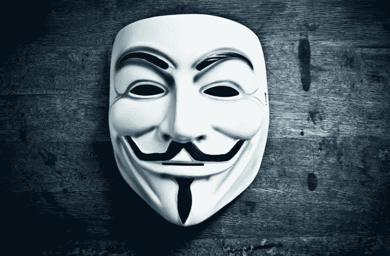
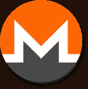
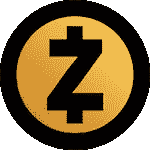
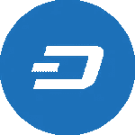
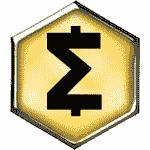
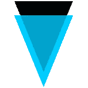

# 最匿名的加密货币

> 原文：<https://medium.com/coinmonks/the-most-anonymous-cryptocurrencies-6948095d3d76?source=collection_archive---------9----------------------->

[Source](http://www.collective-evolution.com/2017/12/07/anonymous-christmas-message-warning-you-are-being-distracted/)

在去年年底加密货币价格快速上涨后，数字货币行业引起了极大的关注。然而，由于与安全问题相关的丑闻不断，许多投资者不愿投资。例如，最受欢迎的数字货币——比特币——并不是最匿名的。它的交易可以被追踪。许多类型的数字货币为您的数据提供了更好的保护。匿名加密货币使用户的交易、日期、资金数量和其他数据无法跟踪，并降低了以不同方式被黑客攻击的可能性。想想最安全的五种加密货币。

## 莫内罗

Monero 于 2014 年春季推出，是使用 CryptoNight 算法的三种加密货币之一。许多专家认为，在它上面进行黑客攻击和跟踪交易是不可能的。Monero 的创造者最终确定了算法，并实现了最大程度的匿名。由于可靠的保护，数字货币经常被攻击者用来制造病毒矿工。

## ZCash

ZCash 成立于 2016 年 10 月，旨在解决互联网用户想要的具有隐私功能的开放金融系统。ZCash 中有两种地址:透明的和私有的。透明地址(addresses)的行为与比特币完全一样，包括它们的全局公共属性。屏蔽地址(Z-addresses)是完全私有的地址，它使用零知识证明系统来屏蔽交易和平衡隐私。

## 破折号

Dash 加密货币出现在 2015 年。它已经经历了一些更名，早期它可以在 XCoin 和 DarkCoin 的名称下在特定的交易所找到。这种加密货币的主要特点是平台的特殊架构，这使得黑客攻击极其困难。使用数字货币的交易受 DarkSend 保护，不允许获取交易的发送者、接收者、日期和金额的数据。

## 深洋葱

一种鲜为人知的被社区不公平忽视的加密硬币。它的独特之处在于极高程度的匿名性。DeepOnion 与 TOR 系统集成。一个特殊的加密系统被用来登录。客户端有一个内置的 VPN，可以改变用户的位置。因此，如果您需要隐藏您的位置，使用 DeepOnion 是最简单的事情。

## 智能现金

这种加密货币的出现是 Zcoin hardfork 的结果。它使用一种特殊的技术来保护用户信息。特别地，该链包括随机排列的信息。要解码它们并把它们放在正确的位置上，除去不必要的，是不可能的。因此，智能现金的匿名程度非常高。

## 边缘

Verge 基于比特币区块链，采用多重匿名-сcentric 网络改编。Verge 的一个独特之处在于它与 TOR(支持匿名通信的免费软件)和 I2P(为用户提供多层匿名化)的集成方式。

如果您需要将您的加密货币兑换成更安全的货币，您可以使用 [ChangeNOW](https://changenow.io/) 来完成。我们创造了新一代的交换机，以最小的延迟进行交易。

我们使用最安全的加密货币。在这个网站上，你会找到所有必要的硬币，并能够快速购买或出售它们，将它们兑换成数字货币。有了 ChangeNOW，你可以让加密货币的交易尽可能有利可图。