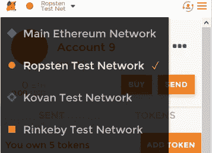

# 在以太坊网络上为你的 ICO 发起众卖最简单的方法。

> 原文：<https://medium.com/coinmonks/the-most-easy-way-to-launch-the-crowdsale-for-your-ico-on-the-ethereum-network-45701896e32c?source=collection_archive---------0----------------------->


Social Crowdsale: source: [https://ethereum.org](https://ethereum.org)

发起众筹(或 ICO)如今非常流行。由于整个以太坊生态系统的快速发展，很难找到一个没有过时的好指南。如果你厌倦了搜集不同的资源来发布你的智能合同，请继续阅读！

我向你保证。我不会浪费你的时间。如果你遵循这个指南，你将能够在主以太网上启动你的合同。本指南不包括如何在 Etherscan 中验证该合同。(我正在实现这个功能)。本指南将花费您不到 10 分钟的时间来部署您的众筹销售。(神圣的烟雾！)

对于本指南，我们将需要:
[Node.js](https://nodejs.org/) v8.9.4+
一个 [Infura](https://infura.io/) 账户(这是免费的！).
[元掩码](https://metamask.io/)

首先将这个库分支到你的 Github 账户。
本地查看。

ForkToken 是以太坊 100%基于配置的众筹合约，所以不需要任何编码知识。(在自述文件中了解更多信息。)

重要的事情先来。转到签出目录并添加您的密钥:

```
$ cd contract\secret
$ cp infura.example.json infura.json
$ cp mnemonic.example.json mnemonic.json
```

现在将从 infura 的邮件中获得的密钥插入 infura.json。(`[https://mainnet.infura.io/[THIS IS YOUR KEY])](https://mainnet.infura.io/CJs6ec7XfxmC2k6SgObI)`

在助记符中插入你的助记符。您可以在 meta mask = > settings = > reveal seed words 中获得您的助记符。

请注意:
！！！！千万不要检查助记符。json 这个文件应该是秘密的，因为每个人都可以通过这些单词访问你的钱包！！！！

好了，这是无聊的部分，现在有趣的开始了！:-)

我们将把我们的代币命名为“示例众筹代币”，以“ECT”作为符号。编辑 contract/Token.sol 并将其更改为:

```
**pragma** solidity 0.4.18;
**import** 'zeppelin-solidity/contracts/token/ERC20/MintableToken.sol';

**contract** Token **is** MintableToken {
    **string public** name = "Example Crowdsale Token";
    **string public** symbol = "ECT";
    **uint8 public** decimals = 18;
}
```

(所以基本上改变文件中的名称和符号)

打开“contract/config”目录下的 Crowdsale.json。该文件包含众卖的配置。让我们做一个这样的众筹:

预 ICO 将有一个 3 ETH 的上限，并给予 50%的奖金。第一波 ICO 将有 6 个 ETH 的上限，并给予 25%的奖金。第二波 ICO 的上限为 10 ETH，不提供奖金。
募集 ETH 总数:19 个 ETH。
如果众筹结束时我们没有达到 15 ETH，我们将向投资者退款，但 ico 前投资者除外。

该团队将获得售出代币总数的 20%。
生态系统将获得售出代币总数的 10%
将有 1%的奖金。

每个 ETH 你将获得 10 个 ECT，ICO 将在部署后 1 天开始，运行 1 周

这将反映到以下配置中:

```
{
  "DATES": {
    "START_IN_DAYS": 1,
    "END_IN_DAYS": 7
  },
  "RATE" : 10,
  "GOAL" : 15,
  "WAVES": {
    "PRE-ICO": {
      "BONUS": 50,
      "CAP": 3
    },
    "WAVE1": {
      "BONUS": 25,
      "CAP": 9
    },
    "WAVE2": {
      "BONUS": 0,
      "CAP": 19
    }
  },
  "WALLETS":{
    "OWNER":{
      "ADDRESS" : "0x7105037736D4c10f9832fE5cb9176ACd129C7D0b"
    },
    "TEAM":{
      "ADDRESS" : "0x0b370e26e7c9dE80578Ace5DCcb271a20c1956b3",
      "AMOUNT" : 20
    },
    "ECOSYSTEM" :{
      "ADDRESS" : "0x5452fD82a24a767F7430a68450cB616dE024f3f0",
      "AMOUNT" : 10
    },
    "BOUNTY" : {
      "ADDRESS": "0x0C3a09e9dd8559bBc37269082B82f0803f4d8c4c",
      "AMOUNT" : 1
    }
  }
}
```

请注意，所有者地址必须是您助记符下的元掩码中已知的地址！其他人可以是一切。

让我们部署到 ropsten(一个以太坊测试网络)！

首先确定机主账号有以太坊。

转到 Metamask 并切换到 Ropsten 网络



metamask ropsten

然后按购买。=> Ropsten 测试水龙头。并按下“从水龙头请求一个乙醚”。现在你有乙醚来支付煤气费！:-)

让我们把这个宝贝发射到神秘空间！

```
$ npm install
$ truffle migrate --network ropsten
```

您的输出应该如下所示:

```
ForkedCrowdsale: 0x9604a44188f3e8480d6bc826a42b178fa48dba77
-----> Token Address 0x3bc6fe3d02a3337e8c0d214e3fdc1d8603294403
-----> startTime:   2018-02-28T20:04:02.000Z
-----> endTime:     2018-03-02T20:04:02.000Z
-----> rate:        10
-----> wallet:      [ '0x7105037736D4c10f9832fE5cb9176ACd129C7D0b',
  '0x0b370e26e7c9dE80578Ace5DCcb271a20c1956b3',
  '0x5452fD82a24a767F7430a68450cB616dE024f3f0',
  '0x0C3a09e9dd8559bBc37269082B82f0803f4d8c4c' ]
-----> cap:         BigNumber { s: 1, e: 18, c: [ 50000 ] }
-----> waves caps:  [ 3000000000000000000,
  9000000000000000000,
  19000000000000000000 ]
-----> bonuses:     [ 50, 25, 0 ]
-----> goal:        BigNumber { s: 1, e: 18, c: [ 30000 ] }
```

这里重要的是:

```
ForkedCrowdsale: 0x9604a44188f3e8480d6bc826a42b178fa48dba77
```

这是发送以太坊以支持众筹的地址。

```
Token Address 0x3bc6fe3d02a3337e8c0d214e3fdc1d8603294403
```

这是令牌的地址。(使用 ForkIco 创建的令牌始终有 18 位小数)

搞定了。众筹在 ropsten 测试网上直播。将会发生什么:每一个发送到 crowdsale 地址的 Eth 都会直接进入所有者的钱包。在其他阶段，它将被锁定，直到众筹结束。如果目标达成，以太坊将进入所有者的钱包。如果没有，人民将得到退款。

如果您想部署到 main，您可以运行以下命令:

```
$ truffle migrate --network mainnet
```

如果你遇到任何问题，让我知道。如果本教程的某些部分令人困惑或需要更多的深度，请告诉我。

> [在您的收件箱中直接获得最佳软件交易](https://coincodecap.com/?utm_source=coinmonks)

[](https://coincodecap.com/?utm_source=coinmonks)

如果你发现 bug 或者有功能需求，请在 Github 上报告。
如果你修复了 bug 或者增加了功能，请做一个推送请求。

> 如果你喜欢这篇文章，请给我一些掌声。我会在未来分享更多的文章，所以不要忘记关注，如果你认为你的朋友会喜欢这篇文章，请随时与他们分享。感谢阅读👐