# 2021 年最赚钱的 NFT 项目

> 原文：<https://medium.com/coinmonks/the-most-profitable-nft-projects-in-2021-c6b3353e1963?source=collection_archive---------1----------------------->

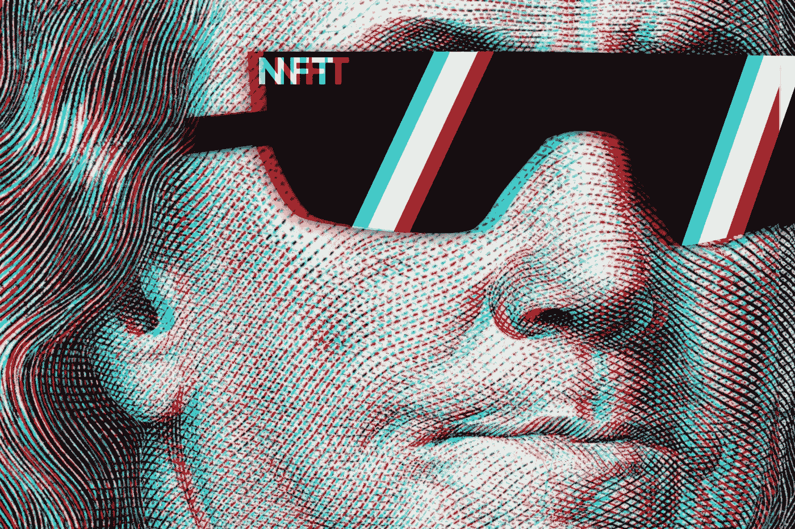

对于加密货币投资者来说，今年已经成为不可替代代币(NFT)越来越受欢迎的象征。加密货币社区已经知道这个概念好几年了，只是最近才开始广泛传播。这导致与 NFT 有关的项目迅速增长。今天，我们将仔细研究这一现象，并看看十个最受欢迎的 NFT 相关的创业公司。

# 什么是 NFT？

不可替换令牌或 NFT 是区块链的加密资产，具有唯一的标识码和元数据，可将它们相互区分开来。与常规加密货币不同，它们不能在等价的基础上进行交易或交换。这将它们与可互换代币区别开来，可互换代币彼此相同，因此可以用作商业交易的媒介。

NFT 具有广泛的现实应用潜力。例如，它们是实物资产(如房地产和艺术品)的数字表示的理想载体。由于总部设在区块链，NFTs 还可以用来消除交易过程中的中介，以及内容创作者和他们的消费者群体之间更密切的沟通。

目前 NFT 市场的很大一部分都围绕着数字艺术、独特的卡片和稀有物品等收藏品。一个主要的例子是 NBA Top Shot 平台，它收集与美国国家篮球协会相关的独特时刻。以数字卡的形式。其中一些贺卡今年已经卖出了数百万美元。

NFT 的另一个普遍用途是为现代互联网和密码市场历史上的难忘时刻创造历史价值。Twitter 首席执行官杰克·多西最近发布了一条链接，链接到有史以来第一条推文的符号化版本。它的 NFT 版本以 250 万美元售出。

像实物货币一样，加密货币是可替代的，这意味着它们可以出售或交换。例如，一个比特币总是等于另一个比特币的价值。同样，一枚以太币始终等于另一枚加密币。这种可互换的特性使得加密货币适合用作数字经济中的交易手段。

NFT 创造了一个新的范例，使每个令牌都是独一无二的，不可替代的。此外，在某些情况下，不可替换的令牌可以相互组合，用其他唯一标识符创建新的数字对象。这为趋势游戏化打开了大量的可能性。

大多数基于以太坊的 NFT 都是 ERC-721 令牌。它的代码不同于 ERC-20 令牌码，后者用于创建可互换的以太币。主要区别在于使 ERC-721 令牌独一无二的特征。其中之一是 tokenId 参数，该参数可用于区分不同的 NFT。

# 为什么 NFT 这么受欢迎？

ERC-721 标准是在 2017 年 9 月发明的，但至少在几年前，加密投资者社区就已经讨论过独特数字对象的想法。2018 年，CryptoKitties 项目引发了第一波引人注目的 NFT 热潮。这是一个分散式应用程序形式的在线游戏，用户可以在游戏中交换与猫的虚拟图像相关的不可替换的令牌。它的主要特点是能够通过组合和创造新的代币来“繁殖”虚拟宠物。

CryptoKitties 曾经如此受欢迎，以至于在以太坊区块链超过 11%的交易都是这个项目的 NFT 转账。最有趣的是，CryptoKitties 并不是第一个 NFT 项目——这个头衔属于初创公司 CryptoPunks，它在交易量方面明显优于 CryptoKitties，但已经在 2021 年了。那么不可替代代币如此受欢迎的原因是什么呢？在这里，我们应该同时强调它们的几个优点:

*   独一无二。在单一实例中拥有某物的事实已经赋予了该物基本的价值；
*   不变性。关于 NFT 的数据记录在区块链中，不能删除或更改；
*   局限性。NFT 代币的集合具有相对较少数量的实例(例如，CryptoPunks 系列代币只有 10，000 个)；
*   数字化。多亏了 NFT，几乎任何物理对象都可以与区块链中的信息联系起来，这赋予了它额外的价值。

2021 年 NFT 的好处引人注目地吸引了大量投资者的注意。正因为如此，与不可替代代币相关的项目在短短几个月的时间内显示出前所未有的回报。

# 2021 年 NFT 十大项目

下面我们来看看最流行的一系列不可替代的代币、交换平台和其他与新趋势相关的项目。排名是随机的，这意味着名单上的某个位置不会自动让一个项目比另一个项目更好。

# NBA 最佳投篮

NBA Top Shot 是由总部位于温哥华的区块链公司 Dapper Labs 在 NBA 的支持下创建的平台，允许用户以独特的数字对象的形式获取最佳篮球时刻的集合。要从 NBA 获得 NFT，这被称为“时刻”，你可以购买成套的代币，或者你可以在二级市场上购买代币本身。

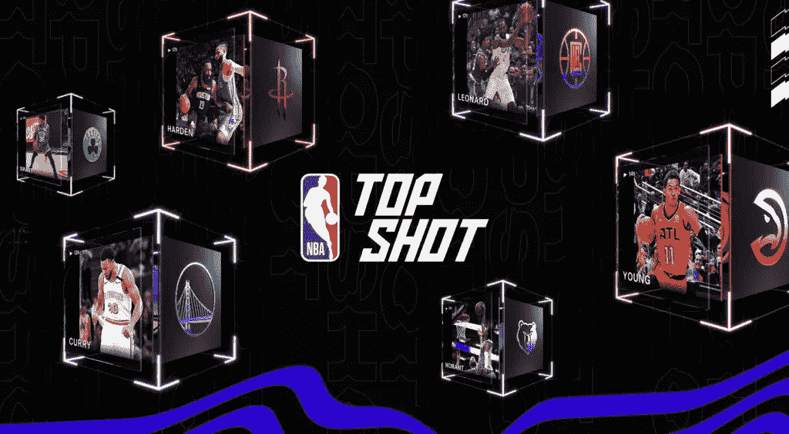

这些“时刻”的稀有程度各不相同，其价值取决于以下稀有程度:

*   有规律，意味着瞬间可以有超过 1000 个数字拷贝。它们可以以普通套装的形式购买，比如售价从 9 美元起的九个瞬间；
*   稀有(150-999 份数字拷贝):这些时刻可以在稀有的套装中找到，起价为 22 美元。一个有七个常见瞬间，至少有一个罕见瞬间；
*   传奇(25–999 份数字拷贝):这些可以在售价从 230 美元起的传奇套装中找到；
*   白金至尊版(3 张数字版):仅在拍卖会上发售；
*   创世纪终极版(只有 1 个数字版本):也只能在拍卖会上买到。

自成立仅两年以来，活跃的 NBA Top Shot 用户数量已超过 100 万大关。同时，一年中篮球比赛独特时刻的交易额超过了 10 亿美元的水平。自今年年初以来，NBA 收藏的许多代币的价值已经增加了几十倍，并且随着 NFT 越来越受欢迎，价值还在继续增加。

# 密码朋克

2017 年，纽约幼虫实验室的创始人 Matt Hall 和 John Watkinson 创建了一个程序，可以生成数千个不同的怪异角色。起初，他们认为自己具备了开发智能手机应用或游戏的条件。他们最终为数字艺术市场建立了一个改变模式的模型，并挑战了“所有权”的概念。

CryptoPunks 是一个 24×24 像素艺术风格图像的集合。总共有 10，000 个令牌，每个令牌都有自己的个性和独特的随机生成的特征的独特组合。有 6039 名男性“密码朋克”和 3840 名女性“密码朋克”根据不同的特征，如头发的颜色、配件的可用性等，将它们分为各自的类别。还有八个没有任何区别特征的小阿飞，有时被称为创世纪小阿飞。

幼虫实验室网站上有一张所有 10，000 名“秘密朋克”的合成图片任何人都可以保存图像文件的副本。每个令牌也有自己的页面，详细介绍其功能和完整的交易历史。但是只有一个人可以正式拥有一把 NFT，因为每个密码朋克的正式所有权都在以太坊区块链密码中规定了。

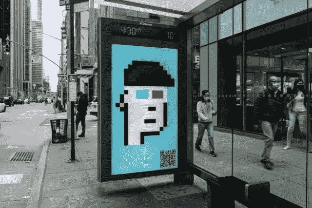

霍尔和沃特金森发明的系统有时被比作拥有一件永久借给公共博物馆的实物艺术品。提醒一下，加密朋克开创了 NFT 世界，理所当然地获得了投资者的最大欢迎。

# 稀有的

Rarible 是一个基于以太坊的平台，通过 NFT 促进数字艺术作品所有权的创造、销售和购买。虽然 Rarible 是作为一个集中式平台推出的，但它的创建者计划随着时间的推移逐渐分散它，最终将控制权转移到一个由 Rarible 社区管理的分散自治组织(DAO)。Rarible 计划通过其 RARI 管理令牌来实现这一目标，该令牌赋予用户参与平台管理的权利。2021 年，Rarible 宣布将推出 Dapper Labs 的区块链交易平台 Flow，该平台旨在托管分散的应用程序，实现快速交易。

要使用 Rarible，你需要一个以太坊钱包，如 Metamask、Argent 或比特币基地，以及一些支付佣金的 ETH。可以用信用卡直接在平台上购买 ETH。将你的钱包登录服务后，你可以浏览 NFT 稀有交易平台，寻找不可替代的代币进行购买。该平台展示最畅销的商品和艺术收藏，还允许你在照片、游戏和迷因等类别中搜索 NFT。NFT 卖家可以选择是为自己的资产设定固定售价，还是举行拍卖。

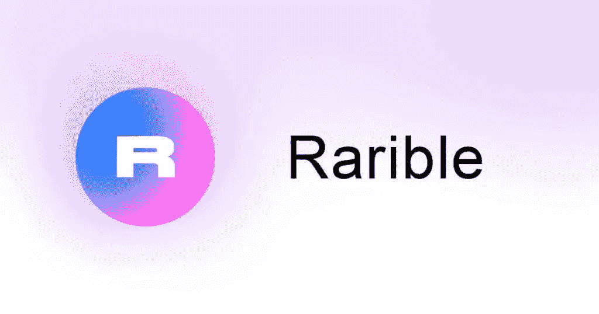

此外，如果你是艺术家或创作者，你可以使用 Rarible 来创建自己的 NFTs。如果生产 NFT，就不用卖了，在平台上发布就可以了。也就是说，当你第一次发行令牌时，你必须支付两笔费用——一笔是让你的钱包获得与 Rarible 交互的许可，另一笔是“调用造币函数”，将你的文件放入跨平台文件系统(IPFS)和以太坊区块链。

这两项费用都是网络费用——与区块链互动的成本——不计入平台本身的收入。对于未来的发行，您只需支付交易费，尽管这可能会因网络负载而异。当你决定出售你创作的艺术品时，Rarible Art 交易平台将允许你从销售中收取 NFT 许可费，这意味着你不仅可以在你的 NFT 的首次销售中获得一定比例的价格，还可以在第三方的后续交易中获得一定比例的价格。事实上，这个在代币交易链上轻松赚钱的机会是这个平台如此受欢迎的原因。

# OpenSea

OpenSea 是另一个分散的交易平台，允许你买卖不可互换的代币。它成立于 2017 年，是 CryptoKitties NFT 令牌交易的市场，但后来为客户大幅扩展了服务。OpenSea 现在支持无数的数字资产类型，包括艺术、域名、游戏项目、音乐等的 NFTs。

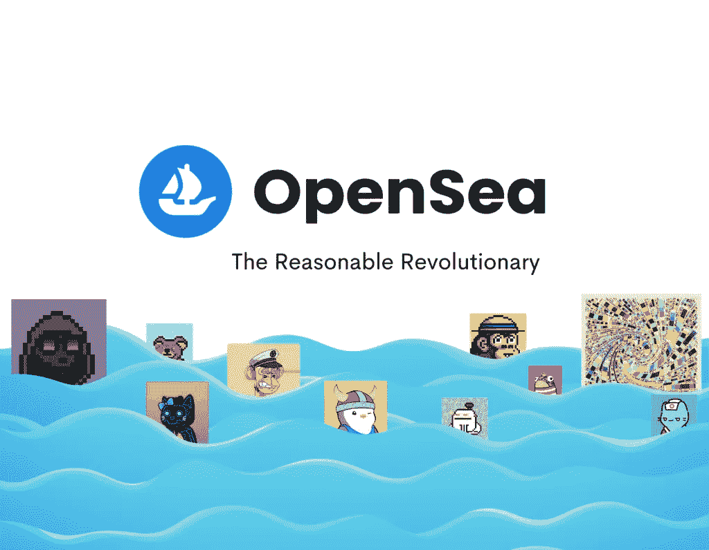

OpenSea 是建立在以太坊区块链之上的，所以你必须有一个以太坊钱包才能使用这个平台。OpenSea 还支持其他几个区块链，包括 Polygon 和 Klaytn。你可以从包括 Stablecoins 在内的 241 种支付方式中进行选择，因此任何人都可以在平台上买卖数字商品。

# 散列表

Hashmasks 是由 Suum Cuique Labs 运营的 70 名艺术家组成的分散团队创作的虚拟艺术作品。每个“面具”都有鲜明的特征，其中最显著的是肤色、性格和眼睛的颜色。Hashmask 不同于任何其他普通的 NFT 绘画，因为每个面具都没有名字。令牌的所有者负责命名他们的 Hashmask，从而为艺术品做出创造性的贡献。

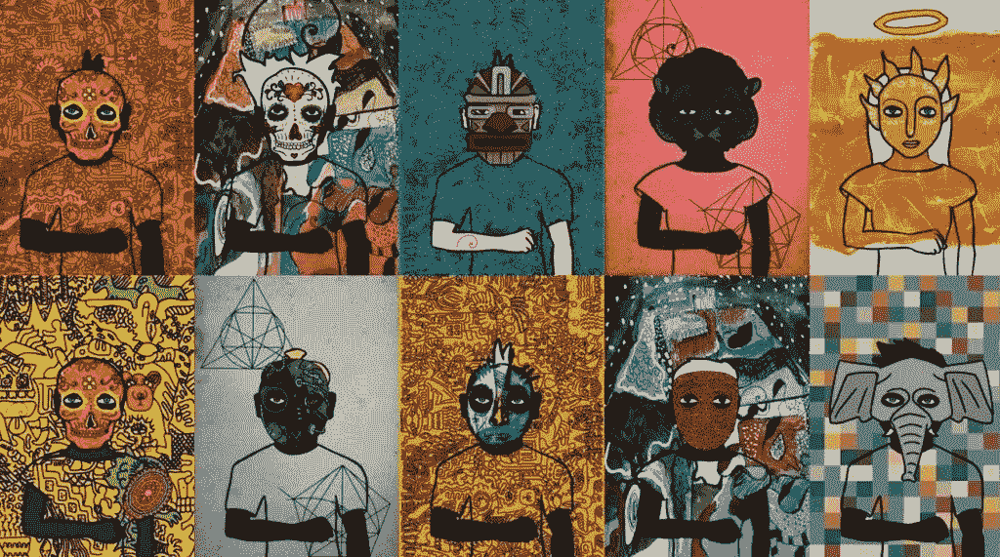

该项目的创造者已经制作了 16，384 个标记和相关图像。面具有自己的等级值，类似于 NFT 系列的密码朋克。在这里，图像的背景很重要，头发的颜色、眼睛等特征也很重要。这一系列不可替代令牌中最昂贵的交易是以 420 ETH 或 169 万美元(按当前加密货币汇率计算)的价格出售面具。

# 金恩

金恩是一个基于新加坡的区块链平台，旨在用作分散式游戏、元站点和不可替换令牌的基础设施。最初创建于 2009 年，现在是世界上最大的游戏社区平台之一，涵盖数十万个游戏社区和大约 2000 万注册玩家。

金恩硬币(ENJ)是该项目的本地令牌。在最高的 10 亿 enj 发行量中，有 8 . 35 亿 enj 在流通。今年 1 月至 4 月，ENJ 经历了巨大的增长，其价格在短短几个月内从 14 美分上涨到 3.46 美元。

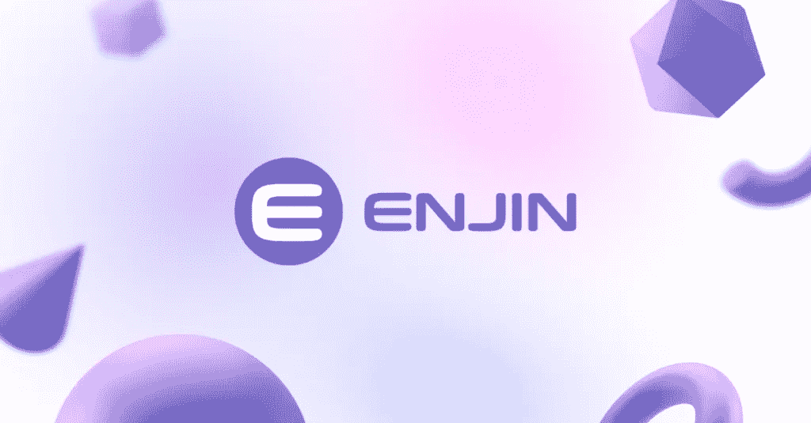

金恩已经拥有一个庞大的用户群体。该平台的成功是由于 NFT 和元宇宙的受欢迎程度普遍上升。这些想法将继续主导加密货币市场，从而确保未来对该平台的稳定需求。

# 流动

Flow 是一个分散的生态系统和基于区块链的平台，为交互式交互、分散的应用程序项目和基于区块链的游戏提供可扩展的解决方案。Flow network 专注于提供一个可扩展的环境和架构，用于无拥塞的快速交易，为 NFT、dApps 和游戏创造环境。Flow 团队参与了 NBA Top Shot 的创建，这是本排名中已经提到的另一个受欢迎的平台。

Flow 在不使用分片的情况下解决了以太坊平台中出现的可伸缩性问题。相反，该平台是基于利害关系证明算法。通过这种方式，Flow 可以确保 dApps 和游戏的流畅运行，并最大限度地减少网络拥塞。

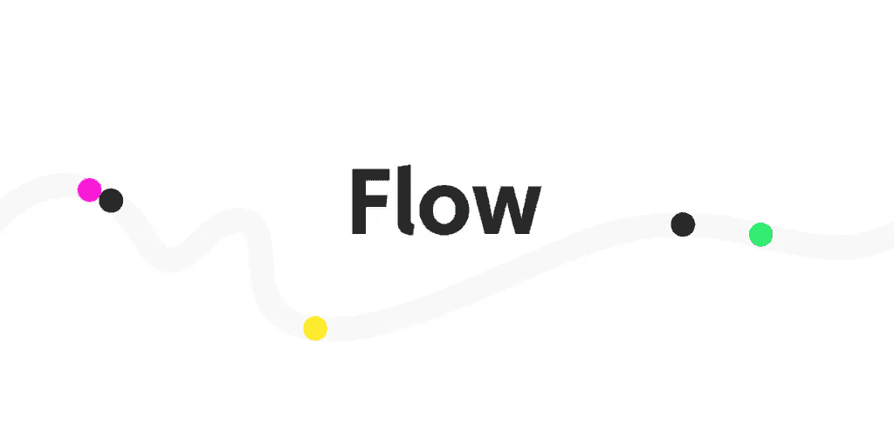

流在支持系统的节点之间分配网络上的工作，不同的节点根据其技术能力被分配不同的任务。通过将非确定性进程(例如，将事务形成一个块)与确定性进程(例如，执行该事务块)分开，可以提高区块链吞吐量。

为了减少以太坊网络上的负载，Flow 使用具有多个角色的多节点架构。为了以高效且经济的方式扩展整个网络，Flow 使用网络参与者的四个角色来分解块验证过程，将不同的任务分配给不同类型的节点。

# 分散土地

分散王国是一个基于以太坊的项目，旨在鼓励全球用户网络管理一个共享的虚拟世界。分散用户可以通过在这个虚拟世界中探索、互动和玩游戏来买卖数字房地产。随着时间的推移，该平台已经发展到实现交互式应用、内部支付，甚至虚拟通信领域。

分散式使用两种类型的控制令牌:

*   土地。这是一个不可互换的令牌，用于确定代表数字房地产的土地的所有权；
*   法力。它是一种加密货币，有助于购买土地以及分散土地中使用的虚拟商品和服务。

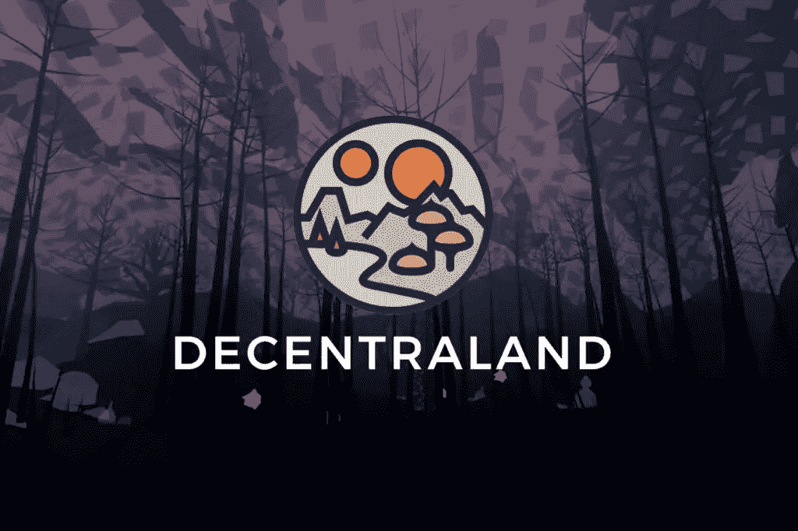

分散土地软件的变化是通过一套位于区块链的智能密码引入的，这些密码允许拥有 MANA 的参与者就政策更新、土地拍卖和新开发补贴进行投票。

# 无限轴

在 Axie Infinity 中，玩家购买、繁殖并与名为 Axie 的怪物相互战斗，以赢得游戏中的 SLP 货币。这种商业模式被称为“玩赚”，玩家花时间玩虚拟游戏可以获得真正的回报。

每个 Axie 都是一个不可替换的代币和可收集的物品，可以在游戏外的交易中买卖。玩家必须至少有三把斧子才能开始战斗，最便宜的要卖 200 美元左右。最贵的怪物在 2020 年卖回 300 ETH。

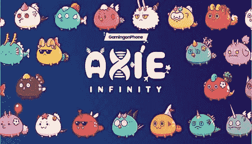

这款游戏的火爆人气帮助开发工作室 Sky Mavis 今年赚了数百万美元。该公司从游戏内交易中获得了 7 亿美元的收入，其中 17%归开发商所有。预计到今年年底，其资本总额将超过 10 亿美元。

这家游戏开发商最近在 B 轮融资中筹集了 1.52 亿美元，由 Andreessen Horowitz 牵头，估值为 30 亿美元。由于该公司并不拥有 Axie Infinity 的所有代币，其估值低于其货币的市值。天空 Mavis 表示，它将使用新的资金推出一个改进的战斗系统，一个分散的交流，和一个新的游戏。

# 沙盒

沙盒是一个基于以太坊的元世界和游戏生态系统，用户可以在虚拟世界中创建、交换和货币化资源和游戏体验。Pixowl 的项目将颠覆游戏行业，在这个行业中，平台拥有并控制用户生成的内容，创作者和玩家的权利受到限制。在沙盒中，用户完全拥有他们的虚拟对象。

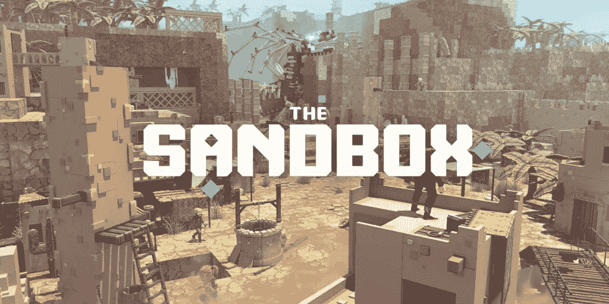

该项目由三个关键部分组成:

*   VoxEdit。允许用户在元宇宙中创建 3D 对象并制作动画。这些对象称为资产，使用 ERC-1155 令牌标准，允许使用单个智能合约创建可互换和不可互换的令牌；
*   沙盒市场。这是一个市场，用户可以发布和出售他们的资产后，他们首先上传到星际文件系统(IPFS)；
*   沙盒游戏制作人。允许用户免费创建 3D 游戏。

虽然参与沙盒不需要编程知识，但其强大的工具包允许用户在快速增长的在线游戏和虚拟世界领域创建和嵌入有价值的资产。这是导致本地 SAND token 在 2021 年增长到历史最高水平的原因。

# 结论

在不可替换的代币出现之前，虚拟世界中的对象仅仅因为它们的存在而没有基本的价值。换句话说，一个普通的计算机文件可以被复制多次，而不会以任何方式改变其属性。随着 NFT 的出现，人们能够将虚拟内容货币化，这成为了现代互联网的基础。因此，对于加密投资者来说，独特的令牌不仅会成为一时的时尚，还会成为数字资产行业中一个非常独立的领域。

这意味着在未来，NFT 项目的投资仍将快速增长。为了积累您的第一笔投资资本，我们建议您使用我们的比特币云挖掘平台 [Hashmart.io](http://hashmart.io/) 的服务！

> 加入 Coinmonks [电报频道](https://t.me/coincodecap)和 [Youtube 频道](https://www.youtube.com/c/coinmonks/videos)了解加密交易和投资

## 另外，阅读

*   [投资印度的最佳加密软件](https://blog.coincodecap.com/best-crypto-to-invest-in-india-in-2021) | [WazirX P2P](https://blog.coincodecap.com/wazirx-p2p)
*   [7 个最佳零费用加密交易平台](https://blog.coincodecap.com/zero-fee-crypto-exchanges)
*   [最佳网上赌场](https://blog.coincodecap.com/best-online-casinos) | [期货交易机器人](/coinmonks/futures-trading-bots-5a282ccee3f5)
*   [分散交易所](https://blog.coincodecap.com/what-are-decentralized-exchanges) | [比特 FIP](https://blog.coincodecap.com/bitbns-fip) | [宾邦评论](https://blog.coincodecap.com/bingbon-review)
*   [用信用卡购买密码的 10 个最佳地点](https://blog.coincodecap.com/buy-crypto-with-credit-card)
*   [加拿大最佳加密交易机器人](https://blog.coincodecap.com/5-best-crypto-trading-bots-in-canada) | [Bybit vs 币安](https://blog.coincodecap.com/bybit-binance-moonxbt)
*   [用于 Huobi 的加密交易信号](https://blog.coincodecap.com/huobi-crypto-trading-signals) | [Swapzone 审查](/coinmonks/swapzone-review-crypto-exchange-data-aggregator-e0ad78e55ed7)
*   最佳[密码交易机器人](https://blog.coincodecap.com/best-crypto-trading-bots) | [购买索拉纳](https://blog.coincodecap.com/buy-solana) | [矩阵导出评论](https://blog.coincodecap.com/matrixport-review)
*   [Coldcard 评论](https://blog.coincodecap.com/coldcard-review) | [BOXtradEX 评论](https://blog.coincodecap.com/boxtradex-review)|[uni swap 指南](https://blog.coincodecap.com/uniswap)
*   [阿联酋五大最佳加密交易所](https://blog.coincodecap.com/best-crypto-exchanges-in-uae) | [SimpleSwap 评论](https://blog.coincodecap.com/simpleswap-review)
*   购买 Dogecoin 的 7 种最佳方式