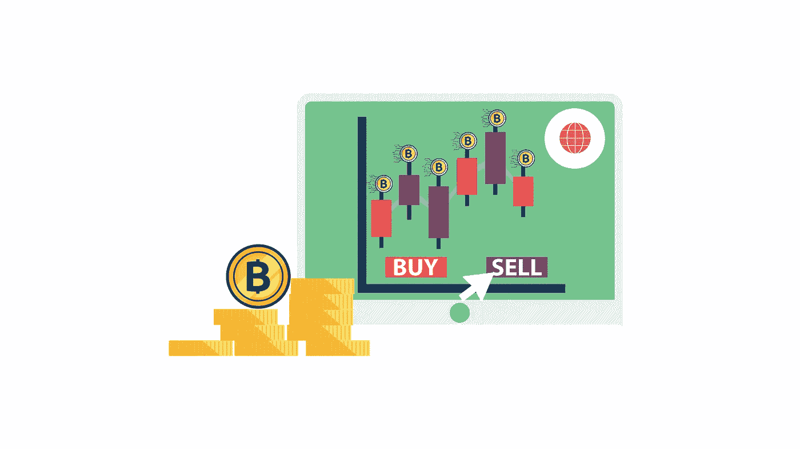
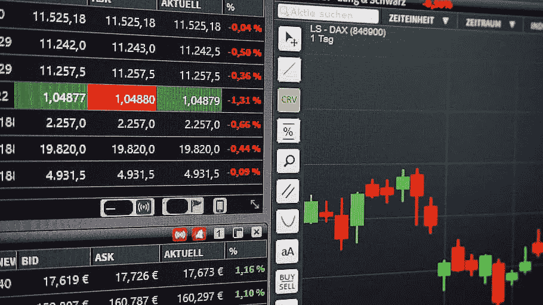
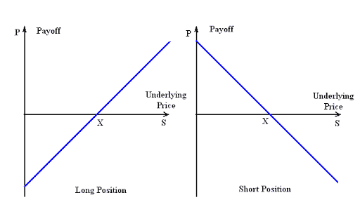
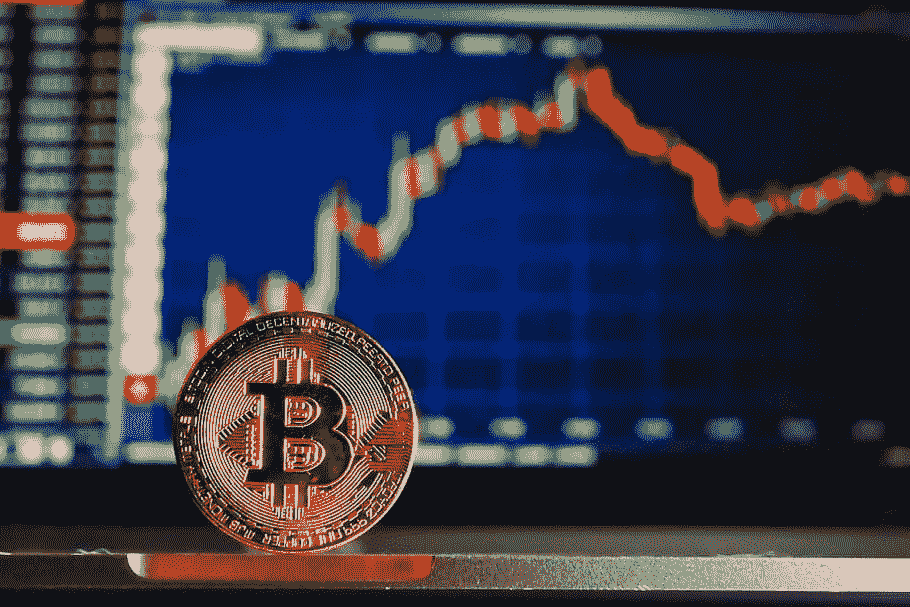
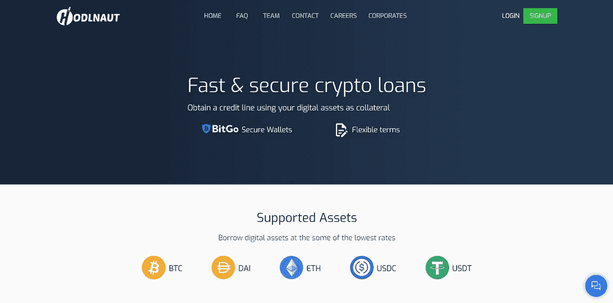

# 加密货币保证金交易最简单指南

> 原文：<https://medium.com/coinmonks/the-most-simple-guide-to-cryptocurrency-margin-trading-69f7fafb1960?source=collection_archive---------0----------------------->

在金融领域，保证金交易利用从经纪人那里借来的钱来交易一种金融资产，这种金融资产构成了经纪人贷款的抵押品。保证金是从经纪公司借入的资金，用于购买一种投资。融资买入指的是用从经纪人那里借来的钱购买证券。从本质上说，保证金交易是一种通过增加交易风险来增加利润的方式。保证金交易是有风险的，因为它们会给你的投资组合带来损失或成功。

## **加密保证金交易讲解**

由于加密货币的波动性，加密市场的保证金交易比常规交易风险更高。与传统金融中的保证金交易类似，加密货币保证金交易可以通过为您的交易增加更多风险来实现更高的潜在利润。你可以从第三方借入资金，在这种情况下，第三方是经纪商或其他平台，也称为保证金贷款机构。

加密保证金交易者需要更加谨慎，尤其是那些交易或加密货币的新手。如果你事先了解对冲和风险管理策略，你可能会更快地解决这个问题。即使你有识别市场趋势和图表的丰富知识，知道进场点和出场点仍然不能消除保证金交易的风险。不管怎样，加密保证金交易确实给交易者带来了新的机会。让我们看看它是如何工作的。

## **它是如何工作的？**

理解加密保证金交易的工作原理是非常困难的。重申一下，我们知道它允许交易者借入资金，以获得更大的购买力，并开立比他们现有账户余额更大的头寸。一个交易者给交易平台一些资本，换取另一类资本与之交易，并从中获利。

从根本上说，这很简单；交易者必须提供初始存款才能开仓；这就是我们所说的初始边际。交易员必须在账户中持有一定数量的资金来维持头寸。在加密货币交易所或 [**借贷平台**](https://app.hodlnaut.com/signup?r=ZGmxQQFoe) ，你存入的资金金额由平台作为抵押品持有。你能够用于保证金交易的金额取决于你交易的平台和初始存款的规定。

## **什么是多头和空头？**

你听说过未平仓合约，但具体是什么呢？通常，在加密保证金交易中，你会发现两种选择:做空或做多。在多头头寸中，交易者预期加密资产的价格将会上涨。做空则相反，如果交易者认为所述加密资产的价格会下降，他们就会建立一个空头头寸——那些做空的交易者通常是寻求从失败的加密资产中获利的交易者。

Source: [Investor Software](http://www.investorsoftware.net/InvestorPrimer/Derivatives.html)

当进行保证金交易时，你交易的交易所将持有你的初始存款作为抵押品。如果您成功平仓获利，交易所将释放您存放的密码和利润；同样，如果你在保证金交易中出现亏损，交易所将会清算你的头寸并结束你的交易。

## **加密货币保证金交易的利弊**

简而言之，加密货币的保证金交易可以带来更丰厚的利润，分散您的头寸，获得更多资金，并让您学习交易策略。由于交易头寸的相对价值更大，利润可能更大。此外，保证金交易有利于分散投资，因为交易者可以用少量的投资资本建立几个头寸。

然而，加密保证金交易的直接缺点是风险较高，损失巨大，而且非常不稳定。与常规交易不同，保证金交易可能导致超过交易者初始投资的损失；市场价格即使小幅下跌也可能造成重大损失。

# 加密保证金交易技巧

在传统金融界，保证金交易被认为是一种高风险的投资策略，不应该被缺乏经验的投资者干预。根据您交易的交易所，有几个技巧或策略可以考虑，例如:

*   *从小处着手，逐步增加。*这是一个安全的赌注，尤其是如果你是保证金交易的新手。总是建议从较小的仓位和较低的抵押品开始。
*   *设定你的目标。*制定清晰的盈利战略并遵循计划至关重要。有一个退出目标和止损水平，也就是说，你的资产价格达到一定水平。
*   *查看费用和利息。支持保证金交易的加密交易所不会免费这么做。当你建立杠杆头寸时，你借入的资金将会产生利息以及其他费用。*
*   *不要忽视外部因素。可能会有监管变化、重大的加密钱包变动，甚至是交易所黑客攻击，这些都可能会产生意想不到的价格变化。*

# 加密保证金交易交易所

不一定要在杠杆最高的平台上交易。在选择交易所进行保证金交易之前，你还应该考虑其他因素，比如利率有多高。Bitmex 是一个受欢迎的交易所，它提供高达 100 倍的杠杆，同时提供从每年 3.65%到每天 0.01%的不同利率，这使它成为短期头寸的理想选择。

CEX.io 允许加密保证金交易和固定存款，这样你可以通过电汇或使用信用卡支付从账户中提款。其他受欢迎的交易所包括 PrimeXBT、BaseFEX 和 ByBit。

> 另外，阅读我们的 [FTX 密码交易所评论](/coinmonks/ftx-crypto-exchange-review-53664ac1198f)

## **从加密贷款中获得资金**

如果你是一个交易者，并在寻找更多的资金来源，一个值得考虑的选择是加密贷款。许多加密借贷平台如 [**Hodlnaut**](https://www.hodlnaut.com/corporates?r=ZGmxQQFoe) 、 [BlockFi](https://blog.coincodecap.com/go/blockfi) 或 Celsius Network 允许交易者借入资产进行套利或保证金交易。这些平台通常有定制的条款和灵活的贷款价值。像往常一样，在贷款前阅读细则。再说一次，没有经验的交易者可能需要在保证金交易前三思。

总而言之，尽管存在风险，加密保证金交易对于交易者、个人投资者和加密爱好者来说是一个迷人的途径，有助于盈利和投资组合多样化。

***作者简介:*** *斯登冲锋枪·伊万是* [*霍德瑙特*](https://www.hodlnaut.com/) *的增长主管，这是一家总部位于新加坡的金融科技初创公司，让用户能够从他们的加密资产中获得有利的利率。*

> 加入 Coinmonks [电报频道](https://t.me/coincodecap)和 [Youtube 频道](https://www.youtube.com/c/coinmonks/videos)获取每日[加密新闻](http://coincodecap.com/)

## 另外，阅读

*   [复制交易](/coinmonks/top-10-crypto-copy-trading-platforms-for-beginners-d0c37c7d698c) | [加密税务软件](/coinmonks/crypto-tax-software-ed4b4810e338)
*   [电网交易](https://coincodecap.com/grid-trading) | [加密硬件钱包](/coinmonks/the-best-cryptocurrency-hardware-wallets-of-2020-e28b1c124069)
*   [密码电报信号](http://Top 4 Telegram Channels for Crypto Traders) | [密码交易机器人](/coinmonks/crypto-trading-bot-c2ffce8acb2a)
*   [购买比特币印度](/coinmonks/buy-bitcoin-in-india-feb50ddfef94) | [Pionex 评论](/coinmonks/pionex-review-exchange-with-crypto-trading-bot-1e459d0191ea) | [加密交易机器人](/coinmonks/crypto-trading-bot-c2ffce8acb2a)
*   [印度的加密交易所](/coinmonks/bitcoin-exchange-in-india-7f1fe79715c9) | [比特币储蓄账户](/coinmonks/bitcoin-savings-account-e65b13f92451)
*   [Cloudbet 赌场评论](https://coincodecap.com/cloudbet-casino-review) | [点火赌场评论](https://coincodecap.com/ignition-casino-review)
*   [币安收费](/coinmonks/binance-fees-8588ec17965) | [僵尸加密审查](/coinmonks/botcrypto-review-2021-build-your-own-trading-bot-coincodecap-6b8332d736c7) | [热点审查](/coinmonks/hotbit-review-cd5bec41dafb)
*   [my constant Review](https://coincodecap.com/myconstant-review)|[8 款最佳摇摆交易机器人](https://coincodecap.com/best-swing-trading-bots)
*   [最佳加密交易所](/coinmonks/crypto-exchange-dd2f9d6f3769) | [印度最佳加密交易所](/coinmonks/bitcoin-exchange-in-india-7f1fe79715c9)
*   [面向开发人员的最佳加密 API](/coinmonks/best-crypto-apis-for-developers-5efe3a597a9f)
*   最佳[密码借贷平台](/coinmonks/top-5-crypto-lending-platforms-in-2020-that-you-need-to-know-a1b675cec3fa)
*   [杠杆代币](/coinmonks/leveraged-token-3f5257808b22)终极指南