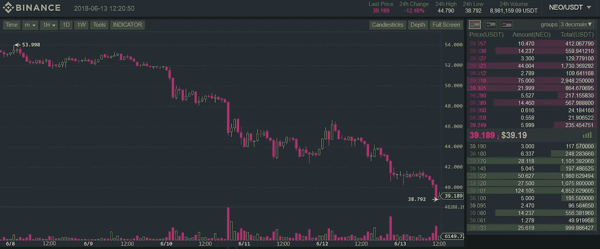
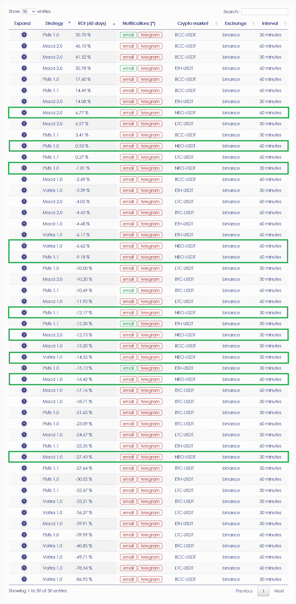
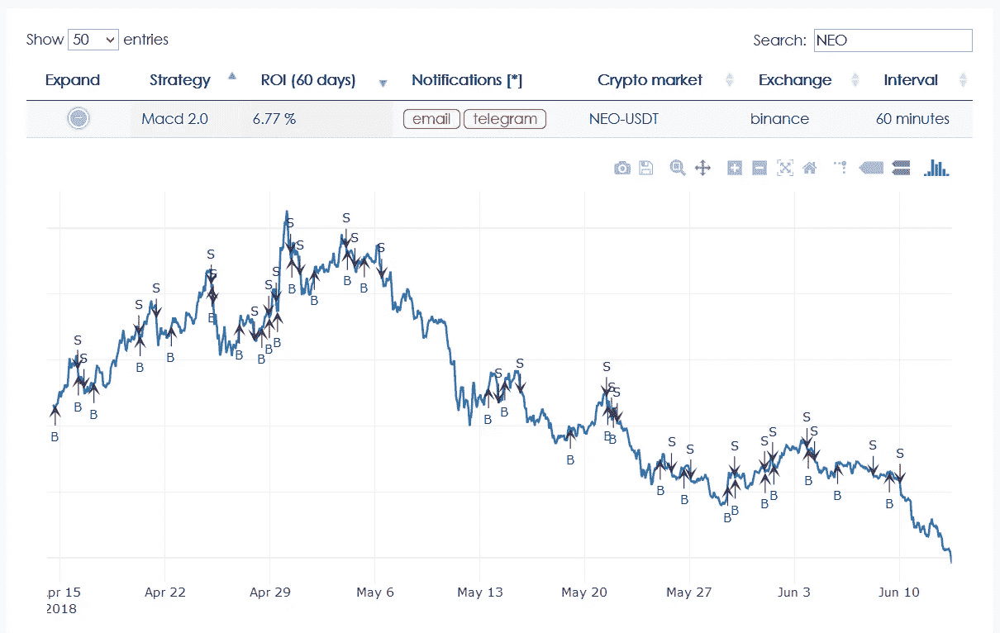
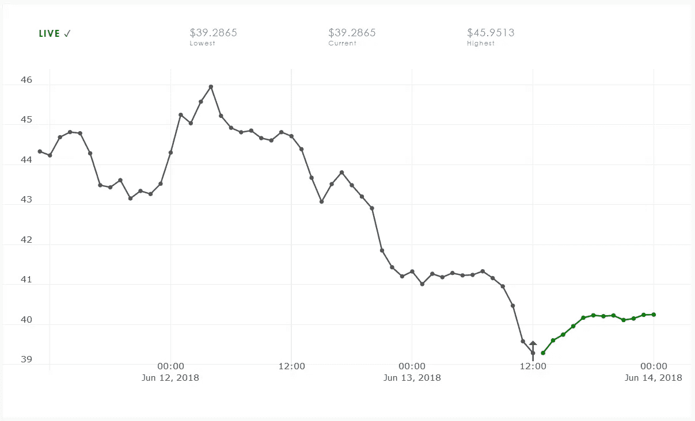

# CryptoPredicted 上的新 USDT 对

> 原文：<https://medium.com/coinmonks/the-neo-usdt-pair-on-cryptopredicted-7c3e8ef0fac9?source=collection_archive---------4----------------------->

在过去的一周里，密码市场一直处于自由落体状态。据称，这是因为一个加密交易所遭到黑客攻击，数千枚比特币被出售。由于比特币对所有其他加密货币都有重大影响，因此这些货币在几个小时内就会受到影响并贬值。

但是我们也有一些好消息。今天我们把新 USDT 对加入了 CryptoPredicted。NEO 现在可用于预测，并与我们所有的交易策略相结合。

NEO/USDT on Binance

在接下来的两节中，我们将从算法交易策略和预测的角度分析 NEO 的表现。

# 贸易信号

一些用户问我们的交易信号是空头还是多头。答案是都是多头，因为不是所有的交易所都允许交易空头。多头更直观，经验不足的交易者也更容易做多。

在下面的截图中，您将看到截至 2018 年 6 月 13 日(CEST 时间 12:30)我们所有的交易策略及其各自的投资回报率。由于过去几天的熊市，投资回报率下降了 20%以上。但更重要的是，我用绿色矩形标出了所有新 USDT 的作品。这使我们能够正确看待新货币，并将其与其他货币进行比较。

我们了解到，就结合我们的交易策略的盈利能力而言，NEO 在某种程度上与 LTC 或 ETH 属于同一类别。但它的表现略好于 BTC，这是好消息。但是与其他硬币相比，BCC(又名 BCH)仍然遥遥领先。

例如，Macd 2.0(60 分钟)策略给 NEO 带来了最高的回报。如上图所示，大多数买入信号都非常稳定，位置也很好。但熊市让盈利变得更加困难，这再次导致投资回报率相当低。

# 价格预测

价格预测被很好地整合并完美地工作，使用 10 分钟和 60 分钟的时间间隔。

NEO-USDT predictions at 60minute intervals

# 结论

很高兴看到 NEO 将如何在牛市条件下执行我们的交易策略。我们得等一等再做分析。总的来说，NEO 相当稳定，在投资回报率方面落后于 LTC 和 ETH，因此它绝对是一枚值得交易的硬币。

如果你想继续收听下一集，请务必订阅。如果你喜欢我们的工作，那么请免费试用 CryptoPredicted 你可以在我们的个人资料描述中找到链接。

祝您愉快！
——伊利亚·内沃林