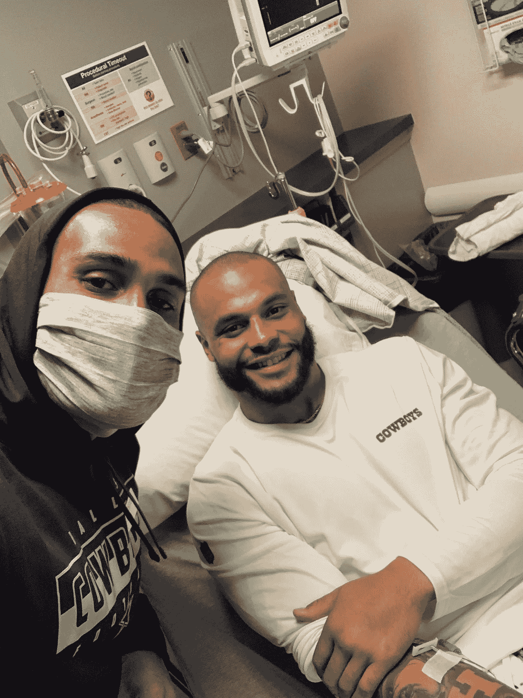
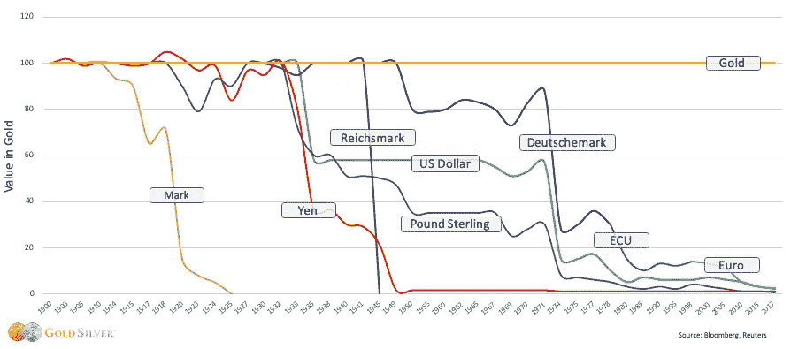
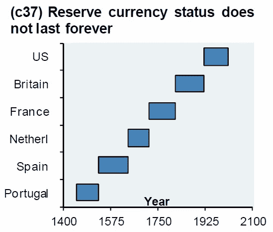
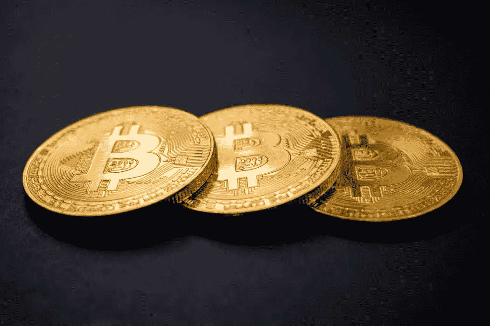
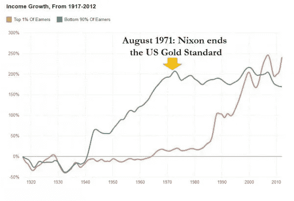

# 投资的新时代(第一部分，共四部分)

> 原文：<https://medium.com/coinmonks/the-new-age-of-investing-part-1-of-4-6d8247fc37b?source=collection_archive---------3----------------------->

“NYC is not a city, it’s a world!” by [Saketh Garuda](https://unsplash.com/@sakethgaruda) on [Unsplash](https://unsplash.com/photos/SHY-CKpYjrE)

对一个渴望财富的 18 岁年轻人来说，最好的建议是:忽略外面的噪音，把注意力放在内心。

这是事实，原因有很多:

首先，在你赚到钱之前，你不可能投资股票/债券/房地产市场、罗斯个人退休帐户或密码。

其次，你能够投资的金额在很大程度上取决于你能够赚多少钱。忽视自己的赚钱能力是本末倒置。在其他条件相同的情况下，一个月挣 5000 美元的人比一个月只挣 3000 美元的人有能力投资更多的钱。

第三，你越年轻，就越容易获得新技能。“窗口”永远不会永远关闭——让我们弄清楚这一点。然而，人类的大脑直到 25 岁才完全发育，而且年龄越小，承担的责任越少。在一场看谁能更快学会如何编程的比赛中，我会把钱押在 18 岁刚从高中毕业的年轻人身上，而不是 35 岁的单身母亲身上。

第四，通过投资于自己，你正在消除交易对手的风险。也就是说，你把自己当成了你想要配置资本的资产。因此，你不必担心一家公司的股票价格暴跌，一笔贷款无法偿还给你等等。

这个清单可以一直列下去…

在所有人当中，沃伦·巴菲特(Warren Buffet)——这位靠投资过着富裕生活的人——总结得最好:

> *“投资自己是你能做的最好的事情。如果你有天赋，没人能从你身上夺走。”*

我倾向于同意巴菲特先生的观点。

在一个完全正常的世界里，我的投资理念会像香草一样简单，比紧身衣更安全:

*首先投资于我自己的赚钱能力。用现金(不是抵押贷款)买房，这样我就有地方睡觉了。尽可能多地为自己投保。拥有大量现金余额，以对冲未来的不确定性和机遇。拥有一些金银，但不要太多。将留存收益重新投资到我最能掌控的领域——我的业务。每月将平均美元成本纳入标准普尔 500 指数，只考虑可以亏损的部分，这样我就可以在动荡时期不去管投资，让它做自己最擅长的事情:随着时间的推移增值。*

我是一个非常厌恶风险的人。仅仅是看着我曾经努力过的一切付诸东流的可能性就让我感到恶心。因此，我给晚上能睡得着觉贴上了相当高的价格标签。

*然而。*

我暂时完全放弃了那篇论文。

有两个主要原因:

1-我们并不是生活在一个完全正常的世界——尤其是现在。矛盾的是，这个不正常的世界实际上是正常的。不完全正常的部分是我们对异常的反应。

(稍后我会谈到这一点)

当面临千年一遇的投资机会时，传统智慧应该被抛弃。

(我也会谈到这一点)

# 1-世界正常；我们对此的反应不是

自 2007 年金融危机以来，我们一直在进行一场货币实验。这也不是一个新颖的实验。事实上，在整个历史过程中，许多经济体都尝试过这种方法，但结果都非常糟糕。

每一个。单身。时间。

成为第一个比以前更好——甚至和以前一样——的国家将是我们国家克服的最大挑战之一。

可能吗？

*地狱是的。我绝不会赌美国输。*

有可能吗？

*不，历史支持这种说法。*

让我先用一个简单的类比来解释一下我们的现状:

Photo of Dak Prescott by [Fox 4 News Dallas — Fort Worth](https://www.fox4news.com/sports/cowboys-qb-dak-prescott-recovering-after-ankle-surgery-sunday-night)

这是一张微笑的达克·普雷斯科特的照片，他在本赛季早些时候的一场足球比赛中遭受了可怕的脚踝受伤，正在等待手术开始，他吃了很多止痛药。简而言之，有骨头从他的皮肤里伸出来。

我将把达克·普雷斯科特(就在拍摄这张照片的那一刻)和自 2007 年金融危机以来的美国经济进行比较:

从某种意义上说，美国经济就像达克·普雷斯科特，医生可以用吗啡麻木他的疼痛。但是，如果他们因为药物似乎总是让他脸上露出笑容而忽视了适当的治疗(即手术)，那么他的伤口感染的可能性就会增加，他的一部分腿需要截肢，最终死亡的可能性也会增加。

*同样，美联储有权力向经济中注入吗啡(即现金)，以麻痹痛苦(即防止衰退、拯救华尔街等)。但如果他们忽视适当的处理(即让不盈利的企业倒闭，为新树的生长腾出空间)足够长的时间，历史告诉我们，经济体的货币将在这个过程中大幅贬值。*

正如瘾君子需要更多的药物才能达到以前的高度，经济也需要比以前更多的刺激才能维持下去。

或者，正如坎耶·韦斯特曾经说过的:

> *“我们的计划是喝酒直到疼痛消失——但更糟糕的是，疼痛还是宿醉？”*

以下是该计划目前在全球主要法定货币中的实施情况:

Photo of fiat debasement by Bloomberg, Reuters

如你所见，所有这些主要货币——美元、日元、英镑、欧元等——过去都是与黄金挂钩的。但每当他们取消盯住美元的政策，允许央行增加货币供应量时，货币供应量最终会趋向于零。

这通常也会对全球储备货币产生不利影响。自 1450 年以来，这种情况每次都是这样发生的:

Photo by [Azizonomics](https://azizonomics.com/)

葡萄牙。西班牙。荷兰。法国。英国…

美国会是下一个目标吗？怀孕会不会太疯狂了？

不管喜欢与否，这是我们一直努力的方向。再说一次，我绝不会赌美国输，但自 2007 年以来，我们的吗啡注射量增加了很多，尤其是在过去两年:

*   从 2008 年到 2014 年，美联储经历了 QE 1 到 3，在七年内有效地“印刷”了 4 万亿美元。
*   2018 年末，美联储决定加息。这是他们为了确保经济增长的可持续性和防止通货膨胀而做的事情。通常它预示着衰退即将来临，这是债务周期中的一个必要阶段。然而，在 2019 年初，他们很快决定改变方针。这是一个指标，表明我们将继续增加我们的债务负担，这只是另一种说法，即我们正在进一步拖延时间。因此，下一次宿醉(即衰退)将会更加痛苦。
*   自 2010 年以来，股票回购——大公司和银行从事的一种见不得人的商业行为——已经积累了 5000 亿美元。股票回购就像反向分红——这是首席执行官以股东为代价让自己变得更富有的方式。不幸的是，2020 年的第一个刺激计划再次拯救了这些企业。
*   2019 年 9 月，我们看到回购市场出现了一些奇怪的活动。基本上，银行间隔夜拆借利率大幅飙升。美联储非常担心，他们注入了 2780 亿美元，以便银行能够满足他们的需求。这是自 2007 年金融危机以来，他们第一次这样做…
*   在 2019 年的后几个月，我们不断听到首席执行官辞职的消息。
*   最后，2020 年 2 月，美国经济正式进入衰退。这都要归功于“伟大的加速器”新冠肺炎这结束了自 1854 年以来美国历史上最长的经济扩张。

显然，在疫情摧毁一切之前，美国经济已经出现了重大裂缝。然后，美联储出台了一项空前庞大的刺激计划。美联储现在创造了以前不存在的 7 万亿美元。最终，我们将不得不偿还他们。

但是请记住这一点:

*减少随机性/波动性(想想吗啡和印钞机)会让整个系统(经济)更加脆弱。*

幸运的是，我们有解决这种疯狂的方法。

Photo by [Dmitri Demidko](https://unsplash.com/@wildbook) on [Unsplash](https://unsplash.com/photos/OG3A-ilG8AY)

# 2-千年投资机会

正如沃伦·巴菲特所说，一生的投资机会在于你自己和你自己的才能。

但是当一个*千禧年*的投资机会落在我们头上时，什么应该优先？

换句话说，哪一种更有生命力:全球平均寿命 72.6 岁，还是未来 1000 年仍能使用的储蓄技术？

在这个世界上，许多居民正遭受着过度富足的痛苦:

*   肥胖源于吃了太多的食物
*   源于高度全球化和高度互联的世界的快速传播的感染
*   贪婪的中央计划者滥用对货币供应的控制，导致恶性通货膨胀

…稀缺和自给自足将是下一步。

在一个不确定性和担忧空前高涨的世界里:

*   *我的雇主会让我休假或解雇我吗？*
*   *下一个经济刺激计划何时发放？*
*   什么时候我们会有疫苗，什么时候我们能回到我们曾经知道的生活？

……拥有一种不会因普通公民将财富存入储蓄账户以备不时之需而受到通胀惩罚的货币，将是至关重要的。

在一个财富不平等比以往任何时候都更加普遍的世界里，政府官僚们仍然对富人指指点点，而不是对他们自己如此不负责任地印刷和消费竖起大拇指。让我简单解释一下:

*税率是根据时间快照确定的；它们不是财富的准确表现。想象一下，你是一个小企业主，已经为收支平衡奋斗了九年。突然，在第十年，你有了成功的一年——也许足以弥补几年在不断挣扎中度过的时光。然而，就在你以为自己获得了第一次重大突破的时候，税收抹去了你这么多年坚持下来的一大部分补偿。具有讽刺意味的是，在接下来的一年里，政府官员会因为一场疫情迫使你的企业关闭几个月，而他们却仍然可以领到薪水。*

与此同时，这些同样的官僚们正在拼命开动印钞机。新铸造的货币首先出现在金融机构和商业银行手中；因此，他们能够以相对较低的价格购买更多的商品、服务和资产。然后，随着新的资金沿着经济阶梯“流淌”,更多的人买入这些资产，买入“低价”资产的金融机构眼睁睁地看着自己的投资升值。与此同时，社会中最贫穷的人甚至在分到新馅饼之前就看着日常用品的价格上涨——他们买不起以前能买的那么多，因为有更多的美元在争夺同样数量的食品。所以一方面，富人越来越富；另一方面，穷人越来越穷。多亏了你的公共“仆人”指指点点，而不是拇指。

Photo by [Zero Hedge](https://www.zerohedge.com/news/2015-02-20/why-1-hates-gold-standard)

正如你所看到的，自从我们放弃金本位制，允许印钞机疯狂运转以来，美国收入最高的 1%的人吸走了收入最低的 90%的人的所有财富。

[比特币](https://blog.coincodecap.com/a-candid-explanation-of-bitcoin)有潜力解决这一切。

*   **它是分散的**——它不属于任何人，但每个人都可以参与其中
*   **它是不可改变的**——没有人能凭空创造出更多的钱，并肆意挥霍
*   它的供应最终是稀缺的——没有人能以牺牲你的利益为代价来扩大他们的“财富馅饼”份额
*   **它的供应量是事先知道的** —它重视透明度和验证，而不是“美国财政部的完全信任和信用”

…最重要的是，比特币让我们能够信任人民，而不是 12 个戴假发的白人老头。

看，1879 年美国最高法院决定明确将国家与教会分开；现在是我们用这笔钱做同样事情的时候了。

# 为什么我~几乎~信任比特币胜过信任自己

没有人——我是说没有人——比我自己更值得我信任。

没有人了解我，关心我，或者像我这样信任我。不这样想会让我质疑生活的目的。

也就是说，“人民”是第二位的——比起信任自己，我更信任他们。

自然为整体(即人)优化；而不是个人。

和其他系统一样，人类也因为同样的原因随着时间的推移而进化和适应:

*   每次飞机失事后，航空业变得更加安全…
*   肌肉在第一次受压、分解和恢复后生长…
*   我们已经从低智商的尼安德特人进化成了两足直立的智人，拥有对生拇指和比任何其他现存动物都大的大脑皮层…

随着时间的推移，我们也将从中央计划者的失败中吸取教训，并逐渐理解像比特币这样的健全货币能够让我们的集体理性为我们的集体利益做出比一小撮游说官僚更好的决定。

我们“人民”是日复一日冒着生命危险的人；我们是游戏中有皮肤的人。我们制定规则。我们进化了。

*由于比特币使人们能够使用，这很可能是我们第二好的投资机会。*

**感谢您的阅读——您可以关注我这里的** [**媒体**](https://peterdavig.medium.com/) **实时发布的《投资新时代》第二、三、四部分！**

我为小企业首席执行官创作书面内容，帮助他们了解需求性别和免费思想领导力。请在 [LinkedIn](https://www.linkedin.com/in/peter-davig-b80a90146/) 上联系我，了解更多信息。

## 另外，阅读

*   最好的[密码交易机器人](/coinmonks/crypto-trading-bot-c2ffce8acb2a)
*   [Deribit 审查](/coinmonks/deribit-review-options-fees-apis-and-testnet-2ca16c4bbdb2) |选项、费用、API 和 Testnet
*   [FTX 密码交易所评论](/coinmonks/ftx-crypto-exchange-review-53664ac1198f)
*   最好的比特币[硬件钱包](/coinmonks/the-best-cryptocurrency-hardware-wallets-of-2020-e28b1c124069?source=friends_link&sk=324dd9ff8556ab578d71e7ad7658ad7c)
*   [密码本交易平台](/coinmonks/top-10-crypto-copy-trading-platforms-for-beginners-d0c37c7d698c)
*   最好的[加密税务软件](/coinmonks/best-crypto-tax-tool-for-my-money-72d4b430816b)
*   [最佳加密交易平台](/coinmonks/the-best-crypto-trading-platforms-in-2020-the-definitive-guide-updated-c72f8b874555)
*   最佳[加密贷款平台](/coinmonks/top-5-crypto-lending-platforms-in-2020-that-you-need-to-know-a1b675cec3fa)
*   莱杰 vs 特雷佐
*   Bitsgap 评论——一个轻松赚钱的加密交易机器人
*   为专业人士设计的加密交易机器人
*   [PrimeXBT 审查](/coinmonks/primexbt-review-88e0815be858) |杠杆交易、费用和交易
*   HaasOnline 评论享受九折优惠
*   Bitmex 的[保证金交易的白痴指南](/coinmonks/the-idiots-guide-to-margin-trading-on-bitmex-dbbd7742c6fc?source=friends_link&sk=7bfa99d2a181142510c8442c8ddb0786)
*   [eToro 评论](/coinmonks/etoro-review-78807ddeb33c) |交易股票、密码、交易所交易基金、差价合约和商品
*   [Bitmex 高级保证金交易指南](/coinmonks/bitmex-advanced-margin-trading-guide-2270c195ce25?source=friends_link&sk=1d986cca731f5084b9a2db4a4bc4a7ad)
*   [面向开发人员的最佳加密 API](/coinmonks/best-crypto-apis-for-developers-5efe3a597a9f)
*   [加密套利](/coinmonks/crypto-arbitrage-guide-how-to-make-money-as-a-beginner-62bfe5c868f6)指南:新手如何赚钱
*   顶级[比特币节点](https://blog.coincodecap.com/bitcoin-node-solutions)提供商
*   最佳[加密制图工具](/coinmonks/what-are-the-best-charting-platforms-for-cryptocurrency-trading-85aade584d80)
*   了解比特币的[最佳书籍有哪些？](/coinmonks/what-are-the-best-books-to-learn-bitcoin-409aeb9aff4b)

> [直接在您的收件箱中获得最佳软件交易](https://coincodecap.com?utm_source=coinmonks)

