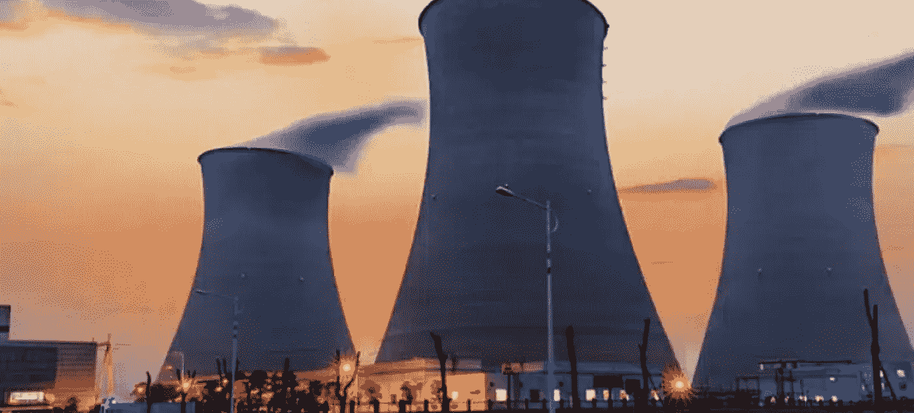
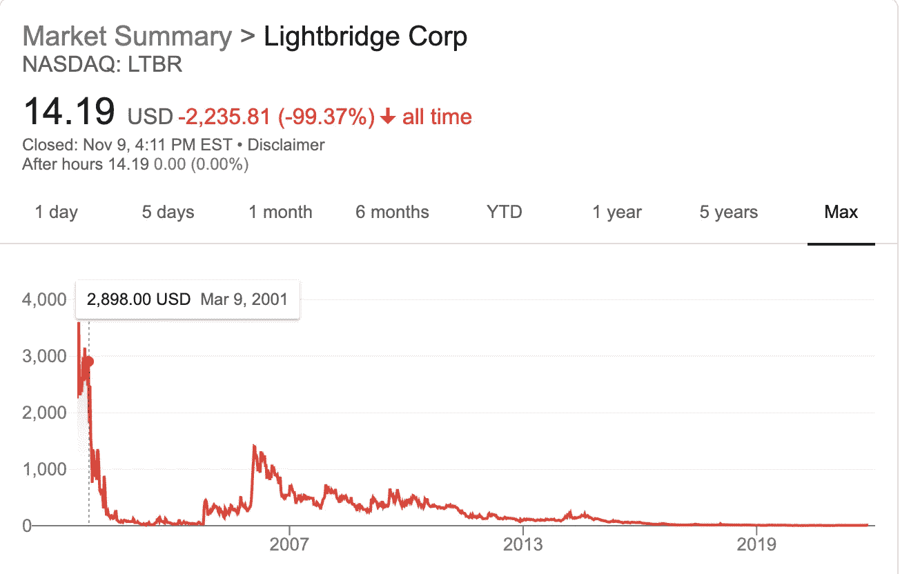
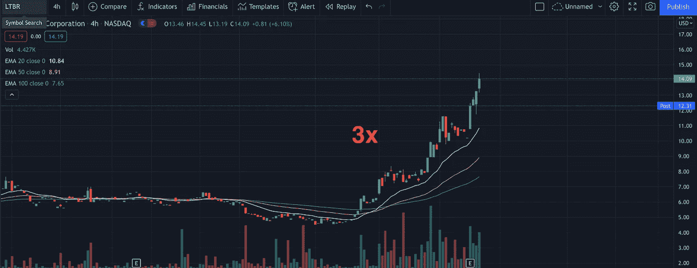

# 下一个十亿美元的投资，铀股票

> 原文：<https://medium.com/coinmonks/the-next-billion-dollar-investment-uranium-stocks-78d19bcc0341?source=collection_archive---------11----------------------->

天然气价格居高不下，煤炭似乎不可持续，太阳能又远远落后。当我们回顾可持续清洁能源的历史时，我们都想说核能，但所有的不幸都淹没了我们的大脑。

以下是对 [$LTBR](https://finance.yahoo.com/quote/LTBR/) 的看法，这是我们非常看好的股票之一，在几个月内已经获得了 3 倍的回报。不，这不是一枚上面有一只狗的加密硬币，而是你的亲铀能源公司。是的，这家公司在 21 世纪初的股价是 3000 美元！

事实是这样的。我们需要尽可能绿色的可持续能源，我们知道煤炭不是未来。现在我们知道核能在概念上是伟大的，并且已经被证实，但是整个问题是生产的稳定性，就像我们在日本看到的自然灾害。现在有几家能源公司，像 T2 光桥公司，LTBR T3，正在努力推进核能的生产。如果你是[马林·卡图萨](https://katusaresearch.com/)的粉丝，那么你会知道有一些伟大的思想家非常支持核能作为未来。

好吧，不要相信我的话，只要在谷歌上搜索一下，你就会发现，这是一个能源领域几位备受尊敬的头脑都在思考的话题。中国已经切断了几家工厂的电力供应，这正在推高我们在全球看到的已经很高的通货膨胀率。必须要有所让步，而这家伙正在全力买入铀股。你可以看看像$LTBR 这样的公司，或者只是投资像$URA 这样的 ETF，但不管你怎么看，我们都从这个疫情身上学到了，当我们撞到墙上时，我们学会了穿过去。能量也不例外，无论我们如何获取，我们都需要它。

> 加入 Coinmonks [电报频道](https://t.me/coincodecap)和 [Youtube 频道](https://www.youtube.com/c/coinmonks/videos)了解加密交易和投资

## 也阅读

 [## 最佳加密交易所| 2021 年十大加密货币交易所

### 编辑描述

blog.coincodecap.com](https://blog.coincodecap.com/crypto-exchange)  [## 2021 年 10 大最佳加密贷款平台| CoinCodeCap

### 编辑描述

blog.coincodecap.com](https://blog.coincodecap.com/crypto-lending)