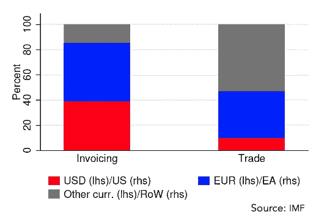
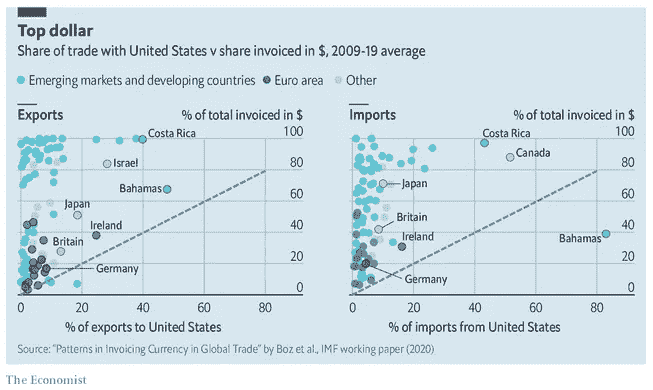
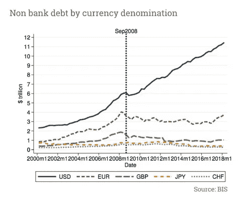
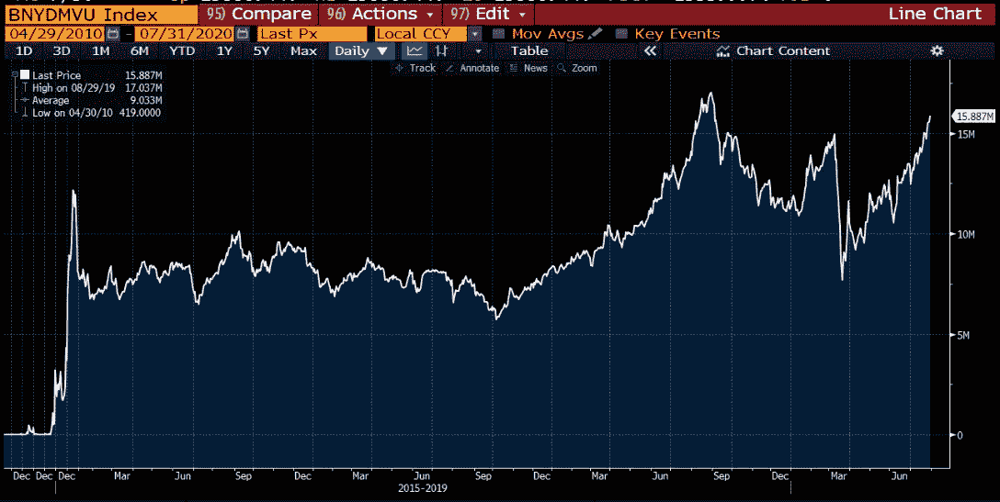
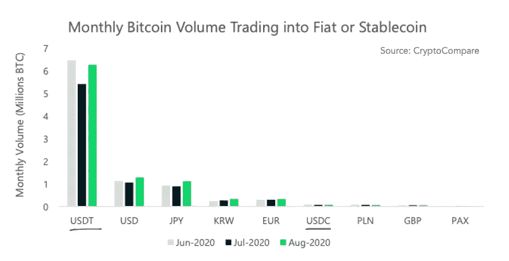
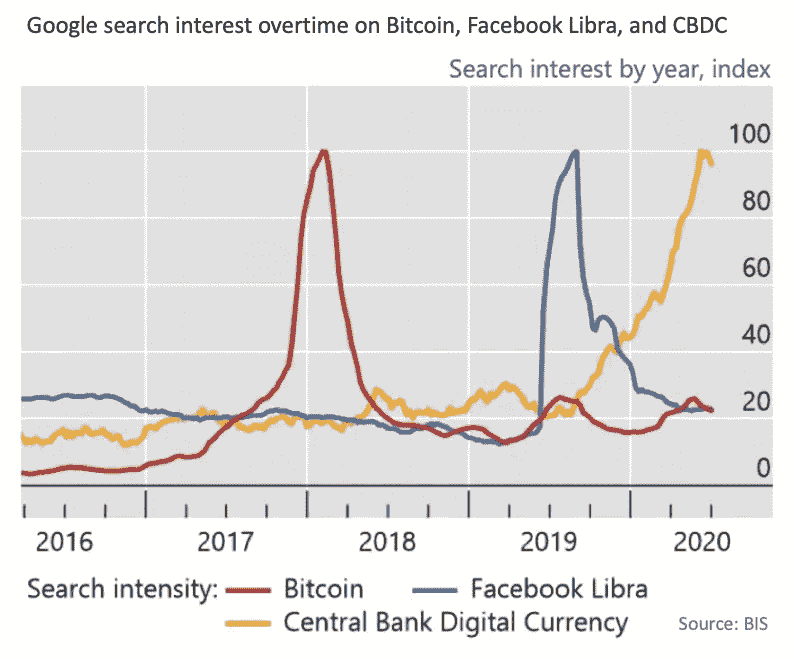

# 下一波加密浪潮

> 原文：<https://medium.com/coinmonks/the-next-crypto-wave-62d9e32d0167?source=collection_archive---------0----------------------->

## 稳定币的兴起及其进入美元市场

*本文分析了全球市场对美元的持续需求、稳定货币的崛起以及加密美元给加密货币和传统市场带来的效用和机遇的一些解释。*

*Source:* ***ERSINKISACIK/ISTOCK***

**自 1944 年布雷顿森林体系建立以来，美元在世界贸易中占据主导地位，毫无疑问是世界上需求最大的储备货币。如今，超过 61%的外国银行储备和全球近 40%的债务都是以美元计价的[1]。**

**然而，美元市场存在着严重的供需失衡。**在供应方面，自 2008 年全球金融危机以来，世界各国央行已经实施了十多年的宽松货币政策。新冠肺炎疫情进一步加剧了对央行提供必要流动性和保持经济运行的需求。虽然美联储领导了“印钞”和刺激计划的努力，但目前的货币供应仍然无法满足对美元的持续高需求[2]。让我们从几个经济基本面来回顾一下这种持续的美元需求的一些原因。

## **美元需求**

首先，世界上大多数贸易都是以美元结算的。国际货币基金组织(IMF)首席经济学家 Gita Gopinath 汇编的数据表明，美元在发票中所占份额是美国进口额份额的 4.7 倍，是其世界出口份额的 3.1 倍[3]。在大多数发展中国家，美元是主要的“计价货币”[4]。

**这种对美元的偏好也直接影响了全球债务。**根据国际清算银行的数据，全球以美元计价的债务超过了**67 万亿美元，到 2020 年，Q1 的海外借款将达到 12.5 万亿美元[5]。仅仅为了偿还这些美元债务，每年都有对美元的巨大需求。假设保守估计借贷成本为每年 1.5% (1 年期伦敦银行同业拆借利率+ 1%)，每年的美元购买需求轻松超过 1 万亿美元。**

****

**其次，与全球同行相比，美国经济更加强劲，**更高的投资回报吸引了世界各地对美元的需求，**投资于公开市场和私人市场的公司。美国拥有世界上最大的股票市场，公开市场资本总额超过 33 万亿美元(纽约证券交易所和纳斯达克的总和)[6]。对于私人市场，北美的总份额远远超过 6.5 万亿美元的全球资产管理的 60%，包括私募股权、实物资产和私人债务投资[7]。对高质量投资的需求也延伸到了固定收益市场。由于日本和瑞士等国家目前的收益率为负[8]，固定收益投资者对发达经济体收益率的追求导致他们回到美国债券市场。截至 2020 年 7 月，全球有价值 15 万亿美元的负收益率债务证券(见图表)。相比之下，在不确定的市场条件下，对于保守的投资者来说，积极的低收益美国债券仍然是一种稳健的固定收益策略。**

****

**Source: Bloomberg**

**最后但同样重要的是，**许多发展中经济体正在经历失败的货币政策，恶性通货膨胀已经成为真正的国家灾难。**一个经典的例子是委内瑞拉，随着通货膨胀率在 2019 年飙升至 10，000，000%，货币玻利瓦尔几乎变得一文不值[9]。最近黎巴嫩贝鲁特港口的爆炸导致了突然的经济崩溃，并加剧了其已经陷入困境的金融市场，通货膨胀率同比飙升至 112%以上[10]。对于生活在这些**不稳定地区的公民来说，唯一可靠的保值手段就是美元。**根据 Chainalysis 2020 年加密货币地理报告，委内瑞拉已经成为最活跃的加密货币交易国家之一[11]。对加密货币的需求激增，因为避险心态推动委内瑞拉人购买美元，以保护他们可能会失去的储蓄价值。这些地区加密货币活动的增长是由这些绝望的公民在获得实际比特币或其他底层加密资产的基础上，使用加密货币作为获取美元的途径来推动的。**

## ****加密美元的崛起****

**由于加密货币的高波动性，推出了 USD stablecoin，这是一种加密驱动的区块链令牌，其价值与美元挂钩，以在加密交易领域提供稳定的美元敞口。Tether 是同类产品中的第一个。它于 2014 年在比特币区块链(Omni layer protocol)上发行，令牌符号为 USDT，试图在加密交易者进出各种加密资产时为他们提供稳定的结算货币。创造 stablecoin 的原因是为了解决必须在传统银行系统和加密交换之间转移法定美元的低效和繁琐问题。因为一 USDT 理论上是由一美元支持的，所以交易者可以使用 USDT 进行交易并结算法定美元。直到 2017 年，大多数交易者似乎才意识到系绳的预期效用，并开始广泛使用它。截至 2019 年 4 月，USDT 的交易量开始超过比特币的交易量[12]，现在它以超过 500 亿美元的日均交易量主导着加密交易领域[13]。**

****

**USDT 的一个有趣的方面是，尽管声称的 1:1 美元抵押品支持受到质疑，并且 Tether 公司实际上通过松散的离岸公司结构运行部分储备， **Tether 的交易量和采用率继续快速增长** [14]。也许与没有任何东西支持的法定美元相比，Tether 在储备中仍然有现金等价物，密码交易员更喜欢其流动性和便利性，而不是其缺乏合法性。对于那些担心 Tether 偿付能力的人来说，他们现在可以购买信用违约掉期来进行下行保护[15]。另一方面，更顺从的竞争者 USDC 以 18 亿美元的硬币发行量远远落后于 USDT 的 145 亿美元(在出版时)位居第二。现在判断谁是 stablecoin 领域的最终领导者还为时过早，因为越来越多的 stable coin 正在推出各种功能和支持机制。稳定币有三大类:基于固定支持、加密抵押和非抵押算法的稳定币。其中大部分仍处于试验阶段，读者可以在这里了解更多关于它们的信息。随着 stablecoin 开发的不断创新，stable coin 在整个密码市场提供的效用将会更加明显。**

## ****机构发展****

**除了贸易结算，stablecoins 还可以应用于许多其他领域。跨境支付和汇款是一个低效的市场，急需创新。**2020 年全球汇款平均成本在 7%左右**【16】，结算需要天。世界银行的目标是到 2030 年将汇款费用降至 3%。**随着区块链技术的实施，这一成本可以进一步降低到接近于零。****

****美国最大的银行 J.P .摩根**已经创建了一个**银行间信息网络(IIN)与 416 家全球机构**通过它自己的 JPM 硬币，另一种加密美元【17】来改变支付流程的速度。尽管人们认为 JPM 硬币不被视为加密货币，因为它不能在公共区块链上公开交易，但它是迄今为止所有机构参与者在“许可”的区块链内交易的最大规模实验。在这种情况下，称之为使用分布式账本技术(DLT)而不是“区块链”可能更准确。然而，我们应该记住，由于 J.P. Morgan 目前每天转移 6 万亿美元[18]，如果成功，这一试验的规模将在国际支付和汇款市场产生相当大的影响。**有一天，受监管的加密交易所可能会成为 IIN 的参与者，公共和私有加密资产之间的链接可以立即连接，从而在区块链应用中释放出更大的可能性。****

**许多中央银行也在讨论开发他们自己的中央银行数字货币(CBDC)。虽然这个想法并不新鲜，但由于**脸书在 2019 年 6 月宣布了雄心勃勃的 Libra 项目**以及随之而来的公众关注，这一讨论被带到了前台。截至 2020 年 7 月，至少有 36 家央行发布了某种形式的 CBDC 框架。虽然每个国家的货币数字化计划背后的动机略有不同，从支付安全、交易效率、轻松的货币实施或金融包容性，但这些央行都致力于部署新的数字支付基础设施。当谈到技术架构时，BIS 的研究表明，当前大多数概念证明都倾向于基于分布式账本技术(区块链许可)[19]。**

****

****这些制度试验为改善全球支付基础设施奠定了重要基础，在这种基础上，可以以最低的成本进行即时、无摩擦的跨境结算**。当然，私人 DLT 代币和公共区块链稳定币的互操作性还有待探索，但公共和私人区块链努力的**创新最终可能会融合。**英国央行行长最近强调了这一点，他表示“苏格兰和 CBDC 可以并肩而坐[20]”。有一点可以肯定，加密美元(或其他与法定货币挂钩的数字货币)将在我们未来的经济中扮演重要角色。**

## ****未来机遇****

**在加密领域从来没有沉闷的时刻。随着创新的不断发展，行业叙事也在不断变化。自诞生 12 年以来，**比特币已经从一个抽象的学科发展成为一个熟悉的概念。它作为一种安全、稀缺、分散的数字价值储存手段的角色继续得到认可，它正在成为一种可投资的资产类别，作为对冲资产价格通胀和法定货币贬值的投资组合。Stablecoins 已经被证明是加密世界中有用的代理货币，就像传统世界中货币的重要性一样。stablecoins 或私人数字代币主宰跨境支付和全球汇款行业只是时间问题。****

**吸引新参与者进入加密空间的炒作和实验并不缺乏，例如智能合约、新区块链、ico、事物的令牌化或 DeFi 令牌的最新趋势。这些项目凸显了更强大的数字未来的可能性，但市场也需要时间来测试和适应。为了让这些实验蓬勃发展，必须首先建立一个可靠的数字支付基础设施。**

**在本文中，我们研究了美元在世界上占据主导地位的历史背景和经济原因，可能的结论是，随着全球经济放缓，对美元的需求可能会继续，特别是在全球疫情中。当前的货币体系远非完美，但至少在短期内没有更好的替代方案。公共部门和私营部门都在不断改进，稳定密码在传统和新的密码领域都将发挥一定的作用。**

**关于作者:克里斯蒂安·谢是加密金融服务平台 [Tokenomy](https://tokenomy.com) 的首席执行官**

**参考:**

**[1]美元如何成为世界储备货币， [Investopedia](https://www.investopedia.com/articles/forex-currencies/092316/how-us-dollar-became-worlds-reserve-currency.asp)**

**[2]美元需求旺盛，容易出现危险的升值，[《经济学家》](https://www.economist.com/finance-and-economics/2020/03/21/the-dollar-is-in-high-demand-prone-to-dangerous-appreciation)**

**[3]美元在贸易和金融中的主导地位，[吉塔·戈皮纳特](https://www.hoover.org/sites/default/files/research/docs/cochranepalermotaylor_currencies_ch2.pdf)**

**[4]全球贸易对美元的依赖，[《经济学家》](https://www.economist.com/schools-brief/2020/08/29/global-trades-dependence-on-dollars-lessens-its-benefits) & [国际货币基金组织工作报告](https://www.imf.org/en/Publications/WP/Issues/2020/07/17/Patterns-in-Invoicing-Currency-in-Global-Trade-49574)**

**[5]按面额货币分列的对非银行借款人的信贷总额，[之二](https://stats.bis.org/statx/srs/table/e2?m=USD)**

**[6]世界上最大的证券交易所，[商业内幕](https://markets.businessinsider.com/news/stocks/biggest-stock-exchanges-world-ranked-market-cap-nyse-nasdaq-trading-2020-6-1029325478)**

**[7]《麦肯锡 2020 年全球私人市场评论》，[麦肯锡&公司](https://www.mckinsey.com/~/media/McKinsey/Industries/Private%20Equity%20and%20Principal%20Investors/Our%20Insights/McKinseys%20Private%20Markets%20Annual%20Review/McKinsey-Global-Private-Markets-Review-2020-v4.pdf)**

**[8]各国央行当前利率，[全球利率](https://www.global-rates.com/en/interest-rates/central-banks/central-banks.aspx)**

**[9]委内瑞拉恶性通货膨胀率达到 1000 万，[美国消费者新闻与商业频道](https://www.cnbc.com/2019/08/02/venezuela-inflation-at-10-million-percent-its-time-for-shock-therapy.html)**

**[10]黎通货膨胀危机，[路透社](https://www.reuters.com/article/lebanon-crisis-inflation/lebanon-inflation-soars-above-100-year-on-year-in-july-idUSL8N2FS5TU)**

**[11]委内瑞拉加密货币市场，[chain analysis](https://blog.chainalysis.com/reports/venezuela-cryptocurrency-market-2020)**

**[12]使用最多的加密货币不是比特币，[彭博](https://www.bloomberg.com/news/articles/2019-10-01/tether-not-bitcoin-likely-the-world-s-most-used-cryptocurrency)**

**[13]所有加密资产的交易量，【coinmarketcap.com **

**[14]钉住美元不再可信，[福布斯](https://www.forbes.com/sites/francescoppola/2019/03/14/tethers-u-s-dollar-peg-is-no-longer-credible/#6efed970451b)**

**[15]新的加密衍生产品让你赌(或赌)系绳的偿付能力**

**[16]全球汇款价格，[世界银行](https://remittanceprices.worldbank.org/sites/default/files/rpw_report_june_2020.pdf)**

**[17]银行间信息网，[摩根大通](https://www.jpmorgan.com/solutions/treasury-services/payments-and-cross-currency-solutions/iin)**

**[18]杰米·戴蒙访谈，[哥伦比亚广播公司新闻](https://www.cbsnews.com/news/jamie-dimon-jp-morgan-chase-ceo-the-60-minutes-interview-2019-11-10/)**

**[19]央行数字货币的兴起， [BIS](https://www.bis.org/publ/work880.pdf)**

**[20]安德鲁·贝利的演讲，2020 年 9 月 3 日，[英格兰银行](https://www.bankofengland.co.uk/-/media/boe/files/speech/2020/reinventing-the-wheel-with-more-automation-speech-by-andrew-bailey.pdf)**

## **另外，阅读**

*   **最好的[密码交易机器人](/coinmonks/crypto-trading-bot-c2ffce8acb2a)**
*   **[密码本交易平台](/coinmonks/top-10-crypto-copy-trading-platforms-for-beginners-d0c37c7d698c)**
*   **最好的[加密税务软件](/coinmonks/best-crypto-tax-tool-for-my-money-72d4b430816b)**
*   **[最佳加密交易平台](/coinmonks/the-best-crypto-trading-platforms-in-2020-the-definitive-guide-updated-c72f8b874555)**
*   **最佳[加密借贷平台](/coinmonks/top-5-crypto-lending-platforms-in-2020-that-you-need-to-know-a1b675cec3fa)**
*   **[最佳区块链分析工具](https://bitquery.io/blog/best-blockchain-analysis-tools-and-software)**
*   **[加密套利](/coinmonks/crypto-arbitrage-guide-how-to-make-money-as-a-beginner-62bfe5c868f6)指南:新手如何赚钱**
*   **最佳[加密制图工具](/coinmonks/what-are-the-best-charting-platforms-for-cryptocurrency-trading-85aade584d80)**
*   **[莱杰 vs 特雷佐](/coinmonks/ledger-vs-trezor-best-hardware-wallet-to-secure-cryptocurrency-22c7a3fd391e)**
*   **了解比特币的[最佳书籍有哪些？](/coinmonks/what-are-the-best-books-to-learn-bitcoin-409aeb9aff4b)**
*   **[3 商业评论](/coinmonks/3commas-review-an-excellent-crypto-trading-bot-2020-1313a58bec92)**
*   **[AAX 交易所评论](/coinmonks/aax-exchange-review-2021-67c5ea09330c) |推荐代码、交易费用、利弊**
*   **[Deribit 审查](/coinmonks/deribit-review-options-fees-apis-and-testnet-2ca16c4bbdb2) |选项、费用、API 和 Testnet**
*   **[FTX 密码交易所评论](/coinmonks/ftx-crypto-exchange-review-53664ac1198f)**
*   **[n 零审核](/coinmonks/ngrave-zero-review-c465cf8307fc)**
*   **[Bybit 交换审查](/coinmonks/bybit-exchange-review-dbd570019b71)**
*   **[3Commas vs Cryptohopper](/coinmonks/cryptohopper-vs-3commas-vs-shrimpy-a2c16095b8fe)**
*   **最好的比特币[硬件钱包](/coinmonks/the-best-cryptocurrency-hardware-wallets-of-2020-e28b1c124069?source=friends_link&sk=324dd9ff8556ab578d71e7ad7658ad7c)**
*   **最佳 [monero 钱包](https://blog.coincodecap.com/best-monero-wallets)**
*   **[莱杰纳米 s vs x](https://blog.coincodecap.com/ledger-nano-s-vs-x)**
*   **[bits gap vs 3 commas vs quad ency](https://blog.coincodecap.com/bitsgap-3commas-quadency)**
*   **[莱杰纳米 S vs 特雷佐 one vs 特雷佐 T vs 莱杰纳米 X](https://blog.coincodecap.com/ledger-nano-s-vs-trezor-one-ledger-nano-x-trezor-t)**
*   **[block fi vs Celsius](/coinmonks/blockfi-vs-celsius-vs-hodlnaut-8a1cc8c26630)vs Hodlnaut**
*   **Bitsgap 评论——一个轻松赚钱的加密交易机器人**
*   **为专业人士设计的加密交易机器人**
*   **[PrimeXBT 审查](/coinmonks/primexbt-review-88e0815be858) |杠杆交易、费用和交易**
*   **[埃利帕尔泰坦评论](/coinmonks/ellipal-titan-review-85e9071dd029)**
*   **[赛克斯·斯通评论](https://blog.coincodecap.com/secux-stone-hardware-wallet-review)**
*   **[区块链评论](/coinmonks/blockfi-review-53096053c097) |从您的密码中赚取高达 8.6%的利息**