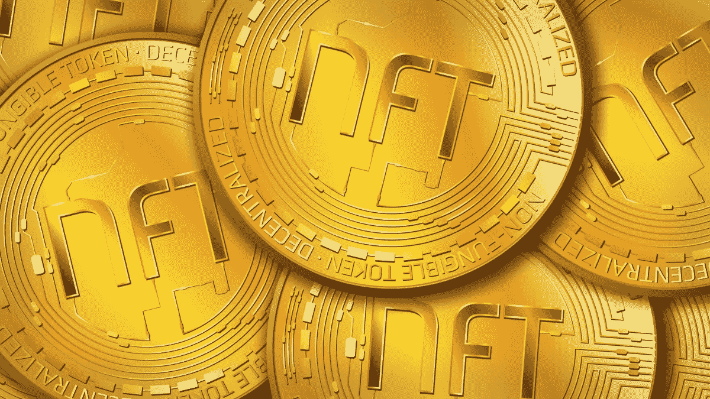
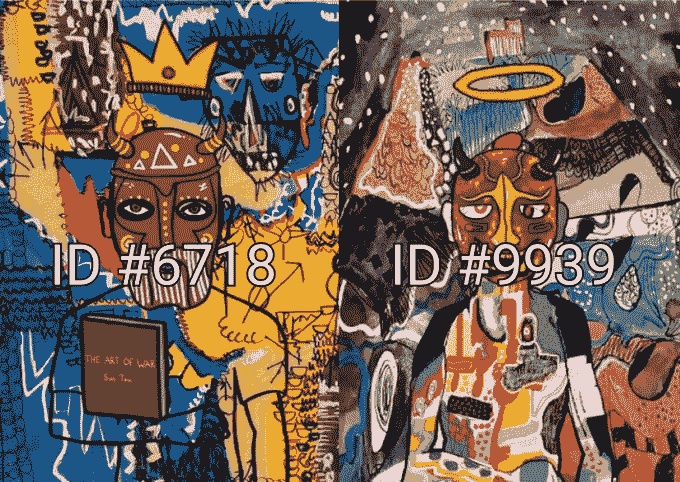
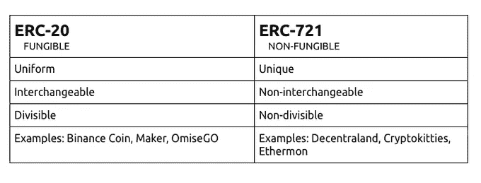
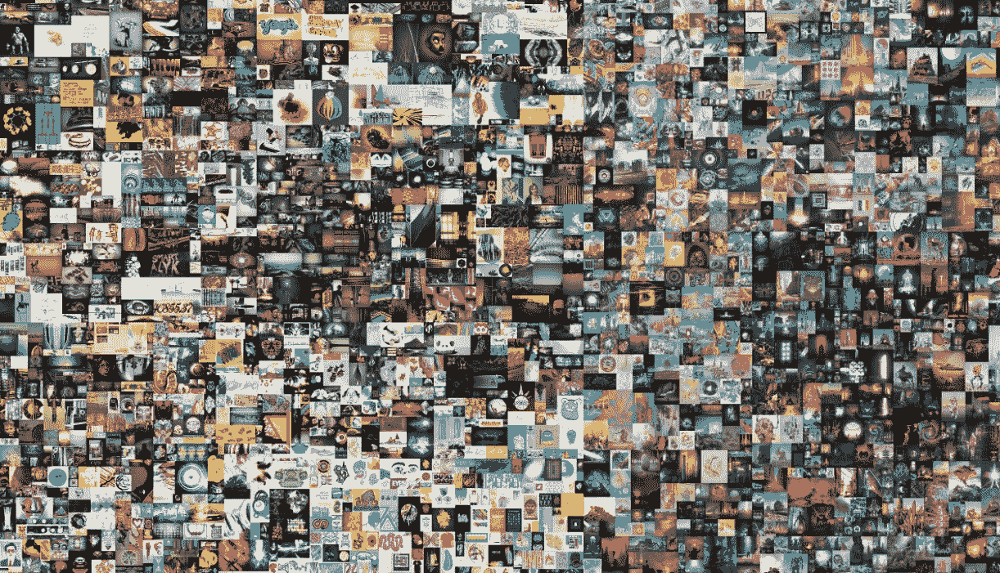
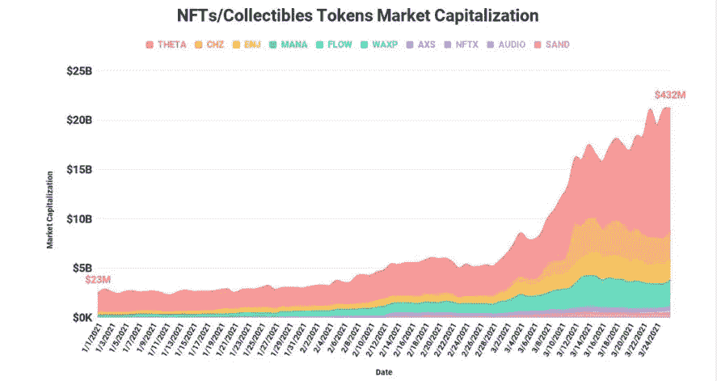

# NFT 密码指南速成班 101

> 原文：<https://medium.com/coinmonks/the-nft-crypto-guide-crash-course-101-5b30d39e0646?source=collection_archive---------2----------------------->

## 什么是不可替换令牌？

最简单形式的不可替换令牌是代表某种独特事物的加密令牌，不能被其他事物替代。一个 NFT 和另一个不一样，不像比特币，每一个聪都和另一个聪完全一样。

每个 NFT 在视觉上都是不同的，很容易验证，并且在区块链网络上有一个唯一的 ID 来区分它们。例如，一个 ID 为 6718 的 NFT 哈希表和一个 ID 为 9399 的哈希表完全不同。

他们是区块链以太坊[的一部分。虽然以太坊像比特币和 Doge 一样是一种加密资产，但它的区块链支持 NFT，存储额外的信息，使它们以不同的方式工作。它们可以在任何以太坊为基础的 NFT 市场上买卖。](https://ethereum.org/en/nft/)

不是 ERC-20 令牌，而是 ERC-721 或 ERC-1155 令牌。其他区块链，如 [Tezos](https://www.coindesk.com/mclaren-to-build-nft-platform-on-tezos) 和 [Flow](https://decrypt.co/resources/what-is-flow-dapper-labs) ，在 [CryptoKitties](https://decrypt.co/resources/cryptokitties) 和 [NBA TopShot](https://nbatopshot.com/) 之后，也可以实现他们的 NFTs 版本。

## **哦！我懂了。但是 NFT 有什么用呢？**

NFT 用于创建可验证的数字稀缺性和数字所有权。NFT 被制作成数字艺术品、收藏品、游戏、音乐、视频等等。它们旨在赋予所有者数字权利和其他人无法复制的独特的东西。虽然 NFT 是一件数字艺术品，人们可能不会直接挂在墙上，但它们无疑更容易向世界展示，让数百万人看到。

此外，这些作品中有一些是由知名的专业艺术家制作的，这使得它们更有价值。赝品很容易被识别出来，因为区块链会验证每一件作品。

例如，在游戏行业中，NFTs 可能是一种特殊的武器或角色，它具有比另一个 NFT 更好或更差的特定属性。

这有什么意义？

我告诉你，有些人愿意花一大笔钱买一些能给他们带来独特游戏体验的东西，不管是功能强大的东西还是化妆品。

***Everydays — The First 5000 Days* by Beeple (Image: Christie’s)**

根据 nonfungible.com 的数据，仅在 T2 的密码朋克游戏上就花费了超过 3 亿美元。著名的数字艺术家迈克·温克尔曼以“毕普”而为人所熟知，他出售他的“每一天；《前 5000 天》在佳士得[拍出破纪录的 6930 万美元](https://decrypt.co/60971/beeples-nft-artwork-sells-for-60-3-million-in-christies-auction)。此外，推特的首席执行官[杰克·多西的第一条推特](https://www.cnbc.com/2021/03/22/jack-dorsey-sells-his-first-tweet-ever-as-an-nft-for-over-2point9-million.html)被作为 NFT 以数百万美元的价格售出。

## 我对 2021 年的 NFT 有什么期待？

整个 NFT 的前景相当乐观，这只是 2021 年及以后预期的一小部分。近几个月来，NFT 的项目越来越受到关注。

越来越多的公司正在围绕 NFTs 开发引人注目的计划和项目。像出售 NBA 历史上难忘时刻的 NFT 的 NBA TopShot 这样的项目最近获得了很多关注，马克·库班是该平台的最新认证用户之一。还有一家名为 NIFTEX 的初创公司，它允许用户购买 NFT 的部分所有权，而不是一次性购买。

**Source:** Bitdealer

根据 Bitdealer 的数据，NFT 的总市值增加了 1，785%，目前 NFT 类别的代币总市值约为 20 亿美元。今年看到它超过目前的上限也就不足为奇了。

## 我在哪里可以买到 NFT？

像所有其他数字资产一样，非功能性桌面可以存储在兼容 NFT 的数字钱包中，而且有几个 NFT 市场可以购买。

● **Rarible** :一个开放的市场，允许艺术家和创作者买卖 NFT。

● **Opensea.io** :是一个点对点平台，用户可以在这里购买从视频游戏物品到数字艺术品的 NFT 原创收藏。

● **Nifty Gateway** :由一家流行的加密货币交易所 Gemini 所有。Nifty Gateway 是一个面向买家和卖家的 NFT 市场，也有一个二级市场，允许收藏家转售他们的艺术品。

与加密市场的其他部分相比，NFT 空间相对较小，但它正日益受到更多的关注，在 NFT 空间内工作的许多 NFT 和项目有着更光明的未来。事实上，我们还没有看到最好的 NFTs，但是现在只是 NFT 空间在未来几年将会有多大的一个片段。

> 加入 [Coinmonks 电报频道](https://t.me/coincodecap)，了解加密交易和投资

## 另外，阅读

*   [什么是保证金交易](https://blog.coincodecap.com/margin-trading) | [美元成本平均法](https://blog.coincodecap.com/dca)
*   [BigONE 交易所评论](/coinmonks/bigone-exchange-review-64705d85a1d4) | [电网交易机器人](https://blog.coincodecap.com/grid-trading)
*   [3 商业评论](/coinmonks/3commas-review-an-excellent-crypto-trading-bot-2020-1313a58bec92) | [Pionex 评论](/coinmonks/pionex-review-exchange-with-crypto-trading-bot-1e459d0191ea) | [Coinrule 评论](/coinmonks/coinrule-review-2021-a-beginner-friendly-crypto-trading-bot-daf0504848ba)
*   [莱杰 vs Ngrave](/coinmonks/ledger-vs-ngrave-zero-7e40f0c1d694) | [莱杰 nano s vs x](/coinmonks/ledger-nano-s-vs-x-battery-hardware-price-storage-59a6663fe3b0) | [币安评论](/coinmonks/binance-review-ee10d3bf3b6e)
*   [Bybit Exchange 审查](/coinmonks/bybit-exchange-review-dbd570019b71) | [Bityard 审查](/coinmonks/bityard-review-7d104239be35) | [CoinSpot 审查](https://blog.coincodecap.com/coinspot-review)
*   [3 commas vs crypto hopper](/coinmonks/3commas-vs-pionex-vs-cryptohopper-best-crypto-bot-6a98d2baa203)|[赚取加密利息](/coinmonks/earn-crypto-interest-b10b810fdda3)
*   最好的比特币[硬件钱包](/coinmonks/the-best-cryptocurrency-hardware-wallets-of-2020-e28b1c124069?source=friends_link&sk=324dd9ff8556ab578d71e7ad7658ad7c) | [BitBox02 回顾](/coinmonks/bitbox02-review-your-swiss-bitcoin-hardware-wallet-c36c88fff29)