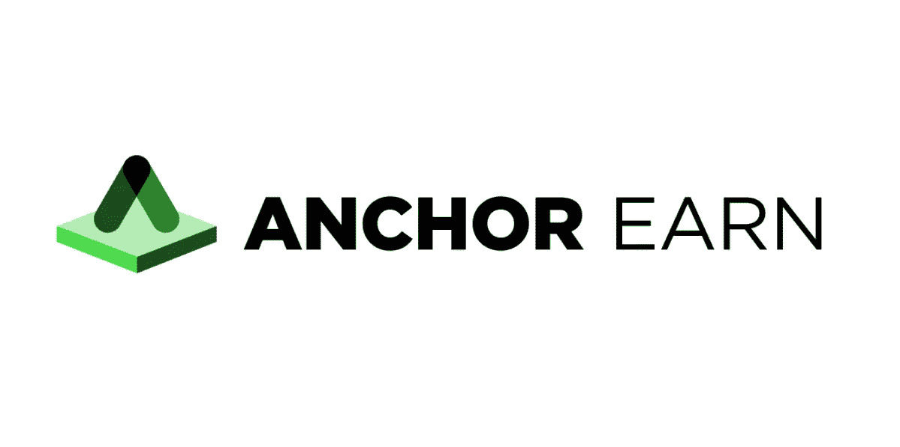

# 金融科技一站式实现 20% APY-主播赚 SDK

> 原文：<https://medium.com/coinmonks/the-one-stop-for-fintechs-to-achieve-20-apy-anchor-earn-sdk-be753363abfc?source=collection_archive---------2----------------------->

Anchor Earn

2021 年 5 月 12 日，Anchor Protocol 发布了 Anchor Earn SDK，使 FinTech 能够在其平台上利用 Anchor 稳定的 20% APY，即使不考虑他们的区块链。令人惊讶的是，FinTech 只用 7 行代码就能实现如此高的 APY！

这里涵盖的主题

*   什么是锚协议？