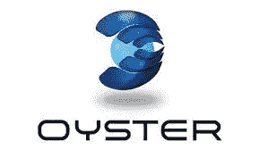

# 牡蛎珍珠崩溃和底层智能合同缺陷

> 原文：<https://medium.com/coinmonks/the-oyster-pearl-debacle-and-substratum-smart-contract-flaw-781da6073fde?source=collection_archive---------2----------------------->

鉴于最近的$PRL 情况，可以在 Substratum 的智能合同中发现另一个潜在缺陷，该合同允许凭空制造代币

# 牡蛎珍珠大溃败

2018 年 10 月 29 日，在 Oyster 协议上利用了传输导向器功能。这使得新主管基本上重新打开了牡蛎梨的 ICO，并以每 PRL 0.04 美元/1 ETH=5000 PRL 的价格获得和重新发行新的 PRL。在这样做之后，这个人向 Kucoin 发送了 300 多万个 PRL，并以大约 30 万美元的价格出售。

尽管通过了多项审计，但 Bruno Block(原始创始人)告诉 Oyster Pearl 团队，象征性合同的董事职位必须保持开放，以便随着时间的推移可以调整挂钩。这最终变成了智能合约中的暗门机制，并最终被利用。合同本身也是布鲁诺在牡蛎珍珠公司之前写的。Bruno 是唯一一个能够在 PRL smart 合同内转移董事职位的团队成员。

官方回应:[https://medium . com/oyster protocol/oyster-update-b 813390 ce 10 e](/oysterprotocol/oyster-update-b813390ce10e)

类似地，我们可以在底层中找到几乎相同的潜在智能合同缺陷。虽然它具有不同的功能目的，但两者都可能以同样的方式被滥用。让我们深入了解一下 Substratum 的智能合同缺陷，几个月来一直说它将被修复，但至今仍未修复。

Pictured: Substratum CEO & Co-Founder Justin C. Tabb

# 底层智能合同更新

在 2018 年 6 月 9 日通过 YouTube 发布的以下视频中，Justin Tabb 解决了 Substratum 智能合约的问题。

在视频中，他表示“下周我们将对智能合同进行一些更改”。他进一步说，“这不会影响你的交易，根本不会影响你，我们只是完全透明。”然后他说，“有两个函数，让我解释一下它们的原因。第一个是 mint token，它出现在这里的原因实际上是在我们最初的白皮书中，我们在开始时谈了很多，我们最初的想法是，如果我们在网络中的流动性很低，流动性低于 10%，在这种情况下，每个人都将持有而不释放他们的令牌。如果我们到了这一步，我们希望确保我们有一种基本的方法来添加令牌，以便网络可以继续运行”。

从 Tabby 冗长的回答中可以得到一些重要的信息。首先，您不能“更新”智能合约，您需要一个新合约，新合约之后会有一个令牌交换。Substratum 的智能合同地址也由 mint token 函数的一方执行，这个人就是 Justin Tabb。这个函数被执行的唯一方式是贾斯汀去做。根据 Justin 的说法，“它没有也永远不会被执行，我们将删除它”。四个月后，它有望在本世纪内被移除。我想我们只剩下“信任”贾斯汀了，就像人们信任布鲁诺一样…我们看到那里发生了什么。

此外，我们看到 Tabby 提到该功能在“原始白皮书”中。有 2 个底层白皮书。当您可以更新最初的 ICO 并删除第一个 ICO 时，为什么会有两个白皮书？

底层白皮书 2017 年 8 月 14 日

底层白皮书 2017 年 12 月

在第一份 ICO 白皮书中，没有一个地方提到团队凭空创造令牌的铸造功能和能力。然后，我们看到在 ICO 完成后制作的第二份白皮书，子团队决定在上面做一个免责声明。多么方便，我们看到一个前 ICO 白皮书和一个后 ICO 白皮书，方便地说:“哦，顺便说一句，我们可以凭空创造新的令牌”。

快进到一个有趣的点，他在视频中说，“然而，我们刚刚意识到我们不需要这个，所以我们有足够的流动性，没有理由有这个功能”。他们已经意识到，他们不仅在第一份关于造币功能的白皮书中没有免责声明，而且在 4 个月内也没有承认这一点。随着最近的牡蛎珍珠溃败，这是非常令人担忧的，它非常清楚地表明，这些类型的关注远远不是稀奇古怪的。除此之外，他们还保留了第二个功能，即智能合约中的冻结令牌功能。

# 币安公告

关于智能合约的这些发现和问题的官方声明来自 SUB 交易量最大的上市交易所，币安交易所占其交易总量的 98%。币安发现了这个缺陷，并就此联系了团队。事实上，如果币安没有对 Substratum 的智能合同进行彻底审查，这永远不会被公之于众。

 [## 分包合同中潜在问题的通知

### 同胞们，经过审查，Substratum (SUB)是唯一在币安上市的令牌，具有潜在的…

support.binance.com](https://support.binance.com/hc/en-us/articles/360004736611) 

这个声明本质上是一个彻头彻尾的谎言。Substratum NODE 甚至还没有实现盈利，那么他们如何知道自己是否有足够的流动性呢？尤其是当他们送出“6000 万艘潜艇”来为底层网络提供燃料的时候，这种网络至今仍然不存在。

在下面，该团队讨论了如何将潜艇从 6000 万潜艇中抽出来，专门用于为网络提供燃料。

然后，在通过 YouTube 接受 Young & Investing 采访时，塔比对智能合约唱反调。

这里有一些要点。

*   该团队仍然声称智能合同的问题在他们自己的审查中
*   冻结功能再次未被提及
*   这变成了现在“一个复杂而昂贵的过程”
*   “将改变更多的东西”这是一个给定的，如果你想把一个 dex，cryptopay，和自动分配，当你启动并运行一个底层节点。

# Substratum 智能合同的当前状态

无论如何，官方声明是“一周内”的智能合同更新。每个人似乎都认为这是发生了什么，因为没有其他公告。然而，鉴于最近的牡蛎珍珠事件，我们可以看到，这种担忧不仅在这个时候是相关的，而且远没有被 Substratumville 的永久居民视为“FUD”。

我们可以清楚地看到，在 Substratum 的智能合约的第 136 行中，合约的所有者可以免费铸造无限多的新令牌。

 [## 以太坊账户、地址和合同

### 以太坊区块链浏览器、API 和分析平台

etherscan.io](https://etherscan.io/address/0x12480e24eb5bec1a9d4369cab6a80cad3c0a377a#code) 

更有甚者，所有声称被烧毁或本世纪尚未销毁的代币仍在底层众筹钱包中。我不知道你是怎么想的，但这看起来就像是数百万的钱在团队的口袋里。

 [## 以太坊账户、地址和合同

### 以太坊区块链浏览器、API 和分析平台

etherscan.io](https://etherscan.io/address/0xd41d37f9865cc121f71957e6eafb09cbdc98d6c3#tokentxns) 

*此外，该团队在没有将底层令牌发送到零地址的情况下进行了令牌刻录。向此地址发送令牌是令牌烧录中的常见做法。Justin Tabb 对 token burn 的定义是创建一个新的 ETH 钱包，并向它发送 6000 万 SUB，然后说下面的话..“好吧，这是私钥，我没有写下来，所以我不知道它是什么”。

绝对了不起，这个视频值得奥斯卡奖。

如果这不是那么混乱的话，当人们要求澄清团队为什么这样做时，回答如下。

1.  “这不是一个安全问题，因为只有开发团队可以访问它”。有点问题，不是吗？他们甚至不应该在第一时间访问它，这基本上就像说只有牡蛎珍珠的布鲁诺可以做到这一点！我们看到了它是如何工作的…
2.  “反正区块链是公开的，所以你可以监控任何交易”。同样，最可信和最常见的做法是将烧毁的令牌发送到零地址。他们为什么不这样做是奇怪和可疑的。

所有这些都提醒任何聪明的观察者，我们使用区块链的原因是我们不应该相信任何人。然而在这里，我们相信泰比。

# 结论

该团队显然对智能合同的工作原理没有丝毫的了解。正如我前面提到的，没有智能合约“更新”这种东西，您需要一个新的合约，在新合约之后会有一个令牌交换。也绝对没有什么可以阻止他们铸造新的代币，并像牡蛎珍珠那样根据自己的判断在市场上出售。他们的合同可以像牡蛎珍珠一样被滥用。事实上，底层契约更容易被滥用，因为它不需要罪犯派人去收集新造的潜艇。

鉴于牡蛎珍珠的所有戏剧性事件，这些担忧远非稀奇古怪，需要在昨天得到解决。小心行事。

编辑:

智能合同上的趋势 Reddit 帖子

子智能合同的全面分析:

 [## 底层网络的技术红旗(SUB)

### 亲爱的读者们:

medium.com](/@YagamiLight/the-technical-red-flags-of-the-substratum-network-sub-1f34e8b5ffcb) 

***免责声明*** *:我不是财务顾问，也不建议根据文章内容买卖投机性加密资产。一如既往地尽职尽责。*

> [直接在您的收件箱中获得最佳软件交易](https://coincodecap.com/?utm_source=coinmonks)

