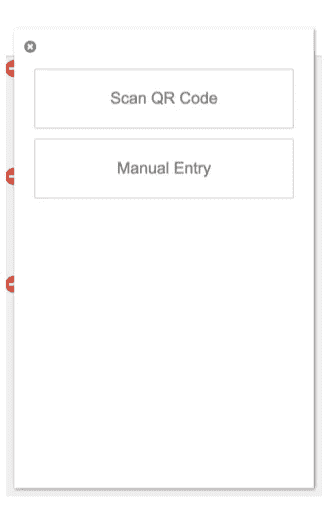

# 双重身份认证的痛苦(2FA)

> 原文：<https://medium.com/coinmonks/the-pain-of-google-authenticator-code-9758ad407bc0?source=collection_archive---------0----------------------->

你现在交易吗？你的交易所增加了一个安全系统(2FA ),并在你每次登录时询问你谷歌验证码，然后你打开手机，打开一个应用程序来查看验证码。你不觉得这是你安逸生活的一种痛苦吗？所以让我们做一些事情，当你想登录任何一个交易所(或者任何一个使用这个安全系统的网站)的时候，你可以不用手机就能做到。

实际上这是一个非常简单的解决方案，我们将为此使用一个谷歌 chrome 插件，下载[这个](https://chrome.google.com/webstore/detail/authenticator/bhghoamapcdpbohphigoooaddinpkbai)插件(你可以下载任何类似的，我用这个)。

因此，按照以下步骤将您的密钥添加到 authenticator。

第 1 步-点击插件，然后编辑按钮。

Step 1

第 2 步-点击+按钮。

step 2

第 3 步-如果您的屏幕上有 QR 码，那么您只需点击扫描 QR 码或点击手动输入即可。

Step 3

第 4 步-添加您的帐户名称(您选择的名称)和网站提供的密钥。

Step 4

哒哒，你现在完成了。所以如果你对此感到高兴，并想分享你的快乐，那么…

# ❤️喜欢，分享，留下你的评论

**和……**

follow me

注意——感谢 sneezry.com 的[开发了这个插件，让我们的生活变得简单。](https://sneezry.com/)

> 我们有一个活跃的社区，来这里加入我们吧。
> 
> 订阅我们的时事通讯，在这里我们可以分享采访、交易想法、市场见解[点击](https://www.getrevue.co/profile/CoinMonks)。
> 
> [直接在您的收件箱中获得最佳软件交易](https://coincodecap.com/?utm_source=coinmonks)

***如果你是投资者、交易者、开发者或加密爱好者，或者对 heck crypto 如何工作有很多疑问，请加入我们的*** [***slack 社区***](https://goo.gl/3Ex81z) 。我们的 crypto 论坛 CoinMonks 也可以查看我们的网站，该网站根据开发进度对 Crypto 进行排名[**CoinCodeCap**](http://www.coincodecap.com)**。**

# ❤️喜欢，分享，留下你的评论

如果你喜欢这篇文章，不要忘记喜欢，与你的朋友和同事分享，并在下面留下你对这篇文章的评论。跟我来……