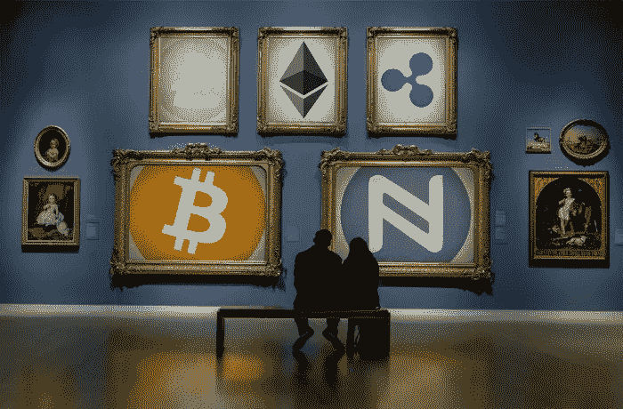
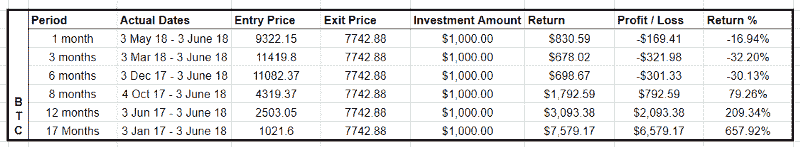
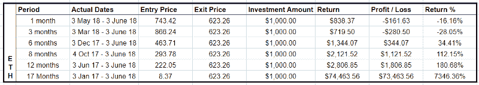
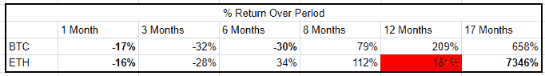
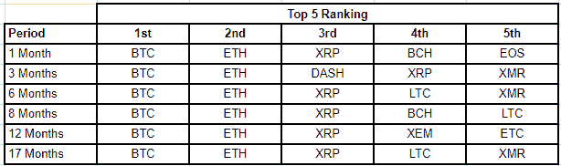
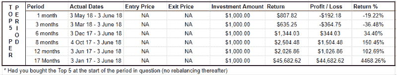
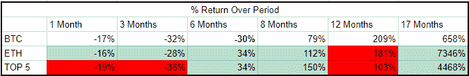
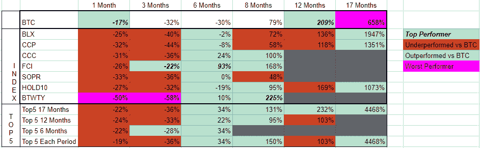
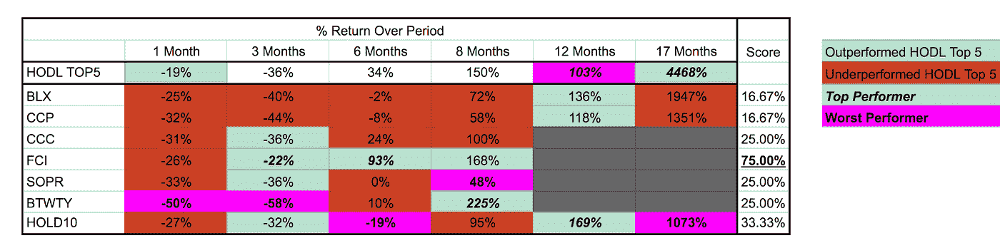

# 被动投资者密码投资指南

> 原文：<https://medium.com/coinmonks/the-passive-investors-guide-to-crypto-investing-6642eabd75c1?source=collection_archive---------0----------------------->

## 我们讨论并分析了四种不同的被动 HODL 策略，看看哪一种效果最好。

*注:* [*点击此处*](https://docs.google.com/spreadsheets/d/1BlR8M2wrr2wFmlJaVTmF5_1Y3TIgU_deSdyDb0IMFvw/edit?usp=sharing) *访问包含本文所用数据和计算的电子表格。*

经常有人问我，被动投资加密货币市场的最佳方式可能是什么。如果他们不想担心每天的价格波动，他们应该买什么硬币或有什么选择？如果他们有一份日常工作，没有时间或者兴趣去理解各种共识机制之间的区别，Zk-SNARKs 是什么或者软件如何分叉。

简单的回答是，这类人可能根本不应该投资加密货币。加密货币和加密货币市场具有高度的波动性、投机性和实验性。大多数项目将归零，技术每天都在变化，你必须接受失去大部分(如果不是全部)资本的想法。

也就是说，这是一个令人兴奋的市场，在去中心化的互联网、无信任的经济和未来方面有着巨大的潜力。这是一个拥有世界上一些最聪明的头脑的市场，致力于建设未来，并为那些愿意承担风险和投资的人提供了前所未有的回报。因此，看到越来越多的人寻求将一定比例的资金用于加密投资并不奇怪。

# 被动加密投资者有哪些选择？

在这个领域投资时，被动投资者可以采用各种策略。出于本文的目的，我选择关注以下五个方面。以下是他们，排名不分先后:

1.  做一个比特币最大化主义者，买比特币去 HODL(千万别松手)。
2.  购买以太坊和 HODL。
3.  按市值和 HODL 购买排名前 5 (10、15 或 20)的加密货币。
4.  投资被动指数/再平衡基金。
5.  投资积极管理的对冲基金。

我将探讨上述每一个策略，重点是前四个选项。我将在另一篇文章中介绍积极管理型对冲基金策略，因为它们通常需要更高的投资额，并且主要由高净值个人、家族理财室和机构使用。

## 1.比特币 HODL 策略

购买并持有比特币是被动投资者最简单的策略。自从中本聪发布比特币白皮书并向世界介绍比特币区块链以来，比特币一直是加密货币市场的教父。

比特币最大化主义者会说，这是人们应该考虑的唯一策略，比特币是唯一一种将在 1 年、5 年、10 年或 50 年后出现的加密货币，因为它具有去中心化的性质、经过验证的安全性、数字稀缺性和价值储存属性。

比特币也是最容易买到的。你可以从集中的交易所(如比特币基地)和[分散的](https://hackernoon.com/decentralized-cryptocurrency-exchanges-93039613eeb7)交易所、[在当地的比特币购买网站](https://localbitcoins.com/)甚至在[的比特币自动取款机](https://coinatmradar.com/)购买。

还有多种存储选项可以保护你的比特币安全，并确保你是该货币的实际所有者——从将你的私钥写在一张纸上，到各种硬件和软件钱包，甚至是将它们放在交易所(不推荐)。

但霍德林比特币为被动投资者提供了更高的回报吗？

如果你在 2017 年 1 月 3 日投资了 1000 美元的比特币，并持有至 2018 年 6 月 3 日，你今天将拥有 7579 美元(658%的净回报率*)。

Bitcoin Price Performance since January 2017

以任何人的标准来衡量，这都是一个巨大的回报。如果你对标普 500 指数投资 1000 美元，你将获得 1209 美元(20.9%的回报率)。**比特币 HODL 策略的表现将超过标准普尔 500 指数 637%** ，但这与以太坊 HODL 策略相比如何呢？

## 2.以太坊 HODL 战略

以太坊最大主义者会说，以太坊利用了比特币承诺的潜力，使其成为现实，并通过轻松创建智能合约的能力进一步扩展。

事实上，如果没有以太坊网络，ICO 市场的爆炸式增长是不可能的，因为当今市场上的大多数代币都使用以太坊 [ERC20](https://en.wikipedia.org/wiki/ERC20) 标准来发行代币。以太坊还拥有最大的开发社区和一些最高的日交易量(超过比特币)。

对于被动投资者来说，购买以太坊就像购买比特币一样简单，并且在安全保护和确保加密货币所有权方面提供了相同的选择。

**如果你在 2017 年 1 月向以太坊投资 1000 美元，你将获得 74463 美元的回报。7，346%的回报率，是同期比特币 HODL 策略的 9.7 倍。**

ETH Price Performance since January 2017

事实上，在除了一个时期(12 个月)之外的每个时期，投资和 HODLing 以太坊的表现都优于同样的比特币策略。

ETH vs BTC returns since January 2017.

以前的表现不是未来表现的指标，所以你对以太坊价格会发生什么的猜测和我一样好，但作为一个被动的加密投资者，如果你决定只采用 BTC·HODL 策略，你会错过一些重要的回报。

这与 HODL 市值排名前五的策略相比如何？

## 3.HODL 市值策略前五名

HODL 按市值排名前 5 的策略是对按市值排名的前 5 种加密货币进行等量投资。这是一个比仅仅购买比特币或以太坊稍微复杂的策略，因为它首先需要知道每种货币的市值是多少，然后购买前五名。并非所有 5 种货币都可以在您拥有帐户的交易所购买，您可能需要多个钱包来存放它们。

尽管如此，这种策略与 HODL 的比特币或以太坊策略遵循相同的原则；找到前 5 名，购买它们，安全地保护它们，然后忘掉它们。还有一种选择是，每隔一段时间(每季度或每半年)重新平衡前 5 名投资者，但这属于“非被动”投资者的领域。

为了找到市值最高的 5 种加密货币，我使用了工具下的 [CoinMarketCap 的](https://coinmarketcap.com/historical/20170101/)历史快照功能。这是从 2017 年 1 月到今天检查的每个时期市值最高的 5 种加密货币的样子。

Historical ranking of the top 5 cryptocurrencies

正如你所看到的，自 2017 年 1 月以来，比特币(BTC)和以太坊(ETH)一直占据着第一和第二的位置。Ripple (XRP)只因为 Dash (DASH)失去过一次第三的位置，而 Litecoin (LTC)、比特币现金(BCH)、以太坊经典(ETC)、Nem (XEM)和 Monero (XMR)都在不同的点上争夺过第四和第五的位置。

作为一名被动投资者，如果你使用这种策略投资，你的回报将如下:

Performance returns by investing equally in the Top 5 cryptocurrencies by market cap

将这些回报与比特币和以太坊的回报进行比较，你会得到以下结果:

Red cells = Under performing VS Bitcoin; Green cells = out performing vs Bitcoin.
Comparison of Top 5 performance vs Bitcoin and Ethereum.

你可以看到前 5 名在 6 个周期中有 3 个周期跑赢了比特币，在相同的周期数中跑输了比特币。值得注意的是，总体而言，超出表现的部分远远超过表现不佳的部分。

为了说明这一点，如果你在 17 个月前投资 1000 美元到前 5 名，你会产生 45682 美元的回报，而比特币的回报为 7579 美元(约 37000 美元或 6 倍溢价)，而 12 个月前前 5 名只会产生 2026 美元的回报，而比特币的回报为 3093 美元(约 1000 美元的差异)。

推动前 5 名和比特币之间回报率差异的主要因素是什么？

如果你采用了比特币 HODL 策略，你可能会错过以太坊(+7，346%)和 Ripple (+10，750%)的惊人表现。

这并不意味着这种趋势将继续下去，但它确实让人怀疑比特币 HODL 策略是否真的是被动投资者的最佳策略。我们在上面的两个例子中已经看到，只有霍丁比特币会导致错过巨大的潜在收益，同时遭受较小的潜在损失。

**旁注**:你可能会问，为什么我只查看 17 个月前的数据？比特币自 2009 年以来就已经存在，所以只从 2017 年初开始看是不是不公平？我选择这个时期是因为这是我唯一可以比较我们下一个策略指数基金表现的数据的时期。我能找到的最古老的加密指数基金是 2017 年 1 月才推出的。所以为了比较苹果和苹果，我决定只看这几个时期。

## 4.投资指数基金

投资指数是被动投资者的一种流行的传统投资策略。它们不需要任何主动管理，因此收费低于主动管理型基金，历史数据显示，指数基金的表现通常优于大多数主动管理型基金。

直到最近，crypto 中还没有很多可用的索引选项，但今天许多选项开始出现。

其中最值得注意的是:

*   [按位持有 10](https://www.bitwiseinvestments.com/) :持有按 5 年稀释市值加权的前 10 种加密货币，每月重新平衡。
*   [比特币基地指数基金](https://am.coinbase.com/index):跟踪在比特币基地交易所 GDAX 上市的数字资产的整体表现。
*   [Bit20](http://www.bittwenty.com/bit20.php?&page=bit20) :很难理解 Bit20 的入选标准。(他们的网站没有说清楚这一点。)
*   [ICONOMI](http://www.iconomi.net) :不是指数，而是一个简单易用的数字资产管理平台，能够投资于一系列不同的主动和被动管理的指数基金，有超过 26 只基金可供选择。

BitWise Hold10 和比特币基地指数基金只对合格的美国投资者开放，最低投资额分别为 2.5 万美元和 25 万美元。Bit20 和 ICONOMI 似乎都没有任何最低限制，而是向全球投资者开放。

关于 ICONOMI 的一个说明:2017 年 11 月我决定尝试一下 ICONOMI。我真的很喜欢这种体验，并且对平台上取得的进步印象深刻。我发现整个注册过程非常简单，我喜欢能够轻松识别每只基金的持有情况，并跟踪它们的表现。

此外，ICONOMI 有一个非常透明的[博客](https://medium.com/iconominet)，在那里他们发布公司的业绩，分享完整的财务和增长计划。我很欣赏一家公司的这种透明度，我把我的资金托付给这家公司，并牺牲了访问我的私钥的安全性。我还在纽约的 Consensus 会见了 ICONOMI 团队，他们的未来路线图和计划给我留下了深刻的印象。对于被动投资者来说，ICONOMI 平台绝对值得探索。

ICONOMI 平台有 26 只基金可供你选择(而且还在增加)。为了这个分析的目的，我决定只考虑管理的资产超过 100 万美元且交易历史至少为 8 个月的基金。这就给我留下了五只基金来比较(区块链指数、Crush Crypto Core、未来链指数、Solidim Prime 和 Pinta)。我无法获得比特币基地指数基金的准确表现信息，因此它们也被排除在我的分析之外。

这些基金之间以及与 BTC 之间的对比如何？(关于每只基金个别表现的潜在回报的详细分类，请查看[计算电子表格](https://docs.google.com/spreadsheets/d/1BlR8M2wrr2wFmlJaVTmF5_1Y3TIgU_deSdyDb0IMFvw/edit?usp=sharing))。

Comparative performance of Index Funds vs BTC vs Hodl Top5

我们可以看到的是，在牛市期间，就像我们在 2017 年看到的那样，在所有分析的指数中，超越比特币将提供优异的回报。然而，仅仅是排名前 5 位就已经大大超过了所有跟踪的指数(2 到 4.5 倍)。除了上个月，只有一只基金(未来连锁指数-FCI)能够持续跑赢前 5 名 HODL 策略。

Comparison of Index Fund Performance vs Hodling Top 5

令人惊讶的是 BTWTY 和 Hold 10 基金的表现。两者都持有更大范围的令牌(10 个或更多)，但我们可以看到，在牛市中，他们的权重调整和更广泛的包容性策略往往表现不如更简单的 HODL 五大策略，在熊市中也没有显著改善表现的好处。这就提出了一个问题，更大范围的令牌是否真的提高了性能或增加了任何种类的多样化。

# 结论:我们能从这个分析中学到什么？

对我来说，有一些关键的见解:

1.  比特币最大赢家认为比特币是唯一值得持有的加密资产，这似乎是错误的。在六个月或更长的时间里，只投资比特币的回报率会低得多。如果投资者采用这种策略，他们将错过以太坊和 Ripple 的巨大业绩增长。
2.  按市值计算，持有前 5 名中同等比例的股票似乎是一种有效的策略，在六个测量期的四个时段中，其表现优于比特币，也优于大多数指数基金策略。
3.  投资更大范围的代币(10+)并不一定等同于牛市中更好的表现和熊市中更好的保护。事实上，相反的趋势(更大程度上集中更少的令牌)似乎是正确的。
4.  大多数指数基金尚未持续证明自己能够跑赢霍德林比特币或简单的 HODL 5 策略。这似乎有悖直觉。

时间会证明这些观点是否正确。

对上述分析的一个警告是，测量的时间周期非常短。8 至 17 个月的历史分析只能提供有限的见解。以前的业绩不是未来业绩的指标，也不是投资建议。一如既往，请做你自己的研究。

**如果你喜欢这篇文章，或者发现了其中的价值，请拍手献爱心，留下评论，关注我。**

[*点击此处*](https://docs.google.com/spreadsheets/d/1BlR8M2wrr2wFmlJaVTmF5_1Y3TIgU_deSdyDb0IMFvw/edit?usp=sharing) *进入谷歌表单，提供用于执行上述分析的原始数据和性能计算。*

**比特币回报不包括在此期间在任何 BTC 分叉中收到隔空投送或额外代币的任何潜在回报。*