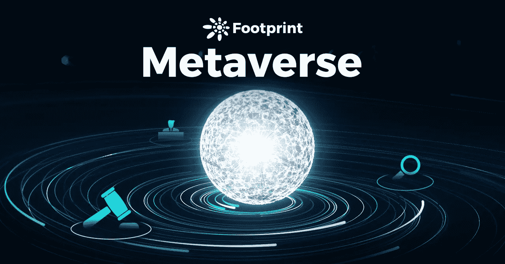
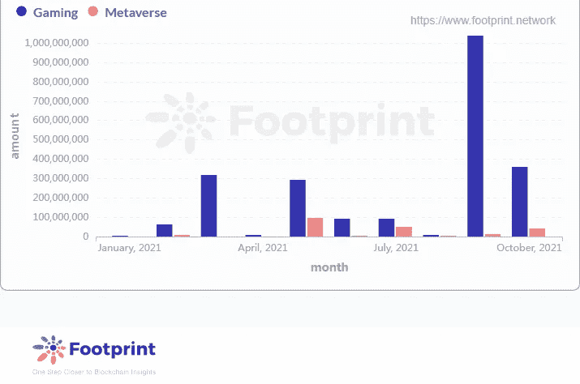
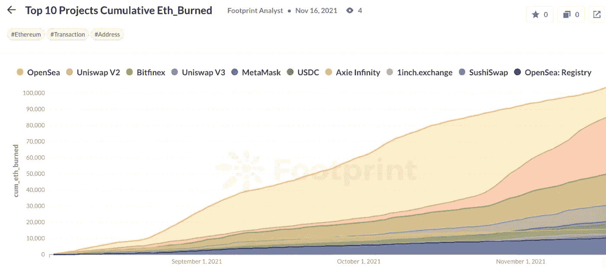
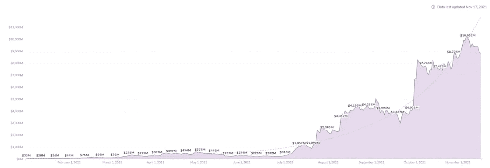

# 元宇宙的过去、现在和未来

> 原文：<https://medium.com/coinmonks/the-past-present-and-future-of-metaverse-178663757f81?source=collection_archive---------8----------------------->

20 世纪 90 年代，互联网这种新技术逐渐走进人们的生活。这种革命性的媒介引发了许多想象。人们称互联网为“网络世界”。

人们描绘了一个完全不同的未来:网络世界将成为一个与现实生活平行的空间，人们将从互联网上获得比现实世界更多的东西。

唯一的区别是，因为街道并不真正存在——它只是写在某处一张纸上的计算机图形协议——这些东西都不是实际建造的。更确切地说，它们是通过全球光纤网络向公众提供的软件。

*所以阿宽其实根本不在这里。他在一个计算机生成的宇宙中，他的计算机把这个宇宙绘制在他的护目镜上，并输入他的耳机。在行话中，这个虚构的地方被称为元宇宙。*

—尼尔·斯蒂芬森(《冰雪奇缘》，1992 年)

这就是“元宇宙”这个词的由来，它由前缀“元”和词根“韵文”组成，字面意思是“超越宇宙”。更具体地说，它意味着一个计算机生成的世界。

元宇宙的觉醒——元宇宙是什么？

元宇宙被描述为一个在线 3D 虚拟环境，支持去中心化和长期持续..简而言之，元宇宙是一个与现实世界平行的世界，在那里人们可以生活，甚至做许多其他事情。

虽然元宇宙的定义和剧情还相当模糊，但艺术、商业、游戏等各个领域都已经涉足:玩家开始探索和建设这个充满未知的世界。

受《冰雪奇缘》的启发，早在 2003 年，游戏《第二人生》就支持类似元宇宙的体验。用户可以四处玩耍，社交，制作和交易虚拟资产，甚至将虚拟资产兑换成美元。

2018 年，斯皮尔伯格的《预备玩家一号》也讲述了一个未来的故事，人类为了逃避现实，大部分时间都在一个名为“绿洲”的虚拟现实世界中度过。人们在绿洲工作、玩耍和寻找游戏制作者留下的复活节彩蛋。

如果说在 VR 和 AR 技术尚未普及的时代，《第二人生》和《Ready Player One》的想法还过于朦胧，那么在技术飞速发展的今天，人们对虚拟世界的想象正逐渐成为现实。

**目前元宇宙四大领域**

2021 年，社交媒体巨头脸书更名为“Meta”，科技巨头如谷歌、字节跳动、微软等也加入了元宇宙世界。与此同时，资本也在向这个领域转移。

[Footprint Analytics: GameFi and Metaverse Funding Data (from January 2021)](https://www.footprint.network/guest/question/273488d7-ec3a-48fc-87bd-f0a53c5b92d1/gaming-metaverse-financing-amount#secret=D3BB91B[%E2%80%A6]00B3671459D78BD)

*   元宇宙的游戏

在 ETH 燃烧量方面，NFT 交易平台 OpenSea 和游戏 Axie Infinity 目前继续领先

[Footprint Analytics: Top 10 Projects in Cumulative Eth Burn Volume](https://www.footprint.network/guest/chart/top-10-projects-cumulative-eth-burned-fp-85ad2184-0b64-4c10-a91f-f2577f57316e#secret=BAC3578C6B6C1EAFFC81A5D0FD3982A5)

游戏被认为是元宇宙的前身。

“我们看到了技术和互联网互动的进步，以及来自游戏的元宇宙，因为它往往处于为许多人设计的东西的前沿，这些人有最高的技术需求，”风险投资家、亚马逊前高管马修·鲍尔(Matthew Ball)说。

Axie Infinity 是以太坊上最受欢迎的游戏之一。足迹分析显示，Axie Infinity 的 token AXS 最高市值超过 100 亿美元，这充分反映了元宇宙游戏的资本活力。

[Footprint Analytics: AXS Token Market Cap Reaches All-Time High on November 7, 2021](https://www.footprint.network/guest/chart/axie-infinity-market-cap-fp-e2bebaca-5b7c-4af8-98b6-0570c5ced34e#secret=FB4090B333B1427092F6956983616FFA)

“Axie 体现了新一代游戏，游戏创作者不是在恐惧的地方运营，而是作为一个开放的自由市场经济，”风险投资公司 Andreessen Horowitz 的普通合伙人阿里安娜·辛普森(Arianna Simpson)写道，该公司投资了开发 Axie 的越南工作室 Sky Mavis。“这对游戏和我们所知的网络的未来意味着什么，这是你所能想象的。”

*   元宇宙的艺术

NFT 的全称是“不可替代的令牌”，这意味着一个独特的和不可互换的数据单元存储在一个数字分类账(区块链)。

NFT 是不可复制的唯一加密令牌，这是它相对于比特币(BTC)和以太坊(ETH)等主流加密资产的优势。

CryptoPunks 于 2017 年 6 月发布，是 10，000 个独特的可收集角色，其所有权证明存储在以太坊区块链上。由于它们的独特性，现在它们的单价高达数千万美元。加密朋克引发了 2021 年的 NFT 热潮，今天，由于其稀有性和排他性，它们成为加密货币社区地位的象征。

这个存在于虚拟世界中的艺术品肯定是元宇宙中的关键角色。也许，在元宇宙，所有的艺术都是不可替代的。因此，随着元宇宙和区块链技术的发展，出现了对 NFT 投资的巨大需求。

*   在元宇宙工作

在新冠肺炎疫情期间，无数人在家工作和学习，这成为了网上工作发展的契机。

脸书在 2021 年元宇宙的发展中赢得了很多关注。2020 年 9 月，脸书宣布了其元宇宙战略的一个重要组成部分，推出了 Infinite Office，这是一款 VR 虚拟办公室应用程序，可以帮助在家工作的用户通过 OculusQues 获得更身临其境的体验。

*   元宇宙的生活

有人认为，元宇宙的未来是探索其应用场景的共性。结合区块链、AR、VR 和人工系统等技术，许多专业人士将元宇宙描述为下一代互联网、沉浸式互联网和“互联网的终极形式”。

与智能手机类似，元宇宙增加了用户对时间的使用，并通过体验感进入人们的生活。碎片化的时间(体验)成为元宇宙所有服务的基础。

**元宇宙属于谁？— —未来世界能走向绿洲吗**

对于元宇宙的未来，无数的期望和担忧依然存在

互联网诞生之初，人们相信权力会更加分散，但互联网的历史告诉我们，最终，集中的权力会接管一切。但或许，随着对去中心化的区块链技术和道治理的深入理解，元宇宙的世界将会有所不同。

*但是，你知道，我认为我们真的会看到一个逐渐的趋势，独立游戏越来越少，用户内容平台越来越多，经济和竞争越来越多，迫使这些经济变得真正公平、强大和有竞争力。*

—蒂姆·斯维尼

技术一次又一次地颠覆了社会。

印刷术的发明代表了思想的传播，无线电将人们联系在一起，无论距离远近，互联网将广阔的世界缩小为地球村……

而元宇宙则暗示了技术与人之间共生的另一个维度。随着元宇宙的发展，托马斯·莫尔设想的乌托邦最终会再次实现吗？

> 加入 Coinmonks [电报频道](https://t.me/coincodecap)和 [Youtube 频道](https://www.youtube.com/c/coinmonks/videos)了解加密交易和投资

## 另外，阅读

*   [如何在印度购买比特币？](/coinmonks/buy-bitcoin-in-india-feb50ddfef94) | [WazirX 评论](/coinmonks/wazirx-review-5c811b074f5b)
*   [印度的加密交易所](/coinmonks/bitcoin-exchange-in-india-7f1fe79715c9) | [比特币储蓄账户](/coinmonks/bitcoin-savings-account-e65b13f92451)
*   [币安收费](/coinmonks/binance-fees-8588ec17965) | [僵尸加密审查](/coinmonks/botcrypto-review-2021-build-your-own-trading-bot-coincodecap-6b8332d736c7) | [热点审查](/coinmonks/hotbit-review-cd5bec41dafb)
*   [我的加密副本交易经历](/coinmonks/my-experience-with-crypto-copy-trading-d6feb2ce3ac5) | [AAX 交易所评论](/coinmonks/aax-exchange-review-2021-67c5ea09330c)
*   [逐位融资融券交易](/coinmonks/bybit-margin-trading-e5071676244e) | [币安融资融券交易](/coinmonks/binance-margin-trading-c9eb5e9d2116) | [超位审核](/coinmonks/overbit-review-9446ed4f2188)
*   [有哪些交易信号？](https://blog.coincodecap.com/trading-signal) | [Bitstamp vs 比特币基地](https://blog.coincodecap.com/bitstamp-coinbase)
*   [ProfitFarmers 回顾](https://blog.coincodecap.com/profitfarmers-review) | [如何使用 Cornix 交易机器人](https://blog.coincodecap.com/cornix-trading-bot)
*   [如何匿名购买比特币](https://blog.coincodecap.com/buy-bitcoin-anonymously) | [比特币现金钱包](https://blog.coincodecap.com/bitcoin-cash-wallets)
*   [币安 vs FTX](https://blog.coincodecap.com/binance-vs-ftx) | [最佳(SOL)索拉纳钱包](https://blog.coincodecap.com/solana-wallets)
*   [如何在 Uniswap 上交换加密？](https://blog.coincodecap.com/swap-crypto-on-uniswap) | [A-Ads 审查](https://blog.coincodecap.com/a-ads-review)
*   [加密货币储蓄账户](/coinmonks/cryptocurrency-savings-accounts-be3bc0feffbf) | [YoBit 评论](/coinmonks/yobit-review-175464162c62)
*   [Botsfolio vs nap bots vs Mudrex](/coinmonks/botsfolio-vs-napbots-vs-mudrex-c81344970c02)|[gate . io 交流回顾](/coinmonks/gate-io-exchange-review-61bf87b7078f)
*   [CoinFLEX 评论](https://blog.coincodecap.com/coinflex-review) | [AEX 交易所评论](https://blog.coincodecap.com/aex-exchange-review) | [UPbit 评论](https://blog.coincodecap.com/upbit-review)