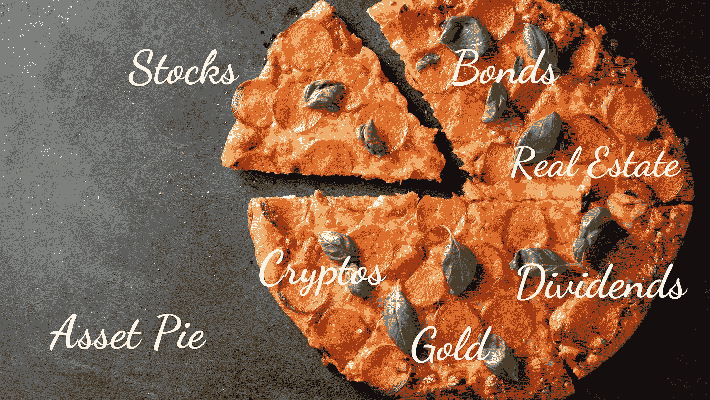

# 完美的投资组合

> 原文：<https://medium.com/coinmonks/the-perfect-portfolio-fe1dd803a25e?source=collection_archive---------5----------------------->

完美的投资组合应该是这样的！

Source: Author’s creation / Canva

当涉及到他们所拥有的资产时，人们习惯于看到他们的馅饼是由什么组成的。他们制作了各种各样的图表，但最受欢迎的是饼图。饼图显示了各种资产或股票及其各自的百分比。

下面是一个资产派应该是什么样子的例子！