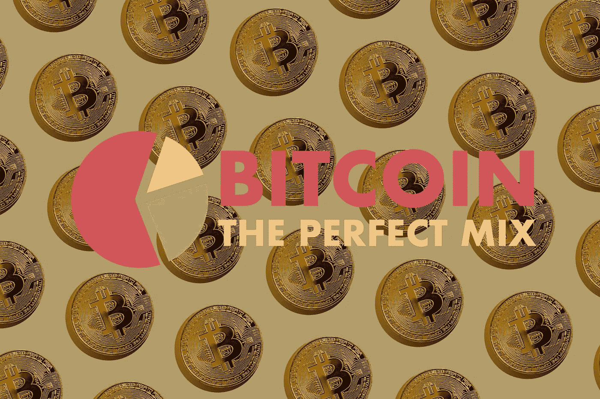

# 完美的投资组合:你应该在比特币上投资多少钱

> 原文：<https://medium.com/coinmonks/the-perfect-portfolio-how-much-money-should-you-invest-in-crypto-60345b3afbb6?source=collection_archive---------0----------------------->

比特币近年来的惊人表现是不可否认的。世界上很少见到如此多的投资者通过单一资产致富。但是哪里有机会，哪里就有风险。很多。这就是为什么比特币应该只是你投资组合的一个补充，以**提高表现**。以及完美的投资组合是怎样的，将在下面解释。

What Is Your Perfect Mix? — Photo by [Jeremy Zero](https://unsplash.com/@jeremy0?utm_source=unsplash&utm_medium=referral&utm_content=creditCopyText) on [Unsplash](https://unsplash.com/s/photos/bitcoin?utm_source=unsplash&utm_medium=referral&utm_content=creditCopyText), edited by the author