# 石油美元，一个腐朽的体系。

> 原文：<https://medium.com/coinmonks/the-petrodollar-a-decaying-system-960d72e2aa7d?source=collection_archive---------3----------------------->

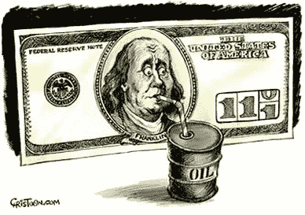

## 从布雷顿森林到石油美元

第二次世界大战后，美国是明显的全球赢家。为了奖励他们，世界在 1944 年信任他们，让他们维持稳定的全球储备货币，让美元与黄金挂钩。正如历史上常见的那样，全球超级大国滥用他们的特权。美国决定大幅增加在社会项目和越南战争上的国内支出，直到外国意识到美元被极度高估，不得不在 1971 年放弃盯住美元。

面对与苏联的冷战和日益多极化的世界，这是对美国霸权的极端打击。不得不放弃金本位制使得美国经济更加疲软。20 世纪 70 年代，他们无可匹敌的全球霸主地位受到了多方面的威胁:通胀和失业率飙升、生产率和盈利能力下降、能源价格飙升以及国际竞争加剧。

随着西欧和亚洲经济的快速增长，美国不再对资本主义世界拥有无可争议的政治、军事和经济优势。它们的复兴意味着“核心”制造业的竞争加剧，从而威胁到美国的钢铁和汽车工业。下图显示了美国在全球 GDP 中的份额在二战后的二十年间是如何达到顶峰的，以及从那以后是如何开始逐渐下降的。[【1】](http://www.dollarsandsense.org/archives/2009/1109reuss.html)

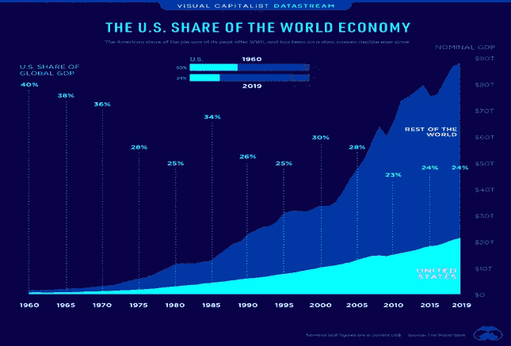

*Source:* [*https://www.visualcapitalist.com/u-s-share-of-global-economy-over-time/*](https://www.visualcapitalist.com/u-s-share-of-global-economy-over-time/)

在这种实力下降的新环境下，美国想出了一个新计划来夺回部分霸权。尼克松和基辛格在 1974 年派遣他们的财政部长去沙特阿拉伯建立石油美元体系。框架很简单，美国将“从沙特阿拉伯购买石油，并向该王国提供军事援助和装备。作为回报，沙特将把数十亿美元的石油收入重新投入美国国债，为美国的支出提供资金。”[【1】](https://time.com/5428669/saudi-arabia-military-relationship/)

其他石油输出国组织国家迅速效仿沙特，导致全球 80%的石油储备不得不以美元出售，这大大增加了全球美元需求。基本上，石油输出国组织国家选择转向石油美元体系，以换取美国的军事保护和合作。在冷战期间，这样做的地缘政治意图很明显。美国可以利用其令人印象深刻且不受挑战的海军来保护全球航道，并在必要时通过军事行动维护其地缘政治霸权地位。

除了对美国的地缘政治优势之外，该系统在其他方面也是有用的，甚至可以说是必要的。美国未能在布雷顿森林体系下保持黄金支持，因为他们在国内和越南的无限制赤字支出，但他们仍然是世界上最大的经济体和最大的商品进口国。他们认为他们的货币是唯一一种“足够大”可以用于全球石油贸易的货币。[【2】](https://www.lynalden.com/fraying-petrodollar-system/)

20 世纪 90 年代苏联解体后，随着冷战期间的两极权力平衡转向以美国为经济和军事强国的单极世界，石油美元开始变得不那么有意义。它变成了一个没有明确目标的系统。

## **没有明确目的的标准**

随着美国寻求捍卫其霸权角色，石油美元标准导致了更多的美国军事参与。这方面的一个例子是 2003 年的伊拉克战争。9/11 悲剧事件后，2001 年 10 月 7 日发起了“持久自由行动”,以抓捕本·拉登并摧毁与本·拉登有关联的两个恐怖组织:基地组织和塔利班。

此后不久，主流媒体和华盛顿开始为全面入侵伊拉克造势。本·拉登和伊拉克之间没有明确的联系，但美国政府官员声称，伊拉克提出了一套完全独立的国家安全威胁，即伊拉克涉嫌发展和拥有大规模杀伤性武器以及与国际恐怖组织的密切联系。鉴于 9/11 后美国国内的创伤情绪，大多数美国公众支持全面入侵伊拉克，剩下的就是历史了。

然而，支持这些动机的证据从未完全确立。相反，一些人认为入侵是在伊拉克 2002 年决定拒绝用美元出售石油，转而使用石油欧元之后。这是华盛顿保护石油美元努力的一部分。[【4】](https://followthemoney.com/how-americas-petrodollar-system-influenced-the-2003-iraq-war/)

## **美国搬起石头砸自己的脚。**

除了导致不必要的军事介入，该系统还伤害了美国国内。美国必须与世界其他国家保持持续的贸易逆差，才能向国际体系提供足够的美元。对美元的强劲需求使得美国出口商品过于昂贵，缺乏竞争力，而进口商品则更便宜。在下图中可以清楚地观察到这种效果。

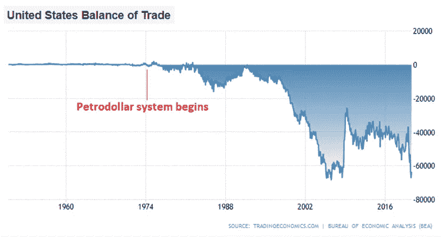

*Source:* [*Trading Economics*](https://tradingeconomics.com/united-states/balance-of-trade)

这大大削弱了美国的制造业基础。从事制造业工作的人数在 1979 年达到顶峰，之后稳步下降。美国中产阶级变得虚弱，而美国所有的工作岗位主要转向国防、技术、服务和金融。

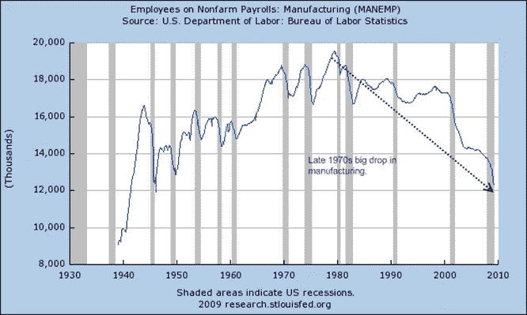

结果是收入越来越集中在顶层(比如金融和科技行业)，而其他行业的工资却停滞不前。随着社会内部财富不平等的加剧，两极分化和政治极端主义也随之增加。除了美国制造业基础的削弱，石油美元体系给美国带来了更多的负面影响，我在这里有更详细的讨论。

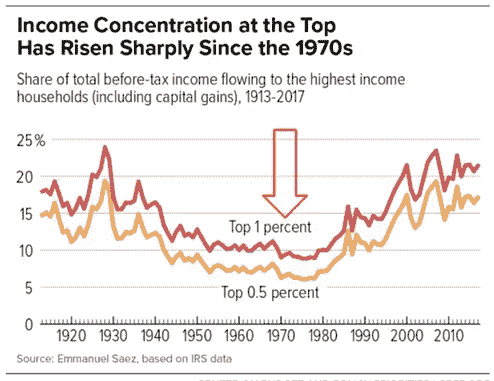

*Source:* [*https://wtfhappenedin1971.com/*](https://wtfhappenedin1971.com/)

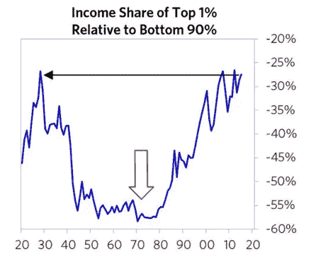

*Source:* [*https://wtfhappenedin1971.com/*](https://wtfhappenedin1971.com/)

## **特里芬难题的回归。**

特里芬难题最终导致了布雷顿森林体系在 1971 年的终结。这是因为向世界提供全球储备货币的国家必须保持持续的贸易逆差，才能向世界供应那种无风险的储备货币。他们对外国的负债越来越多，直到无风险资产不再是无风险的，这打破了这个体系。当美国国内和国外赤字开支变得极端时，美元与黄金挂钩不再是无风险的，与黄金挂钩不再是可持续的。

石油美元让美国陷入了类似但略有不同的境地。美元储备的全球积累要求美国保持经常账户赤字，全球期望储备随着世界名义 GDP 的增长而增加，而世界名义 GDP 的增长显然快于美国名义 GDP 的增长。全球美元储备的增长使得美国的外债不可持续。这意味着，要么美国将停止经常账户赤字，导致全球储备不足，要么他们的债务将无限制增加，这将损害美元和以美元计价的储备的价值。下图显示，美国债务继续无限制上升。最终，石油美元储备标准可能不再是无风险的。

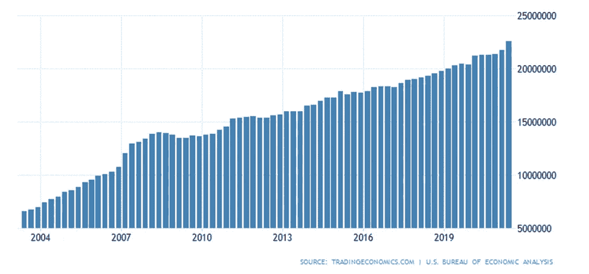

*Source: U.S. Total Gross External Debt —* [*https://tradingeconomics.com/united-states/external-debt*](https://tradingeconomics.com/united-states/external-debt)

## **中国滥用石油美元**

除了石油美元给美国带来的国内问题，他们还面临地缘政治问题。石油美元体系鼓励中国等重商主义国家对美国保持贸易顺差，并将这些美元用于购买美国国债。在中国之前，其他国家也这样做了，包括欧洲、中东和日本。他们积累美元，并将其再投资于美国国债。

除非你是一名活跃在制造业的美国工人，或者站在军事冒险主义的对立面，否则这个体系运行得相对较好。2013 年，中国决定打破这一趋势。他们继续保持对美国的巨额贸易顺差，但他们停止购买美国国债和为美国财政赤字融资。

中国央行副行长易纲表示:“积累外汇储备不再对中国有利。”[【6】](https://www.bloomberg.com/news/articles/2013-11-20/pboc-says-no-longer-in-china-s-favor-to-boost-record-reserves)如图所示，中国一直在缓慢减持美国国债。

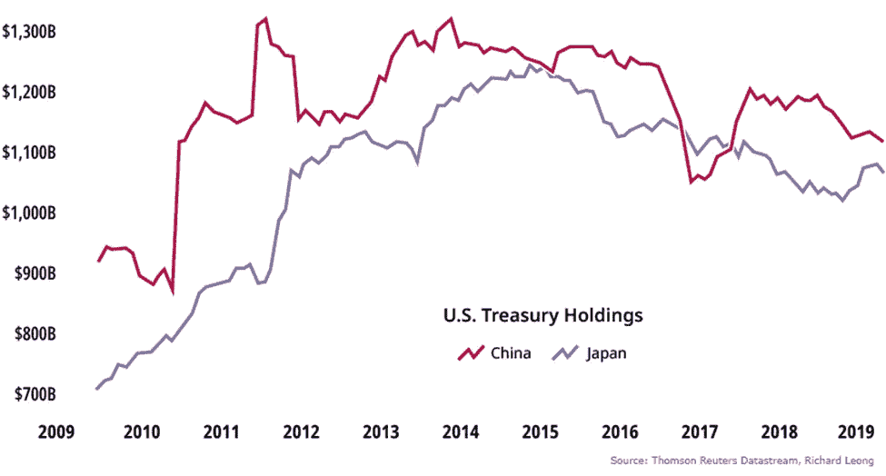

*Source:* [*https://www.visualcapitalist.com/foreign-countries-holding-most-u-s-debt/*](https://www.visualcapitalist.com/foreign-countries-holding-most-u-s-debt/)

中国现在持有的美国国债比十年前少，但与此同时，对美国的贸易顺差一直在持续增长。

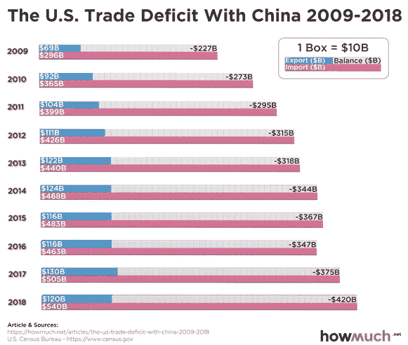

*Source:* [*https://howmuch.net/articles/the-us-trade-deficit-with-china-2009-2018*](https://howmuch.net/articles/the-us-trade-deficit-with-china-2009-2018)

中国提出了新的计划。他们在 2013 年启动了臭名昭著的*一带一路* (BRI) ，通过该计划，他们开始大举向亚洲、拉丁美洲、非洲和东欧国家的基础设施项目发放美元贷款。中国没有将其美元贸易盈余重新注入美国的财政赤字，而是用其流入的美元为世界各地的硬资产项目融资，并增加其全球影响力和实力。

这基本上是一场软实力攻势，中国在这些国家提升自己的影响力。《纽约时报》将其描述为“马歇尔计划的更大胆版本”，美国提供大量援助支持欧洲盟友。

一些人称这种战略拓展为“债务陷阱外交”。中国向较贫穷国家过度推销其基础设施项目的好处，并以沉重的条款向它们提供信贷。当账单最终到来时，债务人往往无法支付。然后，中国要求控制该地区的基础设施和影响力，以此作为补偿。这是一场地缘政治游戏，中国试图通过基础设施的战略建设将一些国家变成卫星国。[【7】](https://www.nationalreview.com/2018/07/china-belt-and-road-initiative-debt-trap-diplomacy/)

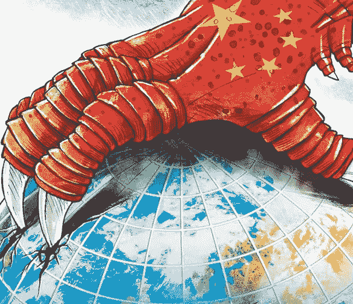

*Source:* [*https://www.magzter.com/stories/Newspaper/The-New-Indian-Express-Chennai/Chinas-Debt-Trap-Diplomacy*](https://www.magzter.com/stories/Newspaper/The-New-Indian-Express-Chennai/Chinas-Debt-Trap-Diplomacy)

下面这张地图漂亮地展示了中国自该项目开始以来在世界各地建设的软实力影响力，从发电厂到铁路系统。如今最大的消费热点是巴基斯坦、埃塞俄比亚和斯里兰卡。

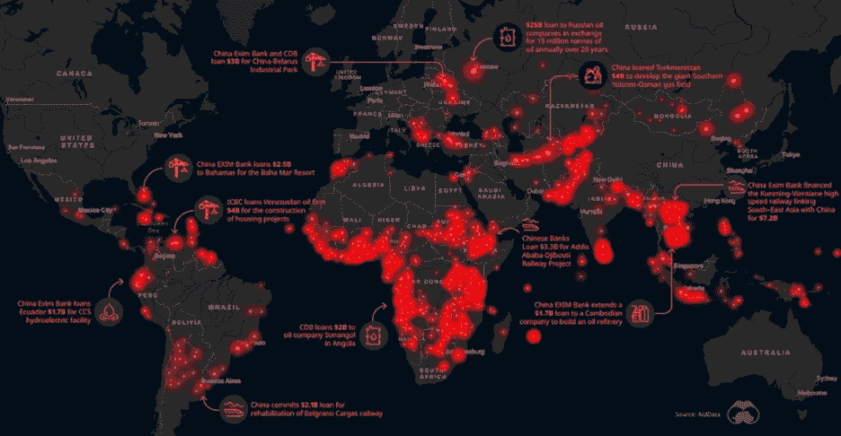

*Source:* [*https://www.visualcapitalist.com/global-chinese-financing-is-fueling-megaprojects/*](https://www.visualcapitalist.com/global-chinese-financing-is-fueling-megaprojects/)

从中国的地缘政治角度来看，可以理解他们为什么会这样做。中国在 19 世纪的鸦片战争中遭到严重破坏，导致了至少 150 年的严重不稳定和停滞。中国不会轻易忘记，现在他们重新获得了权力，他们不打算与西方构建的全球体系友好相处。

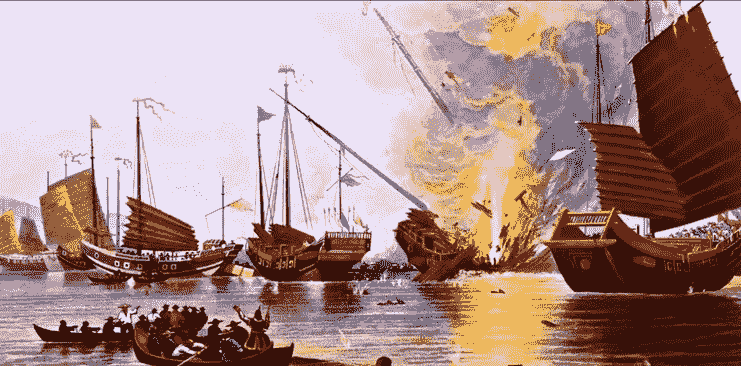

*Source:* [*https://fee.org/articles/the-great-opium-war-revival/*](https://fee.org/articles/the-great-opium-war-revival/)

中国已经取代美国成为世界上最大的商品进口国和最大的贸易伙伴，CCP 官员经常说，他们对石油美元体系的依赖对他们来说是一种安全风险。中国希望在没有美元的情况下获得商品和进行贸易。他们已经开始一步一步地这样做了。例如，中国和俄罗斯之间的美元贸易在六年内从 98%下降到 2020 年的 33%。他们一半的贸易是用欧元完成的，17%是用人民币和卢布完成的。中俄贸易中美元使用的下降可以从下面看出来。

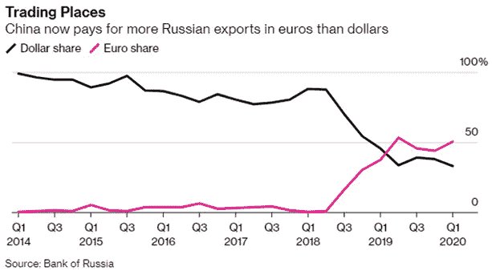

## 石油输出国组织的地缘政治考量。

沙特人也越来越抵触石油美元体系。从历史上看，这种做法对他们很有效，为他们提供了稳定和军事保护。然而，中国现在是最大的原油进口国，也是沙特最大的客户，他们想用人民币购买。沙特人显然希望用人民币向中国出售石油，但这意味着地缘政治风险，因为美国可能会停止保护他们，拿他们的安全冒险。

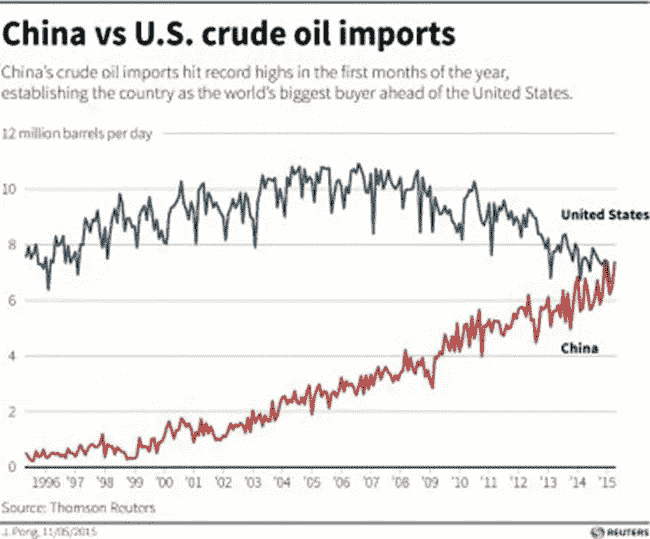

*Source:* [*https://www.ibtimes.co.uk/china-overtakes-us-worlds-top-crude-oil-buyer-1500668*](https://www.ibtimes.co.uk/china-overtakes-us-worlds-top-crude-oil-buyer-1500668)

如果沙特阿拉伯决定接受人民币来换取石油，那么其他石油输出国组织(石油输出国组织)国家几乎肯定会跟进，这可能导致石油美元体系的崩溃。然而，考虑到中东多层次的安全局势以及美国在该地区军事和政治力量的持续主导地位，我怀疑石油输出国组织国家会轻易做出这一决定。

## **通向中立解决机制的道路。**

石油美元在冷战期间具有地缘政治意义，当时美国希望稳固其霸权地位。但现在，特里芬难题的内在缺陷再次对美国产生负面影响。他们需要运行结构性赤字来为世界提供美元，在此过程中损害了他们国内的制造业基础。此外，几十年前美国占全球 GDP 的 35%时围绕美元构建的体系在美国占全球 GDP 的份额下降到 20%时不再适用。全球货币体系的当前结构在数学上变得不可行，它不再支持美国的广泛利益。

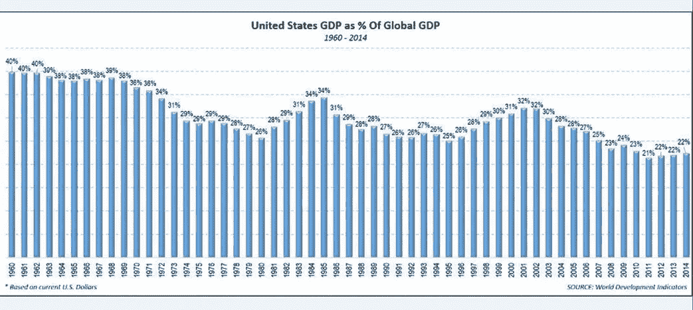

*Source:* [*https://www.forbes.com/sites/mikepatton/2016/02/29/u-s-role-in-global-economy-declines-nearly-50/?sh=6cd17f4b5e9e*](https://www.forbes.com/sites/mikepatton/2016/02/29/u-s-role-in-global-economy-declines-nearly-50/?sh=6cd17f4b5e9e)

其他地缘政治参与者显然也不再热衷于石油美元。沙特和其他石油输出国组织国家更希望能够用人民币与中国进行石油贸易，但这对他们来说是一个地缘政治风险，因为这可能会让他们失去美国的军事保护。很明显，中国和俄罗斯希望看到以美元为基础的贸易体系逐渐减少，因为对美元的依赖会给它们带来安全风险。

Lyn Alden 说得很好，她说全球储备货币地位有一个“自然经济熵”。随着时间的推移，系统内部的缺陷不断增加，直到达到临界点。新的全球货币体系对美国来说不一定是坏消息，但这意味着在国内和国际目标之间进行权衡，这将带来新的贸易动态。[【第八期】](https://www.lynalden.com/fraying-petrodollar-system/#fraying)

既然美国已经失去了一些经济霸权，那么在一个更加中立的结算机制基础上进行贸易将对所有人都有利。几十年前，约翰·凯因斯提出了一个替代系统，称为 *Bancor* ，其中国际记账单位将基于黄金和一篮子主要货币，这些货币将作为央行储备资产持有，并用于结算贸易差额。类似地，国际货币基金组织对他们的特别提款权也有类似的想法，特别提款权是基于各国央行持有的一篮子主要货币。[【10】](https://www.imf.org/en/About/Factsheets/Sheets/2016/08/01/14/51/Special-Drawing-Right-SDR)

也许有一天会是比特币，这种去中心化的开源货币网络已经发展成为一万亿美元的市值资产。比特币是可验证和透明的，它不需要信任或国际合作，只需要使用它的各方达成协议。它适用于不可逆转的大额交易，并可能对那些与国际 SWIFT 网络隔绝的国家具有吸引力。

显而易见的是，全球货币体系正变得越来越分散。它可能会慢慢发生，也可能会很快发生，如果美国决定加速脱离这个似乎不再有明确目的或利益的体系。

> 加入 Coinmonks [电报频道](https://t.me/coincodecap)和 [Youtube 频道](https://www.youtube.com/c/coinmonks/videos)了解加密交易和投资

## 另外，阅读

*   [加拿大最好的加密交易机器人](https://blog.coincodecap.com/5-best-crypto-trading-bots-in-canada) | [赌注加密](https://blog.coincodecap.com/staking-crypto)
*   [如何在印度购买比特币？](/coinmonks/buy-bitcoin-in-india-feb50ddfef94) | [WazirX 审核](/coinmonks/wazirx-review-5c811b074f5b)
*   [最佳网上赌场](https://blog.coincodecap.com/best-online-casinos) | [硬件钱包](/coinmonks/hardware-wallets-dfa1211730c6)
*   [如何在 WazirX 上购买柴犬(SHIB)币？](https://blog.coincodecap.com/buy-shiba-wazirx)
*   [比特币主根](https://blog.coincodecap.com/bitcoin-taproot) | [排名前 6 的比特币信用卡](/coinmonks/bitcoin-credit-card-bc8ab6f377c6)
*   [最佳免费加密信号](https://blog.coincodecap.com/free-crypto-signals) | [YoBit 评论](/coinmonks/yobit-review-175464162c62) | [Bitbns 评论](/coinmonks/bitbns-review-38256a07e161)
*   [huo bi 的加密交易信号](https://blog.coincodecap.com/huobi-crypto-trading-signals) | [BitMEX 评论](https://blog.coincodecap.com/bitmex-review)
*   [7 个最佳零费用加密交易平台](https://blog.coincodecap.com/zero-fee-crypto-exchanges)
*   [分散交易所](https://blog.coincodecap.com/what-are-decentralized-exchanges) | [比特 FIP](https://blog.coincodecap.com/bitbns-fip) | [Pionex 审查](https://blog.coincodecap.com/pionex-review-exchange-with-crypto-trading-bot)
*   [用信用卡购买密码的 10 个最佳地点](https://blog.coincodecap.com/buy-crypto-with-credit-card)
*   [OKEx 评论](/coinmonks/okex-review-6b369304110f) | [Kucoin 交易机器人](/coinmonks/kucoin-trading-bot-automate-your-trades-8cf0ca2138e0) | [期货交易机器人](/coinmonks/futures-trading-bots-5a282ccee3f5)
*   [AscendEx Staking](https://blog.coincodecap.com/ascendex-staking)|[Bot Ocean Review](https://blog.coincodecap.com/bot-ocean-review)|[最佳比特币钱包](https://blog.coincodecap.com/bitcoin-wallets-india)