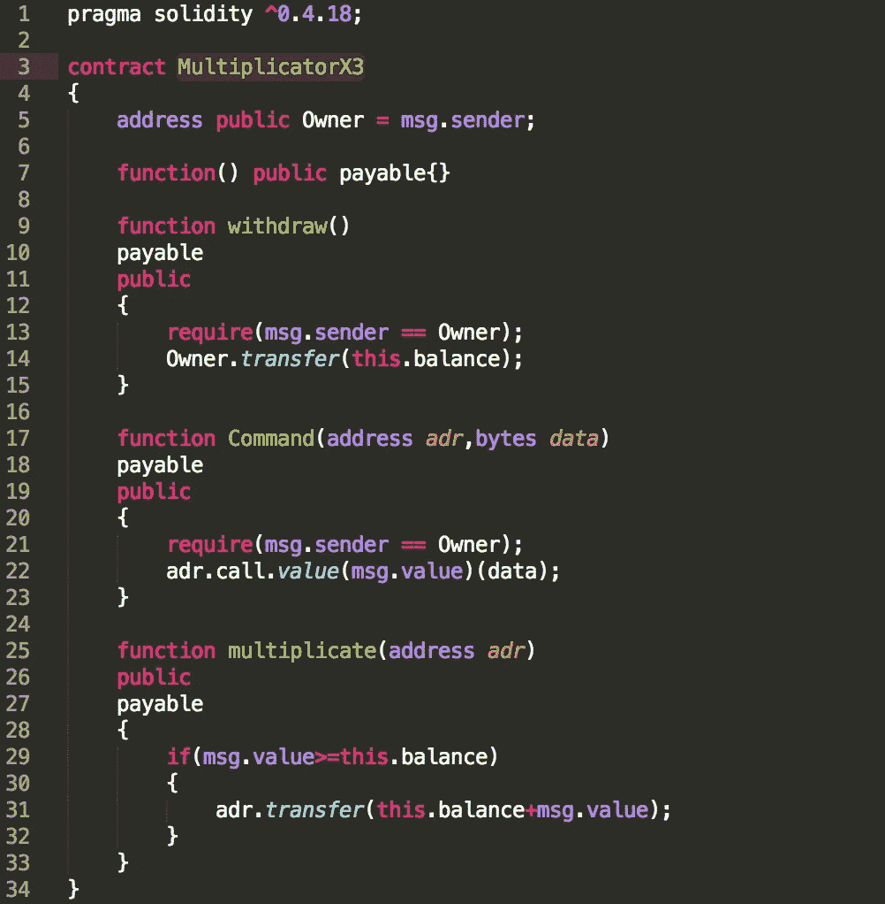
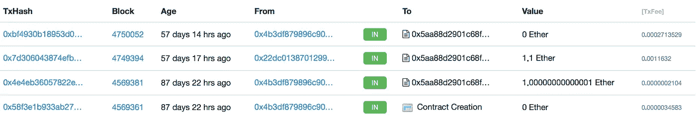
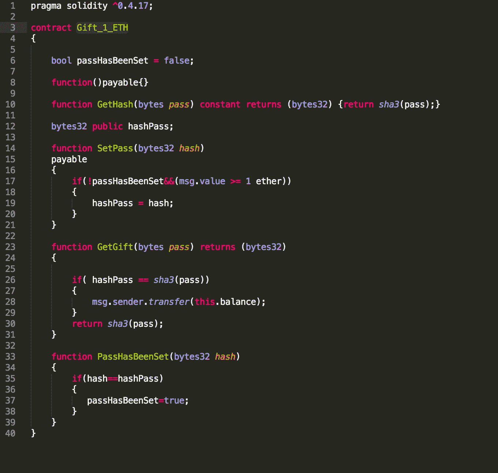
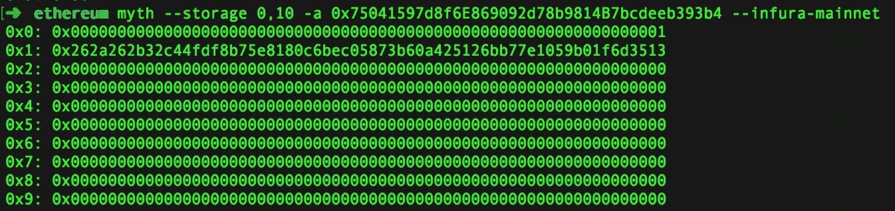
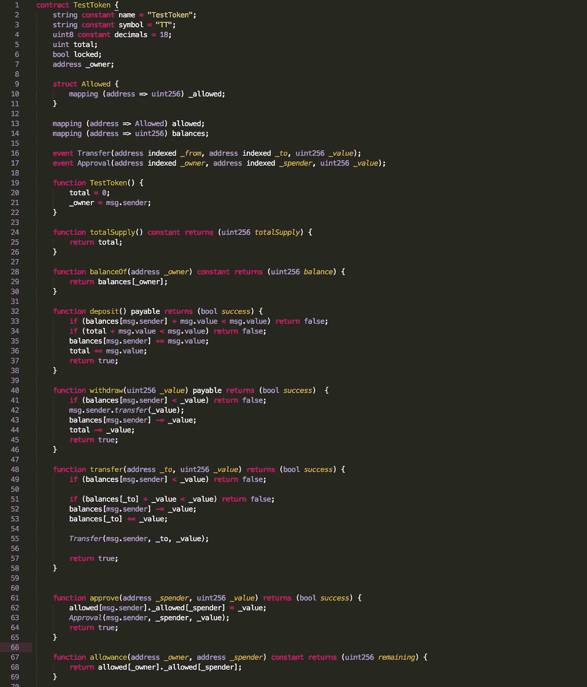

# 智能合同蜜罐现象

> 原文：<https://medium.com/coinmonks/the-phenomena-of-smart-contract-honeypots-755c1f943f7b?source=collection_archive---------0----------------------->

密码世界几乎没有一周不发生大规模的黑客攻击。攻击者的目标不仅仅是集中式交易所。像 [DAO](https://www.coindesk.com/understanding-dao-hack-journalists/) 、 [Parity1](https://steemit.com/cryptocurrency/@etheraveum/parity-wallet-hack-explained) 和 [Parity2](https://blog.springrole.com/parity-multi-sig-wallets-funds-frozen-explained-768ac072763c) 这样的成功黑客攻击表明，智能合同中的漏洞可能导致价值数百万美元的数字资产丢失。攻击者受到利润的驱动，随着 2017 年加密世界令人难以置信的价值升值，持有或管理数字资产的个人和组织经常容易受到攻击。尤其是智能合约已经成为攻击者的主要目标，原因如下:

> [发现并回顾最佳区块链软件](https://coincodecap.com)

*   **交易的终结:**这是区块链系统的一个特殊属性，它意味着交易(或状态更改)一旦发生，就无法收回，或者至少不会产生严重后果，在 DAO hack 的情况下会导致硬分叉。对于以智能合约为目标的攻击者来说，终结性是一个很好的属性，因为成功的攻击不容易被撤销。在传统的银行系统中，这是非常不同的，即使攻击最初是成功的，也可以被阻止，并且如果发现得足够早，任何交易都可以被回滚。
*   **将成功的攻击转化为金钱非常简单**:一旦智能合约的资金可以被提取到攻击者的账户上，攻击者就可以将资金转移到交易所并在隐瞒自己身份的情况下兑现，如果他们足够小心的话。
*   **合同源代码/字节码的可用性:**以太坊是一个公共区块链，因此至少智能合同的字节码可供任何人使用。以太扫描等区块链探索者还允许将源代码附加到智能合同上，从而为潜在的攻击者提供了访问高级可靠性代码的权限。

既然我们现在已经确定了攻击者为什么会发现智能合约是有吸引力的目标，那么让我们进一步研究一下可能决定智能合约是否会受到攻击的环境:

1.  **平衡**:智能合约的平衡越大，越多的攻击者会试图攻击它，他们愿意花更多的时间来寻找漏洞。这是一个比非智能合同目标更简单的经济等式，因为可能被窃取的余额是公开的，攻击者可以确定一次成功的攻击有多有利可图。
2.  **难度/时间**:这是方程中的未知变量。然而，寻找潜在目标的方法可以通过使用智能合同漏洞扫描器来自动化。源代码的可用性进一步减少了分析时间，同时也降低了潜在攻击者破解智能合同的门槛，因为字节码更难阅读，因此需要更多的技能和时间来分析。

考虑到上述两个因素，可以假设发布到主网的具有足够余额的每个智能合同都由扫描器自动分析或/和由人工分析漏洞，并且如果它实际上是易受攻击的，则可能会被利用。公共链上的经济激励和智能合同的可用性催生了一个非常活跃的群体攻击者，他们试图从易受攻击的智能合同中窃取信息。在这个更大的攻击者群体中，一些人似乎专门通过创建看似脆弱的智能合同来攻击黑客。在许多方面，这些合同与蜜罐系统有相似之处。创建它们是为了利用以下属性来引诱攻击者:

*   平衡:蜜罐的初始平衡通常在 0.5-1.0 ETH 之间。
*   漏洞:代码中的一个弱点，似乎允许攻击者提取所有资金。
*   恢复机制:允许所有者收回资金，包括攻击者的资金。

让我们分析一下我在过去几周遇到的三种不同类型的智能合同蜜罐。

# 蜜罐 1:乘数 3

该合同的源代码发布在 [Etherscan](https://etherscan.io/address/0x5aa88d2901c68fda244f1d0584400368d2c8e739#code) 上，带有一个看似易受攻击的功能。试着发现陷阱。

**分析(！剧透！):**

这是一个非常短的契约，函数 *multiplicate()* 是唯一一个允许契约所有者之外的任何人调用的函数。乍一看，通过转移超过合同当前余额的金额，可以提取全部余额。第 29 行和第 31 行的语句都试图强调这样一个观点，即 *this.balance* 在函数完成后以某种方式被记入贷方。这是一个陷阱，因为 *this.balance* 在调用 *multiplicate()函数*之前更新**，所以 *if(消息值> =this.balance)* 永远不会为真，除非 *this.balance* 最初为零。**

似乎真的有人尝试过用 1.1 Ether 调用 *multiplicate()* 。不久之后，业主已经[提取了](https://etherscan.io/tx/0xbf4930b18953d0df8a24857557d480468ad6342d7e9b32ab2c360674fc1696fd)全部余额。

# 蜜罐 2:礼物 1

这个合同有一个很有前途的名字，如果你想自己找出这个陷阱，看看这里的代码。另外查一下[交易日志](https://etherscan.io/address/0x75041597d8f6e869092d78b9814b7bcdeeb393b4)…0xc 4126 a 64 c 546677146 FFB 3 F3 D5 a6 f 6 D5 a2 f 94 df 1 为什么会丢 1 ETH？

**分析(！剧透！):**

看来 0xc 4126 a 64 c 546677146 FFB 3 F3 D5 a6 f 6 D5 a2 f 94 df 1 做的都没错。首先调用 *SetPass()* 来覆盖 *hashPass* ，然后调用 *GetGift()* 来收回以太网。此外，攻击者确保 *PassHasBeenSet()* 没有被调用。那么是哪里出了问题呢？

为了理解*蜜罐 2* 的一个重要信息是澄清什么是内部交易。根据[以太坊黄皮书](https://ethereum.github.io/yellowpaper/paper.pdf)中的规范，它们实际上并不存在(术语见附录 A)。交易只能由外部参与者发送给其他外部参与者或非空的关联 EVM 码账户或通常称为智能合约的账户。如果智能合约在彼此之间交换价值，那么它们执行的是消息调用而不是交易。以太扫描和其他区块链探索者使用的术语可能会产生误导。

有趣的是，如果数据来自一个熟悉的来源，人们是如何把信息当作既定事实的。在这种情况下，以太网扫描不会显示所发生的全部情况。假设交易(或消息调用)应该显示在内部交易选项卡中，但似乎来自其他合同的调用(将 *msg.value* 设置为零)当前没有列出。另一方面，Etherchain 显示了使用正确的散列来调用 *PassHasBeenSet()* 的[事务](https://www.etherchain.org/tx/edde32b2166647e0210bd137c18b8b8833777796f11113cc7257934d5a708823)(或消息调用)，因此拒绝任何未来的密码重置。攻击者(在这种情况下更像是受害者)也可以更加小心，例如实际读取了与 Mythril 的合同存储。很明显 p *assHasBeenSet* 已经被设置为真。

# 蜜罐 3:测试令牌

我从蜜罐合同[whalegiveway 1](https://github.com/thec00n/smart-contract-honeypots/blob/master/WhaleGiveaway1.sol)(见分析)中获得诀窍，并将其与我自己的一个想法结合起来。这份合同在我的 Github 上[这里](https://github.com/thec00n/smart-contract-honeypots/blob/master/TestToken.sol)有。这里少了点什么…

**分析(！剧透！):**

这个合同依赖于一个非常简单而有效的技术。如果启用了水平滚动，它会使用大量的空白将一些代码推到右边，使编辑器看不到这些代码。当你在混音中尝试这种方式，并且纯粹依赖滚动技巧，就像在 *WhaleGiveaway1* 中一样，那么这个技巧实际上不起作用。如果攻击者复制代码并实际上能够在本地利用该问题，但随后在主网上失败，这将是有效的。这可以使用块号来完成。基于所使用的网络，块号与主网络有很大不同。

**加纳切:**从 0 开始

**Testrpc** :从 1150000 开始

几周前大约 2596174

**主网**:几周前 5040270 左右

因此，第一个 if 语句仅在主网上为真，并将所有 ETH 转移给所有者。在其他网络中，不执行“不可见”代码。

*if(block . number>5040270){ if(_ owner = = msg . sender){ _ owner . transfer(this . balance)；} else {抛出；}}*

EtherScan 也启用了水平滚动，但他们在几周前取消了它。

## TL；速度三角形定位法(dead reckoning)

智能合同蜜罐作者在试图从易受攻击的智能合同中获利的更大黑客群体中形成了一种非常有趣的亚文化。总的来说，我想给任何人以下建议:

*   小心你发送的 ETH，它可能是一个陷阱。
*   做好人，不偷人家东西。

我已经为蜜罐智能合约[创建了一个 Github 回购协议。如果你自己有任何想要分享的蜜罐合同，请随时将它们推至回购或在评论中分享。](https://github.com/thec00n/smart-contract-honeypots)