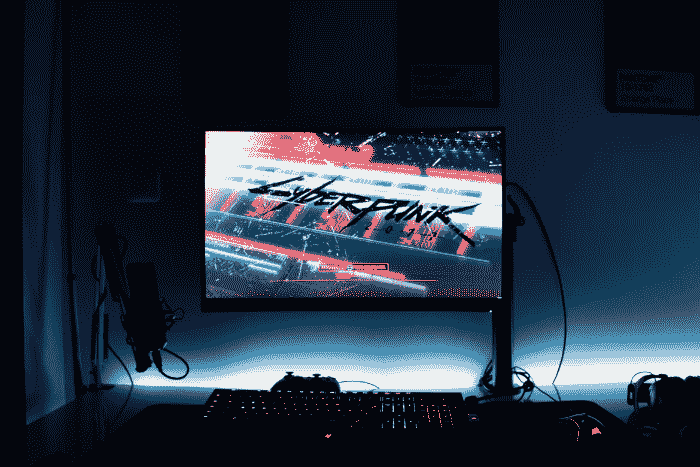

# 区块链游戏的不良形态

> 原文：<https://medium.com/coinmonks/the-poor-shape-of-blockchain-gaming-bf7428ac1933?source=collection_archive---------10----------------------->

一个允许用户从他们的在线行为中“赚取”的真正的免费游戏模式对于游戏来说是必要的。

可悲的是，目前“玩赚”游戏的模式并不完全诚实。Axie Infinity、Splinterlands 和其他声称遵循这种模式的游戏，即使在开始阶段也需要投入大量资金。

不过，这种模式是基于新的“游戏玩家”加入，向老玩家付费。由于开始盈利所需的初始投资不仅仅是为了娱乐而购买一款游戏，因此这种模式的名称具有误导性。

正确的说法应该是“付出才能赢得，或许才能获得”。特别是在 Axie Infinity 中，初始投资可以轻松达到 1000 美元，为该平台的新用户创造了巨大的进入壁垒。

区块链游戏中缺乏高质量的游戏不利于区块链游戏在行业中的地位。利用新用户来支持早期用户的模式是不负责任的，也没有吸引力。

模型应该可以自由发挥。取而代之的是一个充满机会的广阔世界，并且总是以技能为基础，而不是伪装成“玩到赚”的 P2W 系统。

# 低劣的设计和游戏性

仔细看看区块链的游戏，它们没什么大不了的，包含简单的图形，几乎没有动画，设计一般。游戏玩法是所有关于统计数据，使这些游戏只是另一个纸牌游戏。这些游戏被认为具有的竞争优势是赚钱功能。NFT 和在分散市场中销售它们的能力。

与博彩业提供的游戏体验相比，区块链博彩业仍处于不佳状态。情况如此糟糕，以至于 90 年代早期的 Amiga 运动会看起来比区块链运动会更好。

数量有限的开发人员的个人尝试，这些尝试在资金较少的情况下独自取得了显著的成就，但当有育碧、EA、任天堂、索尼、动视等竞争时。，它变得令人沮丧。

没有尖端的图形，动画，或者至少是稳定的游戏来吸引数以亿计的游戏玩家进入区块链游戏。

没有人会放弃英雄联盟，魔兽世界，或者使命召唤而开始玩 Axie Infinity。

游戏的目的是娱乐，而迄今为止，每一款区块链游戏都没有抓住这一点。

当然，在任何网络世界(如 RPG 或 3D 射击游戏)中，整个经济都是存在的。这就是使用 NFT 技术变得重要的地方。然而，目前取决于游戏行业是否采用 NFTs，或者将其视为对不将数字资产控制权交给游戏玩家的商业模式的威胁。

没有玩家大规模迁移到区块链游戏。任何玩 Axie 和 Splinterlands 的人都只是为了“赚钱”。任何有足够自尊的游戏玩家都会认为这些游戏是浪费时间，因为它们提供的刺激和成就感有限。

# 结论

[*来源*](https://unsplash.com/photos/Bp_-zo3Nl28)

2020 年，整个游戏产业将会蓬勃发展，收入将达到 370 亿美元。然而，现代游戏产业为游戏玩家提供的体验超出了预期。

虚拟现实现在正成为一个热门话题，数十亿美元涌入 R&D 开发元宇宙。

相反，我们的区块链游戏无法与 80 年代的街机游戏竞争，甚至无法与 90 年代第一款 VGA 和主机游戏带来的惊人感觉竞争。

多年来，我们只是在这个行业的区块链部分发现纯粹的投机和糟糕的游戏。没有一个平台给人留下足够深刻的印象，也没有任何一个平台有被广泛采用的潜力。

这个领域的竞争是激烈的，任何进入区块链游戏利基的资金都不会再投资于研究，这是区块链游戏领域在这 4-5 年中没有发展的主要原因。

Writing at the following websites: ● [ReadCash](https://read.cash/@Pantera) ● [NoiseCash](https://noise.cash/u/Pantera99) ● [Medium](/@panterabch) ● [Hive](https://hive.blog/@pantera1) ● [Steemit](https://steemit.com/@pantera1) ●[Vocal](https://vocal.media/authors/pantera) ● [Minds](https://www.minds.com/pantera99/) ● [Twitter](https://twitter.com/Panterabch) ● [LinkedIn](https://www.linkedin.com/in/panterabch/) ● [email](https://read.cash/@Pantera/localcryptos-p2p-exchange-is-now-offering-bitcoin-cash-trading-06637230#bad-link)

> **免责声明**:本内容发布的所有材料均用于娱乐和教育目的，并符合**公平使用**的准则。无意侵犯版权。如果您是或代表本文所用材料的版权所有者，并且对所述材料的使用有疑问，请发送 [**电子邮件**](https://read.cash/@Pantera/cryptouknowns-battlegrounds-the-crypto-battle-royal-part-i-0ca762da#bad-link) 。

***支持内容创作者。***

如果你喜欢这个故事，就订阅吧！

*原载于*[*https://read . cash*](https://read.cash/@Pantera/the-poor-shape-of-blockchain-gaming-4838b0fe)*。*

> 加入 Coinmonks [电报频道](https://t.me/coincodecap)和 [Youtube 频道](https://www.youtube.com/c/coinmonks/videos)了解加密交易和投资

## 也阅读

 [## 最佳 4 个加密交易信号电报通道

### 这是乏味的找到正确的加密交易信号提供商。因此，在本文中，我们将讨论最好的…

medium.com](/coinmonks/best-crypto-signals-telegram-5785cdbc4b2b)  [## 获取信号、交易机器人和套利

### 编辑描述

blog.coincodecap.com](https://blog.coincodecap.com/bitsgap-review)  [## 40 个最佳电报频道，用于加密、电影、表演和演讲| CoinCodeCap

### 随着我们周围无限的信息，我们很难筛选和了解有价值的信息。电报有…

blog.coincodecap.com](https://blog.coincodecap.com/best-telegram-channels)  [## 5 个最佳社交交易平台[2021] | CoinCodeCap

### 困惑于社交交易和副本交易哪个平台最好？本文将带您了解各种…

blog.coincodecap.com](https://blog.coincodecap.com/best-social-trading-platforms)  [## BlockFi 评论 2021:利弊和利率| CoinCodeCap

### 编辑描述

blog.coincodecap.com](https://blog.coincodecap.com/blockfi-review)  [## 如何在印度购买比特币？2021 年购买比特币的 7 款最佳应用[手机版]

### 如何使用移动应用程序购买比特币印度

medium.com](/coinmonks/buy-bitcoin-in-india-feb50ddfef94)  [## 加密税务软件——五大最佳比特币税务计算器[2021]

### 不管你是刚接触加密还是已经在这个领域呆了一段时间，你都需要交税。

medium.com](/coinmonks/best-crypto-tax-tool-for-my-money-72d4b430816b)