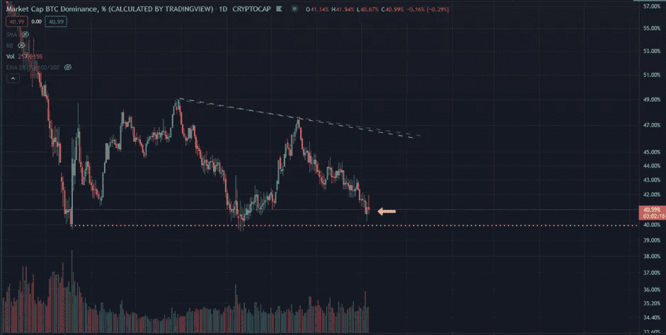
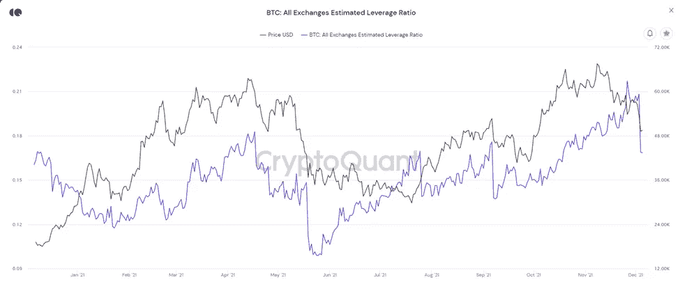
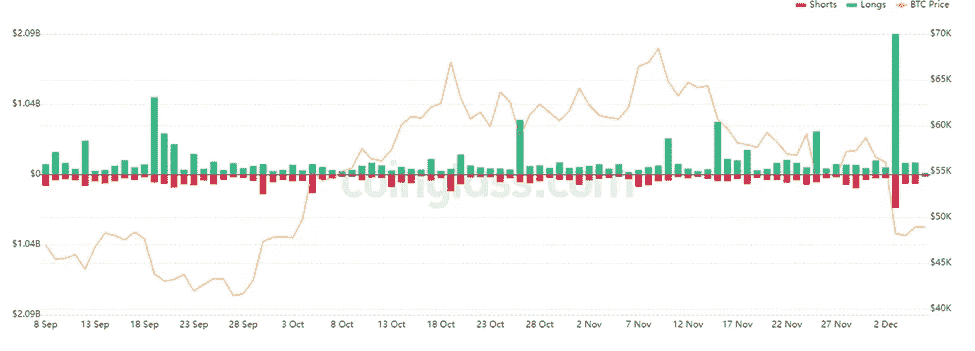
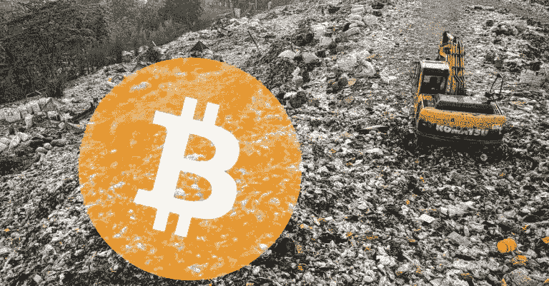
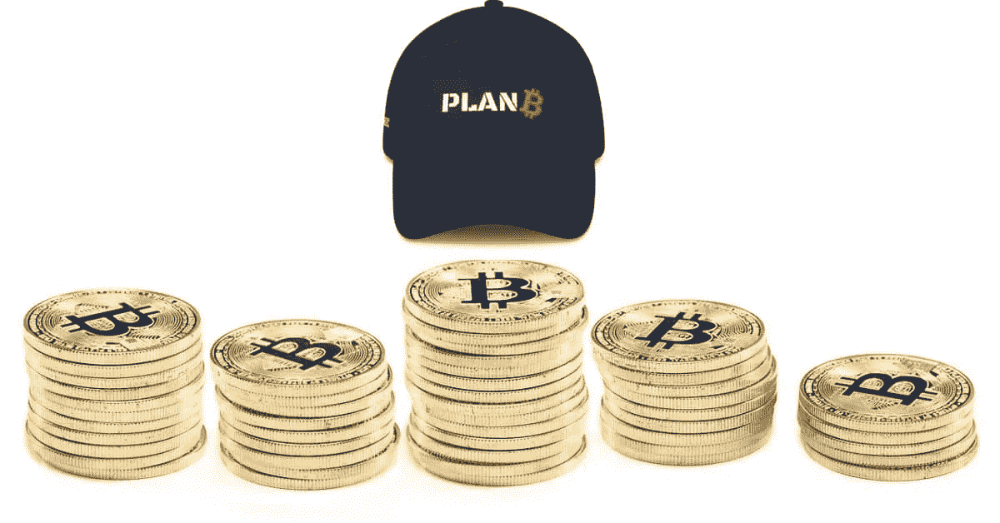
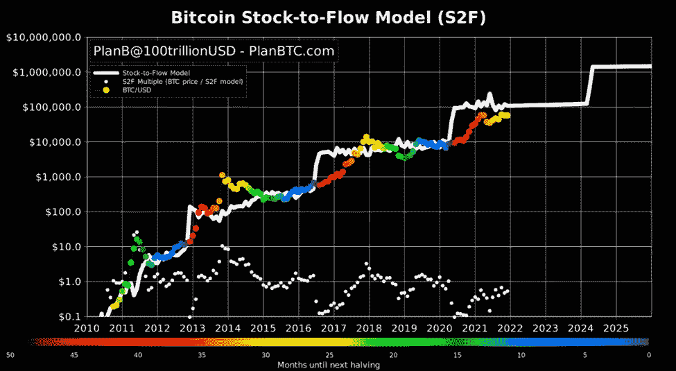

# 抛售的积极一面

> 原文：<https://medium.com/coinmonks/the-positive-side-of-the-selloff-34345dc3883c?source=collection_archive---------11----------------------->

## **加密市场更新与投资报告 12.6**

抛售洞察|主要市场新闻|值得关注的事件|本周关注的硬币|新手:B 计划和 S2F 模型

Photo by [Zoltan Tasi](https://unsplash.com/@zoltantasi?utm_source=medium&utm_medium=referral) on [Unsplash](https://unsplash.com?utm_source=medium&utm_medium=referral)

**概述**

*   市场洞察力:抛售的积极一面
*   主要市场新闻
*   值得注意的事件
*   新手的每日一课:B 计划和库存流向模型
*   每周硬币观察列表

# **市场洞察:抛售的积极一面**

对于密码持有者来说，这是一个非常熊市的周末，比特币在周五晚些时候的四个小时内跌至 42k，损失了 20%。一些交易者趁机进入 **ETH、MATIC 和 LUNA** 等热门替代币。这些替代硬币是过去几周表现最好的。它们拥有最高的 TVL 和最高的采用率。如果市场决定回到看涨形态，我将看好这些硬币在未来几个月的表现。更多的投机性替代硬币，如卡尔达诺和波尔卡多特表现不佳。

收益者(12 月 2 日-目前与比特币)

*   瑞士联邦理工学院/BTC +7.36%
*   卢娜/BTC +9.15%
*   马蒂奇/BTC +0.04%
*   索尔/BTC -5.72%

失败者

*   美国残疾人协会/BTC -20.22%
*   交通部/BTC -23.62%

在市场抛售期间从比特币转向替代比特币是非典型行为。比特币的统治地位(BTC。d)接近 39.64%的历史低点，12 月 5 日最低触及 40.65%。比特币是否会突破这一水平，或者是否会开始复苏，这将是一件有趣的事情。

BTC Dominance %

**好人**

并非所有来自市场抛售的消息都是坏消息。这为大规模去杠杆化创造了条件，54 亿美元的期货合约被平仓。这有助于降低今年处于高位的杠杆率。12 月 4 日见证了 25 亿美元的多头和空头清算。摆脱杠杆将有助于市场回归更自然的状态。

BTC: Exchange Leverage Ratio

BTC Futures Liquidations

# 加密市场更新

**比特币(BTC)** 经历了两天的低价波动后，自大抛售以来，比特币表现得相当平静。BTC 目前处于 48k-50k 的主要阻力之下。

**比特币的统治地位(BTC。D)** 继续其下降轨迹至 **40.84%** 。

尽管市场动荡，但在创下历史新高后，Terra (LUNA)暂时喘口气。露娜下跌- **5.78%** 。当我本周晚些时候报道时，我会解释为什么 LUNA 做得这么好。这是我过去关于露娜的报道中的一个提示。

**Polygon (MATIC)** 继续向上运动，当天上涨 **+7.02%** ，过去 3 天上涨 21%。在 MATIC 中，音量显著增加。它得到了新的 zk-Rollup 扩展努力和新的资金努力的帮助。

> ***比特币恐惧与贪婪指数 16 极度恐惧***
> 
> ***比特币谷歌趋势 36***

> [*了解我为什么在报告中使用比特币恐惧和贪婪指数*](/@TraderGabi/when-can-we-start-buying-again-c3ffc2a1cd3b)

# **主要市场消息**

[世界各国央行旗下的国际清算银行发布报告，将分散金融(DeFi)命名为“分散幻觉”，并表示这将“破坏金融稳定”。](https://cointelegraph.com/news/bank-of-international-settlement-calls-the-rise-of-decentralized-finance-an-illusion-in-latest-quarterly-review) DeFi 协议目前锁定了 2460 亿美元的总价值(TVL)。银行开始看到金融去中心化的真正威胁，预计随着时间的推移，这些文章会越来越多。

[Gray Scale 完成了一项调查，以帮助说服 SEC 推出比特币现货价格 ETF。调查发现，25%的受访投资者目前持有比特币。](https://cointelegraph.com/news/grayscale-finds-that-over-25-of-us-households-surveyed-currently-own-bitcoin)

[拜登政府发布了“反腐败战略”报告，将数字资产、房地产市场和离岸避税天堂列为重点领域。](https://www.theblockcrypto.com/linked/126467/biden-admin-spotlights-digital-assets-in-global-corruption-calling-for-greater-aml?utm_source=rss&utm_medium=rss)

[《纽约客》发表《5 亿比特币，丢在垃圾堆里》。一篇关于一名威尔士人试图找到一个多年前丢弃的硬盘驱动器的文章，以今天的价格计算，该硬盘驱动器价值数十亿美元。](https://www.newyorker.com/magazine/2021/12/13/half-a-billion-in-bitcoin-lost-in-the-dump)

# **值得注意的事件**

*   中本聪游戏(NAKA)推出 mainnet
*   Syscoin (SYS)推出 NEVM Mainnet
*   DefiChain (DFI)从 12 月开始全面发放流动性奖励
*   Elastos (ELA)明天奖金减半
*   [你现在可以加入 CRYPTO VS 僵尸 IDO](https://gleam.io/HJykM/cryptovszombie-ido-whitelist)

# **新手的每日一课**

**计划 B 库存转流动模型**

随着最近的抛售，比特币打破了一个主要趋势，我将在本周的某个时候谈到这一点。为了帮助你，我将首先解释 Plan B 的存量到流量模型，这样你可能会了解一些比特币价格预测的来源。如果你想进一步研究 b 计划，我也会给你一些资源

从历史上看，比特币一直是一种难以建模的资产，因为此前从未有过类似的资产。它被创造出来并被释放到世界上。比特币最初的概念是作为一种纯粹的货币，当它达到一美元的价值时，许多人庆祝。但由于其稀缺性和低供应流量，价格持续上涨。比特币当时被吹捧为电子黄金，直到最近的叙事将比特币标签为金融资产。名称和目的的演变很可能没有完成。比特币和加密领域不断变化的格局给这些资产的定价带来了困难。

Plan B 是一个匿名的在线角色，于 2013 年开始购买比特币。他可能是一名荷兰机构投资者，拥有定量分析、银行和金融法学位。受比特币标准中黄金和稀缺资产*的存量到流量模型的启发，Plan B 在 2019 年创建了比特币的存量到流量模型。*

BTC S2F Modal

该模型考虑了比特币独特的供应结构和减半，是历史上最准确的模型。模型中的白线是比特币的供应结构，陡峭的台阶代表减半。圆点代表价格，颜色代表接近减半。红色是距离减半最远的点，蓝色是最近的点。

S2F 模型因其历史准确性而风靡全球。如果你想知道这个周期的 10 万比特币预测来自哪里，它来自这个图表。尽管 S2F 模型并不完美，但它在预测长期价格模式方面相当准确。你可以在推特[@ 100 万亿美元](https://twitter.com/100trillionUSD)上关注 B 计划。要了解更多关于 B 计划和 S2F 模式的信息，请访问此[网站](https://planbtc.com/#planB)。

现在你已经知道了 S2F 模型，请继续关注本周的报道，看看我们目前的价格和预测。

# **本周要看的币:**

*   以太坊
*   多边形(MATIC)
*   地球(月球)
*   卡尔达诺
*   阿尔格兰德(ALGO)

我计划在本周的报道中深入理解这种大规模抛售，希望它能让我们了解如何为短期未来制定计划。我将进入技术分析，链上指标，并从其他来源收集一些意见。请继续关注并继续积累密码！

感谢阅读 fam！

# TraderGabi

> 加入 Coinmonks [电报频道](https://t.me/coincodecap)和 [Youtube 频道](https://www.youtube.com/c/coinmonks/videos)了解加密交易和投资

## 也阅读

 [## 杠杆代币[多头代币]终极指南

### 杠杆化令牌是具有杠杆化风险敞口的 ERC20 令牌，不考虑保证金、要求、管理…

medium.com](/coinmonks/leveraged-token-3f5257808b22)  [## 最佳加密交易所| 2021 年十大加密货币交易所

### 加密货币交易所的加密交易需要了解市场，这可以帮助你获得利润。之前…

blog.coincodecap.com](https://blog.coincodecap.com/crypto-exchange)  [## 2021 年最佳加密借贷平台| 6 大比特币借贷平台

### 获得比特币和其他加密货币的最佳贷款利率

medium.com](/coinmonks/top-5-crypto-lending-platforms-in-2020-that-you-need-to-know-a1b675cec3fa)  [## 2021 年最佳免费加密交易机器人

### 2021 年币安、比特币基地、库币和其他密码交易所的最佳密码交易机器人。四进制，位间隙…

medium.com](/coinmonks/crypto-trading-bot-c2ffce8acb2a)  [## 最佳 4 个加密交易信号电报通道

### 这是乏味的找到正确的加密交易信号提供商。因此，在本文中，我们将讨论最好的…

medium.com](/coinmonks/best-crypto-signals-telegram-5785cdbc4b2b)  [## 获取信号、交易机器人和套利

### 在本文中，我们将回顾 Bitsgap，这是一个满足您所有交易需求的一站式加密交易平台。它…

blog.coincodecap.com](https://blog.coincodecap.com/bitsgap-review)  [## 5 个最佳社交交易平台[2021] | CoinCodeCap

### 困惑于社交交易和副本交易哪个平台最好？本文将带您了解各种…

blog.coincodecap.com](https://blog.coincodecap.com/best-social-trading-platforms)  [## BlockFi 评论 2021:利弊和利率| CoinCodeCap

### 今天，我们提出了一个全面的 BlockFi 评论，这是一个成立于 2017 年的加密贷款平台，拥有其…

blog.coincodecap.com](https://blog.coincodecap.com/blockfi-review)  [## 如何在印度购买比特币？2021 年购买比特币的 7 款最佳应用[手机版]

### 如何使用移动应用程序购买比特币印度

medium.com](/coinmonks/buy-bitcoin-in-india-feb50ddfef94)  [## 加密税务软件——五大最佳比特币税务计算器[2021]

### 不管你是刚接触加密还是已经在这个领域呆了一段时间，你都需要交税。

medium.com](/coinmonks/best-crypto-tax-tool-for-my-money-72d4b430816b)  [## 存储比特币的最佳加密硬件钱包[2021] | CoinCodeCap

### 保管您的数字资产很容易，但找到正确的存储方式却是一项繁琐的任务。在线钱包有一个风险…

blog.coincodecap.com](https://blog.coincodecap.com/best-hardware-wallet-bitcoin)  [## Pionex 评论 2021 |免费加密交易机器人和交换

### Pionex 是为交易自动化提供工具的后起之秀。Pionex 上提供了 9 个加密交易机器人…

medium.com](/coinmonks/pionex-review-exchange-with-crypto-trading-bot-1e459d0191ea)