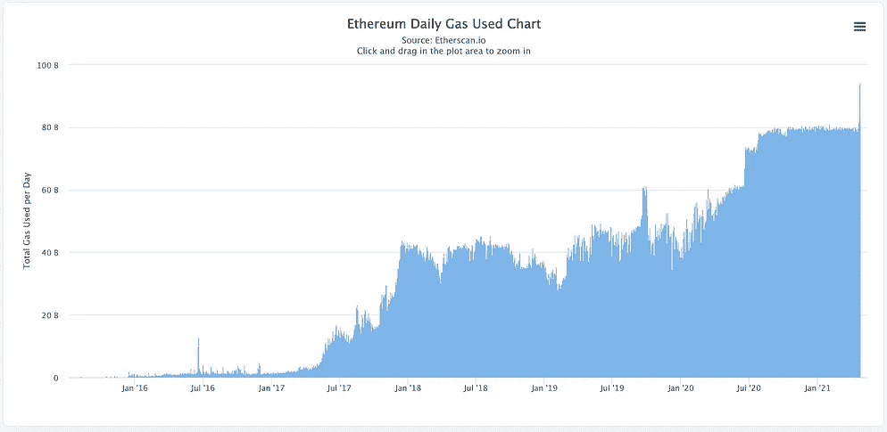

# ETH 的力量和效用

> 原文：<https://medium.com/coinmonks/the-power-and-utility-of-eth-8a6f6858a2b6?source=collection_archive---------2----------------------->

## ETH 是有史以来最有用的加密货币

Image from [Pinterest](https://www.pinterest.com/ethereum/ethereum-wallpapers/)

*免责声明:本文出于教育目的。希望人们发现这些更新有助于跟上这些天来 crypto 飞速发展的步伐。*

*这不是财务建议；你总是对硬币进行尽职调查吗:)*

几周前，[巴拉吉·斯里尼瓦桑](https://twitter.com/balajis)，一位著名的企业家和加密倡导者，参加了[蒂姆·费里斯节目](https://tim.blog/2021/03/24/balaji-srinivasan/)谈论比特币的未来。

当被问及作为一名加密投资者，他将如何花费 1 亿美元时，他说最简单的事情就是“50/50 比特币和 ETH”。

当时，比特币的交易价格在 50，000 美元左右，以太网的交易价格在 2300 美元左右。

今天，在五天内经历了两次创纪录的抛售后，比特币交易价格为 49000 美元，以太网交易价格为 2300 美元。

你想拿走什么就拿走什么。

说实话，比特币最初并没有引起我的兴趣。

对于我这个务实的大四第二学期的学生来说，所有这些关于无许可金融网络的言论似乎有点太牵强，太微不足道了。

不，真正吸引我的是对以太坊的了解。

[世界计算机](https://www.coindesk.com/whats-big-idea-behind-ethereums-world-computer)，能够利用全球数千台计算机运行程序和应用。

[一个无限的网络](https://thedailygwei.substack.com/p/the-infinity-network-the-daily-gwei?token=eyJ1c2VyX2lkIjo1NDE1NTA1LCJwb3N0X2lkIjozNTMyODQ1OCwiXyI6Ik9FZU5aIiwiaWF0IjoxNjE5MjI5NDQzLCJleHAiOjE2MTkyMzMwNDMsImlzcyI6InB1Yi01Mjg5MyIsInN1YiI6InBvc3QtcmVhY3Rpb24ifQ.FMry7ePncf-Jahu43SKzFckHJ9AJCj2or6ujBiGNC3k)，任何人都可以在世界任何地方建造他们想要的任何东西——利用彼此的代码来推动创新。

带 DeFi 的可编程货币。带 NFTs 的可编程媒体。使用 DAOs 的可编程法则。

远比点对点支付系统有趣。

回顾其最初的概念，以太坊的愿景正在快速实现。

任何其他平台都无法接近活跃开发者的数量和基于以太坊的应用程序的数量。

似乎每周，以太坊都在一系列指标上打破历史新高:每日交易量、锁定的总价值、以太价格、唯一地址等。

以太坊有如此多的好消息，以至于我可以坦率地写一整篇文章来说明为什么我如此看好以太坊这项技术。

**然而，今天我将限制自己谈论以太，以太坊的本地货币，以及为什么它有潜力甚至超过比特币——因为这种资产的纯粹用途。**

# 作为商品的效用

以太是以太坊平台的固有资产——这意味着它用于处理区块链上的任何事务或状态变化。

用户和开发者使用以太作为“气体”，以便为以太坊上运行的应用“加油”；这种“气体”被发送给矿工，作为确认交易的报酬。

每次计算都有一个固定的天然气价格——这意味着交易越复杂，价格就越贵。

例如，与利用 DEX 流动性池套利机会进行快速贷款相比，将乙醚从一个钱包转移到另一个钱包相对便宜。

**由于以太被用作网络的气体，与比特币这样的纯货币/价值储存相比，它本质上具有实用性。**

因此，人们想要持有以太——就像人们想要持有石油来驱动机器一样。

随着以太坊网络的使用越来越多，对以太的需求也会越来越大。正如我之前提到的，网络在网络流量和交易方面不断突破 ATHs。

Daily transactions and daily gas (i.e., Ether) used over time. Source: Etherscan.io

# 应用中的效用

除了天然气，以太还可以通过分散的金融应用程序实现多种用途(我可以互换地称它们为‘dapps’或‘DeFi apps’)。

以[制造者](https://makerdao.com/en/)为例。通过 Maker，用户可以将乙醚抵押成一种与美元挂钩的稳定货币，称为“戴”。

更有趣的是，像 Compound 或 Aave 这样的其他 dapps 允许用户抵押他们的 Dai 或 ETH 来获得贷款或将其放入“储蓄账户”以获得收益。

以太在 DeFi 中还有更有趣的应用，为了简洁起见，我不会在这篇文章中深入探讨。

**总而言之，通过 DeFi，ETH 变成了一种收益率资产，或者说是一种让用户获得更多资本的资产。**

实际上，你可以用 ETH 做一些事情——除了持有它、发送或接收之外。

ETH 的这一使用案例非常受欢迎，在 DeFi 应用中使用了超过 500 亿美元的资产(称为“锁定”)。

Source: defipulse.com

最棒的是。有成千上万疯狂聪明的开发人员致力于让以太变得更有趣、更有用。

# 作为碱基对的效用

比特币在 2017 年上涨的一个很大原因是因为它是唯一一个与其他替代硬币配对的基础货币。当时，几乎没有法定入口，所以投资者必须购买比特币，然后用他们真正想要的另一种硬币进行交换。

*注意:我不知道这种说法的来源，但我从很多人那里向你保证，这确实是 2017 年的情况。也许我会试着看看币安的历史清单——尽管很难找到。*

就 DeFi 而言，尤其是 Uniswap 和 Sushiswap 等以太坊指数，这些新的 ERC20 令牌的主要交易对手仍然是 ETH。

The most traded pairs on Uniswap all have something in common… Source: info.uniswap.org

这意味着，对于几乎所有试图交易 DEX 的人，或者试图获得一种没有在比特币基地或币安等集中交易所上市的新硬币的人来说，如果他们想获得最大的流动性，从而获得最少的滑点(即获得硬币的“最便宜”方式)，他们*必须在交换前首先持有 ETH。*

# 作为价值储存手段的效用

当然，有理由相信——随着以太网的内在效用和即将到来的关于改进以太坊的大量新闻——人们会将以太网视为一种有吸引力的价值存储投资，以利用以太坊平台的潜在增长。

在过去的几天里，我们看到以太交易所交易基金筹集了[数亿美元的资金](https://decrypt.co/68802/ethereum-etfs-trading-volume-million)——CI Galaxy 等公司和加拿大知名投资公司也参与其中。

像比特币一样，机构投资者和外行散户投资者希望获得一种资产，从理论上讲，这种资产可以对冲法定通胀。

# 结束语

ETH 是一种令人难以置信的强大资产，它动摇了我们认为金钱可以做的事情的界限。

是钱吗？可以，可以收发。

是商品吗？是的，你必须使用它来支付网上交易的费用。

它是有收益的资产吗？是的。你可以锁定它的利率，也可以用它来举债。

然而，尽管乙醚的力量，仍然有很大的改进空间。即围绕以太坊网络的交易——特别是当网络获得越来越多的流量时，它涉及到交易费用的高成本。

我将在以后的帖子中更多地讨论社区是如何解决这些问题的:)

如果你认为这篇博文值得你花上 5 分钟来阅读，请帮我鼓掌(最多 50 次)或者与一个会从这篇内容中受益的朋友分享。非常感谢！

> 加入 Coinmonks [Telegram group](https://t.me/joinchat/PmKOYQ9NNKZlZGNl) 并了解加密交易和投资

## 另外，阅读

*   最好的[密码交易机器人](/coinmonks/crypto-trading-bot-c2ffce8acb2a) | [电网交易机器人](https://blog.coincodecap.com/grid-trading)
*   [加密复制交易平台](/coinmonks/top-10-crypto-copy-trading-platforms-for-beginners-d0c37c7d698c) | [如何在 WazirX 上购买比特币](/coinmonks/buy-bitcoin-on-wazirx-2d12b7989af1)
*   [CoinLoan 点评](/coinmonks/coinloan-review-18128b9badc4)|[Crypto.com 点评](/coinmonks/crypto-com-review-f143dca1f74c) | [火币保证金交易](/coinmonks/huobi-margin-trading-b3b06cdc1519)
*   [尤霍德勒 vs 科恩洛 vs 霍德诺特](/coinmonks/youhodler-vs-coinloan-vs-hodlnaut-b1050acde55a) | [Cryptohopper vs 哈斯博特](https://blog.coincodecap.com/cryptohopper-vs-haasbot)
*   [杠杆代币](/coinmonks/leveraged-token-3f5257808b22) | [最佳密码交易所](/coinmonks/crypto-exchange-dd2f9d6f3769) | [Paxful 点评](/coinmonks/paxful-review-4daf2354ab70)
*   [加密套利](/coinmonks/crypto-arbitrage-guide-how-to-make-money-as-a-beginner-62bfe5c868f6)指南| [如何做空比特币](/coinmonks/how-to-short-bitcoin-568a2d0b4ae5) | [1xBit 回顾](https://blog.coincodecap.com/1xbit-review)
*   [如何在印度购买比特币？](/coinmonks/buy-bitcoin-in-india-feb50ddfef94) | [WazirX 审核](/coinmonks/wazirx-review-5c811b074f5b) | [BitMEX 审核](https://blog.coincodecap.com/bitmex-review)
*   [印度比特币交易所](/coinmonks/bitcoin-exchange-in-india-7f1fe79715c9) | [比特币储蓄账户](/coinmonks/bitcoin-savings-account-e65b13f92451)
*   [币安费用](/coinmonks/binance-fees-8588ec17965) | [Botcrypto 审核](/coinmonks/botcrypto-review-2021-build-your-own-trading-bot-coincodecap-6b8332d736c7) | [Hotbit 审核](/coinmonks/hotbit-review-cd5bec41dafb) | [KuCoin 审核](https://blog.coincodecap.com/kucoin-review)
*   [我的加密副本交易经验](/coinmonks/my-experience-with-crypto-copy-trading-d6feb2ce3ac5) | [购买硬币评论](https://blog.coincodecap.com/buycoins-review)
*   [Bybit 融资融券交易](/coinmonks/bybit-margin-trading-e5071676244e) | [币安融资融券交易](/coinmonks/binance-margin-trading-c9eb5e9d2116) | [Overbit 审核](/coinmonks/overbit-review-9446ed4f2188)
*   [加密货币储蓄账户](/coinmonks/cryptocurrency-savings-accounts-be3bc0feffbf) | [YoBit 审查](/coinmonks/yobit-review-175464162c62) | [Bitbns 审查](/coinmonks/bitbns-review-38256a07e161)
*   [Botsfolio vs nap bots vs Mudrex](/coinmonks/botsfolio-vs-napbots-vs-mudrex-c81344970c02)|[gate . io 交流回顾](/coinmonks/gate-io-exchange-review-61bf87b7078f)
*   [最佳比特币保证金交易](/coinmonks/bitcoin-margin-trading-exchange-bcbfcbf7b8e3) | [萝莉点评](/coinmonks/lolli-review-e6ddc7895ad8) | [比特币保证金交易](https://blog.coincodecap.com/bityard-margin-trading)
*   [创造并出售你的第一个 NFT](https://blog.coincodecap.com/create-nft) | [本地比特币评论](/coinmonks/localbitcoins-review-6cc001c6ed56)
*   [加密保证金交易交易所](/coinmonks/crypto-margin-trading-exchanges-428b1f7ad108) | [赚取比特币](/coinmonks/earn-bitcoin-6e8bd3c592d9) | [Mudrex 投资](https://blog.coincodecap.com/mudrex-invest-review-the-best-way-to-invest-in-crypto)
*   [如何在印度购买以太坊？](https://blog.coincodecap.com/buy-ethereum-in-india) | [如何在币安购买比特币](https://blog.coincodecap.com/buy-bitcoin-binance)
*   [顶级付费加密货币和区块链课程](https://blog.coincodecap.com/blockchain-courses) | [币安评论](/coinmonks/binance-review-ee10d3bf3b6e)
*   [MXC 交易所评论](/coinmonks/mxc-exchange-review-3af0ec1cba8c) | [Pionex vs 币安](https://blog.coincodecap.com/pionex-vs-binance) | [Pionex 套利机器人](https://blog.coincodecap.com/pionex-arbitrage-bot)
*   [在美国如何使用 BitMEX？](https://blog.coincodecap.com/use-bitmex-in-usa) | [BitMEX 审查](https://blog.coincodecap.com/bitmex-review)