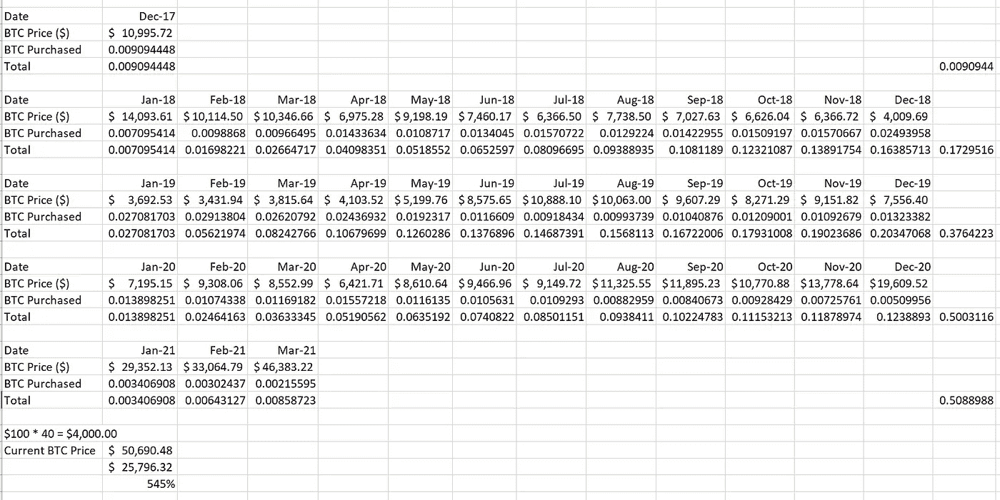
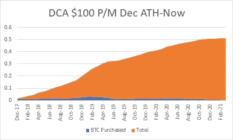
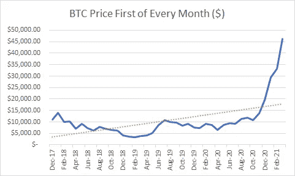
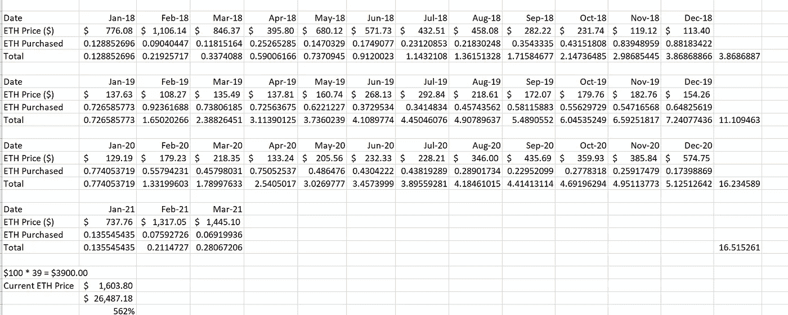
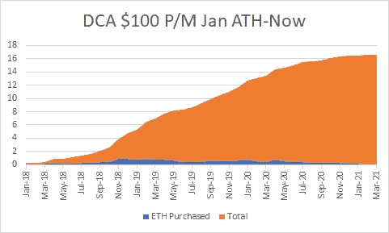
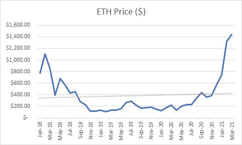

# 平均成本的力量

> 原文：<https://medium.com/coinmonks/the-power-of-dollar-cost-averaging-c0c88be22c5d?source=collection_archive---------1----------------------->

## 高买低卖，要是有那么简单就好了。然而，通过将平均成本作为一种投资策略，你可以中和短期波动以获得长期收益。

# 什么是平均成本？

美元成本平均法(DCA)不是试图把握市场时机来购买一项资产，而是一种在选定时期内进行增量投资的长期投资策略。通过 DCA，投资者可以在短期内降低资产波动的风险。

下面是一个投资者使用 DCA 策略的例子。一位投资者希望建立自己的投资组合，并相信长期来看，英国经济将会改善。因此，这位投资者决定，作为其投资组合的一部分，他们将每月 DCA 到 Vanguard FTSE 100 (VUKE)中，直到退休。投资者希望在退休期间从 VUKE 的分红中受益，用于体验。此外，由于他们相信从长期来看 VUKE 会增加，他们会在这种股票上积累大量的资本，作为遗产流传下来，让后代受益。

虽然回报会比这个投资者正确“选择时机”的回报低得多，但他们受益于情绪上不与购买日期联系在一起。如果这个投资者认为他们可以“把握”市场时机，但错了，他们就会亏损。毕竟，如果我们能“把握”市场时机，我们都会变得非常富有。

> “[投资者]在股价高时大量买入股票，然后在股价低时卖出”(Thaler 和 Sunstein，2009 年，第 132-133 页)

此外，在理查德·塞勒和卡斯·桑斯坦(Cass Sunstein)的推动下，他们在书中的投资部分提到，试图“把握市场时机”的投资者通常会高买低卖。他们通过分析上世纪 90 年代和本世纪初投资于股票的投资者的数据证明了这一点。数据显示，当投资者应该买入股票时，他们没有，当市场升温时，投资者买入。他们这样做既不理性也不经济！

# 美元成本平均加密货币

我对加密货币感兴趣已经有几年了，但我去年才开始投资。随着比特币(BTC)和以太坊(ETH)最近分别从 2017 年和 2018 年创下新的历史新高，我一直很好奇两个峰值之间的 DCA 的结果。

我在这项研究中决定，投资者是 DCA $100 在每个月的午夜开始。我还假设投资者在加密货币创历史新高的那个月开始 DCA，因为他们“买入炒作”。这就是为什么 BTC DCA 从 2017 年 12 月开始，而 ETH DCA 从 2018 年 1 月开始。此外，我使用来自 CoinGecko 的价格数据来表示相应的加密货币

# 从 2017 年 12 月开始的美元成本平均 BTC-现在

下面的电子表格记录了 2017 年 12 月到现在的 40 笔交易。电子表格上的每一行代表一年。我在电子表格中输入了:购买的月份，当天 00:00 时 BTC 的价格，当月 100 美元购买了多少 BTC，最后是当年 BTC 的总金额。

从 2017 年 12 月到现在，DCA BTC 将导致投资者遵循这一策略，每月只有 100 美元(约 72 美元)略高于 0.5 BTC 或略低于 2.58 万美元(2 万美元)。在这段时间内只投资了 4000 美元，回报率达到了令人难以置信的 545%。

在创建这个电子表格时，我发现有趣的是信念是有回报的。在 2018-2019 年期间，BTC 变得大打折扣，但受到了媒体的广泛批评，认为这是一次失败的实验。然而，要让投资者从这种折扣中受益，他们需要有信心，因为他们会研究 BTC，相信其哲学，并继续买入，尽管有风险。

我决定包括这个图表，因为它展示了复合是多么酷。尽管 BTC 的价格在今年 2 月创下历史新高，但在这个假设中，每月 100 美元的小增量为投资者创造了巨大的最终价值。

最后，我附上了这张图表，因为我想了解 BTCs 价格在峰值之间的总体趋势。

也许这些信息可以与其他加密货币一起使用，以确定价格购买机会。具有讽刺意味的是，我在一篇关于 DCA 和无法“把握”市场时机的文章中写了这篇文章，但研究起来还是很有趣的。

由于趋势线正在积极倾斜，DCA BTC 可能会进行调整吗？例如，当这个图表被放大，投资者准备每月存款时，他们能根据 BTC 的价格改变他们的策略吗？因此，当 BTC 的价格高于趋势线时，投资者是否应该投资他们月存款的一半，然后在价格低于趋势线时加倍投资？

# 从 2018 年 1 月开始的平均美元成本-现在

下面的电子表格与上一个类似，根据 ETH 进行了调整。在 BTC 事件后一个月，随着 ETH 价格创下历史新高，只有 39 笔付款，而 BTC 有 40 笔。

尽管 BTC 和 ETH 是两种用途不同的加密货币，但它们在美元方面的表现相对相同。ETH 仅略胜一筹，令人意外。在创建这些电子表格之前，我预计其中一种货币的表现会明显好于另一种，但事实并非如此。

与 BTC 的同一图表相比，有一个显著的差异。这是由于 ETHs 在 2018 年从其 ATH 下跌，在那里以美元计算的价格下跌幅度比 BTC 大得多。这导致在熊市期间能够购买更多的 ETH。

我怀疑 ETH 将在 2021 年创下历史新高，如果投资者在本文发表后继续遵循这一策略，那么与 BTC 相比，ETH 将获得更高的美元收益。

如电子表格所示，两个 ATH 之间的 ETH 变化明显低于 BTC。下图可以说明这一点，因为加入时两个峰值之间的趋势线小于 BTC 的趋势线。如果 ETH 的 ATH 像 BTC 一样出现类似的增长，那么这一趋势线会更大，导致美元大幅上涨。将 BTC 和瑞士联邦理工学院在这两个时期进行比较可以看出，熊市对瑞士联邦理工学院的影响更大。

# 结束语

这篇文章是我出于好奇写的一篇短文。我已经开始 DCA，我很想知道 ETH 和 BTC 在之前的熊市中表现如何。这件作品也产生了一些想法，我将在接下来的几周内以某种方式进行研究。

这项研究向我证明了信念是最基本的。当时局艰难时，继续投资是关键，因为回报会更大。你不会获得与你选择市场时机时相同的收益，但你会从所选期间波动的稳定中受益。

加密货币仍处于起步阶段，但与它们相关的潜在好处让我觉得值得冒险。

如果你有任何问题，请在这篇文章下面评论，或者在 LinkedIn 上联系我，地址是[https://www.linkedin.com/in/wilsonedwardc/](https://www.linkedin.com/in/wilsonedwardc/)

**法律声明:**我不是财务顾问。这里给出的建议不是财务建议，尽管我的兴奋可能会让它看起来像这样。

# 出于好奇

这次没什么好建议的。抱歉。然而，我发现复利的概念真的很有趣，很想了解更多。也许，你这位读者，可以在这个话题上给我一些建议？

> 加入 Coinmonks [电报集团](https://t.me/joinchat/EPmjKpNYwRMsBI4p)，了解加密交易和投资

## 另外，阅读

*   最好的[密码交易机器人](/coinmonks/crypto-trading-bot-c2ffce8acb2a)
*   [印度比特币交易所](/coinmonks/bitcoin-exchange-in-india-7f1fe79715c9)
*   [比特币储蓄账户](/coinmonks/bitcoin-savings-account-e65b13f92451)
*   最好的[加密税务软件](/coinmonks/best-crypto-tax-tool-for-my-money-72d4b430816b)
*   [电网交易](https://blog.coincodecap.com/grid-trading)
*   [最佳加密交易所](/coinmonks/crypto-exchange-dd2f9d6f3769)