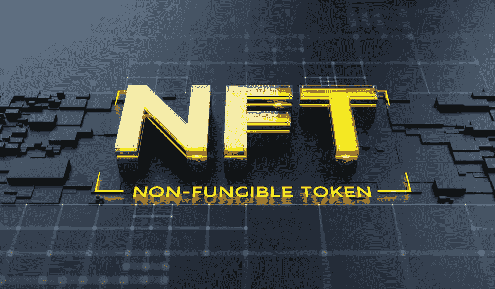
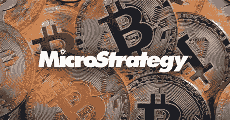

# 非功能测试的实际未来

> 原文：<https://medium.com/coinmonks/the-practical-future-of-nfts-5bfb1cab4e4e?source=collection_archive---------2----------------------->

## 每日加密市场更新和投资报告 12.9

市场洞察|主要加密新闻和事件|新手每日一课

# 概观

*   市场洞察:重新测试支持
*   加密市场更新
*   主要秘密新闻
*   值得注意的事件
*   新手的每日一课:非功能性测试的实际未来

# 市场洞察力

Photo by [Agence Olloweb](https://unsplash.com/@olloweb?utm_source=medium&utm_medium=referral) on [Unsplash](https://unsplash.com?utm_source=medium&utm_medium=referral)

在[周二，我们探讨了暗示大公司不在这个市场销售的连锁指标](/coinmonks/are-we-entering-lengthening-bitcoin-cycles-312a18b6e65e)，Microstrategy 今天又购买了价值 8200 万美元的 BTC 来支持这一证据。我们今天得到了一些坏消息，推动市场下跌，但新闻情绪往往是暂时的。尽管恒大违约，但对比特币主要支撑的重新测试是不可避免的。这不公正地再次引发了对熊市的担忧。

Altcoins 受到的打击最大，所有主要 L1 今天都在挣扎。

**ETH — 5.85%**

**点— 8.34%**

**阿达— 6.11%**

**溶胶— 5.54%**

较小的项目更糟糕。

最近的走势**并没有**显示出很大的成交量，并提高了 48k 支撑位保持住的可能性。今天是一个很好的积累日。市场上有很多恐惧，最好利用这些价格。

投入 crypto 的资金数额太大，无法列出。在我撰写这篇时事通讯的时候，每天都有另外 1.5 亿到 5 亿美元以投资的形式进入市场。这条新闻以及强大的连锁分析正在讲述一个相反的故事时，相比价格下跌。

**发展叙事**

以太坊第二层解决方案最近成为热门话题，包括今天 Polygon 获得 Mir 协议的新闻(如下)。在接下来的几天里，我将尝试介绍一些第二层解决方案。如果你不知道什么是第二层，不用担心，我会把它放在新手区。密切关注 MATIC，因为我预测它将在围绕这个领域的所有宣传中表现良好。最重要的是，最有影响力和最受信任的加密 Youtubers 之一 Coin Bureau 今天在 MATIC 上发布了这个视频。

# 密码市场

Photo by [Jeswin Thomas](https://unsplash.com/@jeswinthomas?utm_source=medium&utm_medium=referral) on [Unsplash](https://unsplash.com?utm_source=medium&utm_medium=referral)

受恒大违约消息影响，比特币(BTC)下跌 5.2%，至 47.8 千比特币。随着形势的发展，恒大的情况将在未来几个月继续困扰市场。比特币继续测试 48k-50k 支持。期待未来几天对这一主要支撑和积累的多次测试。

**总市值——ETH&BTC(Total 3)**是**下跌 4.89%** 和 S **tablecoin 霸主地位(USDT。d)上涨 5.73%** 。交易员正在平仓稳定的比特币，这与最近比特币抛售以太坊(Ethereum)等替代比特币的趋势相反。

Terra (LUNA) 暂时停止了它最近的强势。LUNA 今天下跌了 10.57%，但在过去 5 天里上涨了 76%。

> **这个月密切关注露娜**

> *比特币恐惧和贪婪指数 24 EXTERME 恐惧*
> 
> *谷歌趋势 46* +9(大幅上升)

[*如何利用恐惧和贪婪指数进行投资*](/@TraderGabi/when-can-we-start-buying-again-c3ffc2a1cd3b)

# 主要秘密新闻

*   Microstrategy 又购买了 8200 万美元的比特币，目前持有 122478 枚，价值 59 亿美元。22 亿美元的估值纯粹是基于收益。
*   Palm NFT 工作室举行 B 轮投资，微软是主要投资者。微软正在投资 NFTs，让它深入人心。
*   [Polygon 在 8 月份以 2.5 亿美元收购 ZK-罗博项目 Hermez Network 后，以 4 亿美元收购 ZK-罗博初创公司 Mir Protocol](https://www.theblockcrypto.com/post/126991/polygon-acquires-mir-protocol-400-million-zk-rollups?utm_source=rss&utm_medium=rss)。Mir 将更名为零号多边形。ZK —汇总旨在以快速有效的方式处理以太坊交易，从而降低用户的成本。
*   印度的一个贸易团体向议会建议将 crypto 作为自己的金融类别进行监管。
*   [AWS 最近的大停电凸显了对分散替代方案的迫切需求](/cudos/aws-latest-major-outage-highlights-the-urgent-need-for-a-decentralised-alternative-6e568f4073b)。由库多斯
*   [大型加密游戏公司 Animoca Brands 的市值自 9 月份以来翻了 5 倍，从 29 亿美元增至 159 亿美元。Animoca 持有 REVV (REVV)、沙盒(SAND)塔(Tower)和 GAMEE (GMEE)等代币。](https://cointelegraph.com/news/animoca-brands-treasury-increased-in-value-by-5x-over-two-months)

# 值得注意的事件

*   RedFOX 正在拍卖元宇宙的土地
*   ti-Value(TV)将于明天在 BSC 上推出
*   贝尔德克斯(BDX)明天将从权力移交到职位

# 新手每日一课:非功能测试的未来实际应用

互联网的早期告诉我们，一些技术的采用将通过非常规、不寻常、有时甚至是异常的渠道表现出来。我最初与网络的一些不幸互动是在 rotten.com 与中学朋友一起观看血腥视频。我一点也不了解这项技术的未来以及它对我日常生活的影响。与那个时代相比，NFT 已经开始作为 jpeg 艺术收藏品和游戏中的资产。很难理解为什么人们会为一些 jpeg 艺术支付数百万美元，这让许多人对他们认为是另一种青少年时尚的东西不感兴趣。但是 NFTs 将会以许多我们无法理解的方式改变我们的生活。为了提供对未来的一瞥，我写了一些 NFTs 的实际用例。明天，我将向你们讲述什么是真正的 NFT，现在就把它们看作是不可改变的数字资产。

Bored Ape Yacht Club # 2087 sold for 769 ETH or $2.3 million at the time

*NFT 故事:*

想象一下，今晚去杂货店买一瓶昂贵的阿根廷葡萄酒来打动一些客人。你扫描了价值 50 美元的葡萄酒瓶的 NFT 条形码，却发现在途中的某个地方，这种葡萄酒已经连续两天超过 80 度的高温。你刚刚为你自己省了 50 美元买酸葡萄酒。

你的女儿在迪士尼商店购买了一个 Elsa 玩具，玩具底部附有一个视频游戏 NFT 二维码。她回到家，扫描二维码，在 Roblox 上改变头像的皮肤，以匹配她的新玩具。四周后，她和朋友用它换了一张海洋奇缘的皮肤。

你的祖父不幸去世了，给家里留下了他的 NFT 遗嘱。他的 NFT 契约、头衔、数字资产、汽车钥匙和纽约扬基队的季票在扫描他的 NFT 死亡证明后自动转移到他想要的接收者。没有律师也没有家庭纠纷。这家人在接下来的一周庆祝他的一生。

以下是在不久的将来有可能被改编成非功能性测试的各种项目的列表。

1.  学术学位
2.  房契
3.  驾照
4.  软件许可证
5.  医疗执照
6.  活动门票
7.  歌曲
8.  电子书
9.  威尔斯
10.  汽车/房子钥匙

*NFT 还会在哪些方面影响我们的生活？*

# 每周硬币观察列表

*   地球(月球)
*   以太坊
*   多边形(MATIC)
*   阿尔格兰德(ALGO)
*   卡尔达诺

**明天**我将报道昨天关于基于加密的参议院听证会的一些信息，并解释为什么它对加密的未来如此重要。我还将详细解释什么是 NFT。敬请期待！

在长期削减期间，对加密的兴趣直线下降。学会做一个与投资相关的反向投资者，在市场低迷时开始行动。这是我们的时代。在底部买入，在顶部获利，不要停止积累！

感谢阅读！

# TraderGabi

*跟我上* [*推特*](https://twitter.com/TraderGabi) *和* [*中*](/@TraderGabi)

> 加入 Coinmonks [电报频道](https://t.me/coincodecap)和 [Youtube 频道](https://www.youtube.com/c/coinmonks/videos)了解加密交易和投资

## 也阅读

 [## 杠杆代币[多头代币]终极指南

### 杠杆化令牌是具有杠杆化风险敞口的 ERC20 令牌，不考虑保证金、要求、管理…

medium.com](/coinmonks/leveraged-token-3f5257808b22)  [## 最佳加密交易所| 2021 年十大加密货币交易所

### 加密货币交易所的加密交易需要了解市场，这可以帮助你获得利润。之前…

blog.coincodecap.com](https://blog.coincodecap.com/crypto-exchange)  [## 2021 年最佳加密交换平台| CoinCodeCap

### 如果我们看看今天的场景，许多加密货币交换平台提供了广泛的功能和深度…

blog.coincodecap.com](https://blog.coincodecap.com/best-swap-platforms)  [## 2021 年最佳加密借贷平台| 6 大比特币借贷平台

### 获得比特币和其他加密货币的最佳贷款利率

medium.com](/coinmonks/top-5-crypto-lending-platforms-in-2020-that-you-need-to-know-a1b675cec3fa)  [## 2021 年最佳免费加密交易机器人

### 2021 年币安、比特币基地、库币和其他密码交易所的最佳密码交易机器人。四进制，位间隙…

medium.com](/coinmonks/crypto-trading-bot-c2ffce8acb2a)  [## 最佳 4 个加密交易信号电报通道

### 这是乏味的找到正确的加密交易信号提供商。因此，在本文中，我们将讨论最好的…

medium.com](/coinmonks/best-crypto-signals-telegram-5785cdbc4b2b)