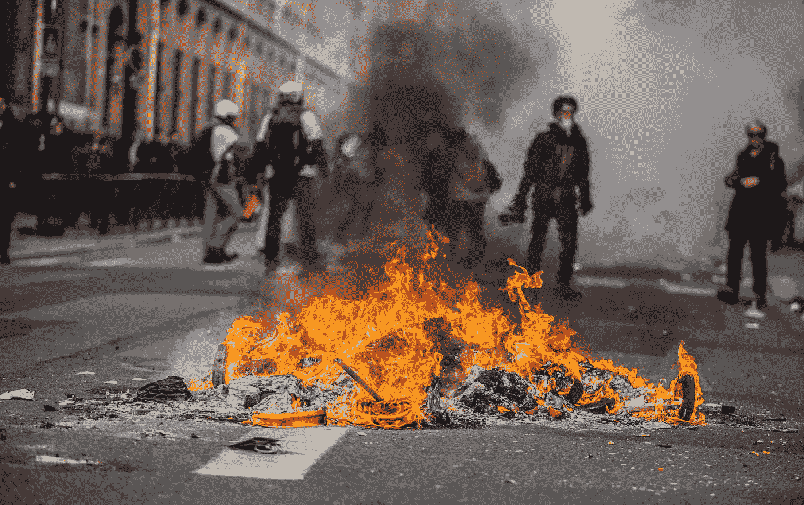
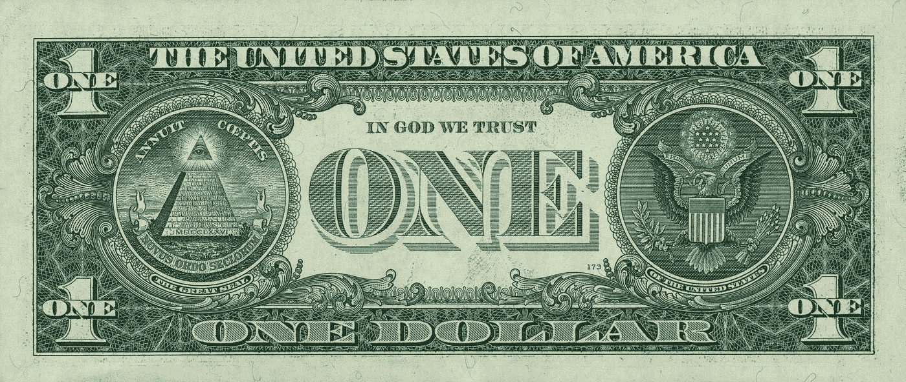
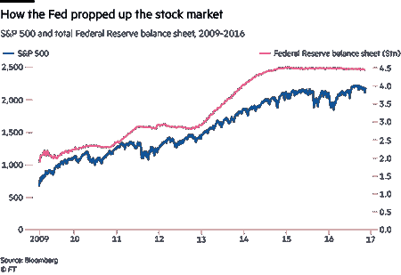
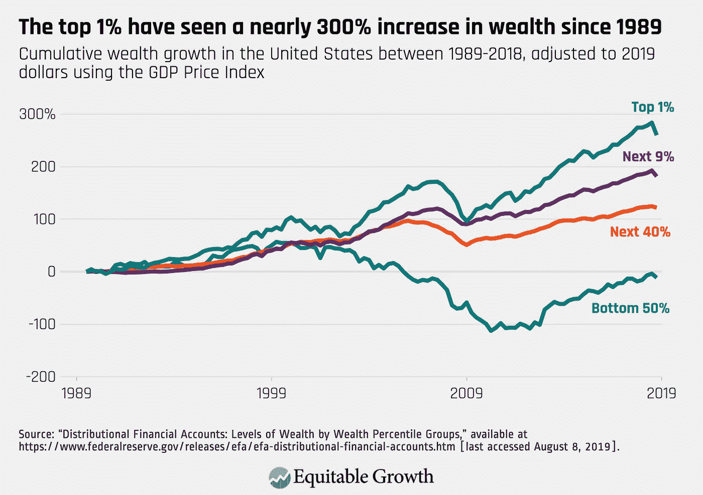
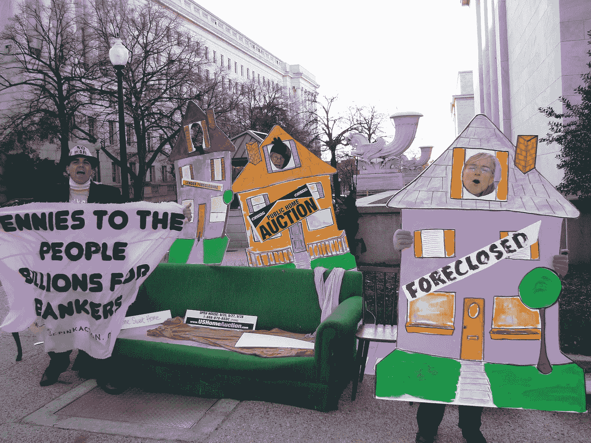
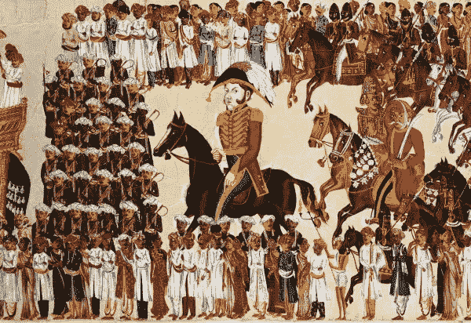
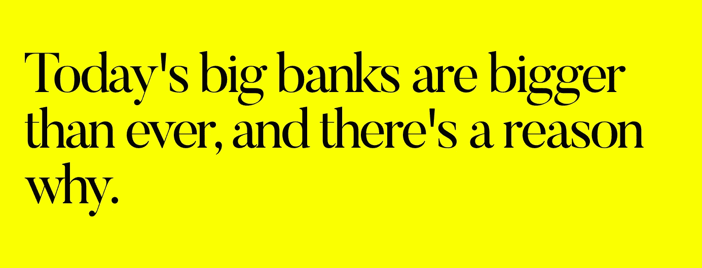
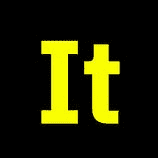
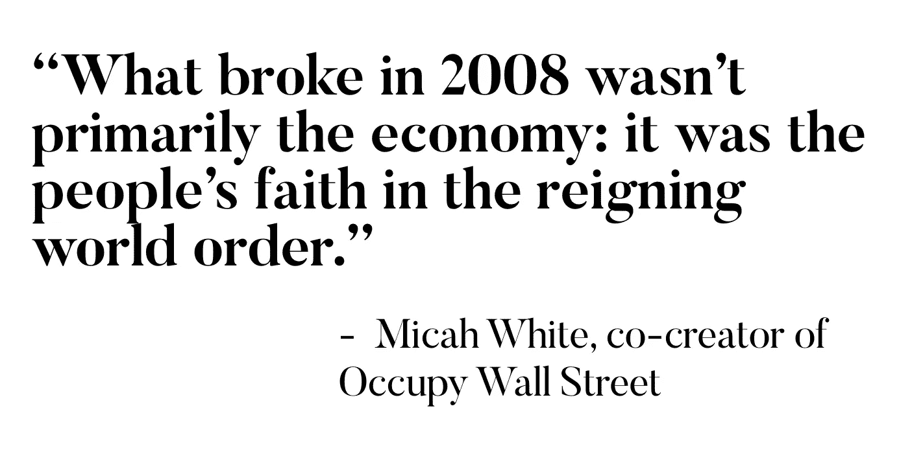
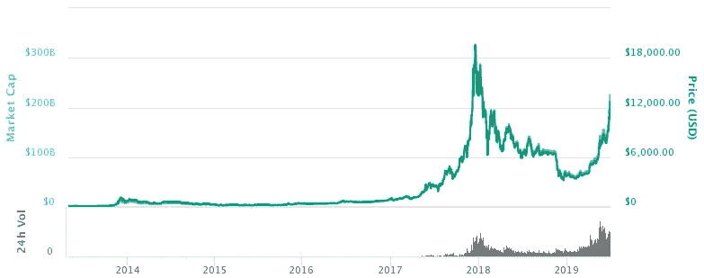

# 相信“上帝”的代价

> 原文：<https://medium.com/coinmonks/the-price-of-trusting-god-71f126467c82?source=collection_archive---------1----------------------->

France’s yellow vest movement is a [“movement for economic justice”](https://apnews.com/27ec2dd2c68646ff8ce6801b2b7f6986); picture source: [WikiMedia Commons](https://commons.wikimedia.org/wiki/File:Yellow_vests_protest6.jpg)

## 经济体系的守护者、政府和金融机构承诺繁荣和稳定。当今世界的神是财神。但是当我们不再相信上帝时会发生什么呢？

# 我们还能相信“上帝”吗？

  T 何 2008 年的全球金融危机本应是一记警钟。数百万人失去了工作，许多人失去了家园。生命被摧毁，有些无法修复。

具有讽刺意味的是，全球金融秩序根植于对主权机构的信任。“我们相信上帝”——这个地球上最强大国家的官方格言——从来不仅仅是一个宗教声明。

“我们相信上帝”被刻在每张美元纸币上是有原因的:这是对其所谓的民主金融体系优于其他一切的肯定。

Source: [Wikipedia](https://en.wikipedia.org/wiki/United_States_one-dollar_bill#/media/File:US_one_dollar_bill,_reverse,_series_2009.jpg)

但 2008 年改变了我们对金融秩序守护者的看法。崩溃之后，政府因缺乏监管而受到指责。人们指责银行过度冒险——从像你我这样的普通储户身上牟取暴利。

# 全球金融危机过去十年后，情况有所好转吗？

答案显然是否定的，至少对普通人来说是这样。

2019 年是大规模反政府运动的一年。然而，真正前所未有的是这些抗议活动的全球规模。从法国，到香港，到贝鲁特，到伊拉克，到智利，数百万人冒着失去工作和生命的危险在街头与政府军发生冲突。

抗议者似乎因为一个普遍的原因而团结在一起，不管他们来自何方:对经济不平等的深深不满。

美联社的 Joseph Krauss 写道，今天的全球示威“是由当地的不满情绪引发的，但反映了全世界对日益增长的不平等、腐败的精英和失信的失望”。

在伊拉克，2019 年有超过 400 人在反政府抗议活动中死亡——这被描述为自 2003 年美国领导的推翻萨达姆·侯赛因以来最大规模和最血腥的。虽然伊拉克是石油储量最丰富的国家之一，但近 40%的伊拉克年轻人没有工作。

香港的抗议活动没有那么暴力，但却让这个世界上最富裕的城市之一陷入了停滞。自 2003 年以来，T2 的房价已经上涨了 400 %( T3 ),迫使普通收入者住进厕所大小的房子——而房地产大亨却从中受益。

联合国环境规划署可持续金融顾问委员会成员、经济学家沈联涛和香港国际金融协会主席肖耿说:“(T4)不平等是香港人感到沮丧的一个强大的、但经常被忽视的因素。”。

两位学者都正确地认为，香港的不平等问题不是“中国独有的问题”，而是一个全球性问题。他们说，当前的混乱是“未能解决不平等问题的资本主义体系的先兆。”

# **上帝真的站在我们这边吗？**

在大多数宗教中，上帝是公平公正的，所有的人都是平等的。

在全球金融秩序中，情况并非如此，银行和企业获得的资金利率比普通人低得多。

在过去十年中，银行向经济注入了数万亿美元，推高了资产价格。

Source: FT.com, [@GreekAnalyst](https://twitter.com/GreekAnalyst/status/899607324427419648)

资金被注入金融市场，推高了已经富裕起来的人的财富。仅今年一年，全球股市就上涨了[超过 10 万亿美元](https://www.reuters.com/article/us-global-markets-2019-graphic/the-best-year-financial-markets-have-ever-had-idUSKBN1YO266)。

问题很多，答案却很少。*为什么没有任何措施来解决世界上日益严重的不平等问题？“上帝”真的在乎吗？谁发号施令？民选政府？*

直言不讳的亿万富翁、维珍银河董事长查马斯·帕利哈皮提亚(Chamath Palihapitiya)可不这么认为。Chamath [说](https://www.youtube.com/watch?v=PMotykw0SIk&t=1s)大约有 150 个人在管理这个世界——他们不是政客。

“当你站在幕后，看到这个世界是如何运作的，你会意识到，这是为他们和他们的后代不公平地设置的，”查马斯说。

今天，许多超级富豪“利用他们的权力、影响和关系来掌控政治，并确保规则是为他们制定的，”著名的反贫困倡导者乐施会国际(Oxfam International)表示。到目前为止，这种方法对他们很有效。

根据乐施会的研究，1988 年至 2011 年间，最贫穷的 10%人口的收入每年增加不到 3 美元，而最富有的 1%人口的收入增加了 182 倍。

前高盛董事总经理诺米·普林斯(Nomi Prins)将日益扩大的贫富差距称为“令人难以置信的差距”——的确如此。牛津饥荒救济委员会的研究显示，世界上最富有的八个人拥有的钱和全球最贫穷的一半人口的钱一样多。

Pennies to the people, billions for bankers. Source: [WikiMedia](https://www.google.com/search?q=s%26p+500+and+total+federal+reserve+balance+sheet+2009-2016&sxsrf=ACYBGNTM11Iurg1yKxX54bgHDnX4vIVyyA:1577175403751&ei=a8kBXt2lLZH1rQHfzKn4CQ&start=20&sa=N&ved=2ahUKEwidh8Gd7M3mAhWReisKHV9mCp84ChDy0wN6BAgMEDA&biw=1041&bih=560)

# **“他们得到了救助，而我们被出卖了”**

  T 何雷曼兄弟的倒闭被普遍视为 2008 年金融危机的导火索。但是宾夕法尼亚大学的教授大卫·斯基尔认为这并不是危机的关键时刻。

就在雷曼申请破产的六个月前，一家规模较小的银行贝尔斯登濒临违约。贝尔斯登从纽约美联储获得了 290 亿美元的援助——足以促成该银行向摩根大通的出售。

“监管者对贝尔斯登困境的处理为随后的一切埋下了伏笔，”大卫说。他认为雷曼兄弟的管理层不准备申请破产——他们只是希望银行得到救助。“如果监管者得出结论，一家规模较小的投资银行(贝尔斯登)需要纾困，他们肯定会对一家非常大的投资银行得出同样的结论。”

虽然美联储没有救助雷曼，但仅一天后就救助了 AIG，不久，国会授权 7000 亿美元收购问题金融资产。

2009 年至 2012 年间，欧洲政府花费了近 6000 亿欧元对银行进行资本重组。根据麻省理工学院斯隆管理学院教授黛博拉·卢卡斯的计算，2008 年美国金融体系的救助花费了近 5000 亿美元。

黛博拉认为，救助的主要受益者是大型机构，如银行、养老金和共同基金、保险公司和主权基金。

当数百万普通人失去工作(或失去家园)时，银行家却获得了数百万美元的奖金——即使他们的银行基本上是靠纳税人的钱生存。2013 年国际货币基金组织的一项研究显示，美国最大银行的利润很大程度上是“从纳税人转移到股东手中”

简而言之，大男孩赢了。

# 救助的历史:重演

  T 何大男孩从 1773 年就开始赢了。就在那一年，东印度公司获得了历史上第一笔巨额救助。

在英国政府的支持下，东印度公司成功征服了整个印度帝国。作为一家私营公司，东印度公司只有 35 名全职员工。它的大部分劳动力是雇佣的雇佣兵——超过 20 万人。

当该公司残酷的殖民统治引发了其宝贵资产孟加拉国的大饥荒时，它很快陷入了破产。

Source: [Encyclopaedia Britannica](https://www.britannica.com/topic/East-India-Company)

但是，东印度公司最终关门大吉还需要很长时间。

在此之前，东印度公司会向英格兰银行贷款 40 万英镑，然后 30 万英镑，然后 100 万英镑，而 30 家欧洲银行紧随其后倒闭。(当时的 100 万英镑相当于今天的 1 亿英镑。)

东印度的困难导致了一场金融危机，这场危机蔓延到了美国，英国商人切断了对殖民地种植园主的优惠信贷条件。但是该公司的所有者罗伯特·克莱武仍然是欧洲最富有的人之一。

  F   ast 展望 2019 年——救助[成为](https://www.bloomberg.com/opinion/articles/2019-12-17/bailing-out-bankers-is-all-the-rage-again-in-europe)再次风靡一时，仅在 12 月就有两家欧洲银行获得数十亿美元的现金注入，彭博报道。

“一个强大的公司仍然可以像 1765 年东印度公司在孟加拉所做的那样有效地压倒或颠覆一个国家，”历史学家威廉·达尔林普尔评论道，他引用了全球次贷泡沫和 2011 年冰岛三大私人银行的崩溃——这几乎将整个国家推向破产。“他们中最强大的不需要自己的军队:他们可以依靠政府来保护他们的利益并拯救他们。”

今天的[大银行比以往任何时候都大](https://www.cnbc.com/2018/09/14/the-next-financial-crisis-why-it-looks-like-history-may-repeat-itself.html)，这是有原因的。

[彭博编辑委员会](https://www.bloomberg.com/opinion/articles/2013-02-20/why-should-taxpayers-give-big-banks-83-billion-a-year-)写道:“银行有强大的动机变得庞大而笨拙。“它们越大，失败的灾难性就越大，在紧急情况下就越有可能得到政府救助。结果是一种隐性补贴:潜在最危险的银行可以以较低的利率借款，因为债权人认为它们太大而不能倒闭。”

# **远离上帝**

  It 难怪对金融机构的信任度一直处于历史低点。

“2008 年崩溃的主要不是经济:而是人们对统治世界秩序的信心，”占领华尔街运动的发起人之一迈卡·怀特说。

2013 年一项被广泛引用的研究发现，如今 71%的千禧一代[“宁愿去看牙医，也不愿听银行说些什么。”](https://www.bbva.com/wp-content/uploads/2015/08/millenials.pdf)2019 年，全球公关集团爱德曼(Edelman)发现，在所有主要行业中，金融服务是最不可信的。

2008 年伦敦证券交易所监管负责人 Nick Bayley 说，大多数人“知道政府不得不救助银行，这花了纳税人一大笔钱，而且是金丝雀码头和华尔街的那些富有的“银行家”做的”。“这个行业遭受了如此沉重的打击，包括那些已经存在了数百年、以你可以投资的可靠堡垒而闻名的机构。这种信任消失了。”

换句话说，很多人不再相信“上帝”了。

# **将上帝排除在等式之外**

大多数政府都专注于从内部解决金融世界的问题，例如，通过对银行更严格的监管。

但是法规可以被推翻——这取决于谁在主持大局。“国会最近开始废除 2010 年多德-弗兰克法案的部分内容，该法案是为了防止另一场金融崩溃而制定的，”[比利亚诺瓦商学院经济学教授李泽宇指出。“如果这种情况持续下去，它将引发另一场金融危机，让 30 多年来从未有过的高通胀和高失业率重现。”](https://www.cnbc.com/2018/09/14/the-next-financial-crisis-why-it-looks-like-history-may-repeat-itself.html)

或许更重要的是，2008 年后的监管变化未能解决比特币的创造者中本聪所说的传统金融系统的“根本问题”:信任，这是使其正常运转所必需的。

毕竟，钱就是钱，因为人们相信它。但是，随着人们对华尔街银行家和华盛顿监管者之间不断扩大的“旋转门”越来越担心，“上帝”还能被信任吗？

Heart of Jesus, triptich Ignaty Loyola Church, Rome. [Public domain image](https://commons.wikimedia.org/wiki/File:Heart_of_Jesus.jpg)

# 寻找新的上帝

 在  2009 年，随着金融世界的崩溃，中本聪在一个互联网聊天论坛上发表了比特币白皮书。

“必须相信央行不会让货币贬值，但法定货币的历史充满了对这种信任的破坏，”Satoshi 写道。

也许 Satoshi 意识到在现有的金融体系内解决问题几乎是不可能的。所以他创造了另一个。

“比特币的创造者看不到他们如何能为修补当前系统的漏洞做出贡献，因为强大的现任者对保持现状有着强烈的兴趣。所以他们找到了竞争的方法，”加密货币研究员哈苏在[一篇关于法定货币的诚实报道](/@hasufly/why-bitcoin-3fdee2328759)中写道。

与现有的金融系统不同，在现有的金融系统中，控制权集中在几个全能的机构中，比特币的 [*去中心化*结构让参与者之间恢复了某种程度的平等。](http://hackingdistributed.com/2014/06/19/bitcoin-and-voting-power/)

著名投资家马克·安德森说:“比特币是一种在没有预先存在信任的各方之间交换金钱或资产的方式。”。马克解释说，这是因为比特币及其技术使得数字财产——包括现实世界资产和货币的所有权——可以通过互联网进行转移，完全不需要银行或经纪人这样的中间人。

比特币交易被记录在区块链中，这是一种不可擦除的数字分类账。在比特币分类账上，每个人都知道转账已经发生，每个人都可以投票选择他们将接受的区块链。比特币没有中央权威——康奈尔大学教授 Emin Gün Sire 说:“规则完全由买卖双方接受的合法比特币决定。

比特币软件的主要开发者马特·科拉洛(Matt Corallo )说，不信任“——不依赖开源软件之外的任何东西就能使用的能力——是比特币的主要吸引力。“更具体地说，对比特币的兴趣似乎几乎完全来自于一种愿望，即避免需要信任某个第三方或第三方的组合。”

 我们 正以超低利率和“[史上最大资产泡沫](https://www.institutionalinvestor.com/article/b1j05yrqr3xqcy/Strategists-Foresee-Boiling-Point-Investors-Risk-Up)”进入 2021 年尽管数万亿美元用于支撑经济，但人们普遍担心我们可能正滑向衰退。

即使世界陷入广泛的动荡和民粹主义浪潮，比特币的价值在 2019 年飙升。

[管理着 3 亿美元区块链相关资产的](https://blockchain.capital/wp-content/uploads/2020/01/Blockchain-Capital-2019-Year-in-Review.pdf) Blockchain Capital 表示，“随着故事从价值储存转移到潜在的避险资产，对比特币的信心增加了。”。“宏观经济环境的不稳定”和内乱“为比特币创造了条件。”

The price of bitcoin from 2009 to 2019\. Source: [BitcoinWiki](https://en.bitcoinwiki.org/wiki/File:Bitcoin_price.png)

Coin Metrics 的数据科学家 Kevin Lu 说，2008 年的金融危机“凸显了我们当前法定货币体系的主要缺陷——它完全建立在信任的基础上”。“比特币通过消除对中央机构和信任的需求来解决这一缺陷——相反，一切都基于加密证明。”

脱离了金融系统的旧“神”，比特币可能预示着一个独立于金融危机、通货膨胀和救助的货币系统。加密资产越来越受欢迎——现在有超过一亿的用户——可以解释为什么比特币的价值从 2010 年的几分之一上升到今天的近 8000 美元。事实证明，比特币一直是近十年来最好的投资方式。

关于为什么比特币不是世界经济问题的终极解决方案，有很多争论。就像我们这个世界的宗教一样，比特币不是万能的。

但与我们这个世界的宗教不同，比特币标志着一种转变，从信任一个实体——*——*某人，无论是高盛、耶稣、贝宝还是佛陀*——*到相信大善终将战胜邪恶。

在比特币中，信任掌握在计算能力的大多数人手中，而不是个体实体或任何中央权力机构。加密货币倡导者安德烈亚斯·m·安东诺普洛斯(Andreas M. Antonopoulos)表示:“只要好的参与者构成了用于形成共识的大多数计算，坏的参与者就无法改变可信的账本。”

比特币的信徒似乎不是无政府主义者——他们只是发现上帝存在于他们自己身上。

> 购买最好的硬件钱包，保证你的密码安全

## 另外，阅读

*   [最佳加密交易机器人](/coinmonks/whats-the-best-crypto-trading-bot-in-2020-top-8-bitcoin-trading-bot-c16adeb13317)
*   最好的比特币[硬件钱包](/coinmonks/the-best-cryptocurrency-hardware-wallets-of-2020-e28b1c124069?source=friends_link&sk=324dd9ff8556ab578d71e7ad7658ad7c)
*   [密码本交易平台](/coinmonks/top-10-crypto-copy-trading-platforms-for-beginners-d0c37c7d698c)
*   最好的[加密税务软件](/coinmonks/best-crypto-tax-tool-for-my-money-72d4b430816b)
*   [最佳加密交易平台](/coinmonks/the-best-crypto-trading-platforms-in-2020-the-definitive-guide-updated-c72f8b874555)
*   [unis WAP 最佳钱包](/coinmonks/best-wallets-to-use-uniswap-e91a6385d9e8)
*   最佳[加密贷款平台](/coinmonks/top-5-crypto-lending-platforms-in-2020-that-you-need-to-know-a1b675cec3fa)
*   [block fi vs Celsius](/coinmonks/blockfi-vs-celsius-vs-hodlnaut-8a1cc8c26630)vs Hodlnaut
*   [莱杰 vs 特雷佐](/coinmonks/ledger-vs-trezor-best-hardware-wallet-to-secure-cryptocurrency-22c7a3fd391e)
*   [德里比特评论](/coinmonks/deribit-review-options-fees-apis-and-testnet-2ca16c4bbdb2)
*   Bitsgap 评论——一个轻松赚钱的加密交易机器人
*   为专业人士设计的加密交易机器人
*   [3commas Review](https://blog.coincodecap.com/3commas-review-an-excellent-crypto-trading-bot) |一款优秀的密码交易机器人
*   [3Commas vs Cryptohopper](/coinmonks/cryptohopper-vs-3commas-vs-shrimpy-a2c16095b8fe)
*   Bitmex 上的[保证金交易的白痴指南](/coinmonks/the-idiots-guide-to-margin-trading-on-bitmex-dbbd7742c6fc?source=friends_link&sk=7bfa99d2a181142510c8442c8ddb0786)
*   加密摇摆交易的权威指南
*   [Bitmex 高级保证金交易指南](/coinmonks/bitmex-advanced-margin-trading-guide-2270c195ce25?source=friends_link&sk=1d986cca731f5084b9a2db4a4bc4a7ad)
*   开发人员的最佳加密 API
*   [加密套利](/coinmonks/crypto-arbitrage-guide-how-to-make-money-as-a-beginner-62bfe5c868f6)指南:新手如何赚钱
*   顶级[比特币节点](https://blog.coincodecap.com/bitcoin-node-solutions)提供商
*   最佳[加密制图工具](/coinmonks/what-are-the-best-charting-platforms-for-cryptocurrency-trading-85aade584d80)
*   了解比特币的[最佳书籍有哪些？](/coinmonks/what-are-the-best-books-to-learn-bitcoin-409aeb9aff4b)

> [直接在您的收件箱中获得最佳软件交易](https://coincodecap.com?utm_source=coinmonks)

