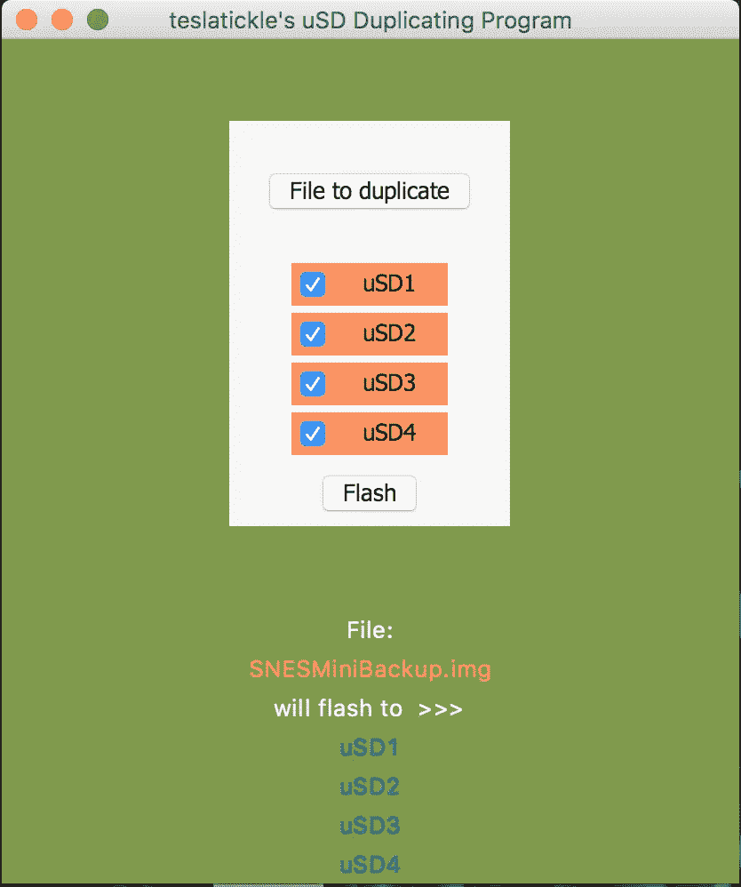

# 让我成为程序员的问题和程序

> 原文：<https://medium.com/coinmonks/the-problem-and-program-that-led-me-to-become-programmer-496063305806?source=collection_archive---------8----------------------->

GUI for my first ever application and extensive programming project

我的兴趣一直是我所说的广泛多样的。当谈到与“技术”相关的事情时，我会说它实际上有点有限，或者更确切地说，是我感兴趣的特定领域。真正的乐趣在于学习“语言”的想法——从这个词的最一般的意义上来说，并获得具有挑战性的技能，使一个人能够克服所谓的现实世界的问题。解决问题、逻辑、符号和有趣的美学都扮演着非常有趣的角色，并且有希望对人类有潜在的益处。

在试图赚取额外收入来偿还我的巨额债务时，我和我的女朋友决定开一家 ebay 商店，提供一种将经典游戏文件闪存到微型 SD 卡的服务。这项业务在一段时间内做得很好，最终相对于利润而言成为了太多的负担。在高峰期，这项业务让我平均每天刷 5 张卡——这意味着我或我的女朋友必须花大约 4 个小时或更长时间关注我的 macBook 和/或 Raspberry Pi，才能让刷卡过程持续下去。

Photo by [Christian Fregnan](https://unsplash.com/@christianfregnan?utm_source=medium&utm_medium=referral)

当时，我正在使用一个很棒的程序，[蚀刻机](https://etcher.io/)，来闪现卡片。令我惊讶的是，没有一个选项可以将一个图像文件(`foo.img`)刷新到多个设备上。我应该很快注意到[蚀刻机](https://etcher.io/)最终会被更新以包括这个特性，而且它工作得很好——好样的蚀刻机团队。到目前为止，我的编程经验已经涉及到 Arduinos、atTinys、Raspberry Pis 的编程，以及一点 Python 和 Linux 编程。当这个问题出现时，我意识到必须有一个更好的方法…我立即想到通过创建一个可以同时刷新多个设备的程序来解决我的问题是多么有趣。

Etcher is an awesome program — kudos to this team.

考虑到我最熟悉的语言是 Arduino 的“类 C”语言，而我目前还不太擅长学习 C 或 C++，我决定使用一种我最近才接触的语言——一种以我最喜欢的东西命名的语言:Python。

尽管完成得很匆忙，我还是通过写一份行动计划并标明“当然需要的特征/方法”开始了这个过程。

将有一个图形用户界面(GUI)，最少 4 个设备可供选择，并迅速可靠。

GUI 是我首先开始研究的，我发现了一个叫做‘TKinter/TKinter’的东西 Python 的事实上的 GUI 框架。这相对容易掌握，我获得了足够的信息，可以在一个小时内完成一个基本的 GUI。

事实上，许多实际的 GUI 布局和方法并不太难，也不令人沮丧。真正的问题涉及到复杂的多线程进程，更重要的是，学习子进程模块来操作命令提示符。操作包括调用带有必要参数的`dcfldd`命令，通过`of=`参数将目标文件`if=`——注意`if=`实际上是输入文件的初始化——刷新到多个设备，其中`of=`表示输出文件。

起初，子进程模块会被证明是相当混乱的，我对操纵命令提示符的编码方法感到忧虑/谨慎。在练习使用 subprocess 模块及其方法`Popen`、`call`、`communicate`并阅读了几篇关于使用 subprocess 的文章(其中许多文章非常混乱，看起来只是同一篇文章的翻版)之后，我终于找到了一种方法来调用必要的系统命令并以一种有意义的方式使用它们的输入、输出和错误管道:

`if=`、`of=`和`/dev/disk{}\n".format(device_name)`的变量由 GUI 中的用户输入值设置。一旦用户选择了要刷新的文件、要刷新的设备，并点击“刷新”按钮，扩展名为`.sh`的文本文件将由`dd_exe_f = open(file location, "w")`创建并打开，其中“w”表示创建要写入的文本文件。接下来是`for i in range(1):`，这是嵌套命令的一次循环，将`combo_fmt`内容:`dcfldd if="inputFile" of="outputDevice1" of="outputDevice2" of="ouputDevice3" of="outputDevice4"`从上面写到最近创建的文件。

A screenshot of a small part of my uSD duplicator program — temporary BASH script creating and executing.

上面是我的 microSD 复制应用程序的一个片段，它决定了哪些变量将包含在一个 bash 脚本中，该脚本将被创建并运行一次，然后被丢弃——在$BASH 中调用的进程将继续作为一个*线程化的*进程(多线程)运行。

当我最终明白了要调用$BASH 中的`dcfldd`命令必须做什么，并且是以一种*异步*的方式，我就有了一个工作程序。接下来的问题是如何安全地向终端注入命令，而不是在运行实际的刷新过程时停止整个程序。

为了防止程序在通过 dcfldd cli 工具启动闪存过程时变得无响应，定义了第二个线程，并在按下“闪存”按钮时调用相关方法。

这是另一个与线程相关的问题的解决方案。一旦进程被设置为异步运行，就没有适当的安全措施来防止再次按下“Flash”按钮，再次调用 dcfldd 命令，中断将数据刷新到内存存储设备的敏感进程。为了防止这种情况，我加入了一个参数，一旦“Flash”按钮被按下，它将阻止任何其他线程开始运行。

flash function includes stoprequest.set() that stops any additional thread requests, therefore, preventing anything from happening when pressing the flash button during an already occurring flash process

函数`stoprequest`的实际声明包含在另一个函数中，该函数处理 usb 设备监听，在刷新过程开始前更改事件。此过程也仅在闪烁事件之前是必需的，并且还要求是异步的，这是通过线程完成的——检测设备更改，如果设备存在，则在 GUI 中设备旁边放置一个图标。一旦开始闪烁过程，就不需要这个线程化过程，所以`threading.Event()`在`dev_status`功能块中定义，并在按下“闪烁”按钮时调用，导致`while`循环返回`false`并退出循环。

一次解决一个问题，解决一个更大的问题，处理一项艰巨的任务的整个过程，从整体上看是如此令人生畏，似乎是不可能的——这是一种难以置信的体验。如此不可思议的经历极大地影响了我将编程作为职业的决定。

请继续关注关于这个项目的下一篇文章——它将很快发布。我将进一步研究如何用 Python 来理解和实现 bash 脚本和执行。

感谢阅读！すごいです!