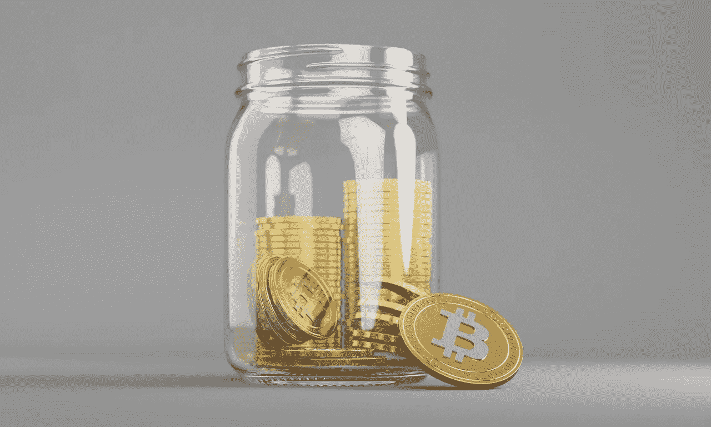
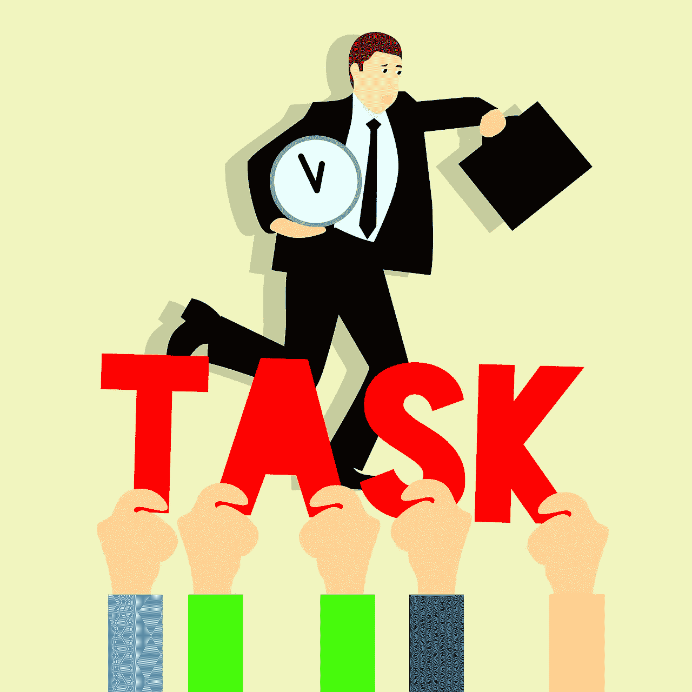
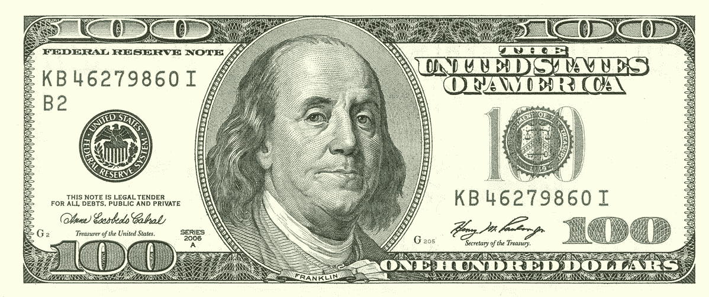
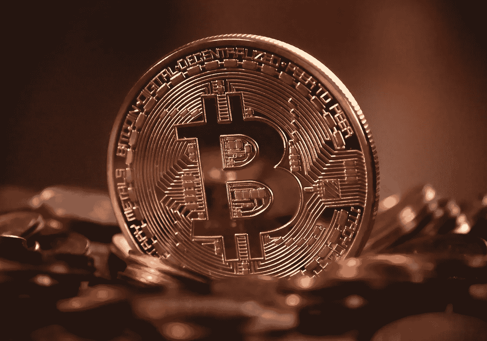
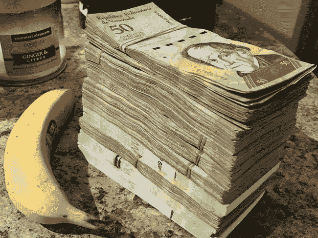

# 存钱的问题是

> 原文：<https://medium.com/coinmonks/the-problem-with-saving-money-f3c5eb8f98ac?source=collection_archive---------10----------------------->

[https://pixabay.com/photos/bitcoin-cryptocurrency-digital-2007769/](https://pixabay.com/photos/bitcoin-cryptocurrency-digital-2007769/)

让我们从这个开始，[今天流通的所有美元的 40%是在过去的 12 个月里印刷的](https://techstartups.com/2021/05/22/40-us-dollars-existence-printed-last-12-months-america-repeating-mistake-1921-weimar-germany/)。

这意味着，与整个金融体系相比，如果一年后你只是坐在银行账户里拿着现金，你只是变得不那么富有了。

棘手的是，你对此无能为力…..还是没有？

# 我们为什么要“工作”，到底什么是“储蓄”？

[https://pixabay.com/illustrations/business-tasks-hurry-up-to-work-idea-2932687/](https://pixabay.com/illustrations/business-tasks-hurry-up-to-work-idea-2932687/)

现代经济运行的基础是，一个人必须工作或提供某种商品或服务，以交换同等价值的商品和服务。例如，一名雇员可能工作一小时以获得 5 美元。

现在，随着时间的推移，我们期望获得某种**专业知识**，以便提供更好的商品和服务。因为我们现在有了某种专业知识，我们希望其他人愿意为我们提高的商品和服务质量支付更多的钱。通过这种方式，我们的目标是获得更多的财富，以便有更好的生活水平。为了获得这些财富，我们需要把收入存起来或者保存在某种资产中，这些资产以后可以用来交换决定我们生活水平的商品和服务。

例如

1.  **工作**:一个厨师必须首先**工作**才能挣钱和维持他的基本需求。最初几年，他可能每小时挣 5 美元。
2.  **专长**:过了一段时间，他的烹饪技术变得越来越好，因此给他更高的薪水，比如说每小时 20 美元。
3.  储蓄:因为他现在有某种专长，他可以比年轻的同龄人挣更多的钱，并打算把收入存起来以增加财富。
4.  财富:随着他攒下越来越多的钱，与年轻时没有专业知识的他相比，他现在的经济状况更好，因此生活水平也更高。

总之，我们工作是为了获得专业知识，然后从专业知识中节省更多的收入，获得更多的财富，这基本上意味着我们有更好的生活水平。然而，为什么在现代经济中这越来越难呢？

> 订阅 [**Coinmonks Youtube 频道**](https://www.youtube.com/c/coinmonks/videos) 获取每日加密新闻。

# 现代世界储蓄的诅咒

[https://pixabay.com/illustrations/piggy-bank-money-finance-banking-2889042/](https://pixabay.com/illustrations/piggy-bank-money-finance-banking-2889042/)

大多数人通常以“法定货币”的形式存入银行账户。这给了你每年大约 0.1%的收益。另一方面，通货膨胀率大约在 [2%](https://www.macrotrends.net/countries/USA/united-states/inflation-rate-cpi) 左右。简而言之，无论你做什么，如果你只用一个储蓄账户存钱，10 年后你肯定不会那么富有。

现在你能做的就是投资。大多数人会选择某种共同基金，10 年后回报率为 [7.16%](https://www.thebalance.com/what-is-the-average-mutual-fund-return-4773782) ，或者可能是年回报率为 10% 的[指数基金。以这种方式投资，乍看之下肯定会让你免受通货膨胀率的影响。](https://www.spglobal.com/marketintelligence/en/news-insights/blog/live-tv-still-dominates-most-tv-viewing-in-asia)

但是等等，记住最后你还是把这些回报兑换成法定货币，还记得我们的第一个声明吗？今天流通的所有美元中有 40%是在过去 12 个月里印刷的。

好吧，我承认美联储不会每年都以那样的速度增加 QE，但请这样想，如果我们有第二个或第三个 COVID，会发生什么？我是说真的，谁知道呢？

所以总结一下，你去工作或者你自己做生意，你赚一些钱，你投资，你储蓄。但是然后呢？你只是又变得不那么富有了。

储蓄的可悲循环。

那么我们如何逃离这个圈子呢？让我们开始吧。

# 健全货币

[音钱](https://www.bis.org/review/r201008d.pdf)有几个定义:

1.  健全的货币是指在自由市场中不会随着时间的推移而贬值或升值的货币。
2.  健全的货币是一种可以长期储存财富的资产。
3.  健全的货币必须能够服务于基本的经济目的，交换商品和服务。

因为我们的目标是获得和保存财富，所以我们本质上是想存好钱，对吗？但问题是，法定货币真的是我们所希望的健全货币吗？

# 法定货币和健全货币的定义

[https://th.wikipedia.org/wiki/%E0%B8%94%E0%B8%AD%E0%B8%A5%E0%B8%A5%E0%B8%B2%E0%B8%A3%E0%B9%8C%E0%B8%AA%E0%B8%AB%E0%B8%A3%E0%B8%B1%E0%B8%90](https://th.wikipedia.org/wiki/%E0%B8%94%E0%B8%AD%E0%B8%A5%E0%B8%A5%E0%B8%B2%E0%B8%A3%E0%B9%8C%E0%B8%AA%E0%B8%AB%E0%B8%A3%E0%B8%B1%E0%B8%90)

过去，菲亚特有黄金做后盾。对美元来说，那是在 20 世纪 70 年代尼克松金本位制之前。我们今天拥有的菲亚特没有任何支撑。此外，事实上，美联储的 QE 政策存在，美元供应随着时间的推移而增加。

如果你仔细观察，法定货币除了作为交换商品和服务媒介之外，没有其他用途。因为供给的增加，我们知道随着时间的推移，同样数量的法定货币会贬值。这意味着，对于健全货币的第一和第二个标准，法定货币不适合。法定货币唯一适用的合理货币的定义是第三个，能够交换商品和服务。

社会早就知道法定货币本质上是腐败的。黄金和其他类型的资产可能是一个替代解决方案，但归根结底，它仍然由控制法定货币的同一批人控制。这些资产被集中在 T2，或者被一群执行法律的人控制，这些法律对他们自己有利。法定货币的腐败转化为储蓄的诅咒，本质上是让穷人更穷，富人更富。因为我们知道法定货币是凭空印制的，它之所以有价值，唯一的原因是因为我们信任控制它的实体。

# 比特币

[https://pixabay.com/photos/bitcoin-cryptocurrency-digital-2007769/](https://pixabay.com/photos/bitcoin-cryptocurrency-digital-2007769/)

到目前为止，我们还没有解决这个问题的替代方案。然后出现了比特币，一种真正去中心化的货币，一种因为社会要求它有价值而不是由某个中央实体持有的货币。让我们看看比特币是如何与健全货币的定义相匹配的。

## *1。健全的货币是指在自由市场中不会随着时间的推移而贬值或升值的货币。*

与法定货币相比，比特币的价值似乎越来越高。然而，这并不是因为比特币升值，而是因为随着时间的推移，菲亚特贬值。

让我们这样想，如果我们将比特币的价格固定在实际的商品或服务上，我们可以看到价格不会改变，因为比特币的供应永远是有限的。

## *2。健全的货币是一种可以长期储存财富的资产。*

让我们把它分成两部分:

**A .存储财富信息**

区块链记录了自第一笔交易以来的所有交易。不管过了多久，这仍然是真的，因此我们总是可以精确定位每个地址(钱包)包含多少比特币。没有人能够改变这个所谓的“真理”，这也是比特币如此强大的原因之一。

**B .储存财富的数量**

1 BTC 将永远等于 1 BTC。在一个系统中，供应是有限的，所有的供应都可以追踪到某个地址，这给了你权力来保留你在系统中实际拥有的数量。

有了这两个事实，我们可以看到，无论过去了多久，我们都可以随着时间的推移存储我们的比特币。

## *3。健全的货币必须能够服务于基本的经济目的，交换商品和服务。*

毫无疑问，比特币每秒可以处理[的少量交易](https://nairametrics.com/2021/06/17/six-cryptocurrencies-that-offer-the-fastest-transaction-time-wef/)，准确地说是 7 笔左右。然而，它仍然是一个可行的选择，一个媒介来交换商品和服务。此外，有了[灯光网络](https://cointelegraph.com/bitcoin-for-beginners/what-is-the-lightning-network-in-bitcoin-and-how-does-it-work)，这种每秒交易量的限制不再是问题。

正如我们所见，比特币确实符合健全的货币定义。这意味着我们可以安全地或者至少有一些信心用比特币拯救我们的财富。然而，比特币本身是相当新的，仍然有很多证据，例如它是否会成为一种被大规模采用的货币。

# 让我们回到我们的问题:储蓄

在我们讨论之前，让我们先确立这样一个事实:**菲亚特的储蓄不起作用。**

[https://www.news.com.au/finance/money/costs/venezuela-in-crisis-as-inflation-spirals-out-of-control/news-story/27638560847eaa8531985e40eaa36901](https://www.news.com.au/finance/money/costs/venezuela-in-crisis-as-inflation-spirals-out-of-control/news-story/27638560847eaa8531985e40eaa36901)

为什么？看看阿富汗的阿富汗尼或委内瑞拉的玻利瓦尔。我们假设政府不会失败，但从来没有为他们真正失败的时候做好准备。如果阿富汉或委内瑞拉的人民把一部分财富存在 BTC，可以肯定的是，直到今天，他们仍然能够保留一部分财富。

现在，我不是说你应该把你所有的积蓄都投入比特币。技术本身是相当新的，我们都必须允许它有自己的适应和完善期。然而，当我们看到像萨尔瓦多这样的国家开始采用它作为国家货币时，这可能标志着货币本身的大规模采用已经非常接近了。

# 摘要

储蓄的目的是储存财富。这并不意味着财富保值的唯一方法就是投资比特币。其他资产，如房地产或黄金也可能是一个不错的选择。然而，由于黄金和房地产等资产不能作为有效的交易媒介，比特币等加密货币进入了对话。毫无疑问，当加密货币最终成为我们新的交易媒介时，BTC 肯定会保持其作为第一种数字货币的价值。

> 加入 Coinmonks [电报频道](https://t.me/coincodecap)和 [Youtube 频道](https://www.youtube.com/c/coinmonks/videos)了解加密交易和投资

## 另外，阅读

*   [分散交易所](https://blog.coincodecap.com/what-are-decentralized-exchanges) | [比特 FIP](https://blog.coincodecap.com/bitbns-fip)
*   [3 commas vs crypto hopper](/coinmonks/3commas-vs-pionex-vs-cryptohopper-best-crypto-bot-6a98d2baa203)|[赚取加密利息](/coinmonks/earn-crypto-interest-b10b810fdda3)
*   最好的比特币[硬件钱包](/coinmonks/hardware-wallets-dfa1211730c6) | [BitBox02 回顾](/coinmonks/bitbox02-review-your-swiss-bitcoin-hardware-wallet-c36c88fff29)
*   [block fi vs Celsius](/coinmonks/blockfi-vs-celsius-vs-hodlnaut-8a1cc8c26630)|[Hodlnaut 点评](/coinmonks/hodlnaut-review-best-way-to-hodl-is-to-earn-interest-on-your-bitcoin-6658a8c19edf) | [KuCoin 点评](https://blog.coincodecap.com/kucoin-review)
*   [Bitsgap 审查](/coinmonks/bitsgap-review-a-crypto-trading-bot-that-makes-easy-money-a5d88a336df2) | [Quadency 审查](/coinmonks/quadency-review-a-crypto-trading-automation-platform-3068eaa374e1) | [Bitbns 审查](/coinmonks/bitbns-review-38256a07e161)
*   [加密复制交易平台](/coinmonks/top-10-crypto-copy-trading-platforms-for-beginners-d0c37c7d698c) | [Coinmama 评论](/coinmonks/coinmama-review-ace5641bde6e)
*   [印度加密交易所](/coinmonks/bitcoin-exchange-in-india-7f1fe79715c9) | [比特币储蓄账户](/coinmonks/bitcoin-savings-account-e65b13f92451)
*   [OKEx vs KuCoin](https://blog.coincodecap.com/okex-kucoin) | [摄氏替代品](https://blog.coincodecap.com/celsius-alternatives) | [如何购买 VeChain](https://blog.coincodecap.com/buy-vechain)
*   [币安期货交易](https://blog.coincodecap.com/binance-futures-trading)|[3 commas vs Mudrex vs eToro](https://blog.coincodecap.com/mudrex-3commas-etoro)
*   [如何购买 Monero](https://blog.coincodecap.com/buy-monero) | [IDEX 评论](https://blog.coincodecap.com/idex-review) | [BitKan 交易机器人](https://blog.coincodecap.com/bitkan-trading-bot)
*   [CoinDCX 评论](/coinmonks/coindcx-review-8444db3621a2) | [加密保证金交易交易所](https://blog.coincodecap.com/crypto-margin-trading-exchanges)
*   [Bookmap 评论](https://blog.coincodecap.com/bookmap-review-2021-best-trading-software) | [美国 5 大最佳加密交易所](https://blog.coincodecap.com/crypto-exchange-usa)
*   [如何在 FTX 交易所交易期货](https://blog.coincodecap.com/ftx-futures-trading) | [OKEx vs 币安](https://blog.coincodecap.com/okex-vs-binance)
*   [CoinLoan 审查](https://blog.coincodecap.com/coinloan-review) | [YouHodler 审查](/coinmonks/youhodler-4-easy-ways-to-make-money-98969b9689f2) | [BlockFi 审查](https://blog.coincodecap.com/blockfi-review)
*   [CoinFLEX 评论](https://blog.coincodecap.com/coinflex-review) | [AEX 交易所评论](https://blog.coincodecap.com/aex-exchange-review) | [UPbit 评论](https://blog.coincodecap.com/upbit-review)
*   [AscendEx 保证金交易](https://blog.coincodecap.com/ascendex-margin-trading) | [Bitfinex 赌注](https://blog.coincodecap.com/bitfinex-staking) | [bitFlyer 审核](https://blog.coincodecap.com/bitflyer-review)
*   [AscendEx Staking](https://blog.coincodecap.com/ascendex-staking)|[Bot Ocean Review](https://blog.coincodecap.com/bot-ocean-review)|[最佳比特币钱包](https://blog.coincodecap.com/bitcoin-wallets-india)
*   [Bitget 回顾](https://blog.coincodecap.com/bitget-review)|[Gemini vs block fi](https://blog.coincodecap.com/gemini-vs-blockfi)|[OKEx 期货交易](https://blog.coincodecap.com/okex-futures-trading)