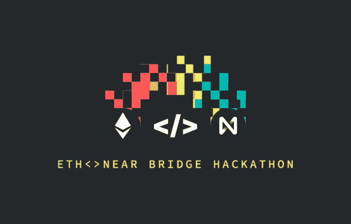
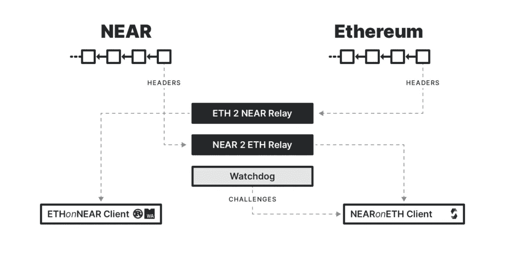

# 彩虹桥

> 原文：<https://medium.com/coinmonks/the-rainbow-bridge-79c10ddef25d?source=collection_archive---------7----------------------->

## 这是一篇彩虹桥的介绍文章，还包含一个名为“黑客彩虹”的黑客马拉松邀请

以太坊始于 2013 年，当时只有一个项目向我们传授区块链技术的秘密使用案例，现在以太坊成为唯一一个不仅创建了大部分令牌，而且大部分 Dapps 也在运行的项目。即使以太坊拥有所有的市场容量，但它也有一些限制，比如它无法扩展，有时区块链会超载{ [参考](https://coingeek.com/not-a-finished-product-ethereum-fees-and-scalability-issues-cripple-network/) -1，{ [参考](https://www.crypto-news-flash.com/following-crash-ethereum-network-heavily-overloaded-due-to-panic-sales/) -2}。

在拥挤的时候，在以太坊区块链，我们用户遭受了很多痛苦，我们不仅要支付高额的汽油费，而且还要浪费我们很多时间，因此，我们需要像彩虹桥这样的创新解决方案。

## 什么是彩虹桥？

我们都知道在特定区块链上创建的令牌或 Dapps 可以相互通信，因为它们都在同一个生态系统中，但是很难在两个独立的区块链之间建立通信，所以彩虹桥将有助于连接区块链附近与区块链以太坊，在那里它们可以相互通信，或者你可以说彩虹桥将有助于增加 NEAR 和以太坊之间的互操作性。

## 为什么需要彩虹桥？

当区块链以太坊努力扩大规模时，你没有任何控制，既不能加快交易速度，也不能节省交易费用，你只能等到区块链以太坊冷却下来，这肯定不是一个解决方案，所以这里我们需要一个通往另一个现代区块链的桥梁，像 NEAR use，我们可以将我们的资产和 Dapps 从区块链以太坊转移到区块链附近，以实现我们的目标。

从开发者的角度来看，如果你让他在以太坊和区块链附近之间选择，有 90%的机会，他会选择区块链以太坊，因为它是继比特币之后最受欢迎的区块链。因此，在这里，彩虹桥将开始工作，这将有助于结束开发者在 NEAR 和以太坊之间的差异，这意味着在区块链附近开发的 Dapps 或服务可以在区块链以太坊上运行，反之亦然，在区块链以太坊上创建的 Dapps 或服务也可以在区块链附近运行。

现在所有的开发者都有了另一个选项，可以毫无顾虑地开发他们的 dapp 和服务，因为他们的 dapp 和服务与以太坊区块链兼容。

## 彩虹桥作品

它将结束以太坊和区块链附近之间的差异，这将有助于为用户打开许多可能性，例如:现在你可以将你的资产、Dapps、智能合同从区块链以太坊移动到区块链附近。

现在，区块链以太坊的所有开发者都面临着可扩展性问题，他们可以通过节省时间和费用来扩展他们在区块链附近的项目。

他们可以随心所欲地保护他们的项目。这意味着在区块链附近，他们将有权决定在多少次确认后交易将是有效的。

你可以在桥上进行跨契约调用，也可以编写以太坊契约，在附近使用验证器。

彩虹桥不是一座桥，而是多座桥。您可以创建自己的桥，也可以帮助开发现有的桥，而无需附近团队的许可{ [Reference](https://near.org/blog/eth-near-rainbow-bridge/) }。

## 黑客马拉松邀请

如果你是一名技能高超的开发人员，那么你将受邀参加附近的“ [Hack the Rainbow](https://near.org/rainbow/) ”黑客马拉松，在那里你可以为精英中的精英赢得超过 50k 美元的奖金。

## 结论:

在结束这篇文章之前，我想说，即使以太坊区块链存在许多问题，彩虹桥也将帮助许多以太坊的铁杆粉丝和使用它的人，但现在他们不必担心，因为他们正在获得另一个像以太坊一样的现代区块链。

作者详情:吉坦德拉·纳伊克

电子邮件-Jitencrackit2@gmail.com

## 另外，阅读

*   最好的[密码交易机器人](/coinmonks/crypto-trading-bot-c2ffce8acb2a)
*   [密码本交易平台](/coinmonks/top-10-crypto-copy-trading-platforms-for-beginners-d0c37c7d698c)
*   最好的[加密税务软件](/coinmonks/best-crypto-tax-tool-for-my-money-72d4b430816b)
*   [最佳加密交易平台](/coinmonks/the-best-crypto-trading-platforms-in-2020-the-definitive-guide-updated-c72f8b874555)
*   最佳[加密贷款平台](/coinmonks/top-5-crypto-lending-platforms-in-2020-that-you-need-to-know-a1b675cec3fa)
*   [最佳区块链分析工具](https://bitquery.io/blog/best-blockchain-analysis-tools-and-software)
*   [加密套利](/coinmonks/crypto-arbitrage-guide-how-to-make-money-as-a-beginner-62bfe5c868f6)指南:新手如何赚钱
*   最佳[加密制图工具](/coinmonks/what-are-the-best-charting-platforms-for-cryptocurrency-trading-85aade584d80)
*   [莱杰 vs 特雷佐](/coinmonks/ledger-vs-trezor-best-hardware-wallet-to-secure-cryptocurrency-22c7a3fd391e)
*   了解比特币的[最佳书籍有哪些？](/coinmonks/what-are-the-best-books-to-learn-bitcoin-409aeb9aff4b)
*   [3 商业评论](/coinmonks/3commas-review-an-excellent-crypto-trading-bot-2020-1313a58bec92)
*   [AAX 交易所审核](/coinmonks/aax-exchange-review-2021-67c5ea09330c) |推荐代码、交易费用、利弊
*   [Deribit 审查](/coinmonks/deribit-review-options-fees-apis-and-testnet-2ca16c4bbdb2) |选项、费用、API 和 Testnet
*   [FTX 密码交易所评论](/coinmonks/ftx-crypto-exchange-review-53664ac1198f)
*   [n 零审核](/coinmonks/ngrave-zero-review-c465cf8307fc)
*   [Bybit 交换审查](/coinmonks/bybit-exchange-review-dbd570019b71)
*   [3Commas vs Cryptohopper](/coinmonks/cryptohopper-vs-3commas-vs-shrimpy-a2c16095b8fe)
*   最好的比特币[硬件钱包](/coinmonks/the-best-cryptocurrency-hardware-wallets-of-2020-e28b1c124069?source=friends_link&sk=324dd9ff8556ab578d71e7ad7658ad7c)
*   最佳 [monero 钱包](https://blog.coincodecap.com/best-monero-wallets)
*   [莱杰纳米 s vs x](https://blog.coincodecap.com/ledger-nano-s-vs-x)
*   [bits gap vs 3 commas vs quad ency](https://blog.coincodecap.com/bitsgap-3commas-quadency)
*   [莱杰纳米 S vs 特雷佐 one vs 特雷佐 T vs 莱杰纳米 X](https://blog.coincodecap.com/ledger-nano-s-vs-trezor-one-ledger-nano-x-trezor-t)
*   [block fi vs Celsius](/coinmonks/blockfi-vs-celsius-vs-hodlnaut-8a1cc8c26630)vs Hodlnaut
*   Bitsgap 评论——一个轻松赚钱的加密交易机器人
*   为专业人士设计的加密交易机器人
*   [PrimeXBT 审查](/coinmonks/primexbt-review-88e0815be858) |杠杆交易、费用和交易
*   [埃利帕尔泰坦评论](/coinmonks/ellipal-titan-review-85e9071dd029)
*   [赛克斯·斯通评论](https://blog.coincodecap.com/secux-stone-hardware-wallet-review)
*   [BlockFi 审查](/coinmonks/blockfi-review-53096053c097) |赚取高达 8.6%的加密利息