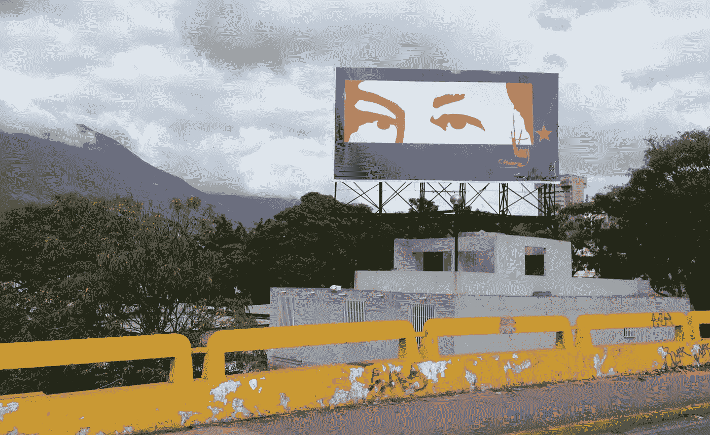
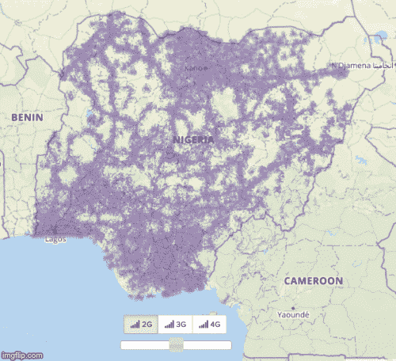
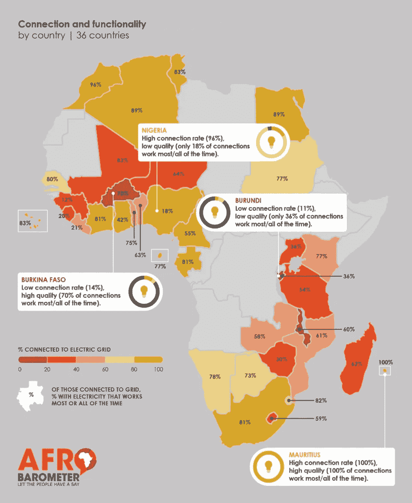
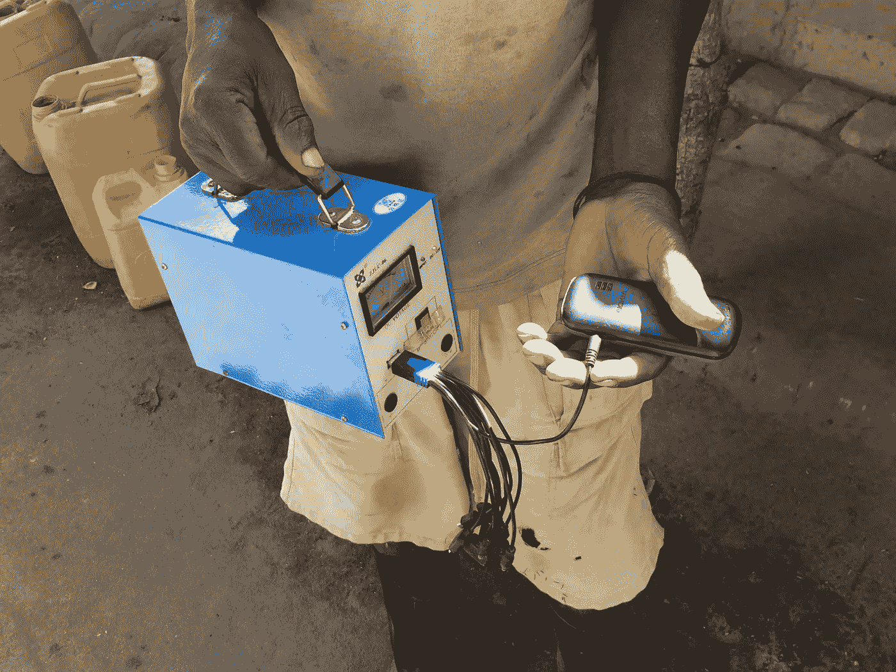
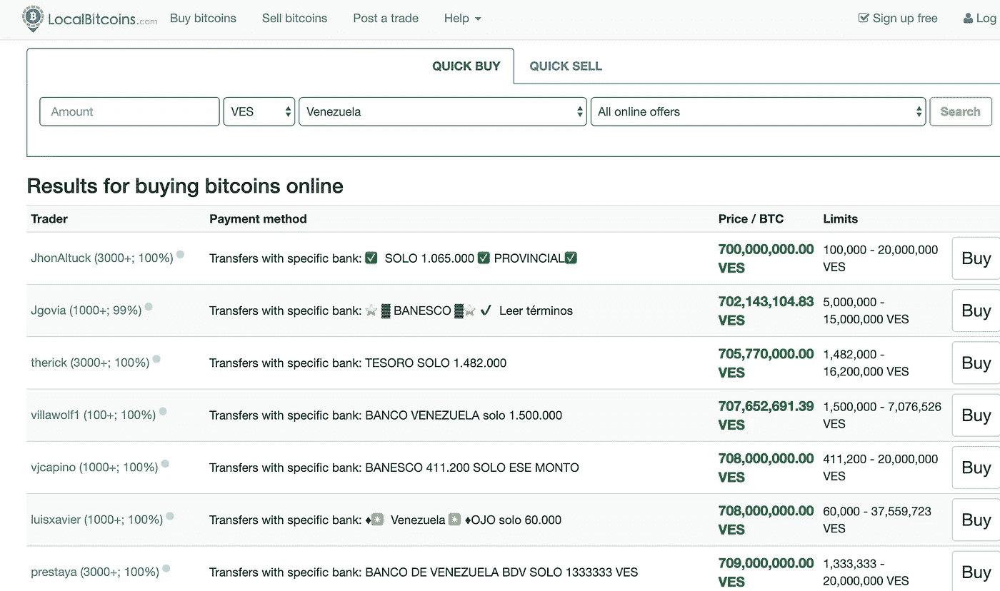

# 加密技术尚未在高通胀国家流行的真正原因——目前还没有。

> 原文：<https://medium.com/coinmonks/the-real-reasons-crypto-hasnt-taken-off-in-high-inflation-countries-yet-6b4d786263c3?source=collection_archive---------0----------------------->

Eyes of Chavez in Caracas, 2014

众所周知，受高通胀、不稳定的法定货币和资本管制困扰的市场对加密货币有巨大的需求。自 2011 年以来，我一直在研究低收入国家的金融行为和技术使用情况，参与的组织包括 [BFA 全球](https://bfaglobal.com/)和脸书的[移动金融服务](https://techcrunch.com/2018/04/25/internet-org-100-million/)和 [Calibra](https://www.calibra.com/?locale=en_US) 项目。通过这项工作，我观察到委内瑞拉、阿根廷、尼日利亚、津巴布韦和其他地方的人们眼睁睁地看着他们辛苦挣来的积蓄膨胀消失。可以理解的是，那些在购买日常用品时面临巨大麻烦和物流挑战的人渴望替代品。

带着特有的乐观，加密社区断言，数字货币将是全球失败的货币政策的解决方案。我们已经看到了 Dash、[比特币](https://blog.coincodecap.com/tag/bitcoin/)和其他一些东西将[拯救委内瑞拉](https://www.raconteur.net/finance/venezuela-cryptocurrencies)和[革新非洲](https://news.cision.com/luno-pte-ltd/r/the-opportunity-for-crypto-in-africa-is-enormous-and-will-impact-everyone-s-lives,c2961604)的观点。而行动则遵循着言辞:布莱恩·阿姆斯特朗的 [GiveCrypto](https://www.givecrypto.org/) 基金会于 2018 年启动，其使命是“向生活贫困的人分发加密货币”，无论他们看起来[能不能使用它](https://bitcoinist.com/coinbase-zcash-airdrop-venezuela/)。超越货币， [RippleWorks](https://m.rippleworks.org/) 编制了[区块链国际发展](https://docs.google.com/spreadsheets/d/14BPQIqnDUTyinkp9eJ7bwYwsg22RJz0AVU9vOSSU94o/edit#gid=1835238919)项目总清单。名单上有近 250 个项目，人们对分布式账本能为欠发达国家的人们做的一切寄予厚望。

尽管加密货币出现在这些市场，尤其是委内瑞拉，但人均外汇交易量远不及发达国家。尽管在高通胀国家，加密技术被用于汇款和投资，但目前还没有证据表明有大量的消费者或企业支付。委内瑞拉*新闻电讯*记者 Javier Bastrado e [解释说，密码的使用比支持者认为的更加有限。但考虑到需求和需要，为什么我们没有看到新兴市场，特别是高通胀的新兴市场大规模采用加密货币？](https://www.whatbitcoindid.com/podcast/bitcoin-around-the-world-venezuela-bitcoin-wont-fix-venezuela-with-javier-bastardo)

根据我在发展中国家研究移动货币和技术采用情况的经验，我认为加密技术在高通胀国家的有限采用有两个主要原因，这两个原因迄今为止都没有得到业界的充分重视。

# 1.基础设施和可靠性挑战

许多国家的移动数据网络和电网都不够可靠，无法持续承受支付交易的负载并提供可靠的客户体验。我这里说的不是挖矿，只是简单的完成一个支付。

## 网络停机和停电

在世界大部分地区，移动和数据网络负担过重，速度缓慢，甚至连基本的通信都变得不可靠。停电很频繁。这些人口中的很大一部分最多只能获得 2G 或 3G 的覆盖，如下图所示的尼日利亚。

4G coverage compared to 2G coverage in Nigeria, [GSMA Mobile Coverage Maps](https://www.mobilecoveragemaps.com/)

螺旋研究所的研究发现，许多国家的移动货币代理经常因为网络中断而无法完成交易。例如，2016 年在孟加拉国接受调查的 57%的移动货币代理人和 2017 年在印度尼西亚接受调查的 50%的移动货币代理人报告说，由于网络宕机，他们无法完成支付交易。正如来自 Afrobarometer 的数据所显示的，一些电力覆盖广泛的地方仍然存在质量差的问题。虽然从技术上讲，尼日利亚大多数人都有电，但只有 18%的人在大部分时间或所有时间都能用上电。2019 年，V [enezuela 在 3 月和 7 月受到大规模全国停电](https://en.wikipedia.org/wiki/2019_Venezuelan_blackouts)的困扰，全年停电和限电较少。

[Afrobarometer 2016 Report](https://afrobarometer.org/publications/ad75-unreliable-electricity-supply-still-plague-majority-of-africans): “*Off-grid or ‘off-on’: Lack of access, unreliable electricity supply still plague majority of Africans”*

实际上，这意味着数字交易经常失败。这破坏了对数字支付系统的信任。当有人交出实物现金时，很明显支付已经完成。但是网络故障为欺诈和诈骗创造了机会。

我在哥伦比亚遇到过一些顾客，他们信任一个账单支付中心，甚至在“系统瘫痪”时也把现金交给店员。移动网络恢复后，他支付了他们的账单。但是，一天晚上，在收了他承诺在网络恢复时支付的账单的钱后，店主清空了他的商店，消失了。这个社区因为网络故障而损失了它的收入。

## 政府互联网关闭

根据 [Top10VPN](https://www.top10vpn.com/cost-of-internet-shutdowns/) 的数据，2019 年有 21 个国家的 122 次政府互联网关闭，全球经济损失估计为 80 亿美元。在乌干达，[2016 年大选期间的意外关闭](https://www.cgap.org/blog/impact-shutting-down-mobile-money-uganda)使得该国 35%使用移动支付的人无法使用他们的资金。该国一家著名的移动运营商 Airtel 损失了大约 3600 万美元的利润，而这些利润原本可以在四天内通过他们的平台进行交易。

众所周知，一些[政府已经禁止加密货币，但是货币疲软的弱国在执行加密禁令方面也很薄弱。除了监管，政府用来打击加密货币的最有力的锤子可能正在破坏互联网本身。](https://cryptonews.com/guides/countries-in-which-bitcoin-is-banned-or-legal.htm)

## 老式手机，较慢的操作系统

想要在全球范围内与前沿客户一起增长的科技产品需要为更老、更低成本的设备构建更具包容性的产品。2019 年底，GiveCrypto 在委内瑞拉的圣埃莱娜德怀仁市运行了其[试点，与 Zcash 一起启动了加密生态系统](https://blog.coinbase.com/day-2-of-12-days-of-coinbase-empowering-venezuelan-families-with-givecrypto-f1def56a5c81)。Armstrong [反映出为旧的 Android 版本构建是从努力中学习的主要内容:](https://twitter.com/brian_armstrong/status/1112059661908246528)

> “我们必须建立一个运行在 Android 4.x 上的@CoinbaseWallet 新版本，因为委内瑞拉 75%以上的收件人仍在运行 2012 年以来的这个版本的 Android。
> 
> 我们没有预料到的间歇性停电。加密仍然需要互联网和电力来运行，尽管在低连接性环境中有一些潜在的中继类型解决方案，我们可以在未来尝试。"

Charging a Nokia phone with a solar-powered battery where electricity is spotty, Mozambique.

# 2.信任和害怕在公共场合拿出手机

与美国大部分地区不同，在高犯罪率的国家，在销售点用手机支付是极其危险的。尼日利亚因其庞大的失窃手机市场而闻名。据估计[每月有 11 万部手机被盗。《T4 时报》详细描述了委内瑞拉人为了避免被抢而采取的极端手段，包括携带一部假电话或者总是改变日常办事的路线。](http://laht.com/article.asp?CategoryId=10717&ArticleId=421765)

汇款在很大程度上避免了这个问题，收款人通常会使用类似 [Localbitcoins](https://localbitcoins.com/) 这样的平台将比特币立即转移到菲亚特。但是由于这些网站上没有关于保护的验证，它们也充满了骗子。

Localbitcoins sales available in Venezuela February 2020\. How to verify these sellers?

考虑到当面付款时手机被盗的风险，送货上门的做法越来越多，但也需要信任。像 FamilyBox 这样精明的商家已经将交易完全带出委内瑞拉，让国外的亲戚直接向商家的加密或外国银行账户付款。

## 对信任和分散货币的思考

Crypto 经常吸引那些不信任中央银行等传统机构的人。但是对于新兴市场的许多人来说，信任像无许可的区块链这样的复杂系统的能力并不是与生俱来的。在我的采访中，我发现生活在低功能的机构中促使人们将信任的天平转向他们私下认识的人和面对面的交易，而不是转向互联网上的匿名系统。例如，当这些系统缺乏使早期 PayPal 成功的支付撤销或买家保护模式时，情况尤其如此。

# 我们如何做得更好

为新兴市场建设的挑战可能令人生畏——很容易让人放弃，为我们这样的人建设。但正是在这些具有挑战性的国家，加密货币可以产生最大的影响。解决方案通常在技术上并不困难，它们只需要改变我们的思维方式和优化目标，例如:

*   **对数据敏感**。客户往往对移动数据应用的使用量高度敏感。在前往销售点之前，考虑是否可以在 wifi 上采取关键步骤。
*   保持应用程序的小尺寸。如果下载硬币钱包应用程序意味着用户将不得不卸载他们最喜欢的应用程序，因为有限的手机存储空间，持续使用是不可能的。
*   **为多个用户共享一部手机而设计。**在保护用户隐私的情况下，用户的登录和退出是否容易？
*   **为线下设计。**以可视化方式交流离线状态和进度。以下是一些想法。
*   **建造 USSD。尽管非洲和亚洲部分地区的移动基础设施和低端手机很差，但 USSD 的技术正在让移动支付蓬勃发展。检查[悬停](https://www.usehover.com/)启用安卓 USSD。**
*   **与老年人一起测试。以委内瑞拉为例，450 万移民已经离开，其中大部分是年轻人和受过良好教育的人。剩下的人年龄较大，对技术不太了解。尽管在高通胀国家非洲情况正好相反，那里的人口倾向于年轻化。**

同样值得支持的是致力于改善新兴市场连通性和电气化的组织，以及反对政府关闭互联网的组织。谁知道呢，随着[中国为改善非洲](https://foreignpolicy.com/2019/03/19/for-africa-chinese-built-internet-is-better-than-no-internet-at-all/)的互联互通做出最大贡献，也许将会是[中国硬币](https://www.wired.co.uk/article/china-digital-currency-crypto)破解密码并改变新兴市场。

> [直接在您的收件箱中获得最佳软件交易](https://coincodecap.com/?utm_source=coinmonks)

