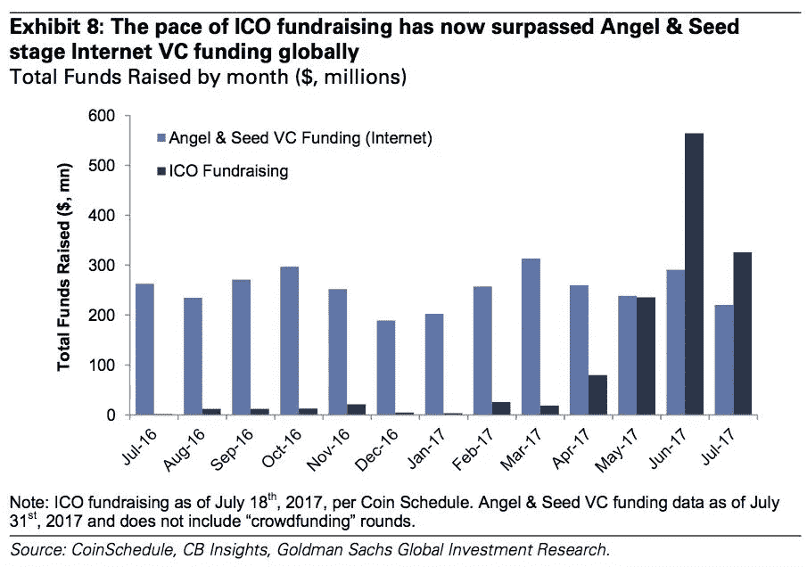
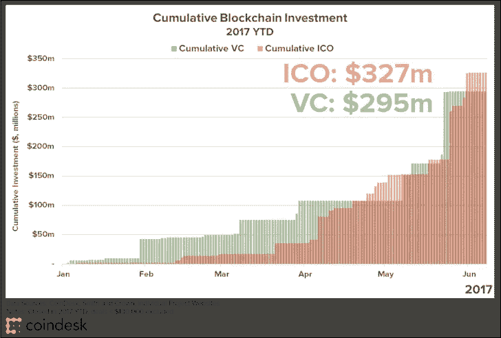
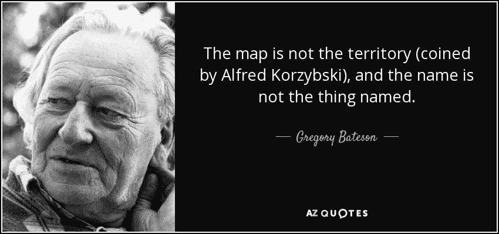
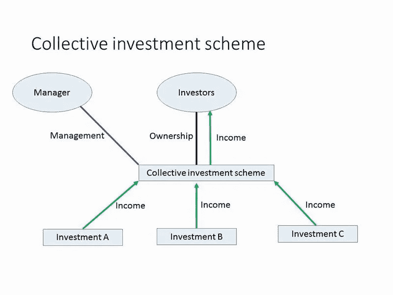

# 欧洲、英国和直布罗陀加密资产和金融服务监管审查

> 原文：<https://medium.com/coinmonks/the-regulation-of-token-sales-under-international-securities-laws-part-1-9020ecf70552?source=collection_archive---------2----------------------->

# 第 1 部分—根据欧洲“证券法”对代币销售的监管

> 然而守法的学者写道:
> 法律没有错也没有对，
> 法律只是犯罪
> 因地因时制宜，
> 
> (**W·H·奥登**

*** * * * * ***

**中国更新**

[**PBC 刚刚宣布，现在禁止在中国市场提供代币**](https://www.bloomberg.com/news/articles/2017-09-04/china-central-bank-says-initial-coin-offerings-are-illegal) **。这项禁令显然是针对包括交易所在内的中国运营商的:**

> 中国人民银行周一在其网站上表示，它已经完成了对 ico 的调查，并将在未来严格惩罚 IPO，同时惩罚已经完成的违法行为。监管机构表示，那些已经筹集资金的人必须提供退款，但没有具体说明这些钱将如何返还给投资者(彭博)

虽然这一禁令似乎与对中国资本外逃的持续担忧密切相关，但所有市场参与者现在花时间进一步考虑该行业的犯罪和消费者损害风险以及国际法的适用性问题也是合理的。

*****

正如律师(现在许多代币销售创始人)所知，没有一部法律或法律框架专门适用于企业发行、推广和销售加密代币。因此，本文的标题有点用词不当，但希望它将有助于强调美国和欧洲证券法中的一些关键共同原则——鉴于电子商务服务完全在全球范围内远程提供的能力，管辖权差异和法律管辖权的主权问题也至关重要。

哪些法律是网上发行的“适用法律”这一问题在任何领域都是一个具有挑战性的问题[1]。]

**背景**

在过去的 6 个月里，代币销售部门(有时被无益地称为初始硬币发行)真的进入了高潮。即使是那些对加密货币长期感兴趣的美国电子商务律师，也对这一浪潮的速度和幅度感到惊讶。[2.]

最近，证券交易委员会发布了与代币销售部门的特定发行相关的[指南](https://www.sec.gov/litigation/investreport/34-81207.pdf)([分散自治组织](https://en.wikipedia.org/wiki/The_DAO_(organization))),该指南与更广泛的部门相关。在本文中，我不会将代币销售称为初始硬币发行(ICO ),因为使用该术语可能会引起技术和法律上的混乱。[3]

**私下‘发行’代币&众筹**

无可争议的是，就尚不存在的平台和产品而言，向公众提供代币销售构成了一种众筹形式。因此，这些提议的问题在于，它们是否代表了一种受监管的众筹形式。在代币销售显著增长之前，众筹可以分为三大类:

1.  基于礼物:为做好事的人提供资金(如慈善或社会企业活动)
2.  基于奖励:为人们开发和制造产品(如 Kickstarter)提供资金，贡献者将获得原型产品和/或独家利益(如参观乐队制作黑胶专辑的场地)
3.  基于投资(债务和股权):提供资产或资本以换取股份，或提供资本加利息回报的合同，基金中的“单位”或其他合同权利，代表对收入、资本、收入、版税或相同发行人的利润的一些权利。[4]

**监管法的一些架构原则**

在深入探讨与不同管辖区相关的具体法律原则之前，有必要强调一些共同的，我希望是显而易见和无可争议的法律和公共政策原则:

1.  “对等”原则:当好的法律寻求避免公共伤害或促进公共利益时，它们应该服从高度的技术中立。

= equivalent

同时，一些新技术无法与现有技术进行有意义的比较，因为它们的使用案例差异太大(例如，考虑文件柜与电子数据库的数据保护法)。

在许多情况下，出于考虑许多公共政策风险的目的，新技术可能会以大致相同的方式与现有技术竞争(例如，一些基于云的计算架构使用 MySQL 和 PHP，而非基于以太坊协议的分散式区块链)。

在欧洲法律和判例中得到坚定体现的出发点是，具体法律应该寻求技术中立(从而避免无意中扭曲创新或支持特定市场参与者)。

SEC 的指导在技术中立点上也是有用的:

> 委员会认为发布本报告是适当的，也符合公众利益，以强调美国联邦证券法可能适用于各种活动，包括分布式分类帐技术，这取决于特定的事实和情况，而不考虑用于实现特定要约或销售的组织形式或技术。

2.实质原则:如果做得正确，给一个事物起的名字只是一种尝试将一个可识别的缩写或描述应用到一个组件集合(集合)的方式。这意味着事物的性质(也是出于法律目的)不能仅仅由一个潜在的任意命名约定来决定。

通俗地说,“代币”可能是“证券”,但这取决于对其结构和目的的分析，特别是对购买者/贡献者的法律“承诺”。在这一点上，证券交易委员会的指导也很明确:

> 在分析某样东西是否是一种证券时，“形式应被实质所忽视”(Tcherepnin 诉 Knight 案，载于《美国最高法院判例汇编》第 389 卷，第 332 页，第 336 页(1967))，而且重点应放在交易背后的经济现实上，而不是附加在交易上的名称联合住宅找到了。，421 美国第 849 页。

也就是说，很明显，如果一个人将某样东西命名为证券要约，即使根据严格的法律分析，它实际上不是证券，如果这种不准确的命名使你认为你拥有实际上并不拥有的权利或保护，你就有充分的理由提出索赔。

**投资合同、基金和豪威测试**

在美国，所谓的[豪威](https://en.wikipedia.org/wiki/SEC_v._W._J._Howey_Co.)测试受到了高度重视，该测试由美国最高法院创立，用于确定某些交易是否符合“投资合同”的条件如果他们这样做，那么根据 1933 年证券法和 1934 年证券交易法，他们必须遵守一系列与注册和推广有关的证券要求。

根据豪威检验，一项交易显然是一项投资合同，如果:

1.  这是金钱的投资
2.  人们期望从投资中获得利润
3.  钱的投资是在一个共同的企业
4.  任何利润都来自于推广者或第三方的努力

豪威测试使用了“钱”这个术语，但是其他案例已经扩展到包括钱的价值和其他资产。美国法院似乎经常将普通企业定义为投资者将资金或资产集中起来投资于一个项目的企业。然而，我注意到这似乎不是美国法律的协调领域。这一领域的大多数美国法律都是基于非常古老的判例法，而这些判例法在不同的时间和不同的州会有不同的解释，这一事实必然使为代币销售客户提供咨询成为美国律师面临的一个有趣挑战。

在直布罗陀和联合王国，我们在促进集体投资计划的监管方面采取了非常相似的广泛方法(独联体)，在欧洲范围，我们也有非常相似的替代投资基金的概念(AIF)——尽管《AIFM 指令》对 AIF 的定义可以说非常狭窄。

例如，在直布罗陀和联合王国，独联体的定义特意非常宽泛:

> 与财产有关的任何安排，其目的或效果是使参与该安排的人，不论是否成为该财产或其任何部分的拥有人，均可参与或收取因取得、持有、管理或处置该财产而产生的利润或收入，或从该等利润或收入中支付的款项...安排..必须是这样的，参与者没有日常控制的财产管理服从安排..并且必须具有下列至少一个特征:(I)参与者的贡献和从中支付给他们的利润或收入被汇集在一起，(ii)该财产由该计划的经营者或代表该经营者作为一个整体进行管理

An example of a CIS structure

然而，在大多数情况下，公用事业令牌通常不会有成为 CIS 的风险，除非它还包括对令牌发行实体或相关方的收入/利润/资本/特许权使用费份额的直接权利。此外，还有一些特定的豁免可能与将某些商业结构排除在独联体体制之外有关，无论是象征性的还是其他的(例如真正的特许经营安排)。

因此，根据美国和欧洲的法律分析，一个关键问题是，尽管存在通过令牌销售筹集的资金的集合，以开发技术或平台，但在某种程度上，令牌并未赋予参与令牌发行实体的资本或利润(以及，如果不同的话，可能接受令牌的基础企业的资本或利润)的直接权利，因此，它不太可能只代表未来使用的私人合同价值交换手段。

或许有希望这种代币的价格/价值会上升，但这本身并不能使它成为 AIF、独联体，或者，我想，是一份针对美国的投资合同[5]。

**告诉我——什么时候象征性报价才是‘安全’报价？**

那得看情况了。在我看来，在对客户进行任何分析的开始，最简单的事情就是问这样一个问题:*如果这个提议是通过法定货币而不是密码货币进行调解的，它会作为一种证券受到监管吗？*

如果答案是“是”，那么您知道您将不得不努力证明为什么使用密码货币会使其不受监管，这不仅有技术法律方面的原因，更重要的是，在与监管机构就此问题进行交涉时，也有公共政策方面的原因。

如果答案是否定的，那么很少有充分的理由使用加密货币和令牌来改变从证券角度的分析(然而，在本系列的另一篇文章中，我们将研究非法定交易引起的其他一些监管风险)。显然，需要对销售的各种要素进行更详细的技术分析，但在形成对销售性质的看法时，整体“观感”是至关重要的。

A fitting joke for wordy lawyers!

监管者对过于技术性(通常冗长)的法律分析不太感兴趣，因为这些分析没有考虑相关立法框架的目的(在大多数情况下是为了保护消费者/零售客户，防止包括逃税在内的犯罪)，这是很有道理的。

**一些公用令牌的潜在法律特征**

首先，我们注意到，即使在加密货币方面，加密货币通常比公用令牌具有更大的交易媒介功能，但目前通常不作为法定支付工具或受监管的金融工具或证券进行监管(BTC 和 ETH 是最著名的)。

使用监管等效方法，您还可以看到，出于以下原因，一些代币销售不是也不应该明显被视为受监管工具或证券:

1.  它们涉及提供旨在可在网络或平台上使用的储值工具(“应用令牌”或实用令牌——这可以与由商业实体发行且仅可在有限网络中使用的不受监管的储值工具相比较[6])；和/或
2.  它们用于奖励努力或向与令牌持有者的特定活动相关联的成员提供利益，而不仅仅是他们的资本(例如，附属机构/成员/忠诚度计划，包括对贡献者提供的信息、服务和更广泛支持的奖励，以换取令牌)。

在上面的例子中，你有一个代币，它可以被购买或获得，并且在它的可用性(在平台或网络上)或它作为电子资产的可交换性方面可以产生经济利益。必须在任何相关司法管辖区详细评估与证券法(包括例如与投资合同相关的美国规则)相关的代币，以得出(相对)结论性的立场。

虽然许多代币购买者/贡献者可能购买代币，至少部分是希望代币在未来会更值钱，但这本身通常并不决定证券分析，因为其他形式的不受监管的房地产投机也是如此(例如，非规划房地产、包括加密货币在内的一些商品的销售)。

关于证券要说明的最后一点是，如果代币也代表受管制的“证券”，那么其要约、销售、推广和上市也可能是受管制的活动，除非依赖特定的豁免。因此，参与代币中介的风险和责任程度在很大程度上取决于我们是否在讨论那些也代表证券的代币(如 DAO)。

一个代币的交易所或推广者是否被授权从事与销售有关的活动，首先需要仔细考虑由这些经营者作为中介或推广的代币的性质。

这是否意味着不代表受监管支付形式、金融工具或证券的代币不应受到监管？

不会，但在开始建立一个机制之前，我们必须从总体公共政策的角度考虑这个问题，以确保任何定制的监管机制能够应对重大风险，同时不会破坏许多象征性销售所代表的众筹国际化的能量和价值。

区分不同类型的代币销售(出于不同目的)以及考虑在给定实际限制和管理各种风险的适当阈值的情况下可能实施的最佳实践也是至关重要的。我们将在下一期进一步考虑这个有趣的问题。我们还将在后面的文章中考虑一系列证券的令牌化所涉及的一些问题。

**这份意见书显然不是法律意见。在这个创新的不成熟领域，所有参与者都必须非常小心，所有参与者都必须注意所涉及的高风险以及象征性销售中出现的许多其他法律和财务问题，这些问题需要详细考虑。**

***

[1.我是直布罗陀和英国认可的合格律师，能够就直布罗陀、英格兰和威尔士以及欧盟的法律为客户提供建议，并已投保。我也是一些密码经济公司的股东:数字资产管理公司和 T2 密码公司。对美国法律的引用仅基于公开信息和对法律原则的考虑，而非任何美国法律经验或就美国法律向客户提供建议。直布罗陀是新加密经济的主要管辖区，目前正在实施一项基于金融服务的[监管制度](http://www.gibraltarfinance.gi/downloads/20170508-dlt-consultation-published-version.pdf?dc_%3D1494312876)，旨在适用于一系列以区块链为基地、代表他人(如交易所和金库/托管人)存储或传输加密价值的企业。注意:目前不打算为代币销售提供授权机制，尽管一些涉及代币的操作可能在范围之内。参见:[https://medium . com/@ peterhowitt _ 15516/why-should-crypto-operators-exchange-and-managers-get-a-DLT-provider-licence-in-Gibraltar-7160214 f441](/@peterhowitt_15516/why-should-crypto-operators-exchanges-and-custodians-get-a-dlt-provider-licence-in-gibraltar-7160214f441)

[2.][https://venturebeat . com/2017/08/07/icos-2017 年迄今已筹集超过 13 亿美元/](https://venturebeat.com/2017/08/07/icos-have-raised-more-than-1-3-billion-so-far-in-2017/)

[3]代币和硬币通常被区分为质量不同，因为代币用于在特定平台上使用/兑换，而硬币独立于任何平台。此外，在试图区分受监管证券的令牌化和不受监管的令牌销售时，首次公开发行(IPO)之间的关联并没有特别大的帮助。例如，参见[https://medium . com/startup-grind/understanding-the-difference-of-coins-utility-tokens-and-tokenized-securities-a 6522655 fb91](/startup-grind/understanding-the-difference-between-coins-utility-tokens-and-tokenized-securities-a6522655fb91)

[4]请注意，根据我有资格提供建议的法律，通常是与投资“基金”相关的集体投资计划规则在考虑代币是否也可以是证券要约时工作量最大，因为它们适用于所有形式的财产，而不仅仅是受监管的工具和投资。但是，如果代币是向公众提供第 2004/39/EC 号指令*中定义的“可转让证券”(MiFID，如公司股票和相当于公司、合伙企业或其他实体股票的其他证券，以及与股票、债券或其他形式的证券化债务有关的存托凭证和任何其他证券，给予购买或出售任何此类可转让证券的权利，或产生通过参考可转让证券、货币、利率或收益率、商品或其他指数或措施确定的现金结算，则欧盟招股说明书要求也可能适用。*

[5]在美国，对于公用事业权标是用于未来而不是现在使用这一事实(即基础平台是否已基本建成)是否会对证券法分析产生实质性影响，似乎有相当不同的看法。我还注意到美国证券交易委员会指南中非常谨慎的措辞，以及最近美国的一些代币销售，这些销售似乎是在美国精心策划和进行的——例如一家加州公司进行的思域销售:【https://tokensale.civic.com/

[6]例如，见[指令(欧盟)2015/2366](http://eur-lex.europa.eu/legal-content/EN/TXT/?uri=CELEX%3A32015L2366) (PSD2)，该指令将某些有限的网络支付工具(如商店卡、加油卡、会员卡、公共交通卡、停车票、餐券或特定服务券)从受监管支付服务的定义中豁免。注:PSD2 不适用于使用加密货币*本身*的支付，因为它通常仅限于与“资金”相关的支付交易，如指令 2009/110/EC 第 2 条第(2)点中定义的“纸币和硬币、纸币或电子货币”。

这一系列文章也将发表在[壁垒法](http://www.ramparts.eu)网站上。请参见[此处](/p/f6758e54d17a/)第二部分:加密货币衍生品和欧洲金融服务法。

> [直接在您的收件箱中获得最佳软件交易](https://coincodecap.com/?utm_source=coinmonks)

