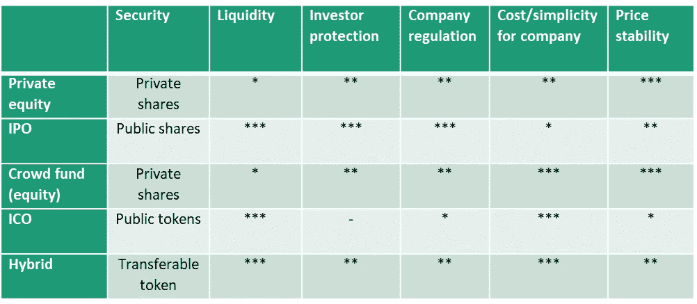
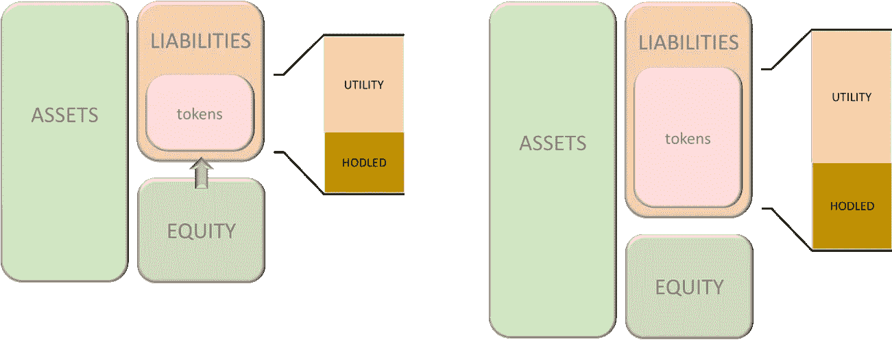

# 私人公司中股票和代币之间的关系。

> 原文：<https://medium.com/coinmonks/the-relationship-between-shares-and-tokens-in-private-companies-3e5a115e97f?source=collection_archive---------2----------------------->

在这篇文章中，我探讨了当一家公司希望筹集营运资金时，股权和代币之间的区别。我们还制作了一个介绍基本概念的 3 分钟短片。

我还介绍了一种混合模式，因为在[的上一篇文章](https://www.trisent.com/icos-ipos-crowdfunding-private-equity/)中，我提出了将代币销售和私募股权相结合的可能性，以便获得两者的好处并消除一些问题。

# 股份出售

如果公司以股权形式发行股票。一个公司的价值等于它的资产减去它的负债，这个价值由股东拥有——由股权代表。如下图所示，公司通过发行新股来筹集新的现金。

请注意，现有股东权益的价值不会随着新股份的发行而改变，尽管他们的所有权百分比(和投票权)减少了。上图简单展示了在一轮股权融资中公司[资产负债表](https://en.wikipedia.org/wiki/Balance_sheet)的变化。投资者的希望是公司会成长，因此他们的股票会增值。为了实现这一价值，需要出售股权，这通常是在交易出售或公司通过 IPO 上市时完成的。

# 代币销售

现在考虑一下，当一家公司决定通过出售代币而不是出售股票来筹集新的现金时，会发生什么。我假设这些是公用代币，因此有一个承诺，它们可以(至少在未来)交换商品或服务。这一承诺代表了公司的负债，可以被视为预付款的一种形式。因此，公司在出售公用事业代币后的资产负债表如下图所示。

请注意，出售代币筹集的新现金被为未来商品或服务预付的新负债所平衡。公司的股权没有改变，现有股东没有经历股权稀释(或代表权丧失)。公司公用事业代币的投资者不会期望将它们全部直接用于交换商品，他们期望随着公司商品的销售，代币的需求增加时出售这些代币。这是可能的，因为代币的数量是有限的，而且有一个出售这些代币的公开市场。

# 代币和股权价值

参与 ico 的一些公司对公司股本的重视程度相对较低，事实上，有一些方法可以在没有股东的情况下组建公司，因此公司资产的任何增加(包括经营其经济的利润)在理论上都应该用来增加象征性价值。在这样的安排中，如果创始人拥有重要的代币，他们将会获利——而且他们通常保证不会立即出售这些代币。

低股本或无股本的后 ICO 公司的一个属性是，通常没有外部利益相关者来影响和协助公司的管理。然而，大多数拥有大量股权的公司都有一个董事会，通常由经验丰富的非执行董事代表股东。这可以为后 ICO 公司提供很大的自由，许多公司都有大量的顾问来提供这种经验，并给代币投资者信心。在拥有智能合约令牌的公司中，这些令牌可能会被配置为提供投票权，因此它们不是公用事业令牌，而是一种股权令牌。

在极端情况下，公司可以是一个完全去中心化的自治组织(DAO ),没有集中管理，所有决策都由投票成员做出。这在某种程度上是意识形态上的，而且还有与 DAOs 相关的实际问题。Coindesk 的[什么是刀？](https://www.coindesk.com/information/what-is-a-dao-ethereum/)给出简单解释。

许多(但肯定不是所有)后 ICO 公司或公司集团都有股权和代币结构——所以从某种意义上说，他们已经有了混合代币-股权结构。然而，很少有人真正考虑到这些模型可以针对公司的阶段进行优化，重要的是，股权和代币可以双向互换。ico 发行的大多数令牌本质上既是安全令牌(持有可交易的价值)又是实用令牌(可用于交换商品或服务)。Strategic Coin 有一篇短文描述了 [3 种代币](https://strategiccoin.com/3-types-ico-tokens/)(效用、安全和股权)。

代币投资者显然在寻求投资回报。这种价值可以通过两种机制增加，一种是投机和持有代币希望增长，这是基于对第二种潜在机制的信心，即公司效用经济的增长增加了对代币的需求。当然，投资回报是通过出售投资者的代币来实现的。

股票投资者也在寻求投资回报。这是在他们的股票价值增加时实现的。同样，股票的价值可以通过两种机制上升，基于预期收入和估值的投机，以及收入和利润的实际增长。投资者的回报是通过公司的贸易销售、私人股份转让或首次公开募股实现的。

# 混合股权和代币模型

我们已经看到加密货币的价格波动很大，ico 的代币估值也很高，但代币仍然没有真正的实用价值。在私人股本支持的公司中，我们看不到价格波动(因为私人股份的流动性很小)。我们可以在上市公司中观察到这一点(在较小程度上)，这些公司有流动性，但更成熟，并通过收入增长建立了“实际”价值。一般来说，资产估值过高和价格不稳定对任何公司都是不利的，尤其是从长期来看。

在私人公司，股权通常会被锁定，直到发生退出事件，因此这对稳定有好处，但对许多投资者来说不是好事。这也意味着通过股权投资，公司通常会进行交易或首次公开募股。然而，在 ICO 的情况下，情况并非如此。因此，我们考虑了是否可以将 ico 和私募股权融资的优势结合起来，以实现两全其美，同时避免重大缺陷。在之前的文章中，我展示了一个表格，列出了不同类型的筹资方式以及它们的优缺点。在这里，我提出了同样的表，并扩展到显示混合股权代币销售模型。

建议的模式是基于在谨慎的情况下将股权转换为代币的能力，以控制价格波动并为投资者创造流动性。如果我们考虑一家初创科技公司，它最初拥有为投资者提供良好保护的私募股权。在此阶段，没有向客户提供任何实用程序价值，因此不需要实用程序令牌。

资产负债表可能看起来像这样，相当数量的股本已经发行给股东。这为该公司提供了资金来构建其技术，从而向客户提供服务。一旦建立了这种服务，公司就可以发行公用事业代币来换取股权。这实际上是公司回购股权，希望进行这种交换的股东将拥有代币，可以持有、出售或用于购买服务。在代币销售期间，还可以分阶段释放额外的代币，直到所有铸造的数字代币都已发行。

由于该公司知道其经济增长中的效用水平，因此它可以衡量对代币的需求。然后，它可以控制流通中的代币数量，并对持有的代币数量产生重大影响。由于买卖活动主要是出于短期价格考虑，而非效用价值，因此大量的投机代币会导致价格大幅波动。

根据经济的效用价值逐步释放代币，可以让经济平稳增长，而不会出现极端的波动。投资者获得流动性，但价格与公司的业绩和增长相关。公司可以通过发行股票来筹集资金，以后当它有了公用事业经济，它也可以通过发行预制代币来筹集资金。

该公司还有两种机制来减少流通中的代币数量。它可以保留一些在其经济中流通的代币(即减少货币供应)，但必须有现金储备才能做到这一点。或者，它可以提供股权来换取代币(直接或通过出售新股权并用所得来限制代币的流通)。

与使用代币和股票来稳定企业经济类似，我们可以考虑一下政府和银行用来稳定国民经济的工具。即通过调整货币供应量以及发行作为债务工具的证券。

> [在您的收件箱中直接获得最佳软件交易](https://coincodecap.com/?utm_source=coinmonks)

# 结论

我已经展示了在同时拥有股权和代币的公司中，股权和代币是如何相互关联的。我还证明了在一个公司的经济中，有没有可能同时使用股权和代币来产生良好的效果，它们不一定是相互排斥的。希望它有助于驱散一些关于代币支持公司的神话——还有更多的神话，所以我可能很快会写一篇关于代币销售的“神话终结者”文章。