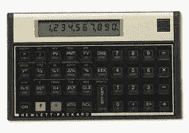
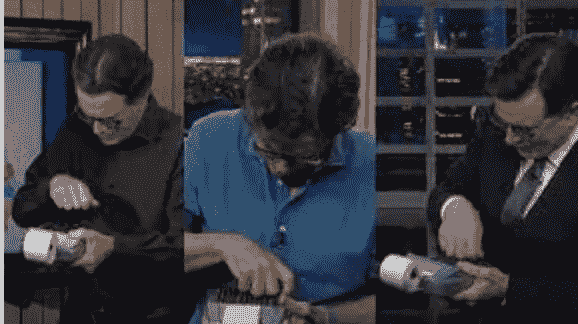
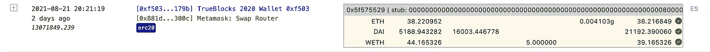
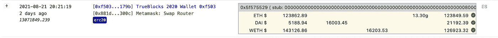

# 租金太高了

> 原文：<https://medium.com/coinmonks/the-rent-is-too-damn-high-part-i-dc6695b25259?source=collection_archive---------2----------------------->

## 费用和延期等等

这是两部分系列的第一部分，描述了我对使用 MetaMask 将自己的钱换成自己的钱的成本感到震惊。这篇文章描述了我们如何使用 TrueBlocks 来找出发生了什么。[点击此处观看第二部分](https://tjayrush.medium.com/the-rent-is-too-damn-high-part-ii-585c33450203)。

## 是的，亲爱的…

我妻子的整个职业生涯都是为机构投资者做投资顾问。她花了大量时间调查总成本，包括将客户资金从一种投资工具转移到另一种投资工具的“隐性”成本。她的客户花了很多钱转移资金——通常比他们知道的要多。

她最近对 DeFi 和区块链非常感兴趣，所以每次我告诉她在以太坊上做了些什么，她都会拿出她值得信赖的 HP 12 C 金融计算器…

HP 12 C Financial Calculator

就像史蒂芬·科拜尔用手指拍打着…

她说——“你为那笔交易向 XYZ 支付了基点。”我爱她，不要误会，但是已经够了！基点到底是什么？

在我心里，我只是说，“这可能要花多少钱？”然后按下按钮完成交易。

## 那要花多少钱？

前几天我用五( *5.0000* )包乙醚( *wETH* )换了*戴*因为我要给某个哥们付点现金买点屎(别问了，关你屁事)。

我使用 MetaMask 的内置**交换**功能，因为它非常容易使用，也因为我不想去 UniSwap 并登录。我发现这里有一点点的滑动，那里有一点点的滑动…

我妻子出去购物了…

我花了 20 秒。我按了几个按钮，确认了几个设置，很快 MetaMask 就把 *5.00 wETH* 发出去了 *16，003.45 戴*回来了。就像魔法一样。

我妻子信赖的 HP 12 C 就放在我旁边的桌子上，所以我拿起它，用 16，003.45 美元除以 5.000 美元，得到当时乙醚的美元价格:3200.69 美元 T20。这似乎是对的。我在当天早些时候查过乙醚的价格，并不太离谱。事实上，美元价格已经上涨。

一切都好。交易完成。

## 那要花多少钱？

今天早上，我醒来时正在做 TrueBlocks，这个项目帮助我弄清楚我所有的钱都在哪里。

每天早上，我首先检查 TrueBlocks 索引器代码是否正常工作。(本来是。)然后我看了看我的账户。我几天前发送的交易就在那里。

当我得知我已经为转账支付了大约 200.00 美元时，我惊呆了。200.00 美元！—那是真金白银——不是什么 T2 的假钞票。真金白银。

我把我自己的钱(*wet*)兑换成我自己的钱(*戴*)寄给我自己，花了我 200.00 美元。搞什么鬼？那不可能是对的。TrueBlocks 肯定有 bug。

## 挖掘…

这是 TrueBlocks 通常向我展示交易的方式(这就是问题中的一个)。这些值以持有的本机令牌数表示:

Transaction 13,071,849.239 according to TrueBlocks (in native tokens)

如上所示，交易从 *TrueBlocks 2020 Wallet* 发送到*元掩码交换路由器*。交易中涉及三(3)个“资产”或“代币”: *ETH* 、 *DAI* 和 *wETH* (正如你所料，我在以太网上用 *wETH* 交换了 *DAI* )。

如果你仔细观察每一行，你会注意到 TrueBlocks 的一个有用之处是，每次交易中资产余额发生变化时，它都会以 18 位小数的精度对每项资产进行对账。

表格的第一行显示，在交易之前，我们的钱包里有 *38.220952 ETH* 。我们在汽油上花费了 *0.004103 ETH* ，因此，在交易结束时，我们应该得到*38.216849 ETH*——这正是我们最终得到的结果(TrueBlocks 查询了链的余额)。因此，显示绿色勾号，表示**该资产的转让已对账**。

这让我想起了我爸在我拿到第一个银行账户的那天对我说的话:“儿子，”他说，“银行很好，但凡事都要仔细检查。”(当我年轻的时候，他对我太正式了——别让我开始——而且，现在我想起来，他似乎和我一样有洁癖！)每一行，也就是每一项资产，都是一致的。

但是，您会注意到，在上表中，三种不同的资产之间没有联系。我们知道我们交换了资产，但我们真的没有足够的信息来了解到底发生了什么。

## 那要花多少钱？

TrueBlocks 长期以来一直能够在其本机令牌中协调交易*中出现的多项资产，但最近我们实现了一个新功能，允许我们以美元显示资产余额和交易。(使用名为`spotPrice`的新字段。即交易发生时的价格。)*

**非常重要的说明:**spot price 只能从 UniSwap 和 Maker 等链上来源获取。我们不使用 API。这意味着没有速率限制。这意味着我们可以按块定价，而不是按分钟、每小时或每天定价。每个街区。一个真实的`spotPrice`。

我立即注意到一些令人不安的事情，并最终理解了我妻子坚持认为基点很重要的观点。

这是上面以美元标价的同一笔交易:

Transaction 13,071,849.239 as per TrueBlocks in the US dollar spotPrice

突然，在本机令牌中查看时复杂和隐藏的内容变得可以立即理解。我给自己发了*$ 16203.53*的*wet*，拿回了*$ 16003.45*的*戴*。花了 20 秒。

丢失的 200.08 美元呢？我(和我妻子)的资产损失了近 125 个基点。

我在自己的电脑上给自己寄了钱，花了我 200.08 美元？

这是为什么呢？那笔钱去了哪里？

## 继续深入挖掘

我们的读者可能知道也可能不知道，TrueBlocks 不仅是一个索引刮刀，还是一个桌面应用程序，而且非常重要的是，它还是一个非常强大的命令行工具，可以对任何以太坊地址(包括我们自己的地址)进行数据分析。

本文已经够长了，所以我们不会详细说明我们是如何找到丢失的 200.08 美元的，但是我们已经在后续文章中写了这个探索。

摘要:MetaMask 获得了近 150 美元，其流动性提供商 UniSwap 和矿业公司获得了另外 50 美元。

租金太高了！

## 支持我们的工作

如果你喜欢这篇文章或者你只是想支持我们的工作，请访问我们的 git coin grant[https://gitcoin.co/grants/184/trueblocks](https://gitcoin.co/grants/184/trueblocks)。捐赠给下一轮比赛。我们得到了额外的好处，那就是更多的匹配资助。即使很少的量也会有很大的影响。

如果您愿意，可以随时将任何令牌发送到我们的公共以太坊地址，地址为 **trueblocks.eth** 或 0x f 503017d 7 BAF 7 FBC 0 fff 7492 b 751025 c6a 78179 b。

感谢阅读…在下面鼓掌并在推特上分享。

> 加入 [Coinmonks 电报频道](https://t.me/coincodecap)，了解加密交易和投资

## 另外，阅读

*   [CoinFLEX 评论](https://blog.coincodecap.com/coinflex-review) | [AEX 交易所评论](https://blog.coincodecap.com/aex-exchange-review) | [UPbit 评论](https://blog.coincodecap.com/upbit-review)
*   [AscendEx 保证金交易](https://blog.coincodecap.com/ascendex-margin-trading) | [Bitfinex 赌注](https://blog.coincodecap.com/bitfinex-staking) | [bitFlyer 点评](https://blog.coincodecap.com/bitflyer-review)
*   [麻雀交易所评论](https://blog.coincodecap.com/sparrow-exchange-review) | [纳什交易所评论](https://blog.coincodecap.com/nash-exchange-review) | [菜鸟评论](https://blog.coincodecap.com/probit-review)
*   [加密货币储蓄账户](/coinmonks/cryptocurrency-savings-accounts-be3bc0feffbf) | [赌注加密](https://blog.coincodecap.com/staking-crypto) | [窃取 x 评论](/coinmonks/stealthex-review-396c67309988)
*   [BigONE 交易所评论](/coinmonks/bigone-exchange-review-64705d85a1d4) | [CEX。IO 审查](https://blog.coincodecap.com/cex-io-review) | [Swapzone 审查](/coinmonks/swapzone-review-crypto-exchange-data-aggregator-e0ad78e55ed7)
*   [最佳比特币保证金交易](/coinmonks/bitcoin-margin-trading-exchange-bcbfcbf7b8e3) | [Bityard 保证金交易](https://blog.coincodecap.com/bityard-margin-trading) | [Prokey 点评](/coinmonks/prokey-review-26611173c13c)
*   [加密保证金交易交易所](/coinmonks/crypto-margin-trading-exchanges-428b1f7ad108) | [赚取比特币](/coinmonks/earn-bitcoin-6e8bd3c592d9) | [Mudrex 投资](https://blog.coincodecap.com/mudrex-invest-review-the-best-way-to-invest-in-crypto)