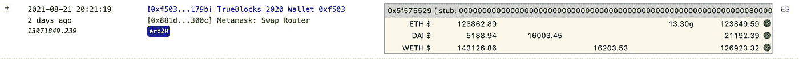
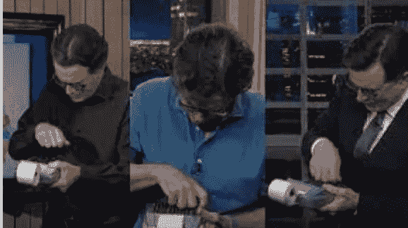

# 租金太高了第二部分

> 原文：<https://medium.com/coinmonks/the-rent-is-too-damn-high-part-ii-585c33450203?source=collection_archive---------3----------------------->

## 关于给自己寄钱的进一步探讨

这是一个由两部分组成的系列[的第二篇文章](https://tjayrush.medium.com/the-rent-is-too-damn-high-part-i-dc6695b25259)，使用 TrueBlocks 来探索*元掩码交换路由器*及其成本。[点击此处查看第一部分](https://tjayrush.medium.com/the-rent-is-too-damn-high-part-i-dc6695b25259)。

## 是的，亲爱的…

在上一篇文章中，我讨论了这笔交易(由 TrueBlocks 前端在交易时以美元表示):



Transaction 13,071,849.239 in US Dollars

我们讨论的事实是，一旦一个人开始查看自己的美元交易，他的钱在哪里消失就变得非常明显。(我是说去。)然而，不太清楚的是，钱是从哪些微小的蜘蛛洞里掉出来的。

在本文中，我们使用 TrueBlocks 软件的一个非常有用的方面:我们的命令行来更深入地探讨这个问题。

## TrueBlocks 命令行入门

本文不是指导如何使用 Linux 命令行的地方。也不知道如何下载和安装 TrueBlocks。我们假设您遵循了这些说明:[https://docs . true blocks . io/docs/prologue/installing-true blocks/](https://docs.trueblocks.io/docs/prologue/installing-trueblocks/)。现在就做，准备好了再回来…

## 到处玩…

假设您已经完成了上述安装说明，让我们尝试以下命令:

```
chifra names -c trueblocks
```

您应该会得到类似的结果(如果没有，请通过[提出问题](https://github.com/TrueBlocks/trueblocks-core/issues)来帮助我们改进我们的软件)。

```
**tags        address       name**
00-Active   0xf50...79b   TrueBlocks Wallet 0xf503
```

复制并粘贴地址(`0xf503017d7baf7fbc0fff7492b751025c6a78179b`)，然后键入以下命令:

```
chifra transactions 13071849.239 --reconcile \
        0xf503017d7baf7fbc0fff7492b751025c6a78179b --fmt json
```

您将获得一个 JSONish blob 的对账信息，正如我们在上一篇文章中介绍的:

```
{
  "data": [
    {
      "blockNumber": 13071849,
      "transactionIndex": 239,
      "assetAddr": "0xf503017d7baf7fbc0fff7492b751025c6a78179b",
      "assetSymbol": "ETH",
      "begBal": "38.220952577792982227",
      "gasCostOut": "0.004103324588246856",
      "spotPrice": 3240.70642,
      "priceSource": "uniswap",
      "totalIn": "0.00000000000000000",
      "totalOut": "0.004103324588246856",
      "amountNet": "-0.004103324588246856",
      "endBal": "38.216849253204735371",
      "reconciled": true
    },
    {
      "blockNumber": 13071849,
      "transactionIndex": 239,
      "assetAddr": "0x6b175474e89094c44da98b954eedeac495271d0f",
      "assetSymbol": "DAI",
      "begBal": "5188.943282141176871055",
      "amountIn": "16003.446778836992430933",
      "spotPrice": 1,
      "priceSource": "stable-coin",
      "endBalCalc": "21192.390060978169301988",
      "totalIn": "16003.446778836992430933",
      "totalOut": "",
      "amountNet": "16003.446778836992430933",
      "endBal": "21192.390060978169301988",
      "reconciled": true
    },
    {
      "blockNumber": 13071849,
      "transactionIndex": 239,
      "assetAddr": "0xc02aaa39b223fe8d0a0e5c4f27ead9083c756cc2",
      "assetSymbol": "WETH",
      "begBal": "44.165326226182661143",
      "amountOut": "5.0000000",
      "spotPrice": 3240.70642,
      "priceSource": "uniswap",
      "endBalCalc": "39.165326226182661143",
      "totalOut": "5.0000000",
      "totalOutLessGas": "5.0000000",
      "amountNet": "-5.0000000",
      "endBal": "39.165326226182661143",
      "reconciled": true
    }
  ]
}
```

这里要注意的太多了，很尴尬…但是…

**你会注意到**transaction index 显示该交易是块*13071849*的*第 239th】笔交易。请注意这一点，我们将在下面需要它。*

**你会注意到**每条记录的最后一项写着`reconciled: true`。这就是我们在前端显示的绿色调和点的来源。

**你会注意到**每条记录都有一个名为`priceSource`的字段，对于除了一条记录之外的所有记录，该值表示为`uniswap`。这记录了我们以美元为给定令牌定价的来源——`priceSource`的另一个值是`stable-coin`,这意味着我们可以(如果我们的用户愿意)将这个值固定为$1.00，从而避免对节点的查询。我们将在未来写一篇文章，讨论我们如何使用 UniSwap 和稳定的硬币。

**你会质疑**戴与 1.00 美元挂钩是否合法。(我们认为是，如果我们的用户不这样做，他们可以随时禁用这种优化。)这样做，大大加快了定价计算的速度。因此，就本文的目的而言，这是可以的。

**你会注意到**我们计算`spotPrice`只到小数点后五位——我们认为如果最终报告是以美元为单位的，那么进一步计算又有什么意义呢？

**您会注意到**数据实际上用它们自己的本机标记来命名值。例如， *wETH* 对账(第三条记录)，说我们在交易了 *5.0000 wETH。我们这样做是为了给协调的消费者提供最大的灵活性。将这些值视为交易的令牌数的计数。*

## 从 SpotPrice 和 Token Count 获取美元

那么，我们如何获得美元呢？

简单—对于每个数据项，我们将每个令牌的`spotPrice`乘以`nTokens`，这是数据本身的值。

*5.000 wet*乘以*的 a`spotPrice`3，240.70642*=*16203.5321*这就是我们想要互换的*wet*美元金额。

*16003.446778836992430933 戴*乘以 *1.00* 美元每戴是我们从互换中得到的*戴*的数。

最后，**你会注意到**我们送出的东西和我们得到的回报之间有一个“未说明”的差异。

有人称之为滑点。这并不奇怪，但是很烦人而且…“房租太高了！”

我难以置信——用完全程序化的方式和自己换钱，花了我*0 . 63007569*美元？

"该死的租金太高了！"

## 钱到底去哪了？

像我父亲一样，我是个守口如瓶的人，仅仅知道我花了 200 美元是不够的。我想知道它到底去了哪里。

让我们回到命令行。执行以下命令:

```
chifra transactions 13071849.239 --uniq
```

这将返回给定事务中出现的所有唯一地址。您应该会得到这些结果(我们已经清除了这些内容，您的结果可能会有所不同):

```
**bn.tx        addr**
13071849.239 0xf503017d7baf7fbc0fff7492b751025c6a78179b
13071849.239 0x881d40237659c251811cec9c364ef91dc08d300c
13071849.239 0xc02aaa39b223fe8d0a0e5c4f27ead9083c756cc2
13071849.239 0x6b175474e89094c44da98b954eedeac495271d0f
13071849.239 0x11ededebf63bef0ea2d2d071bdf88f71543ec6fb
13071849.239 0x74de5d4fcbf63e00296fd95d33236b9794016631
13071849.239 0x60594a405d53811d3bc4766596efd80fd545a270
13071849.239 0xdef1c0ded9bec7f1a1670819833240f027b25eff
13071849.239 0x3d1d55c23dfc759c5ae48500ca88ddf477b3c9e5
13071849.239 0x47f01db18a38261e4cb153bae6db7d3743acb33c
13071849.239 0xfffd8963efd1fc6a506488495d951d5263988d25
```

让我们看看能否给它们命名。对每个地址运行`chifra names`以获得以下结果:

```
**addr                                       name**
0x11ededebf63bef0ea2d2d071bdf88f71543ec6fb Metamask Fees
0x6b175474e89094c44da98b954eedeac495271d0f Dai Stablecoin
0x60594a405d53811d3bc4766596efd80fd545a270 Uniswap V3: DAI
0x881d40237659c251811cec9c364ef91dc08d300c Metamask Swap Router
0xc02aaa39b223fe8d0a0e5c4f27ead9083c756cc2 Wrapped Ether
0xdef1c0ded9bec7f1a1670819833240f027b25eff 0x Exchange Proxy
0xf503017d7baf7fbc0fff7492b751025c6a78179b TrueBlocks WalletNo results for 0x74de5d4fcbf63e00296fd95d33236b9794016631
No results for 0x3d1d55c23dfc759c5ae48500ca88ddf477b3c9e5
No results for 0x47f01db18a38261e4cb153bae6db7d3743acb33c
No results for 0xfffd8963efd1fc6a506488495d951d5263988d25
```

**你会注意到**有四个地址是未命名的。这不是问题。显然，TrueBlocks 不可能知道每个地址的每个名字。此外，请注意，这些“地址”中的一些甚至可能不是地址，它们可能只是看起来是地址。这就是为什么我们经常说外表而不是地址。有时，在创建索引的过程中，我们根本无法判断某个东西是一个地址，还是看起来只是一个地址，所以我们还是包含了它。没有伤害。没有犯规。

如果您更仔细地观察这些命名的地址，您会发现除了一个以外，所有的都有意义。

显然，TrueBlocks 钱包存在于交易中。

显然，*戴*和*韦*也在场——这就是我们交换的内容。

这三个路由器和/或代理也是有意义的( *Uniswap* 、*元掩码交换路由器*、0 *x 交换*)。毕竟，人们必须在某个地方完成互换。

但是，让我们从列表中的第一项开始: *MetaMask 费用*。

让我们看看我们能看到什么。运行以下命令:

```
chifra transactions 13071849.239 --reconcile \
        0x11ededebf63bef0ea2d2d071bdf88f71543ec6fb --fmt json
```

这是我们上面运行的相同命令，但是现在我们显示的是对*元掩码费*钱包地址的协调。该命令返回类似于以下内容的结果:

```
{
  "data": [
    {
      "blockNumber": 13071849,
      "transactionIndex": 239,
      "assetAddr": "0x11ededebf63bef0ea2d2d071bdf88f71543ec6fb",
      "assetSymbol": "ETH",
      "begBal": "1250.563288183878021420",
      "amountIn": "",
      "internalIn": "0.043750000000000000",
      "spotPrice": 3240.70642,
      "priceSource": "uniswap",
      "totalIn": "0.043750000000000000",
      "totalOut": "",
      "amountNet": "",
      "endBal": "1250.586983614757050983",
      "reconciled": true
    }
  ]
}
```

**您会注意到**中的`spotPrice`与之前的数据相同。这是意料之中的，因为这是同一笔交易。

MetaMask 费地址在本次交易中收取的金额等于`spotPrice`(*3240.70642*美元/ETH)乘以*0.043750000000000 ETH*等于 *141.780905875* 美元。

我不知道你怎么想，但对我来说那是一大笔钱。我的妻子，在斯蒂芬·科尔贝里的手指敲击之后，



告诉我这是 87.5 个基点(我们在 MetaMask 的网站上确认了这个数字)。

她说，她会建议她的客户找到一个更便宜的解决方案。

我们在网上做了一个快速而粗略的计算，看看在常规的、老式的、有 200 年历史的 FAIT 系统中，我们将美元兑换成欧元需要多少钱，结果要低得多。WTF！

我们正在撰写本系列的一篇姊妹篇，在这篇文章中，我们将探讨 MetaMask 费用合同在一天内的收入。找找那个。

## 其余的呢？

上面的计算仍然没有考虑到*58。588007569*。钱去哪里了？查看上图，你可以看到我们向矿工支付了*13.30 美元*的天然气费，剩下的 *45.004415288007569* 给了 UniSwap 及其流动性提供商。我将把它作为一个练习留给感兴趣的读者去深入研究。

无论如何，“房租太高了！”

## 结论

好吧，我们承认我们在上面的最终决议上踢了脚，但是你得到了这个想法: [TrueBlocks](https://docs.trueblocks.io) 是惊人的。

好吧。我不干了。这篇文章太长了。

## 支持我们的工作

如果你喜欢这篇文章，或者你只是想支持我们的工作，请访问我们的 git coin grant[https://gitcoin.co/grants/184/trueblocks](https://gitcoin.co/grants/184/trueblocks)。捐赠给下一轮比赛。我们得到了额外的好处，那就是更多的匹配资助。即使很少的量也会有很大的影响。

如果您愿意，请将 ETH 或任何其他令牌发送到我们的公共以太坊地址`0xf503017d7baf7fbc0fff7492b751025c6a78179b`。

感谢阅读…敬请期待更多内容。

> 加入 [Coinmonks 电报频道](https://t.me/coincodecap)，了解加密交易和投资

## 另外，阅读

[](https://blog.coincodecap.com/crypto-exchange) [## 最佳加密交易所| 2021 年十大加密货币交易所

### 加密货币交易所的加密交易需要了解市场，这可以帮助你获得利润…

blog.coincodecap.com](https://blog.coincodecap.com/crypto-exchange) [](https://blog.coincodecap.com/crypto-lending) [## 2021 年 9 大最佳加密借贷平台

### 当谈到加密货币贷款时，大量因素等同于良好的收入状况。此外，借款的一部分…

blog.coincodecap.com](https://blog.coincodecap.com/crypto-lending) [](/coinmonks/crypto-trading-bot-c2ffce8acb2a) [## 2021 年最佳加密交易机器人(免费和付费)

### 2021 年币安、比特币基地、库币和其他密码交易所的最佳密码交易机器人。四进制，位间隙…

medium.com](/coinmonks/crypto-trading-bot-c2ffce8acb2a) [](/coinmonks/best-crypto-signals-telegram-5785cdbc4b2b) [## 最佳 4 个加密交易信号电报通道

### 这是乏味的找到正确的加密交易信号提供商。因此，在本文中，我们将讨论最好的…

medium.com](/coinmonks/best-crypto-signals-telegram-5785cdbc4b2b) [](https://blog.coincodecap.com/blockfi-review) [## BlockFi 评论 2021:利弊和利率

### 今天，我们提出了一个全面的 BlockFi 评论，这是一个成立于 2017 年的加密贷款平台，拥有其…

blog.coincodecap.com](https://blog.coincodecap.com/blockfi-review) [](/coinmonks/buy-bitcoin-in-india-feb50ddfef94) [## 如何在印度购买比特币？2021 年购买比特币的 7 款最佳应用[手机版]

### 如何使用移动应用程序购买比特币印度

medium.com](/coinmonks/buy-bitcoin-in-india-feb50ddfef94) [](/coinmonks/best-crypto-tax-tool-for-my-money-72d4b430816b) [## 加密税务软件——五大最佳比特币税务计算器[2021]

### 不管你是刚接触加密还是已经在这个领域呆了一段时间，你都需要交税。

medium.com](/coinmonks/best-crypto-tax-tool-for-my-money-72d4b430816b) [](https://blog.coincodecap.com/pionex-review-exchange-with-crypto-trading-bot) [## Pionex 评论-被动交易者的简单交易机器人

### 在本文中，我们将回顾 Pionex，它提供了加密交易机器人自动化工具，集成了一个…

blog.coincodecap.com](https://blog.coincodecap.com/pionex-review-exchange-with-crypto-trading-bot) [](https://blog.coincodecap.com/best-hardware-wallet-bitcoin) [## 存储比特币的最佳加密硬件钱包[2021]

### 保管您的数字资产很容易，但找到正确的存储方式却是一项繁琐的任务。在线钱包有一个风险…

blog.coincodecap.com](https://blog.coincodecap.com/best-hardware-wallet-bitcoin)