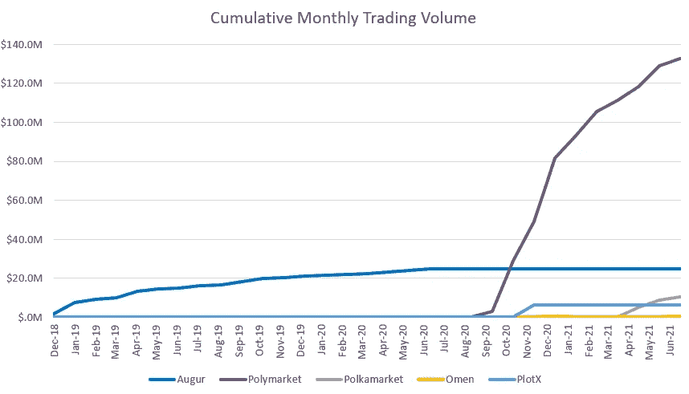

# 分散预测市场的复兴——一种潜在的社交媒体新形式

> 原文：<https://medium.com/coinmonks/the-resurgence-of-decentralized-prediction-markets-a-potentially-new-form-of-social-media-a76fcf41d98c?source=collection_archive---------1----------------------->

## **概述**

早在 2014 年，预测市场就被吹捧为最佳的区块链用例之一，当时第一个此类平台 Augur 推出。从那以后，大多数早期平台都淡出了存在，原因是以下原因之一:1)可用性/ UX 差，2)以太坊气费高，3)流动性差

然而，在 2020 年，随着以太坊扩展解决方案和差异化激励结构的出现，一批新的分散预测市场出现了。与上次不同的是，一些公司现在已经找到了早期产品与市场的契合点。随着这些平台的发展，我们相信这一类别可能会成为一种新的社交媒体形式，并成为下一波主流采用的领导者。

社区中的其他人也持有类似的信念，他们从一开始就关注着这个空间的发展。

## **预测市场如何运作**

简单地说，预测市场允许用户对二元事件的结果下注。在分散预测市场中，用户可以购买“Y-token”或“N-token”，它们代表二元结果事件的两个方面，根据需求和供应定价在 0-1 美元之间。例如，如果两种结果的几率相等，两个代币的价格都是 0.5 美元。在事件发生的日期，获胜代币的价值变为 1 美元，而另一个变为 0 美元，并且该价值从失败的群组转移到获胜的群组。

预测市场受益于三个关键参数的分散化:

1.  **全球:**用户第一次可以在没有任何基础设施/货币兑换障碍的情况下对全球赛事下注(大多数平台都在 USDC 运营)
2.  **限制更少:**几个集中式平台强加了自己的一套用户限制。例如，经常获胜的用户可能不再被允许下注
3.  **有限的交易对手风险:**几个集中预测市场，如 Intrade，已经被迫突然关闭

在分散式预测市场中，事件的结果可以通过以下两种方式之一进行报告:

1.  **基于令牌的 oracle 激励措施:**平台推出一个本地令牌，可由 oracle 服务提供商提供。作为交换，部分费用与他们分享
2.  **中心化神谕:**平台本身在前期充当神谕，选择不发行令牌。这引入了平台操纵的风险，但是降低了早期波动的风险，直到项目获得产品市场适合度

## **分散预测市场简史**

August 和 Omen 是这个领域的早期创造者，August 早在 2014 年就推出了。这些早期项目中的大多数都有正确的想法，但是可能太早了。这些项目受到四个关键挑战的困扰:

1.  **UX 故障:**这些平台中的大部分都是在 Metamask 的功能版本发布之前出现的，并努力提供干净的用户体验
2.  **定价/面额:**这些平台很多原来都是在 ETH 定价的；资产的波动性导致愿意承担价格风险的用户的可寻址市场较低
3.  **高昂的天然气费用:**在预扩展解决方案领域，许多此类项目都面临着天然气费用往往高于期望值的难题，导致一些用户流失
4.  **流动性差:**这些项目也很难拥有足够的流动性，以最终扩大规模，促成更大的赌注

结果，这些早期项目中的大部分慢慢变得默默无闻，带着看涨的分散预测市场叙事。

然而，在 2020 年，一些事件促使这个市场复苏。随着诸如 Matic 等 ETH 扩展解决方案的投入使用(以及低费用 L1 解决方案的兴起),进行低价值押注的体验变得更加经济。同时，总统选举和 COVID 推出了一套独特的二元结果，全球利益事件。最后，BTC 减半导致密码价格飙升，并带来了一个全新的用户群进入加密生态系统。

这些顺风推动了一个新玩家的崛起，该玩家彻底改造了分散预测市场模型，并迅速实现了其现有同时代人仍无法企及的产品市场契合度。

Polymarket 建立在 Matic 侧链的基础上，对传统的分散预测市场模型进行了四项关键变革:

1.  **无令牌/集中式 Oracle(最初):**poly market 没有像其竞争对手那样推出令牌，而是决定首先在内部发布裁决。这最大限度地减少了用户采用的波动性，这通常是由令牌价格波动引起的，并允许团队专注于产品和增长
2.  **稳定的货币单位:** Polymarket 将其所有市场都以 USDC 计价，以避免价格波动带来的不便。这使得它对新用户来说更加容易接受和直观，促进了用户的采用
3.  **流动性激励:** Polymarket 对直接流向流动性提供者的每笔交易收取 2%的费用。Polymarket 最初没有为自己保留费用，因此能够解决困扰其前辈的一个关键问题
4.  **专注于简化 UX:** 在大多数参数上，Polymarket 的 UX 比大多数竞争对手更直观。这使它很好地吸引了新的(和非)加密用户

## **预测市场的潜在未来**

从以太坊早期开始，加密社区就被建立自己的分散式社交媒体平台的前景所吸引。然而，迄今为止，大多数模型只是试图模仿成功的 Web 2.0 平台，并称之为“去中心化”。我们认为，第一个成功的去中心化社交媒体平台看起来将与大多数人预期的非常不同，并将围绕 crypto 的核心价值主张:全球金融互联性而构建。

去中心化的预测市场第一次让世界各地的人们在经济激励下表达他们对全球事件和时事的看法成为可能。这感觉像是 Twitter 评论和 Reddit 聊天室辩论的自然发展，直到区块链技术的出现，才有办法在全球范围内得到解决。

在这个旅程中，当前分散预测市场结构的一个关键补充将是匿名评论和讨论的能力，使这些平台成为真正的社交平台。同样，这已经被社区中的杰出人物引用，并且可能已经在路线图中。

除了连接假名身份，分散的预测市场将开始像分布式调查工具一样运作。正如 Twitter 已经成为事实上的新闻来源，在正式渠道之前提供新闻一样，预测市场将成为捕捉公众情绪和传播由明确的经济激励支持的信息的工具。这方面的一个例子是 2020 年总统大选，大多数预测市场在传统新渠道之前就预测了特朗普和拜登的竞选结果。

任何捕捉并传播这一价值的平台都将能够建立一个基于象征性收费的稳健商业模式。

## **风险/限制**

分散预测市场的一个关键限制是，如果围绕可能影响结果的人创造了一个博彩事件，他们可能会抢在机会之前采取相应行动。这方面的一个例子出现在 2016 年，当时围绕 Vitalik Buterin 是否会在给定的一周戴帽子出现了一个预测市场。不出所料，他很快买下了“Yes-token ”,并戴上帽子参加了下一次电视公开露面。

然而，代表了当今市场相对较小的一部分；大多数预测市场事件的结果不是由一个人或一群人控制的。此外，我们预计，随着用户越来越明智地选择投资地点，这些市场将无法积累流动性。

## **结论**

虽然现在看起来还不明显，但去中心化的预测市场可能最终会在正确的时间出现在正确的地方，从而获得更广泛的采用。在这一领域的参与者中，Polymarket 似乎已经抓住了正确的组合，以利用推动该行业的顺风。随着它的不断发展和添加，如评论，分享等功能。预测市场可能成为去中心化生态系统中一个独特的社交媒体平台。凭借其作为公众情绪数据/新闻来源的额外价值主张和全球影响力，如果分散预测市场平台在未来十年变得像 Twitter 一样重要，我们不会感到惊讶。

## 也阅读

 [## 加密交易机器人——最佳免费加密交易机器人

### 2021 年币安、比特币基地、库币和其他密码交易所的最佳密码交易机器人。四进制，位间隙…

medium.com](/coinmonks/crypto-trading-bot-c2ffce8acb2a)  [## 最佳 6 个加密交易信号电报通道

### 这是乏味的找到正确的加密交易信号提供商。因此，在本文中，我们将讨论最好的…

medium.com](/coinmonks/best-crypto-signals-telegram-5785cdbc4b2b)  [## BlockFi 评论 2021:利弊和利率

### 今天，我们提出了一个全面的 BlockFi 评论，这是一个成立于 2017 年的加密贷款平台，拥有其…

blog.coincodecap.com](https://blog.coincodecap.com/blockfi-review)  [## 加密税务软件——五大最佳比特币税务计算器[2021]

### 不管你是刚接触加密还是已经在这个领域呆了一段时间，你都需要交税。

medium.com](/coinmonks/best-crypto-tax-tool-for-my-money-72d4b430816b)  [## Pionex 评论 2021 |免费加密交易机器人和交易所

### Pionex 是为交易自动化提供工具的后起之秀。Pionex 上提供了 9 个加密交易机器人…

medium.com](/coinmonks/pionex-review-exchange-with-crypto-trading-bot-1e459d0191ea)