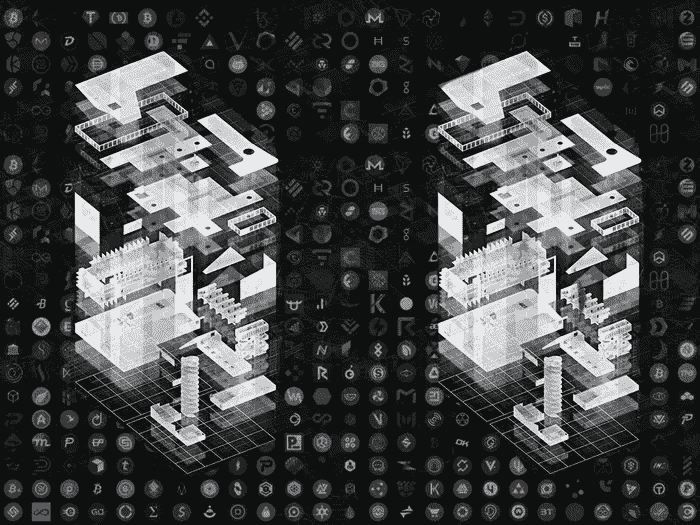
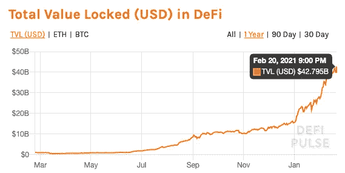

# 经济 3.0 的革命

> 原文：<https://medium.com/coinmonks/the-revolution-that-is-economy-3-0-78df53ab54da?source=collection_archive---------5----------------------->

一场全球性的革命正在发生，而且它发生得如此之快，除非你被明确告知，否则它很可能对你完全不可见。你可能知道的一些事情正在发生的唯一线索是提到比特币和另一个新冠肺炎刺激方案的头条新闻。这场革命并非始于今年，甚至也不是始于去年，但在过去三个月里，这场革命的速度如此之快，以至于我们显然已经接近了一个转折点。我所说的这场全球革命关系到全球经济的本质和机制。这场革命是由数字资产、可编程货币和分布式自治组织推动的。我们亲眼目睹的是人类组织、工业和贸易的完全重塑。我们正在见证的是[经济 3.0](https://wiki.p2pfoundation.net/Economy_3.0) 的诞生。

# **收敛**

在宏观层面上，如果人类工业和创新的趋势线继续沿着它正在穿越的路线发展，这场革命是不可避免的。哈雷戴维森、普拉达和惠而浦等老牌公司花了近一个世纪才达到 10 亿美元的估值。像美泰、耐克和星巴克这样的现代公司只用了四分之一的时间就做到了。然后我们看到像 Evernote 和 PayPal 这样的互联网公司在不到十年的时间里就做到了这一点。随着互联网变得更加成熟，网络效应变得更加牢固，像 Pinterest、Instagram 和 YouTube 这样的纯数字公司在不到两年的时间里就达到了十亿美元的估值。随后，购物网站 Jet.com 凭借其独特的定价算法，在四个月内做到了这一点。现在，随着区块链、加密货币和令牌化组织的出现，我们看到公司在小时、分钟和秒的规模上达到难以想象的估值。

*   bancor:3 小时内 1.53 亿美元
*   阿拉贡:15 分钟 2500 万美元
*   直觉:10 分钟内 1200 万美元
*   奇点网:60 秒内 3600 万美元
*   勇敢:30 秒内筹集了 3500 万美元

见:最快的 [IPO 的](https://fleximize.com/unicorns/)和 [ICO 的](https://insights.invyo.io/europe/mapping/mapping-the-top-10-fastest-icos-of-all-time/)

# **创世纪**

让我们后退几步，看看我们是如何走到这一步的，因为如果你理解了这一模式，那么正在发生的一切都不足为奇。一旦任何东西变得数字化和程序化，就会开始以指数速度加速发展。雷·库兹韦尔详细讨论并记录了这一点。从这个角度来看，这种经济数字变形的起源始于 80 年代末。

> 一旦任何东西变得数字化和程序化，就会开始以指数速度加速发展。

1987 年，世界上有了第一个电子股票交易所——纳斯达克终端。交易员现在可以直接将订单输入电脑。一位名叫托马斯·彼得菲的交易员不想输入订单，所以他和他的工程师们侵入了纳斯达克终端，这样它就可以直接连接到他们自己的电脑上，根据算法自动进行交易。一名纳斯达克高级官员看到了彼得菲的设置，并表示彼得菲违反了规则:所有订单都必须通过键盘输入。他给皮特菲的团队一周时间来解决这个问题。

彼得菲和他的工程师们想出了一个解决方案。他们制造了一个带有橡胶手指的机械机器人，可以在键盘上打字。据报道，检查员在看到这台笨重的机器后怒气冲冲地离开了房间，但它在技术上符合纳斯达克规则。交易员表示，在交易活跃的日子里，机器人打字速度如此之快，听起来就像机关枪一样。彼得菲成为数字交易之父，这反过来为算法和高频交易铺平了道路。他会在交易日在脑子里写代码，然后在下班后把他的想法应用到电脑交易模型中。参见:[电脑化股票交易背后的男人](https://www.npr.org/2015/04/23/401781306/we-built-a-robot-that-types-the-man-behind-computerized-stock-trading)

在接下来的几年里，股票市场将被算法交易所主导，所有货币的大部分将以数字形式存在。但这里不容忽视的关键区别是。交易的是所有权记录，而不是实际的资产本身。但随着 2009 年世界上第一个数字化稀缺资源比特币的发明，这一切都将改变。

# **数字货币**

比特币的发明带来的根本性创新是数字稀缺性的发明。我可以拥有一些数字化的东西，并把其中一些发给你，我的供应量减少了，这种想法是如此的新奇和不可思议，以至于世界上绝大多数人甚至没有意识到这种东西的存在。事实上，世界只是在过去几个月才意识到加密货币的现实，而实际的加密生态系统已经远远超出了这一点。

> *“我认为互联网将是减少政府角色的主要力量之一。有一样东西是缺失的，但很快就会被开发出来，那就是可靠的电子现金。在互联网上，你可以在 A 不知道 B 或者 B 不知道 A 的情况下，将资金从 A 转移到 B 的一种方法，”—诺贝尔经济学奖得主米尔顿·弗里德曼*

在过去的三个月里，政治家、大型科技公司、银行、信用卡、宾夕法尼亚证券交易所都狂热地加入了 T 型加密货币比特币的行列。所有的宣传和机构投资都推高了比特币的价格，但与 3.0 经济的前沿发生的事情相比，这根本不算什么。这远远没有达到事情发展的最高水平。这才刚刚开始，这场革命与互联网革命的不同之处在于，这场革命无法控制。

> “就接受程度而言，比特币的用户数量与 1997 年互联网的用户数量大致相同。大的增长更快。按照目前的路径，未来四年比特币用户将达到 10 亿人，这相当于 2005 年互联网用户的数量”——威利·吴 [*，推特*](https://twitter.com/woonomic/status/1356310219215699968)

# **分权财政**

一些非常聪明的人意识到，如果你可以拥有一种去中心化的货币，为什么不可以有去中心化的程序，为什么不使用这些程序根据被称为智能合约的可编程规则来移动加密货币呢？为什么不在这些智能合约中创造出与传统金融世界中相同的工具和实体呢？我刚才描述的是分散式金融(Defi)中发生的事情，仅在疫情期间，它就增长到了 400 亿美元，而且没有放缓的迹象。事实上，一个人几乎不能跟踪新的竞争和补充 Defi 协议和仪器的扩散。以太坊远没有失去动力，它是用于 Defi 的区块链中最活跃的，正在准备一次更新，这将大大降低交易费用，从而邀请更多的参与者加入生态系统。

> 新一轮金融创新正在向我们袭来。分散金融(DeFi)为新的金融服务提供了坚实的基础，这些服务是如此强大和有利，以至于我们很快就会回过头来看它们，并质疑没有它们我们是如何运作的。— [*纳斯达克*](https://www.nasdaq.com/articles/decentralized-finance-defi%3A-an-emerging-giant-2021-01-15)

政府肯定会展示他们的肌肉，试图监管 3.0 经济，但问题是他们是否会超过这个生态系统的技术发展。英国政府表示，它将在 2022 年发布加密货币的监管规则，但这可能需要 20 年的时间。像分散交换、星际文件系统和以太坊命名系统这样的技术正被用来以分散和抵制审查的方式重建互联网。权力正在发生根本性的转变，这种转变无法用新的法律或物理武器来阻止或减轻。信息经济从民族国家经济中挣脱出来，妖怪无法被放回瓶子里。那些反对这场革命的人的努力将被发现是徒劳的，就像一个孩子无力地跺脚以示抗议一样。那些认识到这一运动是什么并花时间自学并成为积极参与者的人将发现自己是新世界的数字奇才。阿特拉斯耸耸肩，古老而笨拙的民族国家正走上正轨，与自由市场中的任何其他参与者一样无关紧要。

阅读:[主权个人:掌握向信息时代的过渡](https://www.amazon.com/dp/B00AK9IXXM/ref=dp-kindle-redirect?_encoding=UTF8&btkr=1)