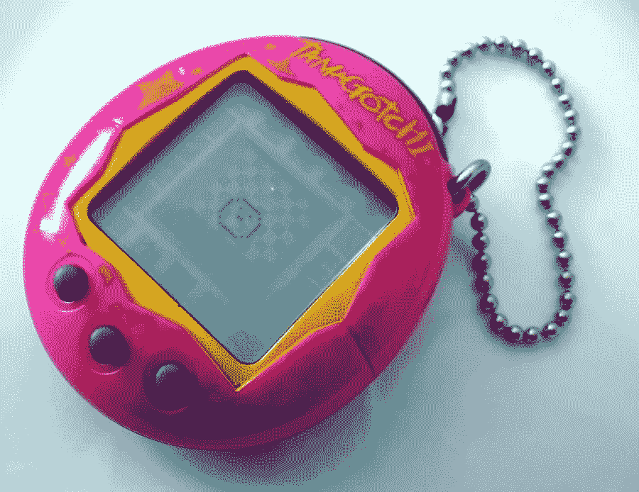

# 不可替代的代币资产的崛起

> 原文：<https://medium.com/coinmonks/the-rise-of-non-fungible-token-assets-7fdb4bbb8ad7?source=collection_archive---------1----------------------->

到现在为止，你很可能听说过隐猫。CryptoKitties 是一个基于以太坊的游戏和迷你经济，用户在这里购买、出售、交易和繁殖数字猫。在外人看来，像这样的项目看起来像是区块链技术的荒谬应用，似乎没有任何用途。虽然区块链上的猫听起来本质上并不重要，但允许这些资产存在的底层协议却有着重要的价值。

> “可替代性本质上是一种资产的特征，在这种情况下是一种象征，它决定了相同或相似类型的项目或数量在交换或使用过程中是否可以完全互换。—杰拉尔德·纳什

ERC721 协议于去年 9 月开发，目的是在区块链创建不可替代的资产。这使得一组开发人员能够在以太坊的区块链上设计出具有独特特征的数字猫，同时允许买家拥有这些资产的不可改变的所有权。从表面上看，这似乎无关紧要。然而，区块链独特的、数字化稀缺资产的概念有着深远的影响。

*(在这里，为了可读性，我将不可替换的令牌称为 NFT 的)*

# **收藏品**

NFT 最受关注的方面是将数字化稀缺资产作为收藏品的想法。人类有丰富的收集从棒球卡到稀有硬币的心理历史。因此，数字资产领域的许多人猜测，人们会纯粹因为 NFT 的独特和稀缺特性而寻求拥有它。然而，关于收集心理学的研究表明，人类收集东西更多的是出于情感目的，而不是金钱目的。例如，我的一个表兄收集他参加过的活动的票根作为纪念品。这些纪念品把他带回了一个特定时间、地点和与那段记忆相关的感觉。

目前，NFT，如 CryptoKitties 或稀有品种，主要是为了以升值的未来价值出售资产的预期货币收益而被买卖。与我的堂兄相比，购买这些资产几乎没有任何感情因素。也就是说，我不相信仅仅因为 NFT 的稀缺和独特的属性，它就会被广泛采用。我们需要为这些资产开发一个可用性功能，要么增加用户的情感反应，要么提供在此协议标准之前不可能实现的效用。

# **游戏**

NFT 的一个垂直领域是博彩业。几个月前，《福布斯》称，2017 年电子竞技收入达到 6.55 亿美元，预计 2018 年增长 38%。现在想象一下 NFT 会如何影响这个已经蓬勃发展的行业。例如，说有一个类似的经济为使命召唤字符有为密码猫。用户可以购买他们的角色，移植到游戏中，和他们一起玩。有了这个应用程序，你就超越了 NFT 的收藏品。游戏中的可用性和拥有一个受欢迎的角色的自豪感引发了人类如此渴望的情感反应。

Tamagotchi

ERC721 协议的另一个重要含义是能够改变资产的特性。在当前的数码猫世界里，你可以让一只猫和另一只猫交配，创造出一只具有完全不同身体特征的全新的猫。现在，让我们把这个想法更进一步。想象一下，隐猫正在发展成为 21 世纪的电子鸡。你拥有你的 CryptoKitty，拥有一个开放的世界环境，你可以遛它，喂它，给它买配件。你为它买的任何东西都会影响猫的特征，从而影响它的价值。例如，如果你每天喂你的猫奶酪汉堡，它会增加体重，变得迟缓，最终功能会与你喂它健康餐时不同。这让位于 NFT 经济的全新方面。所有者现在可以直接影响他们的 NFT 的特征，影响他们在游戏经济中的市场价值。同时，这为这个游戏空间的所有者引入了新的收入流。为了让你知道这可能有多有利可图，动视暴雪仅在 2017 年就在游戏内购买上获利超过 40 亿美元。NFT 对游戏环境的可移植性解决方案对于该协议的当前状态和整个区块链来说是雄心勃勃的。然而，这肯定是未来需要关注的事情。

# **发牌**

在我看来，NFT 的最新也是最令人兴奋的应用涉及到它们在许可方面的潜在用途。软件许可在历史上一直很复杂。用户可以购买软件，然后在互联网上免费盗版给数百万用户；导致软件公司收入的重大损失。同样，如果你想在使用完软件后简单地转售它，那是不可能的。正如 2008 年的 [*Vernor 诉 Autodesk*](https://en.wikipedia.org/wiki/Vernor_v._Autodesk,_Inc.) 一案所表明的那样，如今几乎所有的软件都是“授权”的，而不是“出售”的；因此将其转售给第三方是非法的。

进入 NFT 的。

> “如果我们所有的软件许可证都是兼容的，我们可以去一个集成的应用程序商店，卖三天的 Adobe Creative Cloud，买两天的 Microsoft Office，会怎么样？这种灵活性对消费者来说是一个明显的胜利，但肯定会导致软件供应商的收入损失。嗯，但是如果这种许可证的易转让性也减少了盗版呢？”—约翰·格里芬

正如约翰·格里芬在上面的引用中提到的，NFT 的许可证缓解了软件销售中消费者和供应商双方的问题。对消费者来说，主要的好处是可转让性和隐私性。您不再需要被锁定为 Microsoft Office 的一年订阅。当你完成后，只需在以太坊区块链顶部的公开市场上出售你的许可证。在隐私方面，除了你的公共以太坊地址之外，不需要和服务商分享任何信息。

对供应商的好处也很大。由于 NFT 只是智能合同，供应商可以将参数编码到许可证中。这些参数中的一些包括但不限于二次销售的收入分成或许可证转让前后的时间段限制。NFT 的许可证也挫败了当今软件猖獗的盗版问题。为了让您盗版 NFT 软件许可证，您需要共享您的私钥。在这种情况下，您会泄露您的以太坊地址，并冒着许可证被盗的风险。

# **涟漪效应和可投资的垂直行业**

正如你所看到的，NFT 的影响远远超出了数码猫。而且，就我个人而言，我认为我们甚至还没有开始挖掘这一资产类别的潜力。然而，尽管这可能令人兴奋，但该领域快速增长的连锁反应可能会带来麻烦。去年 12 月，CryptoKitties 狂潮彻底瘫痪了以太坊网络。如果 NFT 继续以比以太坊扩展解决方案更快的速度增长，预计将在短期内看到 TX 费用飙升和主要网络堵塞。

目前，投资于对 NFT 增长的预期尤其艰难。显而易见且令人不满意的答案是，预计到网络需求的增加，购买 ETH 以支付更高的天然气费用。在我个人看来，我不认为适当的可投资垂直市场存在。在接下来的几个月里，我会寻找新的项目，致力于 NFT 氏症的保管解决方案，与 NFT 氏症互动的消费者友好的用户界面，以及这些独特资产可以交换的市场的发展。

# 额外资源

NFT 的 as 许可证:

*   约翰·格里芬的 LicenseToken 目前处于概念验证阶段。更多信息可以在[这里](/@john.griffin/software-licences-as-non-fungible-tokens-1f0635913e41)找到。
*   NFT 的 as 许可证的其他应用包括[Dottabot](https://www.dottabot.com/)trailing profit adjustment bot。

***在 Twitter 上关注我所有东西 crypto***[***@ bennybitcoins***](https://twitter.com/bennybitcoins)