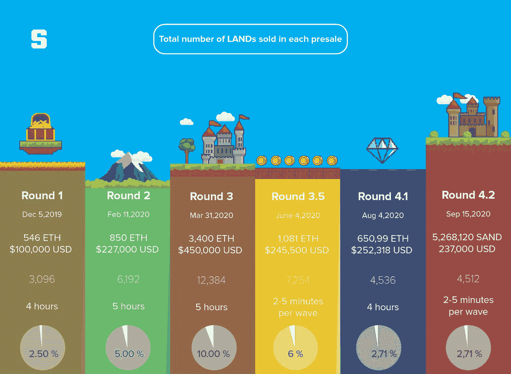
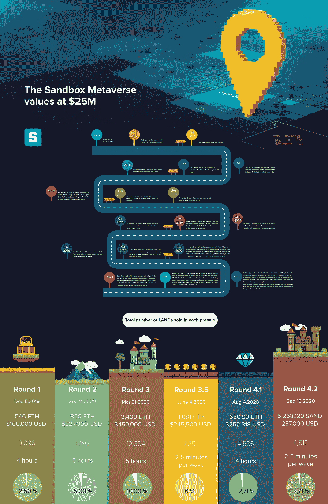
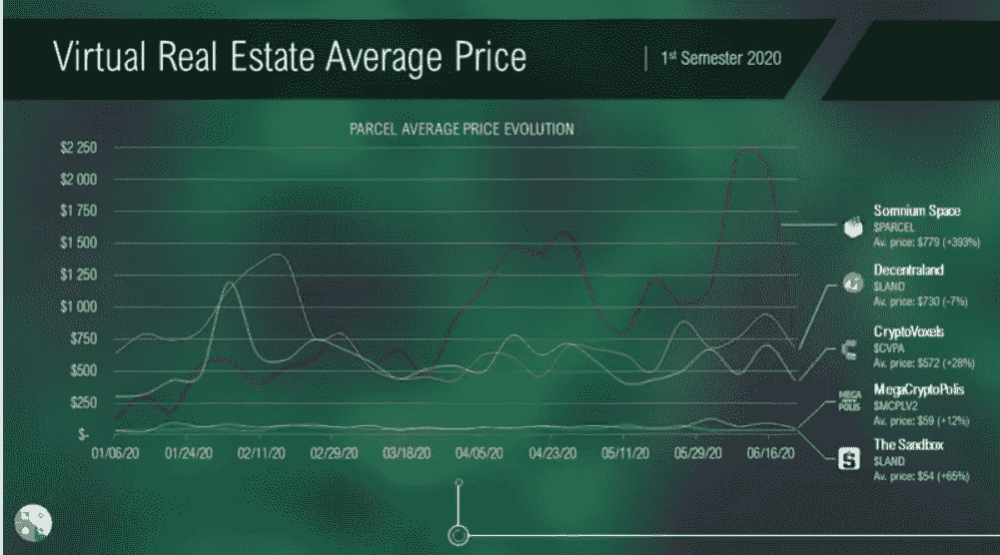
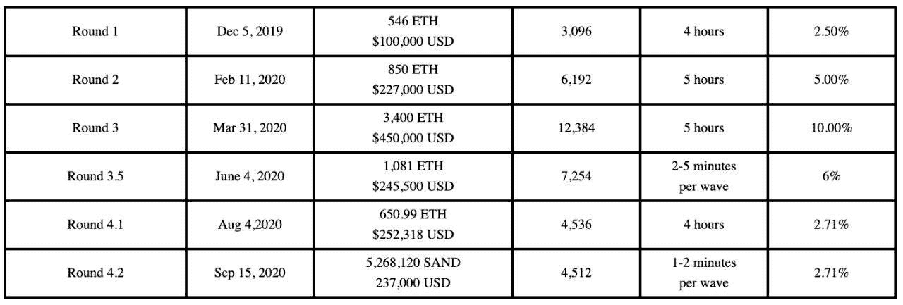

# 基于区块链的虚拟土地的崛起:下一步是什么？

> 原文：<https://medium.com/coinmonks/the-rise-of-the-blockchain-based-virtual-lands-whats-next-53021ed81777?source=collection_archive---------2----------------------->

如今，考虑到今年年初在全球范围内实施的新冠肺炎限制，人们将大量空闲时间花在了网上。社交网络的智能算法和让人们保持在线的技术进步也支持了这一趋势。

事实上，数字世界已经变得如此流行，以至于全球投资者开始将资金投入虚拟资产，包括虚拟土地、独特的数字艺术品等等。事实上，在 2020 年的过程中，世界已经看到了许多买家对虚拟土地的大量投资，他们渴望增加他们的数字财产。

由于区块链产业的最新发展，人们现在能够用比特币购买房屋或在区块链上进行抵押贷款。因此，越来越多的人开始意识到区块链技术应用于许多行业的好处，尤其是在房地产市场。

随着区块链在这一领域知名度的提高，越来越多的人开始创建虚拟世界，一些创新项目也进入了这个领域。因此，区块链推动的项目提供了购买和拥有虚拟财产的机会，最近受到了很大的欢迎。

# 什么是虚拟世界？🌍

虚拟土地代表 3D 虚拟空间中的一块土地，在这里用户可以对他们的土地做任何他们想做的事情。许多虚拟世界项目提供了不同的虚拟世界标准，当然，也有各种各样的虚拟世界体验。例如，在游戏中拥有一块虚拟土地的玩家可以出售或出租，就像在现实世界中一样。

随着虚拟世界的发展趋势和对虚拟土地需求的增加，许多新项目开始致力于开发自己的虚拟现实世界。以下是一些最受欢迎的虚拟世界项目。

**索姆空间**

[Somnium Space](https://somniumspace.com/) 是一个跨平台的虚拟现实世界，于 2018 年推出。它使用户能够购买土地，构建和导入对象到平台，创建一个共同的虚拟世界。在 Somnium 空间中，玩家可以选择三种不同大小的土地:小型(200 平方米)、中型(600 平方米)和大型(1500 平方米)。

该项目旨在通过允许玩家在虚拟现实世界中创建一个正常运行的经济来促进虚拟世界的沉浸式体验。

**去中心化**

分散世界是一个虚拟世界，用户可以在这里建立、购买和出售不同的 3D 作品，进行社交和玩游戏。这个项目背后的战略思想是创造一个用户可以称之为自己的虚拟空间。该平台为他们提供了购买虚拟土地并在其上创建任何对象的机会，包括商店、城市等。

**沙盒**

[沙盒](https://www.sandbox.game/en/)是一个社区驱动的虚拟世界，玩家有机会在以太坊区块链上建立、拥有和货币化他们的游戏体验。该平台旨在克服当前游戏市场的局限性，并加速区块链在全球的采用。

在沙盒《元宇宙》中，土地是一片数字化的不动产，玩家可以在上面建造体验。土地所有者可以用各种游戏和资产来填充它。沙盒元宇宙上的每块土地都是以太坊区块链上唯一不可替代的代币。

沙盒最大的土地预售将于 11 月 12 日格林威治时间下午 1 点开始。点击查看详情[。](/sandbox-game/announcing-the-sandbox-land-presale-4-3-the-last-and-biggest-land-presale-with-smurfs-31ece7890b)

The Sandbox Roadmap

# **虚拟土地价值正在上升🚀**

今年年初，crypto 社区被分散土地向一个未知用户出售价值 21.5 万美元的土地的消息震惊了。总的来说，据报道，分散土地社区已经在平台内的数字土地上花费了 100 万美元。

如此巨大的数字并不令人惊讶，因为虚拟世界的趋势正在与日俱增，甚至大型密码行业的人物都在投资数字领域。

来源:[https://nonfungible.com/](https://nonfungible.com/)

例如，今年 9 月初，领先的加密货币交易所之一币安宣布有意购买沙盒中的土地 NFT。交易所在沙盒元宇宙购买了 4012 块土地，[增加](https://www.binance.com/en/blog/421499824684900959/Game-On-Buying-Digital-LAND-NFTs-in-The-Sandbox):

*“很明显，区块链技术在游戏行业有着巨大的潜力。它为游戏玩家和开发者提供了显著的改进，特别是在去中心化、透明性和互操作性方面。币安进一步证明，通过与沙盒的合作，区块链技术可以将主流应用带入游戏。我们共同致力于一个全新的娱乐领域，为玩家带来更多自由。”*

在对他们的数字地产进行大量慷慨投资、一系列成功的合作以及社区的整体增长之后，沙盒生态系统看到了他们的土地价值的增加。

在最近的更新中，该项目的联合创始人兼首席运营官 Sebastien Borget 提到，元宇宙以 210 ETH～76，931 美元(28x 原价 1，400 美元)的价格出售了两个庄园。下面你可以看到一张表格，总结了近一年来沙盒元宇宙的土地销售价值。

## **最后的话**

总体而言，考虑到当前平台上可用虚拟土地的稀缺因素，需求正在持续增长。虽然虚拟现实提供了正确的工具，区块链提供了虚拟土地货币化的层面，但这种增长趋势将继续下去。此外，随着冠状病毒疫情导致更多数字形式的交流，虚拟现实世界可能是最安全的互动空间。

这些天来，随着我们目睹数字经济的蓬勃发展，大玩家和普通社区已经朝着虚拟现实和财产的更广泛应用的方向稳步前进。预计随着更多的时间和大量的研究与开发，虚拟现实世界可以帮助建立一个透明和可持续的数字世界。