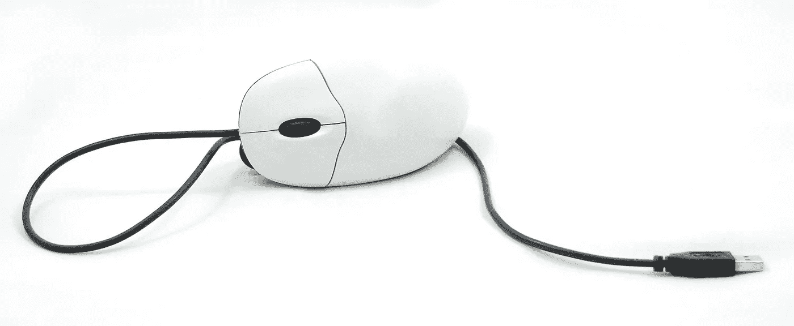
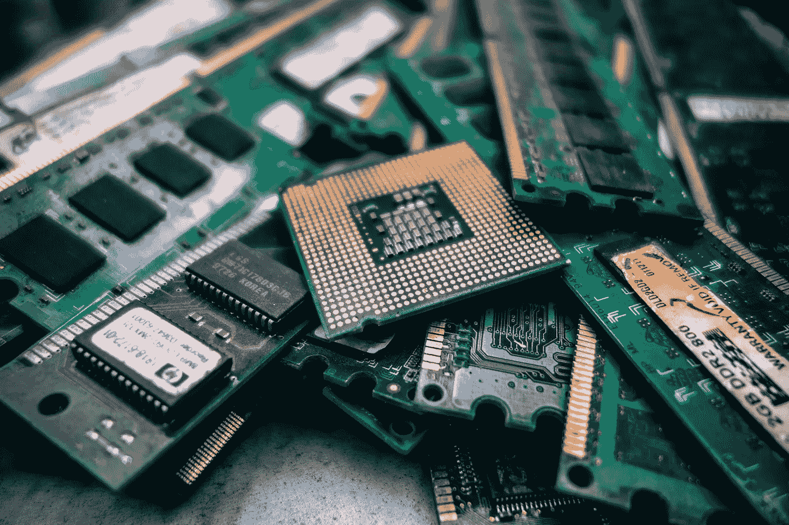

# 硬件和可信执行环境在区块链扩展和安全性中的作用

> 原文：<https://medium.com/coinmonks/the-role-of-hardware-and-trusted-execution-environments-in-blockchain-scaling-and-security-bcc5d5d79b76?source=collection_archive---------8----------------------->

***硬件不仅仅是关于挖矿的 ASICs。它将影响区块链对等节点、远程设施和基础设施的下一代设计***

T 用于加速工作证明算法计算的新型 ASIC 挖掘硬件的推出，最近震动了区块链社区，增加了对硬件的认识和讨论。但是硬件会影响区块链架构的各个方面，包括对等节点和网络基础设施。固件和微码越来越模糊了硬件和软件之间的界限。此外，区块链提供了一个机会来重新思考和扩展可信执行环境的传统概念，使它们更加有用。

作为一个社区，我们对这些项目对可伸缩性和安全性的巨大影响关注不够。

这是一系列博客中的第一篇，在这些博客中，我将研究这个主题的一些多学科的复杂性。本系列接下来的几篇博客正处于不同的写作阶段。但我欢迎各种形式的建设性反馈，并将根据需要调整未来的博客。因为最终这是对未来的展望，我在这里的贡献只是指出一些趋势并提出一些建议。

第一部分:关于过去和未来的一些想法

**一些语境:**

这一系列博客的后续内容是对当今硬件行业的评估，因为它与比特币和其他区块链有关，以及未来可能发生的事情。这是我个人的观点，所以有理由问为什么有人要相信我说的话。在许多细节上，我当然可能是错的，我完全相信我会错的。但是我相信下面描述的大部分愿景最终都会实现，我请求你们考虑这种可能性。

我工程生涯的大部分时间都在为大型半导体制造商工作，设计和支持一些产量最大、成本最敏感的计算机芯片，还有较短的时间从事系统设计、网络和网络安全工作。自从两年半前我对比特币着迷以来，我就一直在努力探索比特币作为从过去到未来的进化步骤，是如何“融入”计算的。虽然硬件不再是我的主要关注点，而且用今天的标准来看也不“性感”，但硬件对任何计算技术的未来都是至关重要的，在试图预测未来时，利用过去的经验似乎是合适的。为了理解今天计算机硬件的状态和正在形成的趋势，有必要考察技术的进步以及激励和塑造其未来道路的商业环境中的力量和变化。我尽量把两者都考虑进去。我希望你和我一样感到有趣和激励。

**一点历史:**

> **“真正对软件认真的人应该自己做硬件”** *-* [*艾伦·凯*](https://en.wikipedia.org/wiki/Alan_Kay) *，计算机先驱，GUI 发明者*

当从历史的角度考虑计算时，我们可能会注意到伴随着个人电脑的广泛采用而在大型机上却不存在的创新。提高个人电脑可用性的核心是施乐帕洛阿尔托研究中心的鼠标和图形用户界面的发明。正是在那里，比尔·盖茨和史蒂夫·乔布斯第一次看到了这个概念，并决定在自己的公司里实施。施乐公司负责这项工作的工程经理艾伦·凯是(现在仍然是)真正的计算机先驱，他还向世界介绍了许多其他重要的新进展，包括面向对象编程。艾伦因为说过“真正对软件认真的人应该自己做硬件”而出名。

这听起来可能微不足道，但是仔细想想。如果我们还在给计算机输入穿孔卡片，它们还会有用吗？还是仅限于在终端窗口中输入命令？在计算机发展的每个阶段，硬件都经过了调整，以更好地适应可用性和性能需求，并与最佳软件解决方案共同设计。区块链也不会有什么不同。我们在采矿专用集成电路中看到了这一点，但这仅仅是开始。硬件可能不被视为性感，但它是至关重要的，可以非常创新。这意味着定制硬件是不可避免的。

让我提供一个简单的例子来说明硬件优化是多么强大，甚至对于主流的普通计算也是如此。多年来，半导体行业一直在努力应对摩尔定律即将终结的事实。[摩尔定律](https://en.wikipedia.org/wiki/Moore%27s_law)以英特尔创始人之一的名字命名，他观察到集成电路会不断增加晶体管并变得越来越小，在过去的 50 年里，该定律推动了计算机行业的小型化和产品价格的不断下降。我们稍后会详细讨论这一点。但是现在，只要接受过去 5 年(至少)没有看到同样的趋势。让电子产品变得更小仍然是可能的，而且这种情况将继续下去。工程师是聪明的人，他们很少会想不出主意。但是最新最密集的技术不再是最便宜的。处于领先地位现在变得越来越昂贵。如果工程奇才提出新的更具成本效益的小型化策略，这种情况可能会改变，但目前，我们有点卡住了。

考虑到这一点，让我们快速了解一下苹果使用的硬件。这些不是尖端超级计算机。但每年，苹果都会为其产品推出另一个 A 系列片上系统，并设法大幅提高性能。但推动这一趋势的并不是摩尔定律。苹果一直渴望完全控制芯片，定制合作设计以最佳匹配他们的软件。要了解更多细节，你可以看看这里的，作者总结道“在接下来的一小段时间里——大约 20 到 50 年后——将被从软件到硬件的过渡所主导，这两者的混淆如此彻底，以至于几乎不可能知道两者之间的界限在哪里。”

当然，苹果一直以出色的产品设计而闻名，其中硬件和软件都经过精心制作，以获得最佳的用户体验。这种方法效果如何？从历史上看，基于苹果公布的 2018 年 3 月季度业绩，这是一个问这个问题的好时机。你可以在[这里](https://www.cnbc.com/2018/05/11/apple-made-more-profit-in-three-months-than-amazon-has-generated-during-its-lifetime.html)读到一些细节，美国消费者新闻与商业频道解释道:

> 苹果三个月的利润比亚马逊一生的利润还要多

当然，我们可以讨论亚马逊未来可能获得多少利润。或者苹果是否对开源软件社区或希望完全控制自己设备的人很好(我个人选择了永远不拥有苹果产品)。但事实仍然是，硬件协同设计以最佳方式匹配软件和其他应用程序需求是计算成功的一个非常强大的公式！

**半导体行业的趋势:**

我们已经讨论了摩尔定律的减速和可能的终结，以及即使 CPU 性能的提高不再是免费的，片上系统的性能仍然可以通过仔细的硬件和软件协同设计来提高。但是还有更大的影响。如果 CPU 性能不再每隔几个月就自动提高，那么就有必要也有必要做更多的硬件设计工作来优化特定的应用程序。由于全球计算总量不断增长，设计定制芯片作为满足特定需求的硬件加速器变得越来越经济高效。事实证明，在相当多的应用中，定制芯片设计可以实现比通用 CPU 高 1000 倍或更多的性能提升。这是一个普遍现象，不仅仅局限于采矿专用集成电路。此外，如果定制硬件设计可以产生超过 1000 倍的性能提升，而将硅芯片缩小到最新的技术节点只能以更高的价格产生适度的性能提升，那么最具成本效益的硬件解决方案越来越不在领先的制造技术节点。

> **性价比最高的硬件解决方案越来越不在前沿制造技术节点。**

这是推动硅“代工厂”计算机芯片制造量增加的原因，无晶圆厂半导体设计公司在硅“代工厂”承包制造产品。几年前的“必胜电话”垄断不再驱动所有的音量。去年，三星半导体部门的半导体收入超过了英特尔。除了内存芯片，晶圆代工厂正在制造越来越重要的集成电路。当然，像 Nvidia 和 AMD 这样的老牌公司在谈判生产能力和价格时仍然有优势，但在很大程度上，它们仍然是“无晶圆厂”的设计公司，从商业代工厂承包生产。这种动态正在创造一种环境，在这种环境中，用于通用功能的定制硬件不仅变得越来越实用，而且变得越来越不可避免。我完全理解和同情[大卫·沃里克](https://medium.com/u/49f73e8059c4?source=post_page-----bcc5d5d79b76--------------------------------)在这里[关于矿业 ASICs 的挫折。幸运的是，由于将在未来博客中讨论的原因，尽管 ASICs 将变得越来越不可避免，但它们不会总是导致采矿集中化。](https://blog.sia.tech/the-state-of-cryptocurrency-mining-538004a37f9b)

无论是从成本/性能的角度，还是从安全性的角度来看，通用 CPU 的时代都在以前所未有的速度减弱(后面会详细介绍)。

除了 CPU 和 GPU 之外，以下是一些硬件定制以提高性能的趋势示例:

*   英特尔 Movidius VPU(视觉处理单元)，在标称 1W 功耗内可达到 100 GFLOPs 以上的性能:[这里](http://www.anandtech.com/show/11649/intel-launches-movidius-neural-compute-stick)和[这里](http://www.tomshardware.com/news/movidiud-myriad2-vpu-vision-processing-vr,30850.html)
*   谷歌 TPU 人工智能芯片比服务器级的英特尔 Haswell CPU 或 Nvidia K80 GPU 快 30-50 倍，性能功耗比高 25-80 倍:这里是[这里是](http://www.pcworld.com/article/3187914/data-center-cloud/google-says-its-ai-chips-smoke-cpus-gpus-in-performance-tests.html)，这里是[这里是](https://www.nextplatform.com/2017/04/05/first-depth-look-googles-tpu-architecture/)，这里是[这里是](https://www.nextplatform.com/2017/05/22/hood-googles-tpu2-machine-learning-clusters/)
*   用于基因组序列比对的达尔文协处理器，在不牺牲灵敏度的情况下，提供高达 15，000 倍的加速比:[此处](https://blog.acolyer.org/2018/04/19/darwin-a-genomics-co-processor-provides-up-to-15000x-acceleration-on-long-read-assembly)
*   在微软 Azure 云基础设施中使用 FPGAs 作为计算加速器:[这里](https://insidehpc.com/2018/05/intel-fpgas-power-realtime-ai-azure-cloud/)
*   比今天的 GPU 快一万倍的神话深度神经网络人工智能加速器:[这里](https://www.eetimes.com/document.asp?doc_id=1333238)
*   对于那些有幽默感的人来说——每秒 50，000，000，000 条指令的 BrainFuck 计算机使用 Xilix Vertex 7 FPGA: [这里](http://sigtbd.csail.mit.edu/pubs/veryconference-paper2.pdf)

**为什么区块链需要新的硬件设计:**让我把话说清楚——设计一个定制的计算机芯片并承包芯片制造、封装、测试、库存等等仍然是一个昂贵且有风险的提议。不能跟两个人拿着笔记本电脑写软件比。但是让我们诚实地说，在加密货币领域，有多大比例的重大项目可以准确地描述为两个人用笔记本电脑编写软件？从另一个角度来看，当然也有成功的无晶圆厂半导体公司，它们是由两名工程师带着笔记本电脑、CAD 软件和一些风险资本起家的。今天，大多数有价值的硬件项目都需要更多的成功机会，但这仍然是可能的。事实是，越来越多的利基市场正在进行定制硅设计。对于相当多的最大加密货币项目来说，所需的投资肯定不再是遥不可及的。对多个加密货币项目有用或对整个社区有益的定制硬件很容易在财务上得到证明。

> **对于相当多的最大的加密货币项目来说，所需的投资肯定不再遥不可及。**

当然，恰当的问题是:

1.  区块链社区能从定制硬件中获得什么？而且:
2.  不实施定制硬件会给社区带来什么风险？

这些问题的答案将在本博客系列的后续文章中进行深入分析。虽然我已经知道了两个列表中的几个项目，但在这里一次涵盖所有内容是不现实的。但是，从总体上审视这些问题和潜在的答案肯定是可能的，也是值得的。

关于问题#1，定制硬件的主要目标通常是提高运行时的性能功耗比或购买时的性价比。让我们暂时同意，我们将在以后的博客中研究这种性能优势的多个例子。如果事实上我们能够证明这些好处的存在，那么利用这些好处的动机是什么？任何关注区块链辩论的人都会意识到可伸缩性的挑战以及为解决这些问题而做出的许多妥协。不缺乏勤奋寻求解决方案的伟大思想家。关于块大小的争论似乎没有结果，也没有解决方案。看看共识算法， [Paul Sztorc](https://medium.com/u/742dd28ddb55?source=post_page-----bcc5d5d79b76--------------------------------) 在[辩护](http://www.truthcoin.info/blog/pow-and-mining/)工作证明中的定期文章反驳 [Vitalik Buterin](https://medium.com/u/587a00dbce51?source=post_page-----bcc5d5d79b76--------------------------------) 的利害关系证明[文章](/@VitalikButerin/a-proof-of-stake-design-philosophy-506585978d5)总是引人入胜的读物。当然还有许多更新的算法正在测试或开发，包括[丹尼尔·拉里默](https://medium.com/u/1d906c7421de?source=post_page-----bcc5d5d79b76--------------------------------)的 [DPOS](https://github.com/EOSIO/Documentation/blob/master/TechnicalWhitePaper.md#consensus-algorithm-bft-dpos) 、[布拉姆·科恩](https://medium.com/u/3d3999cc14d6?source=post_page-----bcc5d5d79b76--------------------------------)的[空间证明](https://eprint.iacr.org/2017/893.pdf)、[空间时间证明](https://www.coindesk.com/crypto-startup-wants-to-change-how-consensus-protocols-operate/)、[容量证明](https://github.com/PoC-Consortium)、[希尔维奥·米卡利](https://medium.com/u/ebd2a5a0fc?source=post_page-----bcc5d5d79b76--------------------------------)的[算法和](https://www.coindesk.com/mit-professor-raises-4-million-to-build-a-better-blockchain/)、 [Thunderella](https://eprint.iacr.org/2017/913.pdf) 、[此外，共识算法并不是唯一考虑的架构折衷方案。](https://medium.com/u/68056732c09d?source=post_page-----bcc5d5d79b76--------------------------------)[凯尔·萨马尼](https://medium.com/u/2e8de4ec5cc0?source=post_page-----bcc5d5d79b76--------------------------------)的分析[这里](https://multicoin.capital/2018/02/23/models-scaling-trustless-computation/)给出了一个很好的框架和概述。

这些想法中的一些有希望经受住时间的考验，其中一些事实上可能证明是必要的。但是，如果硬件可以被优化以产生显著的性能改进，我们当然应该考虑在对协议做出基本妥协之前利用所有这些机会。如果我们能够发现几个 10 倍或 100 倍的硬件机会，甚至是一个 1000 倍的机会，最佳前进路径可能会发生巨大变化。是，POS 和其他一致性算法可能被证明是可信的，但是对于可以使 POW 具有足够性能的关键应用程序，我们当然应该设法维护它。不要误解我——我强烈支持 EOS 和许多其他项目，因为我支持所有涉及资金充足的项目中熟练的经验丰富的工程师的努力，他们试图做任何事情来增加用户在真实世界用例中对区块链甚至半区块链的采用，并希望有一两个杀手级应用。硬件优化和雾计算包含的解决方案同样适用于 EOS 和其他平台。但是对于关键的应用程序来说，在协议层做出尽可能少的妥协似乎是明智的，这可以通过硬件和其他更高级别的解决方案来解决。还有许多其他挑战需要解决，例如治理和帐户恢复机制，而不必为了可伸缩性这样的基本问题而放弃核心协议安全性。如今，区块链的美元交易量在经济中只占很小的比例，我担心真正的反对力量不会出现，除非它大得多，并对央行构成更大威胁。我不是比特币最大化主义者，但对于关键应用，我看到了完全防弹的最低层的价值，以防它被证明是生存所必需的。

关于问题#2，基本问题是软件不会比运行它的硬件更值得信任。**如果硬件同质化太严重，区块链也无法改变这一事实。**仔细观察，当今常见硬件的缺乏可信度和同质化程度令人震惊。在未来的博客中，我们将详细研究一些普遍存在的未打补丁的漏洞，以及这些问题不会消失的结构性原因。我们还将讨论由于普遍存在的易受攻击的同质硬件，一个民族国家甚至一个聪明的黑客搞垮比特币网络的非常真实的可能性。但这些都是以后的话题。

> **软件并不比运行它的硬件更值得信任。**

未来博客中的一些内容:未来的某一天-

*   我们将比特币采矿集中化作为比特币经历的一个危险但短暂的阶段来讨论。
*   许多应用程序将由运行在区块链上的分散软件组成，而不是由恶意的大公司拥有的集中软件。此外，该软件将运行在一个分散的雾计算网格上，由区块链管理，由大量分散和异构的个人和组织拥有和维护，而不是运行在恶意的大公司拥有的硬件大云上。
*   简单计算硬件引擎的开放硬件设计没有存储器高速缓存或推测性执行，以保证完全确定性的同步操作不受 Spectre/Meltdown 类型的弱点的影响，这将容易且廉价地从多个硅代工厂获得。
*   新区块链的推出通常包括设计、保护性专利和其共识算法的配套 asic 硬件设计的开源发布，以鼓励多元化社区的投资和承诺，并帮助防止强大的 asic 鲸鱼申请专利和垄断采矿。
*   专门的区块链处理单元(BPU)芯片将常见于针对点对点节点的独特计算需求而优化的架构。
*   网络硬件优化将提供比分片更好的性能优势。
*   智能使用优化硬件的区块链项目将展现出不可逾越的优势

你可以在[https://houstondesign.com](https://houstondesign.com)找到这个博客系列的所有文章