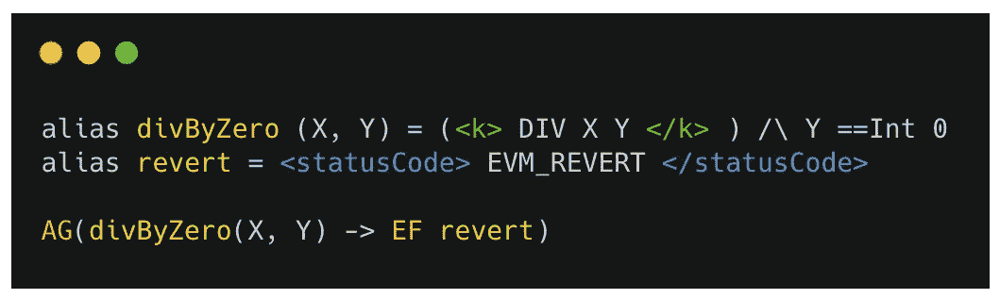
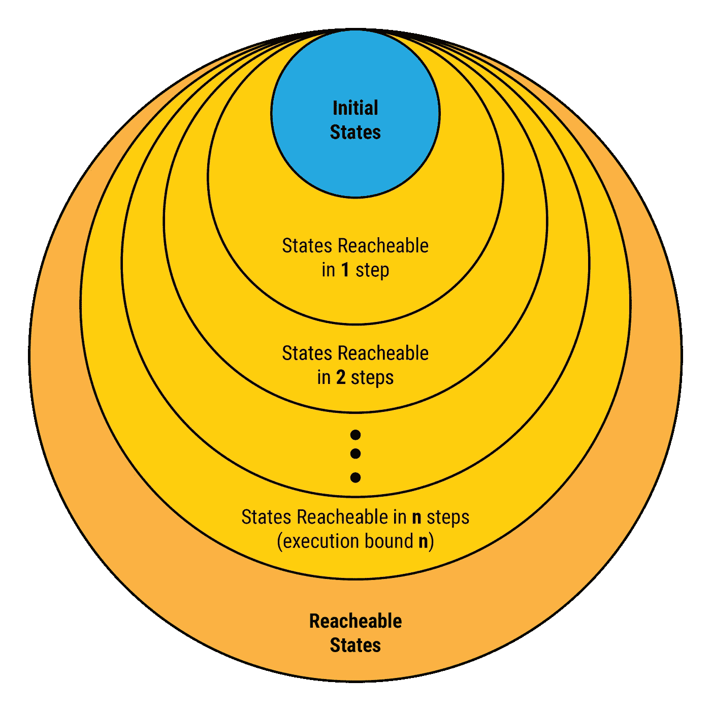

# RV 有界模型检查器——一个轻量级的基于语义的工具

> 原文：<https://medium.com/coinmonks/the-rv-bounded-model-checker-a-lightweight-semantics-based-tool-35a6e37ce1c1?source=collection_archive---------6----------------------->

## 作者:张懿

智能合约失败可能会造成数百万美元的损失，甚至可能导致公司和加密货币的死亡。此外，智能合约比普通软件更容易被黑客攻击，原因很简单，因为它们在区块链是公开的，任何人都可以从任何地方调用它们。因此，前所未有地需要保证代码的正确性。

众所周知，保证代码正确性的唯一方法是通过使用严格的形式方法，其中智能合约的正确性在数学上被表示为形式属性，编程语言或虚拟机也在数学上被表示为形式模型，并且前者从后者被严格证明。此外，智能合约的正确性必须是可独立检查的，而不必信任其作者或任何审计机构。因此，必须为它们提供机器可检查的正确性证书。

我们在 Runtime Verification (RV)开发了一个语言参数化的、完全成熟的智能合约形式验证工具，基于[匹配μ logic](http://matching-logic.org) ，并结合了由形式方法社区开发的最佳技术、算法和数学基础。该工具是语言参数化的，这意味着它可以通过简单地插入语言的正式语义来快速实例化任何语言(或虚拟机)。目前，我们已经为 EVM 实例化了它，并使用 EVM 验证器[来验证高规格智能合约](https://github.com/runtimeverification/verified-smart-contracts/blob/master/README.md)的全部功能正确性，包括 ERC20 令牌合约、以太坊卡斯珀 FFG 合约和 DappHub MakerDAO 合约。

然而，完全成熟的验证器需要相当大的努力和专业知识来使用。例如，设计和调试正式规范对于非专家来说是一项非常重要的任务。这项任务不仅需要大量的定理证明和逻辑知识，而且可能需要用户识别定制的抽象和相应的引理来推理某些程序行为。由于这些原因，我们当前的正式验证工具本质上是交互式的，只有少数专家能够有效地使用它。因此，尽管其基于语义的严格性，我们现有的正式验证工具的使用在我们的团队之外相当有限，并且我们认为在合同开发的早期阶段和/或日常基础上，或者由负担不起大量正式验证工作的小企业尝试使用它是不切实际的。

为了将正式技术引入日常合同开发，我们正在为合同开发人员开发一个全自动、轻量级的正式验证工具。该工具将作为 [K 的 haskell 后端](https://github.com/kframework/kore)的一个组件提供给社区。这个工具是全自动的，因为除了提供程序和一组要验证的属性之外，它不需要额外的人工努力。这些属性可以是对任何程序通用的预定义属性，例如无溢出或被零除，或者其他用户定义的属性(例如，断言)。此外，该工具将仍然提供与完全成熟的验证者相同的关于某些执行步骤界限的完全形式保证。

示例属性:

> *在所有执行路径(AG)上，如果发生被零除的情况，程序将最终终止(EF)在恢复状态。注意:AG 和 EF 是* [*计算树逻辑*](https://en.wikipedia.org/wiki/Computation_tree_logic) *(CTL)引入的时态运算符，在匹配μ逻辑中很容易定义(在本*[*【LICS】19 论文*](http://fsl.cs.illinois.edu/index.php/Matching_mu-Logic) *)。*

我们的工具将如下工作。从一个通用的符号初始状态开始，它将象征性地执行整个程序，这将试图给出程序执行中所有可能的路径和(符号)状态。只要达到违反任何属性的状态，就会报告错误。然而，如果程序具有无界循环或递归，则在没有人工指导的情况下，符号执行可能不会终止(即，注释循环不变量)。为了使工具完全自动化，循环将展开到有限的迭代次数，称为一个界限。在这种情况下，该工具将显式地报告可能仍然存在潜在 bug 的未探索的迭代！。此外，基于我们在手动验证智能合约时积累的丰富经验，我们提出了一组通用的引理和抽象，它们将加速状态探索。

在智能合约的上下文中，我们实现这种 BMC 技术的概念验证工具非常有用和有效。这是因为智能合约通常是小而终止的程序，很少有循环或递归。像 Vyper 这样的语言甚至不允许递归调用和无限长循环作为语言设计的一部分。因此，预计在大多数情况下，我们的工具将不仅仅是查找 bug。事实上，它将能够完全自动地证明大多数智能契约的功能正确性。

> [在您的收件箱中直接获得最佳软件交易](https://coincodecap.com/?utm_source=coinmonks)

